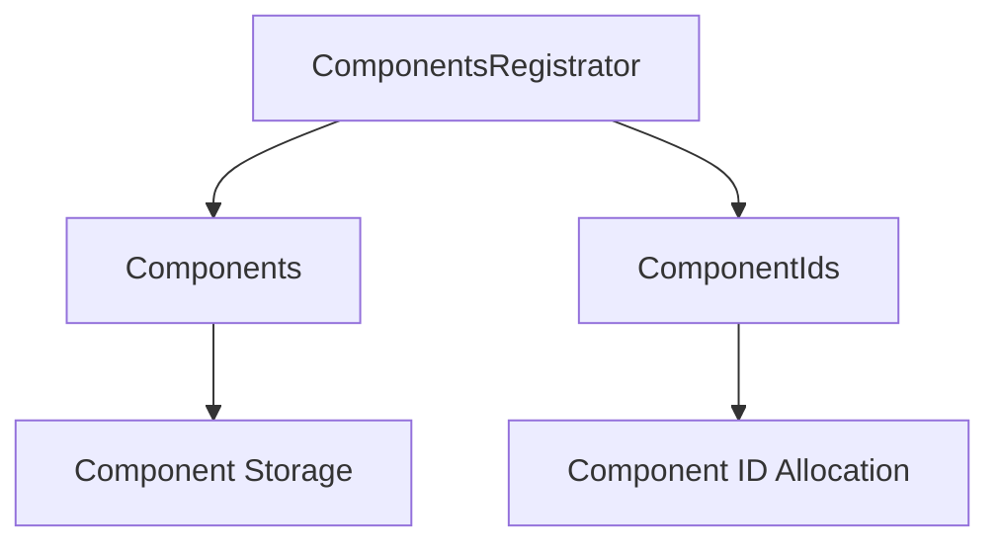

+++
title = "#20187 Fix `ComponentsRegistrator` unsoundness"
date = "2025-07-22T00:00:00"
draft = false
template = "pull_request_page.html"
in_search_index = true

[taxonomies]
list_display = ["show"]

[extra]
current_language = "en"
available_languages = {"en" = { name = "English", url = "/pull_request/bevy/2025-07/pr-20187-en-20250722" }, "zh-cn" = { name = "中文", url = "/pull_request/bevy/2025-07/pr-20187-zh-cn-20250722" }}
labels = ["C-Bug", "A-ECS", "P-Unsound"]
+++

# Analysis of PR #20187: Fix `ComponentsRegistrator` unsoundness

## Basic Information
- **Title**: Fix `ComponentsRegistrator` unsoundness
- **PR Link**: https://github.com/bevyengine/bevy/pull/20187
- **Author**: SkiFire13
- **Status**: MERGED
- **Labels**: C-Bug, A-ECS, S-Ready-For-Final-Review, P-Unsound
- **Created**: 2025-07-18T11:16:46Z
- **Merged**: 2025-07-21T23:19:18Z
- **Merged By**: alice-i-cecile

## Description Translation
# Objective

- Fix #20174

## Solution

- Avoid implementing `DerefMut` for `ComponentsRegistrator`
- To avoid potential breakage, expose the `any_queued_mut` and `num_queued_mut` on `ComponentsRegistrator`. These are the only methods taking `&mut self` on `Components` and for which the `DerefMut` impl could have been useful for.

## The Story of This Pull Request

This PR addresses a soundness issue in Bevy's ECS component registration system. The core problem stemmed from `ComponentsRegistrator` implementing `DerefMut`, which allowed obtaining a mutable reference to the underlying `Components` collection. This created potential for unsound operations since `ComponentsRegistrator` simultaneously holds mutable references to both `Components` and `ComponentIds`, and arbitrary mutation of `Components` could violate internal invariants maintained by `ComponentIds`.

The solution removes the `DerefMut` implementation entirely. This prevents direct mutable access to `Components` through `ComponentsRegistrator`, eliminating the soundness risk. However, since two methods on `Components` (`any_queued_mut` and `num_queued_mut`) were potentially being accessed through `DerefMut`, the PR adds explicit passthrough methods for them on `ComponentsRegistrator`. This maintains functionality while preserving safety.

Throughout the implementation, all internal accesses to `Components` methods were updated to explicitly use `self.components` rather than relying on deref coercion. For example:

```rust
// Before:
self.register_component_inner(id, descriptor);

// After:
self.components.register_component_inner(id, descriptor);
```

This change required updating multiple registration methods to explicitly reference the underlying `components` field. The modifications maintain identical functionality while making the access patterns explicit and safe.

The PR also adds a migration guide explaining that `ComponentsRegistrator` no longer implements `DerefMut`, and directs users to the new explicit methods for the previously accessible functionality. This ensures existing codebases can adapt without loss of functionality.

## Visual Representation



## Key Files Changed

### 1. `crates/bevy_ecs/src/component/register.rs` (+32/-19)
This file contains the core fix by removing `DerefMut` and adding explicit component access.

**Key changes:**
```diff
-impl DerefMut for ComponentsRegistrator<'_> {
-    fn deref_mut(&mut self) -> &mut Self::Target {
-        self.components
-    }
-}

// Added explicit methods:
+    pub fn any_queued_mut(&mut self) -> bool {
+        self.components.any_queued_mut()
+    }
+
+    pub fn num_queued_mut(&mut self) -> usize {
+        self.components.num_queued_mut()
+    }
```

**Internal access pattern updates:**
```diff
 unsafe {
-    self.register_component_inner(id, descriptor);
+    self.components.register_component_inner(id, descriptor);
 }
```

### 2. `crates/bevy_ecs/src/component/required.rs` (+8/-7)
Updated required component registration to use explicit component access.

**Change:**
```diff
 unsafe {
-    self.register_required_components_manual_unchecked::<R>(
+    self.components.register_required_components_manual_unchecked::<R>(
         requiree,
         required,
         required_components,
         constructor,
         inheritance_depth,
     );
 }
```

### 3. `release-content/migration-guides/components-registrator-derefmut.md` (+6/-0)
Added migration guide explaining the change.

**Content:**
```md
---
title: ComponentsRegistrator no longer implements DerefMut
pull_requests: [14791, 15458, 15269]
---

`ComponentsRegistrator` no longer implements `DerefMut<Target = Components>`, meaning you won't be able to get a `&mut Components` from it. The only two methods on `Components` that took `&mut self` (`any_queued_mut` and `num_queued_mut`) have been reimplemented on `ComponentsRegistrator`, meaning you won't need to migrate them. Other usages of `&mut Components` were unsupported.
```

## Further Reading
1. [Rust Deref coercion documentation](https://doc.rust-lang.org/std/ops/trait.Deref.html)
2. [Bevy ECS Component documentation](https://docs.rs/bevy_ecs/latest/bevy_ecs/component/index.html)
3. [Rustonomicon: Unsoundness](https://doc.rust-lang.org/nomicon/un soundness.html)