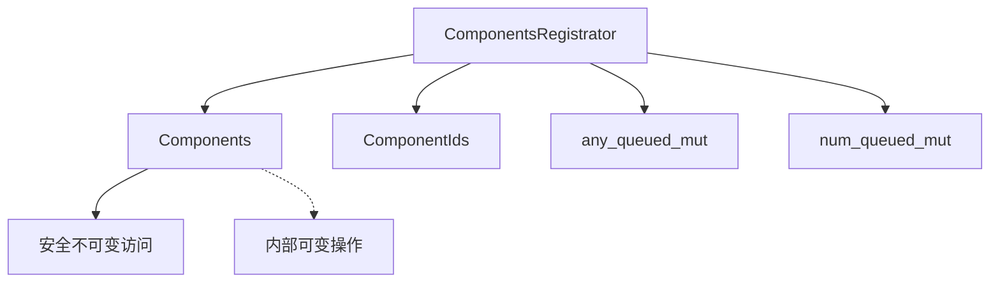

+++
title = "#20187 Fix `ComponentsRegistrator` unsoundness"
date = "2025-07-22T00:00:00"
draft = false
template = "pull_request_page.html"
in_search_index = false

[extra]
current_language = "zh-cn"
available_languages = {"en" = { name = "English", url = "/pull_request/bevy/2025-07/pr-20187-en-20250722" }, "zh-cn" = { name = "中文", url = "/pull_request/bevy/2025-07/pr-20187-zh-cn-20250722" }}
+++

# 修复 `ComponentsRegistrator` 的内存安全问题

## 基础信息
- **标题**: Fix `ComponentsRegistrator` unsoundness
- **PR 链接**: https://github.com/bevyengine/bevy/pull/20187
- **作者**: SkiFire13
- **状态**: 已合并
- **标签**: C-Bug, A-ECS, S-Ready-For-Final-Review, P-Unsound
- **创建时间**: 2025-07-18T11:16:46Z
- **合并时间**: 2025-07-21T23:19:18Z
- **合并者**: alice-i-cecile

## 描述翻译
### 目标
- 修复 #20174

### 解决方案
- 避免为 `ComponentsRegistrator` 实现 `DerefMut`
- 为避免潜在的破坏性变更，在 `ComponentsRegistrator` 上暴露 `any_queued_mut` 和 `num_queued_mut` 方法。这些是 `Components` 上唯一需要 `&mut self` 的方法，而 `DerefMut` 实现原本对这些方法可能有帮助。

## PR 分析

### 问题与背景
这个 PR 解决了 issue #20174 中报告的内存安全问题。核心问题在于 `ComponentsRegistrator` 结构体实现了 `DerefMut` trait，允许用户通过解引用直接获取底层 `Components` 的可变引用。这种设计违反了 Rust 的别名规则（aliasing rules），因为它同时暴露了多个指向同一数据的可变引用：

```rust
// 问题代码示例
impl DerefMut for ComponentsRegistrator<'_> {
    fn deref_mut(&mut self) -> &mut Self::Target {
        self.components
    }
}
```

在 ECS 架构中，`ComponentsRegistrator` 负责管理组件注册过程。它封装了 `&mut Components` 和 `&mut ComponentIds` 两个关键引用。实现 `DerefMut` 使得用户可以通过 `*registrator` 获取 `&mut Components`，而 `registrator` 自身已经持有 `&mut Components`。这导致同一作用域中出现多个可变引用指向同一数据，违反了 Rust 的唯一可变引用原则，可能引发未定义行为。

### 解决方案
PR 移除了 `ComponentsRegistrator` 的 `DerefMut` 实现，从根本上解决了别名问题。但考虑到现有代码可能依赖通过 `DerefMut` 访问的特定方法，PR 采取了最小化破坏性的方法：

1. 移除 `DerefMut` 实现
2. 显式暴露 `Components` 中需要 `&mut self` 的两个方法
3. 重构内部调用以直接访问 `self.components`

```rust
// 解决方案：移除 DerefMut 实现
// 之前存在的 DerefMut impl 被完全删除

// 新增代理方法
pub fn any_queued_mut(&mut self) -> bool {
    self.components.any_queued_mut()
}

pub fn num_queued_mut(&mut self) -> usize {
    self.components.num_queued_mut()
}
```

### 实现细节
主要修改集中在组件注册逻辑的重构上。所有原本通过 `DerefMut` 访问 `Components` 方法的地方，现在改为直接通过 `self.components` 访问：

```rust
// 修改前
unsafe {
    self.register_component_inner(id, ComponentDescriptor::new::<T>());
}

// 修改后
unsafe {
    self.components
        .register_component_inner(id, ComponentDescriptor::new::<T>());
}
```

这种改动模式在多个注册函数中重复出现，包括：
- `register_dynamic`
- `register_resource_dynamic`
- `register_arbitrary_dynamic`

`required.rs` 中的相关方法也做了类似调整：

```rust
// required.rs 修改
unsafe {
    self.components  // 添加 direct access
        .register_required_components_manual_unchecked::<R>(...);
}
```

### 技术洞察
这个修复的核心是遵循 Rust 的借用规则。`ComponentsRegistrator` 现在通过以下方式安全地管理访问：
1. 通过 `Deref` 提供不可变访问
2. 通过显式方法提供受限的可变访问
3. 直接操作内部字段进行需要特权的操作



### 影响与迁移
PR 包含了一个迁移指南（`components-registrator-derefmut.md`），明确说明：
1. `DerefMut` 实现已被移除
2. 只有 `any_queued_mut` 和 `num_queued_mut` 需要迁移
3. 其他 `&mut Components` 用法原本就不被支持

```markdown
`ComponentsRegistrator` 不再实现 `DerefMut<Target = Components>`，
意味着你无法从中获取 `&mut Components`。
`Components` 上仅有的两个需要 `&mut self` 的方法
(`any_queued_mut` 和 `num_queued_mut`)
已在 `ComponentsRegistrator` 上重新实现，
因此你不需要迁移它们。
其他 `&mut Components` 的用法原本就不被支持。
```

## 关键文件变更

### 1. `crates/bevy_ecs/src/component/register.rs` (+32/-19)
主要变更：
- 移除 `DerefMut` 实现
- 添加代理方法
- 重构内部访问方式

```rust
// 移除 DerefMut
-impl DerefMut for ComponentsRegistrator<'_> {
-    fn deref_mut(&mut self) -> &mut Self::Target {
-        self.components
-    }
-}

// 添加代理方法
+    pub fn any_queued_mut(&mut self) -> bool {
+        self.components.any_queued_mut()
+    }
+
+    pub fn num_queued_mut(&mut self) -> usize {
+        self.components.num_queued_mut()
+    }

// 内部访问重构
-    unsafe {
-        self.register_component_inner(id, descriptor);
-    }
+    unsafe {
+        self.components
+            .register_component_inner(id, descriptor);
+    }
```

### 2. `crates/bevy_ecs/src/component/required.rs` (+8/-7)
调整 required components 注册逻辑：

```rust
// 修改前
 unsafe {
-    self.register_required_components_manual_unchecked::<R>(
-        requiree,
-        required,
-        required_components,
-        constructor,
-        inheritance_depth,
-    );
+    self.components
+        .register_required_components_manual_unchecked::<R>(
+            requiree,
+            required,
+            required_components,
+            constructor,
+            inheritance_depth,
+        );
 }
```

### 3. `release-content/migration-guides/components-registrator-derefmut.md` (+6/-0)
新增迁移指南：

```markdown
---
title: ComponentsRegistrator no longer implements DerefMut
pull_requests: [14791, 15458, 15269]
---

`ComponentsRegistrator` no longer implements `DerefMut<Target = Components>`, 
meaning you won't be able to get a `&mut Components` from it. 
The only two methods on `Components` that took `&mut self` 
(`any_queued_mut` and `num_queued_mut`) 
have been reimplemented on `ComponentsRegistrator`, 
meaning you won't need to migrate them. 
Other usages of `&mut Components` were unsupported.
```

## 延伸阅读
1. [Rust 所有权与借用规则](https://doc.rust-lang.org/book/ch04-02-references-and-borrowing.html)
2. [Bevy ECS 组件文档](https://bevyengine.org/learn/book/next/ecs/components/)
3. [Rust 内存安全原理](https://doc.rust-lang.org/nomicon/meet-safe-and-unsafe.html)