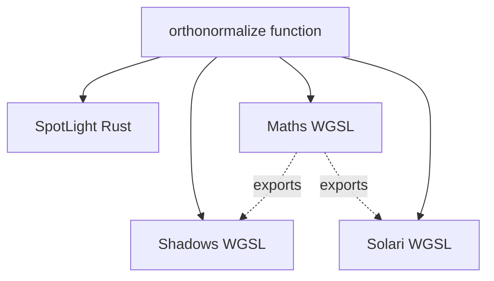

+++
title = "#20191 Deduplicate orthonormal basis construction"
date = "2025-07-20T00:00:00"
draft = false
template = "pull_request_page.html"
in_search_index = true

[taxonomies]
list_display = ["show"]

[extra]
current_language = "en"
available_languages = {"en" = { name = "English", url = "/pull_request/bevy/2025-07/pr-20191-en-20250720" }, "zh-cn" = { name = "中文", url = "/pull_request/bevy/2025-07/pr-20191-zh-cn-20250720" }}
labels = ["A-Rendering", "D-Shaders", "M-Deliberate-Rendering-Change"]
+++

# Deduplicate orthonormal basis construction

## Basic Information
- **Title**: Deduplicate orthonormal basis construction
- **PR Link**: https://github.com/bevyengine/bevy/pull/20191
- **Author**: atlv24
- **Status**: MERGED
- **Labels**: A-Rendering, S-Ready-For-Final-Review, D-Shaders, M-Deliberate-Rendering-Change
- **Created**: 2025-07-18T17:46:56Z
- **Merged**: 2025-07-20T16:27:13Z
- **Merged By**: alice-i-cecile

## Description Translation
# Objective

- Deduplicate orthonormal basis construction
- fix a bug with handling of negative zero in spotlight basis construction
- separate handedness flip from basis construction in spotlight basis
- improve performance and stability of point light orthonormal basis construction
- improve docs

## Solution

- edit the code

## Testing

- spotlight example and 3d_scene

## The Story of This Pull Request

### The Problem and Context
Orthonormal basis construction is a fundamental operation used throughout Bevy's rendering pipeline, particularly for lighting calculations. Before this PR, several independent implementations existed across Rust code and WGSL shaders. This duplication created maintenance challenges and risked subtle inconsistencies that could cause rendering artifacts. 

Specifically, spotlight calculations used slightly different implementations between CPU (Rust) and GPU (WGSL) code paths. The WGSL implementation had a bug in handling negative zero values, which could lead to incorrect basis vectors in certain edge cases. Additionally, the existing implementations used different algorithms - some used Gram-Schmidt while others used Duff's method - making it difficult to ensure consistent behavior.

### The Solution Approach
The core solution was to consolidate all orthonormal basis construction into a single, shared implementation. We chose Duff's method from ["Building an Orthonormal Basis, Revisited"](https://jcgt.org/published/0006/01/01/) for its numerical stability and performance characteristics. This algorithm is branchless, avoids degenerate cases, and matches what `glam::Vec3::any_orthonormal_pair` uses.

Key engineering decisions:
1. Create a shared `orthonormalize` function in both Rust and WGSL
2. Fix negative zero handling using bitwise copysign operation
3. Separate basis construction from handedness flipping
4. Replace all custom implementations with the shared function
5. Maintain exact CPU-GPU implementation parity

### The Implementation
The implementation centered around creating a unified `orthonormalize` function that could be reused across multiple systems. In Rust, we added this to `spot_light.rs`:

```rust
pub fn orthonormalize(z_basis: Dir3) -> Mat3 {
    let sign = 1f32.copysign(z_basis.z);
    let a = -1.0 / (sign + z_basis.z);
    let b = z_basis.x * z_basis.y * a;
    let x_basis = Vec3::new(
        1.0 + sign * z_basis.x * z_basis.x * a,
        sign * b,
        -sign * z_basis.x,
    );
    let y_basis = Vec3::new(b, sign + z_basis.y * z_basis.y * a, -z_basis.y);
    Mat3::from_cols(x_basis, y_basis, z_basis.into())
}
```

In WGSL, we implemented the same algorithm with proper negative zero handling:

```wgsl
fn copysign(a: f32, b: f32) -> f32 {
    return bitcast<f32>((bitcast<u32>(a) & 0x7FFFFFFF) | (bitcast<u32>(b) & 0x80000000);
}

fn orthonormalize(z_basis: vec3<f32>) -> mat3x3<f32> {
    let sign = copysign(1.0, z_basis.z);
    let a = -1.0 / (sign + z_basis.z);
    let b = z_basis.x * z_basis.y * a;
    let x_basis = vec3(1.0 + sign * z_basis.x * z_basis.x * a, sign * b, -sign * z_basis.x);
    let y_basis = vec3(b, sign + z_basis.y * z_basis.y * a, -z_basis.y);
    return mat3x3(x_basis, y_basis, z_basis);
}
```

### Technical Insights
The key technical improvements:
1. **Negative Zero Fix**: The previous WGSL implementation used conditional checks for sign determination which didn't properly handle negative zero. The new bitwise `copysign` implementation matches Rust's behavior exactly.

2. **Handedness Separation**: Spotlight calculations require left-handed coordinate systems. Instead of baking this into the basis construction, we now:
   - Create a right-handed basis with `orthonormalize`
   - Explicitly flip the x-axis for handedness conversion
   
   This separation makes the code more reusable and clear:

```rust
let basis = orthonormalize(fwd_dir);
let mut mat = Mat4::from_mat3(basis);
mat.x_axis = -mat.x_axis; // Handedness flip
```

3. **Performance**: Duff's method is branchless and requires fewer operations than the previous Gram-Schmidt implementation in `bevy_render/maths.wgsl`. This improves shader performance, especially on mobile GPUs.

4. **Consistency**: All systems now use the same algorithm - spotlight rendering, point lights, and ray tracing (bevy_solari) all share the identical implementation.

### The Impact
These changes provide several concrete improvements:
1. **Bug Fix**: Negative zero values are now handled correctly in spotlight basis calculations
2. **Code Health**: Eliminated 4 separate implementations, reducing maintenance burden
3. **Performance**: More efficient basis calculation in shaders
4. **Clarity**: Explicit handedness conversion makes coordinate system intentions clear
5. **Portability**: Shared implementation works consistently across CPU and GPU

The changes particularly benefit spotlight rendering where numerical stability is critical for shadow mapping. Developers can now rely on consistent behavior when working with coordinate systems throughout Bevy's rendering pipeline.

## Visual Representation



## Key Files Changed

### `crates/bevy_light/src/spot_light.rs` (+32/-24)
Central change: extracted orthonormal basis logic into reusable function and separated handedness conversion.

Key changes:
```rust
// Before:
pub fn spot_light_world_from_view(transform: &GlobalTransform) -> Mat4 {
    let fwd_dir = transform.back().extend(0.0);
    let sign = 1f32.copysign(fwd_dir.z);
    // ... inline basis calculation ...
    Mat4::from_cols(right_dir, up_dir, fwd_dir, ...)
}

// After:
pub fn orthonormalize(z_basis: Dir3) -> Mat3 {
    // Shared basis calculation
}

pub fn spot_light_world_from_view(transform: &GlobalTransform) -> Mat4 {
    let fwd_dir = transform.back();
    let basis = orthonormalize(fwd_dir);
    let mut mat = Mat4::from_mat3(basis);
    mat.x_axis = -mat.x_axis; // Handedness flip
    mat.w_axis = transform.translation().extend(1.0);
    mat
}
```

### `crates/bevy_render/src/maths.wgsl` (+17/-11)
Replaced Gram-Schmidt implementation with Duff's method and added proper negative zero handling.

Key changes:
```wgsl
// Before:
fn orthonormalize(z_normalized: vec3<f32>) -> mat3x3<f32> {
    var up = vec3(0.0, 1.0, 0.0);
    if (abs(dot(up, z_normalized)) > 0.99) {
        up = vec3(1.0, 0.0, 0.0);
    }
    // ... Gram-Schmidt process ...
}

// After:
fn copysign(a: f32, b: f32) -> f32 {
    return bitcast<f32>((bitcast<u32>(a) & 0x7FFFFFFF) | (bitcast<u32>(b) & 0x80000000));
}

fn orthonormalize(z_basis: vec3<f32>) -> mat3x3<f32> {
    let sign = copysign(1.0, z_basis.z);
    // Duff's method implementation
}
```

### `crates/bevy_pbr/src/render/shadows.wgsl` (+12/-13)
Updated to use shared orthonormalize function and explicit handedness flip.

Key changes:
```wgsl
// Before:
fn spot_light_world_from_view(fwd: vec3<f32>) -> mat3x3<f32> {
    var sign = -1.0;
    if (fwd.z >= 0.0) { sign = 1.0; }
    // ... inline basis calculation ...
}

// After:
fn spot_light_world_from_view(z_basis: vec3<f32>) -> mat3x3<f32> {
    var basis = orthonormalize(z_basis);
    basis[0] = -basis[0]; // Handedness flip
    return basis;
}
```

### `crates/bevy_solari/src/scene/sampling.wgsl` (+4/-14)
Removed local implementation in favor of shared function.

Key changes:
```wgsl
// Before:
fn build_orthonormal_basis(normal: vec3<f32>) -> mat3x3<f32> {
    // Local implementation
}

// After:
// Replaced with orthonormalize from bevy_render
```

### `crates/bevy_light/src/lib.rs` (+2/-2)
Exported the new orthonormalize function.

## Further Reading
1. [Building an Orthonormal Basis, Revisited](https://jcgt.org/published/0006/01/01/) - The paper describing the algorithm used
2. [glam's any_orthonormal_pair implementation](https://github.com/bitshifter/glam-rs/blob/main/src/f32/vec3.rs) - Reference implementation that inspired this approach
3. [IEEE 754 Floating Point Standard](https://en.wikipedia.org/wiki/IEEE_754) - Background on negative zero handling
4. [Coordinate System Handedness](https://en.wikipedia.org/wiki/Right-hand_rule) - Explanation of left vs right-handed systems