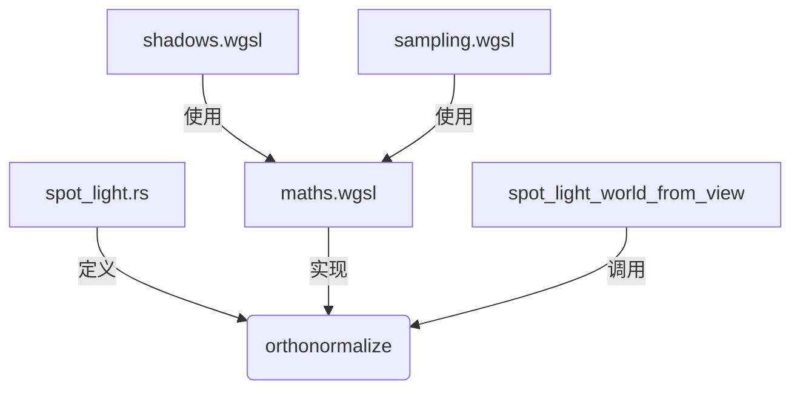

+++
title = "#20191 Deduplicate orthonormal basis construction"
date = "2025-07-20T00:00:00"
draft = false
template = "pull_request_page.html"
in_search_index = false

[extra]
current_language = "zh-cn"
available_languages = {"en" = { name = "English", url = "/pull_request/bevy/2025-07/pr-20191-en-20250720" }, "zh-cn" = { name = "中文", url = "/pull_request/bevy/2025-07/pr-20191-zh-cn-20250720" }}
labels = ["A-Rendering", "D-Shaders", "M-Deliberate-Rendering-Change"]
+++

## Deduplicate orthonormal basis construction

### Basic Information
- **Title**: Deduplicate orthonormal basis construction
- **PR Link**: https://github.com/bevyengine/bevy/pull/20191
- **Author**: atlv24
- **Status**: MERGED
- **Labels**: A-Rendering, S-Ready-For-Final-Review, D-Shaders, M-Deliberate-Rendering-Change
- **Created**: 2025-07-18T17:46:56Z
- **Merged**: 2025-07-20T16:27:13Z
- **Merged By**: alice-i-cecile

### Description Translation
**目标**
- 消除正交基构造的重复代码
- 修复聚光灯基构造中处理负零的bug
- 将基构造中的手性翻转与聚光灯基分离
- 提升点光源正交基构造的性能和稳定性
- 改进文档

**解决方案**
- 编辑代码

**测试**
- 聚光灯示例和3d_scene

### The Story of This Pull Request

#### 问题背景
在聚光灯和点光源的渲染实现中，正交基(orthonormal basis)的构造代码存在多处重复实现。这些重复主要出现在：
1. Rust代码 (`spot_light.rs`)
2. WGSL着色器代码 (`shadows.wgsl`, `maths.wgsl`, `sampling.wgsl`)

这种重复导致几个具体问题：
1. 维护困难：算法变更时需要同步多个位置
2. 潜在bug：`shadows.wgsl`中的实现未正确处理负零(negative zero)情况
3. 性能问题：原有实现包含分支语句，影响GPU执行效率
4. 手性(handedness)处理与基构造逻辑耦合

#### 解决方案
核心方案是提取统一的正交基构造函数`orthonormalize`，在Rust和WGSL中共享相同算法实现。具体步骤：

1. **创建标准实现**：在`spot_light.rs`中新增`orthonormalize`函数，基于Frisvad方法实现无分支正交基构造
2. **修复负零处理**：在WGSL中实现`copysign`函数确保负零处理与Rust一致
3. **分离手性处理**：在聚光灯矩阵构造中显式处理手性翻转
4. **统一着色器实现**：所有WGSL文件改用`maths.wgsl`中的`orthonormalize`
5. **删除冗余代码**：移除`sampling.wgsl`中的重复实现

#### 实现细节
关键改进在正交基构造算法。原实现使用分支判断Z分量符号：
```wgsl
var sign = -1.0;
if (fwd.z >= 0.0) {
    sign = 1.0;
}
```
新实现改用无分支的`copysign`操作：
```wgsl
fn copysign(a: f32, b: f32) -> f32 {
    return bitcast<f32>((bitcast<u32>(a) & 0x7FFFFFFF) | (bitcast<u32>(b) & 0x80000000));
}
```
这确保正确处理-0.0边界情况，同时消除分支提升GPU性能。

#### 影响
1. **代码质量**：消除4处重复实现，减少48行代码
2. **正确性**：修复负零导致的基构造错误
3. **性能**：无分支实现提升着色器执行效率
4. **可维护性**：正交基构造逻辑集中到单一可信源
5. **清晰度**：显式分离基构造和手性翻转逻辑

### Visual Representation


### Key Files Changed

1. **crates/bevy_light/src/spot_light.rs** (+32/-24)
   - 新增标准正交基构造函数
   - 重构聚光灯矩阵生成逻辑

```rust
// 新增正交基构造
pub fn orthonormalize(z_basis: Dir3) -> Mat3 {
    let sign = 1f32.copysign(z_basis.z);
    let a = -1.0 / (sign + z_basis.z);
    let b = z_basis.x * z_basis.y * a;
    let x_basis = Vec3::new(1.0 + sign * z_basis.x * z_basis.x * a, sign * b, -sign * z_basis.x);
    let y_basis = Vec3::new(b, sign + z_basis.y * z_basis.y * a, -z_basis.y);
    Mat3::from_cols(x_basis, y_basis, z_basis.into())
}

// 重构后的聚光灯矩阵生成
pub fn spot_light_world_from_view(transform: &GlobalTransform) -> Mat4 {
    let fwd_dir = transform.back();
    let basis = orthonormalize(fwd_dir);
    let mut mat = Mat4::from_mat3(basis);
    mat.x_axis = -mat.x_axis; // 显式手性翻转
    mat.w_axis = transform.translation().extend(1.0);
    mat
}
```

2. **crates/bevy_render/src/maths.wgsl** (+17/-11)
   - 添加WGSL版正交基构造
   - 实现copysign处理负零

```wgsl
fn copysign(a: f32, b: f32) -> f32 {
    return bitcast<f32>((bitcast<u32>(a) & 0x7FFFFFFF) | (bitcast<u32>(b) & 0x80000000));
}

fn orthonormalize(z_basis: vec3<f32>) -> mat3x3<f32> {
    let sign = copysign(1.0, z_basis.z);
    let a = -1.0 / (sign + z_basis.z);
    let b = z_basis.x * z_basis.y * a;
    let x_basis = vec3(1.0 + sign * z_basis.x * z_basis.x * a, sign * b, -sign * z_basis.x);
    let y_basis = vec3(b, sign + z_basis.y * z_basis.y * a, -z_basis.y);
    return mat3x3(x_basis, y_basis, z_basis);
}
```

3. **crates/bevy_pbr/src/render/shadows.wgsl** (+12/-13)
   - 改用统一正交基函数
   - 显式手性翻转

```wgsl
fn spot_light_world_from_view(z_basis: vec3<f32>) -> mat3x3<f32> {
    var basis = orthonormalize(z_basis);
    basis[0] = -basis[0]; // 显式手性翻转
    return basis;
}
```

4. **crates/bevy_solari/src/scene/sampling.wgsl** (+4/-14)
   - 删除冗余实现
   - 改用标准正交基函数

```wgsl
// 删除旧实现
-fn build_orthonormal_basis(normal: vec3<f32>) -> mat3x3<f32> {
-    let sign = select(-1.0, 1.0, normal.z >= 0.0);
-    let a = -1.0 / (sign + normal.z);
-    let b = normal.x * normal.y * a;
-    let tangent = vec3(1.0 + sign * normal.x * normal.x * a, sign * b, -sign * normal.x);
-    let bitangent = vec3(b, sign + normal.y * normal.y * a, -normal.y);
-    return mat3x3(tangent, bitangent, normal);
-}

// 使用标准函数
ray_direction = orthonormalize(directional_light.direction_to_light) * ray_direction;
```

5. **crates/bevy_light/src/lib.rs** (+2/-2)
   - 导出新函数

```rust
pub use spot_light::{
    orthonormalize, // 新增导出
    spot_light_clip_from_view,
    ...
};
```

### Further Reading
1. 正交基构造算法论文: [Building an Orthonormal Basis from a Unit Vector](https://jcgt.org/published/0006/01/01/)
2. IEEE 754浮点数标准 (负零处理): [IEEE Standard for Floating-Point Arithmetic](https://ieeexplore.ieee.org/document/8766229)
3. Bevy渲染架构: [Bevy Render Pipeline Documentation](https://bevyengine.org/learn/book/introduction/)
4. WGSL规范: [WebGPU Shading Language](https://www.w3.org/TR/WGSL/)