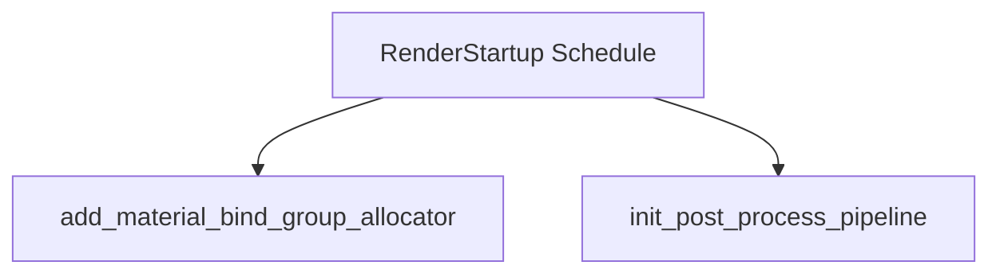

+++
title = "#20193 Improve the naming of a couple systems in `RenderStartup`"
date = "2025-07-19T00:00:00"
draft = false
template = "pull_request_page.html"
in_search_index = true

[taxonomies]
list_display = ["show"]

[extra]
current_language = "en"
available_languages = {"en" = { name = "English", url = "/pull_request/bevy/2025-07/pr-20193-en-20250719" }, "zh-cn" = { name = "中文", url = "/pull_request/bevy/2025-07/pr-20193-zh-cn-20250719" }}
labels = ["D-Trivial", "A-Rendering", "C-Code-Quality"]
+++

### Title: Improve the naming of a couple systems in `RenderStartup`

#### Basic Information
- **Title**: Improve the naming of a couple systems in `RenderStartup`
- **PR Link**: https://github.com/bevyengine/bevy/pull/20193
- **Author**: andriyDev
- **Status**: MERGED
- **Labels**: D-Trivial, A-Rendering, C-Code-Quality, S-Ready-For-Final-Review
- **Created**: 2025-07-19T05:22:00Z
- **Merged**: 2025-07-19T08:42:45Z
- **Merged By**: mockersf

#### Description Translation
# Objective

- Followup for a PR for #19887.
- Minor style fix.

## Solution

- Rename these two cases to better match other systems in `RenderStartup`

---

### The Story of This Pull Request

This PR addresses a minor code quality issue identified during follow-up work on PR #19887. The problem centered around inconsistent naming conventions for systems registered in Bevy's `RenderStartup` schedule. Two system names - `setup_render_app` and `setup_pipeline` - didn't align with the established naming patterns used elsewhere in the codebase for similar systems. While functionally correct, these names were less descriptive than they could be and created inconsistency in the code.

The solution implemented was straightforward: rename the systems to better reflect their purpose and match existing naming conventions. For the material system, `setup_render_app` was changed to `add_material_bind_group_allocator`. This new name explicitly describes the system's responsibility of initializing bind group allocators for materials. Similarly, `setup_pipeline` in the post-processing example was renamed to `init_post_process_pipeline`, which more accurately describes its role in initializing the post-processing pipeline.

These changes required minimal code modifications but significantly improved code clarity. The new names immediately convey each system's purpose to developers working with the code. This consistency is particularly valuable in Bevy's ECS architecture where systems are fundamental building blocks. When systems have clear, descriptive names, it becomes easier to understand execution flows and maintain the render pipeline logic.

The implementation involved simple find-and-replace operations in two files. Since the changes were purely cosmetic and didn't affect functionality, testing focused on verifying that compilation succeeded and that existing render pipeline initialization continued working as expected.

---

### Visual Representation



---

### Key Files Changed

1. **crates/bevy_pbr/src/material.rs**  
   Renamed a material setup system to better describe its functionality.  

   ```rust
   // Before:
   render_app
       .add_systems(RenderStartup, setup_render_app::<M>)
   
   fn setup_render_app<M: Material>(
   ```

   ```rust
   // After:
   render_app
       .add_systems(RenderStartup, add_material_bind_group_allocator::<M>)
   
   fn add_material_bind_group_allocator<M: Material>(
   ```

2. **examples/shader/custom_post_processing.rs**  
   Renamed a post-processing pipeline initialization system for clarity.  

   ```rust
   // Before:
   render_app.add_systems(RenderStartup, setup_pipeline);
   
   fn setup_pipeline(
   ```

   ```rust
   // After:
   render_app.add_systems(RenderStartup, init_post_process_pipeline);
   
   fn init_post_process_pipeline(
   ```

---

### Further Reading
- [Bevy ECS System Scheduling Documentation](https://bevyengine.org/learn/book/getting-started/ecs/#system-scheduling)
- [Bevy Render Pipeline Architecture](https://bevyengine.org/learn/book/getting-started/rendering/)
- [PR #19887 - Initial Implementation](https://github.com/bevyengine/bevy/pull/19887)