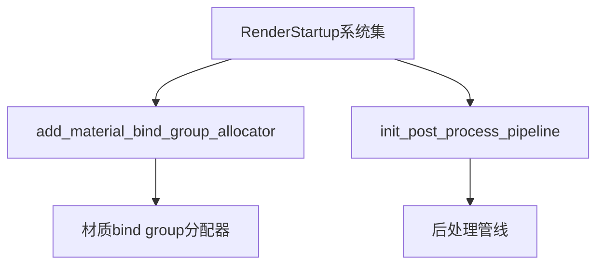

+++
title = "#20193 Improve the naming of a couple systems in `RenderStartup"
date = "2025-07-19T00:00:00"
draft = false
template = "pull_request_page.html"
in_search_index = false

[extra]
current_language = "zh-cn"
available_languages = {"en" = { name = "English", url = "/pull_request/bevy/2025-07/pr-20193-en-20250719" }, "zh-cn" = { name = "中文", url = "/pull_request/bevy/2025-07/pr-20193-zh-cn-20250719" }}
+++

# 改善 `RenderStartup` 中两个系统命名的PR分析

## 基本信息
- **标题**: Improve the naming of a couple systems in `RenderStartup`
- **PR链接**: https://github.com/bevyengine/bevy/pull/20193
- **作者**: andriyDev
- **状态**: 已合并
- **标签**: D-Trivial, A-Rendering, C-Code-Quality, S-Ready-For-Final-Review
- **创建时间**: 2025-07-19T05:22:00Z
- **合并时间**: 2025-07-19T08:42:45Z
- **合并者**: mockersf

## 描述翻译
### 目标
- 对 #19887 PR 的后续改进
- 小的样式修复

### 解决方案
- 重命名这两个系统，以更好地匹配 `RenderStartup` 中的其他系统

## 这个PR的故事

### 问题与背景
这个PR是对先前#19887的后续改进，主要解决渲染启动阶段(`RenderStartup`)中两个系统命名不一致的问题。在Bevy引擎中，`RenderStartup`系统集负责初始化渲染相关的资源，良好的命名约定对代码可读性和维护性至关重要。

原PR引入的两个系统函数名`setup_render_app`和`setup_pipeline`存在两个问题：
1. 命名过于泛化，没有准确反映具体功能
2. 与`RenderStartup`中其他系统的命名模式不一致

### 解决方案
开发者采用了直接的重命名策略：
1. 将`setup_render_app`改为`add_material_bind_group_allocator`
2. 将`setup_pipeline`改为`init_post_process_pipeline`

新命名更明确地表达了函数的具体职责，同时符合Bevy代码库中"动词+对象"的命名约定，保持了系统命名的统一性。

### 实现细节
变更集中在两个文件中的系统注册和函数定义处：

1. 在`bevy_pbr/src/material.rs`中：
```diff
render_app
-    .add_systems(RenderStartup, setup_render_app::<M>)
+    .add_systems(RenderStartup, add_material_bind_group_allocator::<M>)
```

```diff
-fn setup_render_app<M: Material>(
+fn add_material_bind_group_allocator<M: Material>(
     render_device: Res<RenderDevice>,
     mut bind_group_allocators: ResMut<MaterialBindGroupAllocators>,
) {
```

2. 在`custom_post_processing.rs`示例中：
```diff
-    render_app.add_systems(RenderStartup, setup_pipeline);
+    render_app.add_systems(RenderStartup, init_post_process_pipeline);
```

```diff
-fn setup_pipeline(
+fn init_post_process_pipeline(
     mut commands: Commands,
     render_device: Res<RenderDevice>,
     asset_server: Res<AssetServer>,
```

### 技术洞察
这个PR体现了几个重要的代码质量实践：
1. **精确命名**：新名称`add_material_bind_group_allocator`明确表示函数负责添加材质的bind group分配器
2. **一致性**：`init_post_process_pipeline`遵循了"init_"+领域对象的命名模式
3. **可发现性**：通过匹配命名模式，开发者更容易找到相关功能

### 影响
虽然这是个小改动，但改善了：
1. 代码可读性：新开发者更容易理解系统功能
2. 维护性：减少因模糊命名导致的错误
3. 一致性：保持整个代码库的命名标准

## 可视化表示



## 关键文件变更

### 1. `crates/bevy_pbr/src/material.rs`
**变更描述**：重命名材质系统函数，更准确反映其功能

**代码变更**：
```diff
// 系统注册处
 render_app
-    .add_systems(RenderStartup, setup_render_app::<M>)
+    .add_systems(RenderStartup, add_material_bind_group_allocator::<M>)

// 函数定义处
-fn setup_render_app<M: Material>(
+fn add_material_bind_group_allocator<M: Material>(
     render_device: Res<RenderDevice>,
     mut bind_group_allocators: ResMut<MaterialBindGroupAllocators>,
 ) {
```

### 2. `examples/shader/custom_post_processing.rs`
**变更描述**：更新后处理示例中的系统命名

**代码变更**：
```diff
// 系统注册处
-    render_app.add_systems(RenderStartup, setup_pipeline);
+    render_app.add_systems(RenderStartup, init_post_process_pipeline);

// 函数定义处
-fn setup_pipeline(
+fn init_post_process_pipeline(
     mut commands: Commands,
     render_device: Res<RenderDevice>,
     asset_server: Res<AssetServer>,
```

## 延伸阅读
1. [Bevy系统调度文档](https://bevyengine.org/learn/book/getting-started/ecs/#systems)
2. [Rust命名指南](https://rust-lang.github.io/api-guidelines/naming.html)
3. [原始PR #19887](https://github.com/bevyengine/bevy/pull/19887)

## 完整代码差异
```diff
diff --git a/crates/bevy_pbr/src/material.rs b/crates/bevy_pbr/src/material.rs
index 3ebc89bccd0e4..c69a6ea8f77ff 100644
--- a/crates/bevy_pbr/src/material.rs
+++ b/crates/bevy_pbr/src/material.rs
@@ -374,7 +374,7 @@ where
             }
 
             render_app
-                .add_systems(RenderStartup, setup_render_app::<M>)
+                .add_systems(RenderStartup, add_material_bind_group_allocator::<M>)
                 .add_systems(
                     ExtractSchedule,
                     (
@@ -389,7 +389,7 @@ where
     }
 }
 
-fn setup_render_app<M: Material>(
+fn add_material_bind_group_allocator<M: Material>(
     render_device: Res<RenderDevice>,
     mut bind_group_allocators: ResMut<MaterialBindGroupAllocators>,
 ) {
diff --git a/examples/shader/custom_post_processing.rs b/examples/shader/custom_post_processing.rs
index 81e2b7e17b4b0..4cd925be01d82 100644
--- a/examples/shader/custom_post_processing.rs
+++ b/examples/shader/custom_post_processing.rs
@@ -68,7 +68,7 @@ impl Plugin for PostProcessPlugin {
 
         // RenderStartup runs once on startup after all plugins are built
         // It is useful to initialize data that will only live in the RenderApp
-        render_app.add_systems(RenderStartup, setup_pipeline);
+        render_app.add_systems(RenderStartup, init_post_process_pipeline);
 
         render_app
             // Bevy's renderer uses a render graph which is a collection of nodes in a directed acyclic graph.
@@ -226,7 +226,7 @@ struct PostProcessPipeline {
     pipeline_id: CachedRenderPipelineId,
 }
 
-fn setup_pipeline(
+fn init_post_process_pipeline(
     mut commands: Commands,
     render_device: Res<RenderDevice>,
     asset_server: Res<AssetServer>,
```