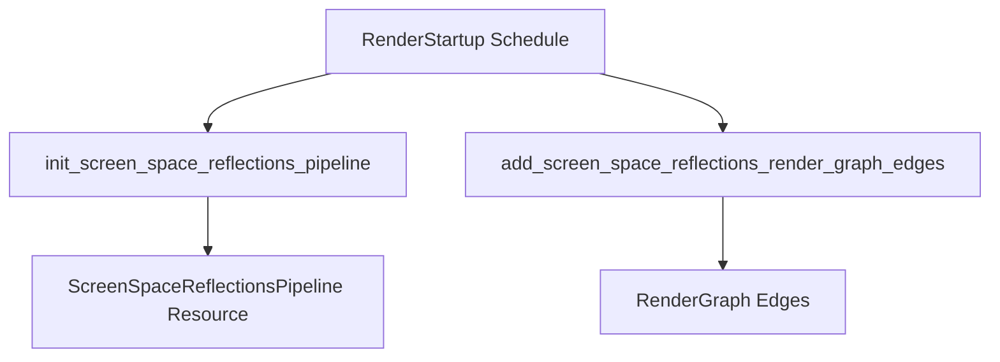

+++
title = "#20194 RenderStartup for screen space reflections"
date = "2025-07-22T00:00:00"
draft = false
template = "pull_request_page.html"
in_search_index = true

[taxonomies]
list_display = ["show"]

[extra]
current_language = "en"
available_languages = {"en" = { name = "English", url = "/pull_request/bevy/2025-07/pr-20194-en-20250722" }, "zh-cn" = { name = "中文", url = "/pull_request/bevy/2025-07/pr-20194-zh-cn-20250722" }}
labels = ["A-Rendering", "C-Code-Quality", "D-Straightforward"]
+++

## RenderStartup for Screen Space Reflections: Technical Analysis

### Basic Information
- **Title**: RenderStartup for screen space reflections
- **PR Link**: https://github.com/bevyengine/bevy/pull/20194
- **Author**: andriyDev
- **Status**: MERGED
- **Labels**: A-Rendering, C-Code-Quality, S-Ready-For-Final-Review, D-Straightforward
- **Created**: 2025-07-19T05:49:32Z
- **Merged**: 2025-07-21T23:20:24Z
- **Merged By**: alice-i-cecile

### Description Translation
# Objective
- Progress towards #19887.

## Solution
- Convert `FromWorld` impls to systems in `RenderStartup`.
- Add a system to conditionally add render graph edges (if a particular node exists).

## Testing
- Ran the `ssr` example and it still works.

### The Story of This Pull Request

The screen space reflections (SSR) implementation was using the `FromWorld` pattern for pipeline initialization, which didn't align with Bevy's newer system-based architecture. This PR migrates the SSR setup to use the `RenderStartup` schedule, improving consistency and maintainability.

The core issue was that `ScreenSpaceReflectionsPipeline` was being initialized through a `FromWorld` implementation. This pattern creates resources directly from the world during plugin setup, which bypasses Bevy's system scheduling and makes the initialization process less flexible. The solution involved converting this setup into a proper system that runs during the `RenderStartup` schedule.

Additionally, the render graph edge setup was moved from the plugin's `finish` method to a dedicated system. This change improves conditional logic handling by checking for the existence of the deferred lighting pass node at runtime rather than during plugin initialization. The new approach uses the render graph's current state to determine if edges should be added:

```rust
fn add_screen_space_reflections_render_graph_edges(mut render_graph: ResMut<RenderGraph>) {
    let subgraph = render_graph.sub_graph_mut(Core3d);
    
    subgraph.add_node_edge(NodePbr::ScreenSpaceReflections, Node3d::MainOpaquePass);
    
    if subgraph
        .get_node_state(NodePbr::DeferredLightingPass)
        .is_ok()
    {
        subgraph.add_node_edge(
            NodePbr::DeferredLightingPass,
            NodePbr::ScreenSpaceReflections,
        );
    }
}
```

The pipeline initialization was refactored from a `FromWorld` impl to a system that uses standard Bevy resources and commands:

```rust
pub fn init_screen_space_reflections_pipeline(
    mut commands: Commands,
    render_device: Res<RenderDevice>,
    // ...other dependencies...
) {
    // Bind group layout creation
    let bind_group_layout = render_device.create_bind_group_layout(/* ... */);
    
    // Sampler creation
    let color_sampler = render_device.create_sampler(/* ... */);
    // ...other samplers...
    
    commands.insert_resource(ScreenSpaceReflectionsPipeline {
        mesh_view_layouts: mesh_view_layouts.clone(),
        color_sampler,
        // ...other fields...
        fragment_shader: load_embedded_asset!(asset_server.as_ref(), "ssr.wgsl"),
    });
}
```

This change aligns SSR with Bevy's established patterns, making the code more consistent and easier to maintain. The migration guide was updated to reflect that `ScreenSpaceReflectionsPipeline` is now initialized in `RenderStartup`.

Testing confirmed the `ssr` example continues to function correctly after these changes. The PR represents a straightforward quality improvement that progresses Bevy toward eliminating `FromWorld` usage (#19887) without altering SSR's core functionality.

### Visual Representation



### Key Files Changed

1. `crates/bevy_pbr/src/ssr/mod.rs`
   - Converted pipeline setup from `FromWorld` to `RenderStartup` system
   - Moved render graph edge creation to dedicated system
   - Removed plugin `finish` method

```rust
// Before:
impl FromWorld for ScreenSpaceReflectionsPipeline {
    fn from_world(world: &mut World) -> Self {
        // Resource initialization directly from world
    }
}

// After:
pub fn init_screen_space_reflections_pipeline(
    mut commands: Commands,
    render_device: Res<RenderDevice>,
    // ...dependencies...
) {
    // System-based resource initialization
    commands.insert_resource(ScreenSpaceReflectionsPipeline { /* ... */ });
}
```

2. `release-content/migration-guides/render_startup.md`
   - Added `ScreenSpaceReflectionsPipeline` to resources initialized in `RenderStartup`

```markdown
+ - `ScreenSpaceReflectionsPipeline`
```

### Further Reading
1. [Bevy RenderStartup Migration Guide](https://github.com/bevyengine/bevy/blob/main/release-content/migration-guides/render_startup.md)
2. [Bevy ECS Schedules Documentation](https://docs.rs/bevy_ecs/latest/bevy_ecs/schedule/index.html)
3. [Bevy Render Graph Architecture](https://github.com/bevyengine/bevy/blob/main/crates/bevy_render/src/render_graph/mod.rs)