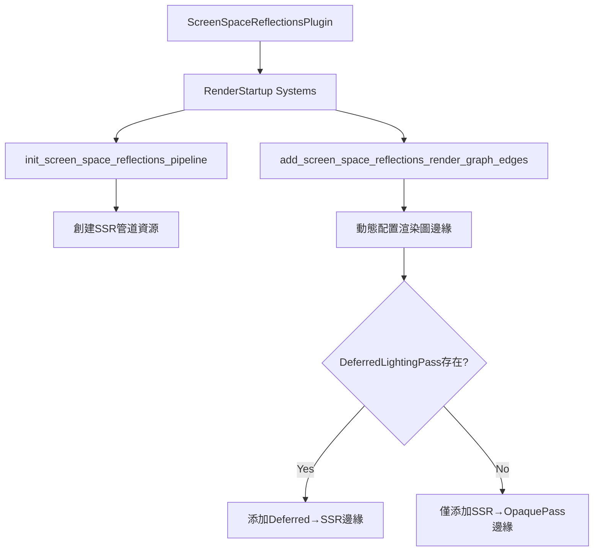

+++
title = "#20194"
date = "2025-07-22T00:00:00"
draft = false
template = "pull_request_page.html"
in_search_index = false

[extra]
current_language = "zh-cn"
available_languages = {"en" = { name = "English", url = "/pull_request/bevy/2025-07/pr-20194-en-20250722" }, "zh-cn" = { name = "中文", url = "/pull_request/bevy/2025-07/pr-20194-zh-cn-20250722" }}
+++

# RenderStartup for screen space reflections

## 基本資訊
- **標題**: RenderStartup for screen space reflections
- **PR 連結**: https://github.com/bevyengine/bevy/pull/20194
- **作者**: andriyDev
- **狀態**: 已合併
- **標籤**: A-Rendering, C-Code-Quality, S-Ready-For-Final-Review, D-Straightforward
- **建立時間**: 2025-07-19T05:49:32Z
- **合併時間**: 2025-07-21T23:20:24Z
- **合併者**: alice-i-cecile

## 描述翻譯
### 目標
- 推進 #19887 的工作

### 解決方案
- 將 `FromWorld` 實現轉換為 `RenderStartup` 中的系統
- 添加系統以有條件地添加渲染圖邊緣（如果特定節點存在）

### 測試
- 運行 `ssr` 範例，它仍然正常工作

## 這個 PR 的故事

### 問題與背景
這個 PR 解決了 Bevy 渲染系統初始化邏輯的技術債問題。原實作中，屏幕空間反射（Screen Space Reflections, SSR）使用 `FromWorld` trait 進行資源初始化，這種方式有幾個缺點：
1. 初始化邏輯與系統調度解耦，難以管理執行順序
2. 無法利用 Bevy 的系統參數注入機制
3. 違反了 Bevy 正在推行的 RenderStartup 初始化標準

具體來說，在 SSR 插件中：
- `ScreenSpaceReflectionsPipeline` 資源通過 `FromWorld` 初始化
- 渲染圖邊緣添加邏輯放在 `Plugin::finish` 方法中
這種實作方式使程式碼分散且難以維護，也阻礙了 #19887 的架構統一工作

### 解決方案方法
作者採用了系統化重構策略：
1. 將 `FromWorld` 初始化轉換為 `RenderStartup` 系統
2. 將渲染圖邊緣添加邏輯提取為獨立系統
3. 實現動態邊緣添加（根據節點存在條件）
4. 保持向後兼容性，確保現有功能不受影響

關鍵工程決策：
- 使用 `RenderStartup` 階段確保初始化順序正確性
- 動態檢查 `DeferredLightingPass` 節點存在性，避免硬編碼依賴
- 保留原有渲染圖結構，僅改變初始化時機

### 實作細節
核心變更是將初始化邏輯從被動構造轉為主動系統執行。以下是具體修改：

#### 1. 資源初始化系統化
原 `FromWorld` 實作被替換為 `init_screen_space_reflections_pipeline` 系統：

```rust
// Before:
impl FromWorld for ScreenSpaceReflectionsPipeline {
    fn from_world(world: &mut World) -> Self {
        let mesh_view_layouts = world.resource::<MeshPipelineViewLayouts>().clone();
        let render_device = world.resource::<RenderDevice>();
        // ... 其他資源獲取 ...
        
        // 創建 bind group layout
        let bind_group_layout = render_device.create_bind_group_layout(...);
        
        // 創建 sampler
        let color_sampler = render_device.create_sampler(...);
        // ... 其他 sampler 創建 ...
        
        Self { /* 字段初始化 */ }
    }
}

// After:
pub fn init_screen_space_reflections_pipeline(
    mut commands: Commands,
    render_device: Res<RenderDevice>,
    render_adapter: Res<RenderAdapter>,
    mesh_view_layouts: Res<MeshPipelineViewLayouts>,
    fullscreen_shader: Res<FullscreenShader>,
    asset_server: Res<AssetServer>,
) {
    // 創建 bind group layout (使用參數注入的資源)
    let bind_group_layout = render_device.create_bind_group_layout(...);
    
    // 創建 sampler (使用參數注入的資源)
    let color_sampler = render_device.create_sampler(...);
    // ... 其他 sampler 創建 ...
    
    // 通過 commands 插入資源
    commands.insert_resource(ScreenSpaceReflectionsPipeline {
        mesh_view_layouts: mesh_view_layouts.clone(),
        // ... 其他字段初始化 ...
    });
}
```
這個轉換帶來兩個主要優勢：
1. 通過系統參數明確聲明資源依賴
2. 利用 Commands 進行資源插入，符合 ECS 標準模式

#### 2. 渲染圖邊緣動態添加
原插件 `finish` 方法中的邊緣添加邏輯被重構為獨立系統：

```rust
// Before:
fn finish(&self, app: &mut App) {
    let has_default_deferred_lighting_pass = /* 複雜的狀態檢查 */;
    if has_default_deferred_lighting_pass {
        render_app.add_render_graph_edges(Core3d, (A, B, C));
    } else {
        render_app.add_render_graph_edges(Core3d, (B, C));
    }
}

// After:
fn add_screen_space_reflections_render_graph_edges(mut render_graph: ResMut<RenderGraph>) {
    let subgraph = render_graph.sub_graph_mut(Core3d);
    
    // 無條件添加基礎邊緣
    subgraph.add_node_edge(NodePbr::ScreenSpaceReflections, Node3d::MainOpaquePass);
    
    // 動態檢查並添加條件邊緣
    if subgraph.get_node_state(NodePbr::DeferredLightingPass).is_ok() {
        subgraph.add_node_edge(
            NodePbr::DeferredLightingPass,
            NodePbr::ScreenSpaceReflections,
        );
    }
}
```
這個改進解決了兩個問題：
1. 消除對特定節點的硬編碼依賴
2. 簡化邊緣添加邏輯，直接操作渲染圖資源

#### 3. 插件初始化重構
在插件註冊層面，轉為使用 `RenderStartup` 階段：

```rust
render_app
    .add_systems(
        RenderStartup,
        (
            init_screen_space_reflections_pipeline,
            add_screen_space_reflections_render_graph_edges,
        ),
    )
```
這確保了：
1. 初始化在正確的渲染階段執行
2. 系統間的執行順序可通過調度控制

### 技術洞察
這個 PR 展示了幾個重要的架構模式：

1. **資源初始化標準化**：
   - 使用 `RenderStartup` 替代 `FromWorld` 統一初始化模式
   - 通過系統參數聲明資源依賴，取代手動資源查找

2. **動態渲染圖配置**：
   ```rust
   if subgraph.get_node_state(NodePbr::DeferredLightingPass).is_ok() {
       // 條件添加邊緣
   }
   ```
   這種模式允許插件靈活適應不同的渲染管線配置

3. **初始化邏輯拆分**：
   - 將資源創建與圖形配置分離為獨立系統
   - 每個系統專注單一職責，提高可維護性

潛在改進點：
- 可考慮將 sampler 創建抽離為共享資源
- 未來可加入錯誤處理機制

### 影響
這些修改帶來以下實質性改進：
1. **架構一致性**：符合 Bevy 渲染系統的現代初始化標準
2. **可維護性**：消除 `finish` 方法中的複雜條件邏輯
3. **靈活性**：動態邊緣添加使 SSR 能適應不同渲染配置
4. **向後兼容**：通過 `ssr` 範例驗證功能完整性

遷移指南也相應更新，記錄了 `ScreenSpaceReflectionsPipeline` 現在在 `RenderStartup` 中初始化，幫助其他開發者適應此變更。

## 視覺表示



## 關鍵文件更改

### 1. `crates/bevy_pbr/src/ssr/mod.rs`
**修改原因**：重構SSR初始化邏輯以符合RenderStartup標準

關鍵修改：
```rust
// 註冊系統到RenderStartup階段
render_app
    .add_systems(
        RenderStartup,
        (
            init_screen_space_reflections_pipeline,
            add_screen_space_reflections_render_graph_edges,
        ),
    )

// 動態渲染圖邊緣添加系統
fn add_screen_space_reflections_render_graph_edges(mut render_graph: ResMut<RenderGraph>) {
    let subgraph = render_graph.sub_graph_mut(Core3d);
    subgraph.add_node_edge(NodePbr::ScreenSpaceReflections, Node3d::MainOpaquePass);
    
    if subgraph.get_node_state(NodePbr::DeferredLightingPass).is_ok() {
        subgraph.add_node_edge(
            NodePbr::DeferredLightingPass,
            NodePbr::ScreenSpaceReflections,
        );
    }
}

// SSR管道初始化系統
pub fn init_screen_space_reflections_pipeline(
    mut commands: Commands,
    render_device: Res<RenderDevice>,
    // ...其他依賴...
) {
    // 資源創建邏輯...
    commands.insert_resource(ScreenSpaceReflectionsPipeline { /* 字段 */ });
}
```

### 2. `release-content/migration-guides/render_startup.md`
**修改原因**：更新遷移指南記錄初始化位置變更

關鍵修改：
```markdown
- `ScreenSpaceReflectionsPipeline`
```

## 延伸閱讀
1. [Bevy RenderStartup 架構文件](https://github.com/bevyengine/bevy/blob/main/docs/plugins_guide.md#render-startup)
2. [ECS 系統設計模式](https://bevyengine.org/learn/book/getting-started/ecs/)
3. [渲染圖動態配置技術](https://github.com/bevyengine/bevy/blob/main/docs/render_graph.md)