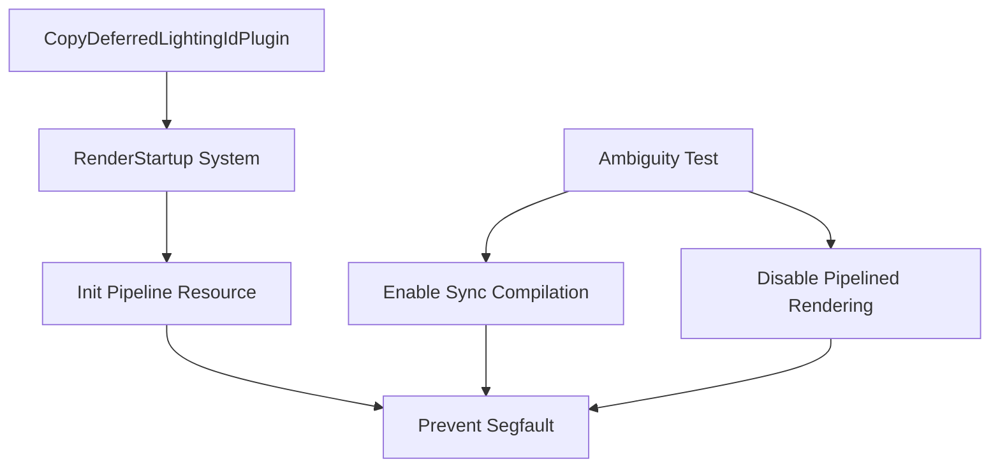

+++
title = "#20195"
date = "2025-07-22T00:00:00"
draft = false
template = "pull_request_page.html"
in_search_index = true

[taxonomies]
list_display = ["show"]

[extra]
current_language = "en"
available_languages = {"en" = { name = "English", url = "/pull_request/bevy/2025-07/pr-20195-en-20250722" }, "zh-cn" = { name = "中文", url = "/pull_request/bevy/2025-07/pr-20195-zh-cn-20250722" }}
+++

## Analysis of PR #20195: Use `RenderStartup` for `CopyDeferredLightingIdPipeline`

### The Story of This Pull Request

This PR addresses a specific segfault that occurred under Linux/Vulkan/llvmpipe configurations when terminating the application while pipelines were being compiled in parallel. The root cause was a thread safety issue in LLVM's `atexit` handlers during concurrent pipeline compilation. The primary objective was to migrate `CopyDeferredLightingIdPipeline` initialization to the `RenderStartup` schedule as part of #19887, but the solution also required specific test modifications to prevent the segfault.

The problem manifested as consistent segfaults in CI runs, particularly in the `ambiguity_detection` test. Investigation revealed that pipeline compilation threads were still active during application termination when using the llvmpipe driver. This PR implements two key changes: First, it converts the `FromWorld` implementation to a `RenderStartup` system like other render resources. Second, it modifies the problematic test to force synchronous pipeline compilation and disable pipelined rendering, ensuring all rendering operations complete before test termination.

The implementation follows Bevy's established pattern for render resource initialization. The `CopyDeferredLightingIdPipeline` resource creation was moved from a `FromWorld` impl to a dedicated system in `RenderStartup`:

```rust
// Before (FromWorld impl):
impl FromWorld for CopyDeferredLightingIdPipeline {
    fn from_world(world: &mut World) -> Self {
        // Resource initialization code
    }
}

// After (RenderStartup system):
pub fn init_copy_deferred_lighting_id_pipeline(
    mut commands: Commands,
    render_device: Res<RenderDevice>,
    // ... other dependencies
) {
    // Initialization logic
    commands.insert_resource(CopyDeferredLightingIdPipeline { ... });
}
```

This change improves consistency with other render resources and provides more explicit control over initialization timing. The system uses standard ECS queries to access necessary resources like `RenderDevice` and `PipelineCache`, making dependencies explicit and improving testability.

For the test fix, we modified the ambiguity detection test to configure rendering for synchronous operation:

```rust
app.add_plugins(
    DefaultPlugins
        .build()
        .set(RenderPlugin {
            synchronous_pipeline_compilation: true,
            ..Default::default()
        })
        .disable::<PipelinedRenderingPlugin>(),
);
```

The `synchronous_pipeline_compilation` setting ensures the render thread blocks on pipeline compilation rather than processing it asynchronously. Disabling `PipelinedRenderingPlugin` guarantees the test doesn't terminate while render operations are still in progress. These changes prevent the race condition between pipeline compilation and application termination that caused the segfault.

The PR also updates the render startup migration guide to include the newly migrated resource, maintaining documentation consistency. After these changes, extensive testing confirmed the segfault no longer occurs in the previously problematic Linux/Vulkan/llvmpipe environment.

### Visual Representation



### Key Files Changed

1. **crates/bevy_core_pipeline/src/deferred/copy_lighting_id.rs** (+47/-54)  
   Migrated pipeline initialization to `RenderStartup` schedule:
   ```rust
   // Before:
   fn finish(&self, app: &mut App) {
       render_app.init_resource::<CopyDeferredLightingIdPipeline>();
   }
   
   // After:
   fn build(&self, app: &mut App) {
       render_app.add_systems(RenderStartup, init_copy_deferred_lighting_id_pipeline);
   }
   
   // New initialization system:
   pub fn init_copy_deferred_lighting_id_pipeline(...) {
       // Uses explicit dependencies via system parameters
       commands.insert_resource(CopyDeferredLightingIdPipeline { ... });
   }
   ```

2. **tests/ecs/ambiguity_detection.rs** (+16/-12)  
   Modified test configuration to prevent segfault:
   ```rust
   // Before:
   app.add_plugins(DefaultPlugins);
   
   // After:
   app.add_plugins(DefaultPlugins.build()
       .set(RenderPlugin {
           synchronous_pipeline_compilation: true,
           ..
       })
       .disable::<PipelinedRenderingPlugin>()
   );
   ```

3. **release-content/migration-guides/render_startup.md** (+1/-0)  
   Updated migration documentation:
   ```markdown
   - `CopyDeferredLightingIdPipeline`
   ```

### Further Reading
1. [Bevy Render Startup Migration](https://github.com/bevyengine/bevy/issues/19887)
2. [Bevy Pipelined Rendering Architecture](https://github.com/bevyengine/bevy/blob/main/docs/plugins/pipelined_rendering.md)
3. [WGSL Shader Compilation in Bevy](https://bevyengine.org/learn/book/getting-started/shaders/)