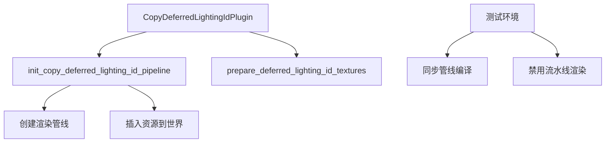

+++
title = "#20195 Use `RenderStartup` for `CopyDeferredLightingIdPipeline"
date = "2025-07-22T00:00:00"
draft = false
template = "pull_request_page.html"
in_search_index = false

[extra]
current_language = "zh-cn"
available_languages = {"en" = { name = "English", url = "/pull_request/bevy/2025-07/pr-20195-en-20250722" }, "zh-cn" = { name = "中文", url = "/pull_request/bevy/2025-07/pr-20195-zh-cn-20250722" }}
+++

# 渲染管线初始化迁移：修复 Vulkan + llvmpipe 环境下的段错误问题

## 基本信息
- **标题**: Use `RenderStartup` for `CopyDeferredLightingIdPipeline`
- **PR 链接**: https://github.com/bevyengine/bevy/pull/20195
- **作者**: andriyDev
- **状态**: MERGED
- **标签**: A-Rendering, C-Code-Quality, S-Ready-For-Final-Review, D-Straightforward
- **创建时间**: 2025-07-19T07:03:56Z
- **合并时间**: 2025-07-21T23:24:05Z
- **合并人**: alice-i-cecile

## 描述翻译
### 目标
- 推进 #19887 的进展
- 此迁移在特定环境下捕获了一个段错误：Linux + Vulkan + llvmpipe 软件渲染驱动 + (可能) `xvfb-run`
  - 原因似乎是程序并发终止(触发 LLVM 的 `atexit` 处理程序)与并行编译管线同时发生
  - LLVM 代码在此场景下存在多线程安全问题
  - 感谢 @kristoff3r 定位此段错误
  - 仍不清楚为何此 PR 触发而非其他 PR

### 解决方案
大部分实现与其他 `RenderStartup` 迁移相同：
- 将 FromWorld 实现转换为 RenderStartup 系统

额外措施：
1. 启用同步管线编译 (`synchronous_pipeline_compilation`)
2. 在 `ambiguity_detection` 测试中禁用流水线渲染 (`PipelinedRenderingPlugin`)
   - 确保渲染线程阻塞在管线编译而非后台运行
   - 保证在测试结束前完成渲染线程

### 测试
- 多次运行 run-examples-linux-vulkan Github Action
- 段错误在此 PR 前持续出现，之后不再复现

## PR 技术分析

### 问题背景
在特定技术栈(Linux + Vulkan + llvmpipe + xvfb-run)下，Bevy 引擎在并行编译渲染管线时可能发生段错误。根本原因是应用程序终止(触发 LLVM 的 `atexit` 处理程序)与后台管线编译同时进行，而 LLVM 的清理代码在此场景下存在多线程安全问题。

`CopyDeferredLightingIdPipeline` 的初始化原使用 `FromWorld` trait，这在引擎初始化阶段同步执行。当迁移到异步管线编译模式时，其初始化可能延迟到应用生命周期后期，与程序终止产生竞态条件。

### 解决方案实现
PR 采用标准模式解决此问题：
1. 将 `FromWorld` 实现转换为 `RenderStartup` 系统
2. 在测试中强制同步管线编译
3. 禁用可能导致后台线程运行的流水线渲染

#### 核心修改：管线初始化迁移
在 `copy_lighting_id.rs` 中，将 `CopyDeferredLightingIdPipeline` 的初始化从 `FromWorld` 迁移到 `RenderStartup` 系统：

```diff
// File: crates/bevy_core_pipeline/src/deferred/copy_lighting_id.rs
-impl FromWorld for CopyDeferredLightingIdPipeline {
-    fn from_world(world: &mut World) -> Self {
-        let render_device = world.resource::<RenderDevice>();
-        // ... 初始化逻辑 ...
-    }
-}
+pub fn init_copy_deferred_lighting_id_pipeline(
+    mut commands: Commands,
+    render_device: Res<RenderDevice>,
+    fullscreen_shader: Res<FullscreenShader>,
+    asset_server: Res<AssetServer>,
+    pipeline_cache: Res<PipelineCache>,
+) {
+    // 创建 bind group layout
+    let layout = render_device.create_bind_group_layout(...);
+    
+    // 配置管线状态
+    let vertex_state = fullscreen_shader.to_vertex_state();
+    let shader = load_embedded_asset!(...);
+    
+    // 将管线加入缓存并获取ID
+    let pipeline_id = pipeline_cache.queue_render_pipeline(...);
+    
+    // 将资源插入世界
+    commands.insert_resource(CopyDeferredLightingIdPipeline {
+        layout,
+        pipeline_id,
+    });
+}
```

插件初始化相应调整为：
```diff
 impl Plugin for CopyDeferredLightingIdPlugin {
     fn build(&self, app: &mut App) {
         let Some(render_app) = app.get_sub_app_mut(RenderApp) else {
             return;
         };
-        render_app.add_systems(
-            Render,
-            (prepare_deferred_lighting_id_textures.in_set(RenderSystems::PrepareResources),);
-    }
-
-    fn finish(&self, app: &mut App) {
-        let Some(render_app) = app.get_sub_app_mut(RenderApp) else {
-            return;
-        };
-
-        render_app.init_resource::<CopyDeferredLightingIdPipeline>();
+        render_app
+            .add_systems(RenderStartup, init_copy_deferred_lighting_id_pipeline)
+            .add_systems(
+                Render,
+                (prepare_deferred_lighting_id_textures.in_set(RenderSystems::PrepareResources),);
     }
 }
```

#### 测试环境加固
在 `ambiguity_detection` 测试中修改插件配置：

```diff
// File: tests/ecs/ambiguity_detection.rs
 fn main() {
     let mut app = App::new();
-    app.add_plugins(DefaultPlugins);
+    app.add_plugins(
+        DefaultPlugins
+            .build()
+            .set(RenderPlugin {
+                // 启用同步管线编译
+                synchronous_pipeline_compilation: true,
+                ..Default::default()
+            })
+            // 禁用流水线渲染
+            .disable::<PipelinedRenderingPlugin>(),
+    );
```

#### 文档更新
在迁移指南中添加新增的 `RenderStartup` 资源：

```diff
// File: release-content/migration-guides/render_startup.md
 - `RenderLightmaps`
 - `PrepassPipeline`
 - `PrepassViewBindGroup`
+ - `CopyDeferredLightingIdPipeline`
```

### 技术影响
1. **线程安全**：通过控制管线初始化时机，避免与程序终止处理程序的竞态
2. **测试稳定性**：同步编译确保测试结束时无后台管线编译进行
3. **架构一致性**：遵循 Bevy 渲染子系统的最佳实践，统一使用 `RenderStartup`
4. **问题定位**：虽然根本原因未完全明确，但解决方案有效规避了特定环境下的段错误

### 组件关系



## 关键文件变更

### crates/bevy_core_pipeline/src/deferred/copy_lighting_id.rs
**变更说明**：将管线初始化从 `FromWorld` 迁移到 `RenderStartup` 系统  
**代码片段**：
```diff
 render_app
-    .add_systems(...)
+    .add_systems(RenderStartup, init_copy_deferred_lighting_id_pipeline)
     .add_systems(...);
```

### tests/ecs/ambiguity_detection.rs
**变更说明**：修改测试配置以启用同步编译和禁用流水线渲染  
**代码片段**：
```diff
+    .set(RenderPlugin {
+        synchronous_pipeline_compilation: true,
+        ..Default::default()
+    })
+    .disable::<PipelinedRenderingPlugin>(),
```

### release-content/migration-guides/render_startup.md
**变更说明**：文档更新记录新增的 RenderStartup 资源  
**代码片段**：
```diff
+ - `CopyDeferredLightingIdPipeline`
```

## 进一步阅读
1. [Bevy Render Stages](https://bevyengine.org/learn/book/getting-started/rendering/) - 官方渲染阶段文档
2. [WGSL Shading Language](https://gpuweb.github.io/gpuweb/wgsl/) - WebGPU 着色语言规范
3. [Vulkan Multithreading](https://vulkan-tutorial.com/Multithreading) - Vulkan 多线程编程指南
4. [LLVM atexit Handling](https://llvm.org/docs/Atomics.html#atexit-handling) - LLVM 原子操作与退出处理