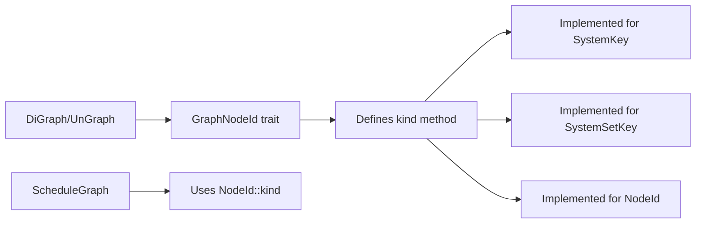

+++
title = "#20196 Clean up `NodeId` kind fetching"
date = "2025-07-22T00:00:00"
draft = false
template = "pull_request_page.html"
in_search_index = true

[taxonomies]
list_display = ["show"]

[extra]
current_language = "en"
available_languages = {"en" = { name = "English", url = "/pull_request/bevy/2025-07/pr-20196-en-20250722" }, "zh-cn" = { name = "中文", url = "/pull_request/bevy/2025-07/pr-20196-zh-cn-20250722" }}
labels = ["D-Trivial", "A-ECS", "C-Code-Quality", "D-Domain-Agnostic"]
+++

# Analysis of PR #20196: Clean up `NodeId` kind fetching

## Basic Information
- **Title**: Clean up `NodeId` kind fetching
- **PR Link**: https://github.com/bevyengine/bevy/pull/20196
- **Author**: ItsDoot
- **Status**: MERGED
- **Labels**: D-Trivial, A-ECS, C-Code-Quality, S-Ready-For-Final-Review, D-Domain-Agnostic
- **Created**: 2025-07-19T08:49:34Z
- **Merged**: 2025-07-21T23:31:55Z
- **Merged By**: alice-i-cecile

## Description Translation
# Objective

- Part of #20115

We don't actually need the `ScheduleGraph` in order to get the kind of a node, so lets move it to our newly created trait.

## Solution

- Removed `ScheduleGraph::get_node_kind`, added `GraphNodeId::kind` instead.
- Co-located `GraphNodeId` in the same file as `DiGraph`/`UnGraph`/`Graph`.
- Implemented `GraphNodeId` for `SystemSetKey` for symmetry.

No migration guide needed as `get_node_kind` is a private function.

## Testing

Re-using current tests.

## The Story of This Pull Request

This PR addresses a code organization issue in Bevy's ECS schedule graph implementation. The core problem was that node type information ("system" vs "system set") was being fetched through the `ScheduleGraph` struct when it more naturally belonged to the node identifiers themselves. 

The original implementation had a private `ScheduleGraph::get_node_kind` method that returned a string based on the `NodeId` variant:

```rust
fn get_node_kind(&self, id: &NodeId) -> &'static str {
    match id {
        NodeId::System(_) => "system",
        NodeId::Set(_) => "system set",
    }
}
```

This approach had two main issues:
1. The `ScheduleGraph` didn't need to own this functionality
2. The `GraphNodeId` trait (which `NodeId` implements) was a more natural home for this behavior

The solution involved three key changes:
1. Adding a `kind()` method to the `GraphNodeId` trait
2. Implementing this trait for all relevant node ID types
3. Removing the now-redundant `get_node_kind` from `ScheduleGraph`

The implementation added the `kind()` method to the `GraphNodeId` trait definition:

```rust
pub trait GraphNodeId: Copy + Eq + Hash + Ord + Debug {
    // ... existing code ...
    
    fn kind(&self) -> &'static str;
}
```

Concrete implementations were then added for the node ID types:

```rust
// For SystemKey
impl GraphNodeId for SystemKey {
    // ...
    fn kind(&self) -> &'static str {
        "system"
    }
}

// For SystemSetKey
impl GraphNodeId for SystemSetKey {
    // ...
    fn kind(&self) -> &'static str {
        "system set"
    }
}

// For NodeId (enum wrapper)
impl GraphNodeId for NodeId {
    // ...
    fn kind(&self) -> &'static str {
        match self {
            NodeId::System(n) => n.kind(),
            NodeId::Set(n) => n.kind(),
        }
    }
}
```

This change allowed replacing all `get_node_kind` calls with direct `kind()` method calls on the node IDs themselves. For example:

```rust
// Before:
writeln!(
    message,
    " -- {} `{}` cannot be child of set `{}`, longer path exists",
    self.get_node_kind(child),
    self.get_node_name(child),
    self.get_node_name(parent),
)

// After:
writeln!(
    message,
    " -- {} `{}` cannot be child of set `{}`, longer path exists",
    child.kind(),
    self.get_node_name(child),
    self.get_node_name(parent),
)
```

Additionally, the PR improved code organization by moving the `GraphNodeId` trait from its own file (`graph/node.rs`) to `graph_map.rs` where the graph structures (`DiGraph`, `UnGraph`) are defined. This co-locates related concepts and reduces file count.

The change maintains backward compatibility as `get_node_kind` was private and all public interfaces remain unchanged. Existing tests provided sufficient coverage since this was a refactor without functional changes.

## Visual Representation



## Key Files Changed

### 1. `crates/bevy_ecs/src/schedule/graph/graph_map.rs` (+23/-5)
- Added `GraphNodeId` trait definition with `kind()` method
- Removed old trait bounds and added `Debug` constraint
- Updated `Graph` debug implementation

Key additions:
```rust
pub trait GraphNodeId: Copy + Eq + Hash + Ord + Debug {
    // ... existing associated types ...
    
    fn kind(&self) -> &'static str;
}

impl<const DIRECTED: bool, N: GraphNodeId, S: BuildHasher> Debug for Graph<DIRECTED, N, S> {
    // ... implementation ...
}
```

### 2. `crates/bevy_ecs/src/schedule/node.rs` (+20/-0)
- Implemented `GraphNodeId` for `SystemKey`, `SystemSetKey`, and `NodeId`
- Added `kind()` methods returning appropriate node types

```rust
impl GraphNodeId for SystemKey {
    // ...
    fn kind(&self) -> &'static str {
        "system"
    }
}

impl GraphNodeId for SystemSetKey {
    // ...
    fn kind(&self) -> &'static str {
        "system set"
    }
}

impl GraphNodeId for NodeId {
    // ...
    fn kind(&self) -> &'static str {
        match self {
            NodeId::System(n) => n.kind(),
            NodeId::Set(n) => n.kind(),
        }
    }
}
```

### 3. `crates/bevy_ecs/src/schedule/schedule.rs` (+4/-14)
- Removed `get_node_kind` method
- Replaced its usages with direct `kind()` calls

```rust
// Removed method:
fn get_node_kind(&self, id: &NodeId) -> &'static str {
    match id {
        NodeId::System(_) => "system",
        NodeId::Set(_) => "system set",
    }
}

// Usage replaced:
// Before: self.get_node_kind(child)
// After: child.kind()
```

### 4. `crates/bevy_ecs/src/schedule/graph/node.rs` (+0/-16)
- Entire file removed as its content moved to `graph_map.rs`

### 5. `crates/bevy_ecs/src/schedule/graph/tarjan_scc.rs` (+4/-5)
- Updated imports to reference new `GraphNodeId` location

```rust
// Before:
use crate::schedule::graph::node::GraphNodeId;
use super::DiGraph;

// After:
use crate::schedule::graph::{DiGraph, GraphNodeId};
```

## Further Reading
1. [GraphNodeId trait documentation](https://doc.rust-lang.org/book/ch10-02-traits.html)
2. [Bevy ECS architecture overview](https://bevyengine.org/learn/book/getting-started/ecs/)
3. [Polymorphism in Rust through traits](https://doc.rust-lang.org/book/ch17-02-trait-objects.html)
4. [Code organization best practices](https://doc.rust-lang.org/book/ch07-02-defining-modules-to-control-scope-and-privacy.html)