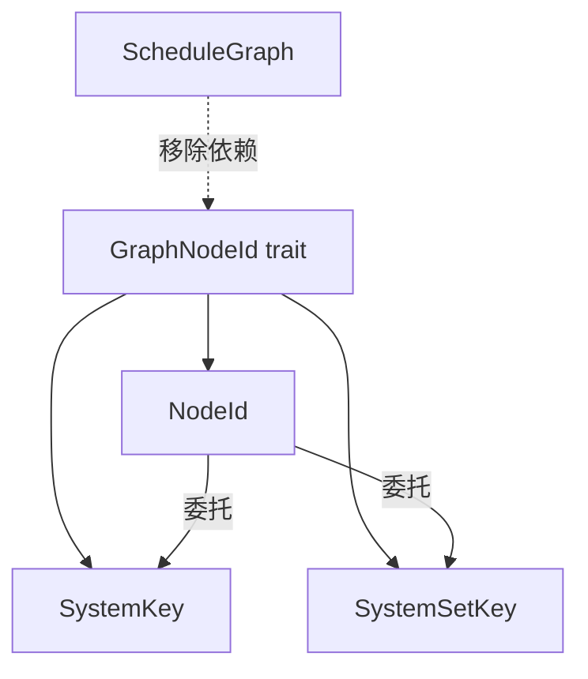

+++
title = "#20196 Clean up `NodeId` kind fetching"
date = "2025-07-22T00:00:00"
draft = false
template = "pull_request_page.html"
in_search_index = false

[extra]
current_language = "zh-cn"
available_languages = {"en" = { name = "English", url = "/pull_request/bevy/2025-07/pr-20196-en-20250722" }, "zh-cn" = { name = "中文", url = "/pull_request/bevy/2025-07/pr-20196-zh-cn-20250722" }}
+++

### Clean up `NodeId` kind fetching

#### 基本信息
- **标题**: Clean up `NodeId` kind fetching
- **PR链接**: https://github.com/bevyengine/bevy/pull/20196
- **作者**: ItsDoot
- **状态**: 已合并
- **标签**: D-Trivial, A-ECS, C-Code-Quality, S-Ready-For-Final-Review, D-Domain-Agnostic
- **创建时间**: 2025-07-19T08:49:34Z
- **合并时间**: 2025-07-21T23:31:55Z
- **合并人**: alice-i-cecile

#### 描述翻译
**Objective**
- #20115 的一部分

我们实际上不需要依赖 `ScheduleGraph` 来获取节点的类型(kind)，因此将其移至新创建的 trait。

**Solution**
- 移除 `ScheduleGraph::get_node_kind`，改为添加 `GraphNodeId::kind`
- 将 `GraphNodeId` 移到与 `DiGraph`/`UnGraph`/`Graph` 相同的文件中
- 为保持对称性，为 `SystemSetKey` 实现 `GraphNodeId`

无需迁移指南，因为 `get_node_kind` 是私有函数。

**Testing**
复用现有测试。

---

### 技术分析报告

#### 问题背景
在 Bevy ECS 的调度图(schedule graph)实现中，获取节点类型（如区分 system 或 system set）是通过 `ScheduleGraph::get_node_kind` 方法完成的。这种方法存在两个问题：
1. 不必要的耦合：获取节点类型本质上是节点自身的属性，却依赖外部容器 `ScheduleGraph`
2. 代码冗余：相同逻辑在多个地方重复实现（如错误消息生成）

原实现片段：
```rust
// crates/bevy_ecs/src/schedule/schedule.rs
fn get_node_kind(&self, id: &NodeId) -> &'static str {
    match id {
        NodeId::System(_) => "system",
        NodeId::Set(_) => "system set",
    }
}
```

#### 解决方案
核心思路是将节点类型查询行为内聚到节点自身：
1. 在 `GraphNodeId` trait 添加 `kind()` 方法
2. 为所有节点类型实现该方法
3. 移除原本分散的 `get_node_kind` 实现

关键修改点：
- 将类型查询逻辑下放到具体节点类型
- 消除对 `ScheduleGraph` 的不必要依赖
- 保持 `SystemKey` 和 `SystemSetKey` 的对称实现

#### 具体实现
**1. 重构 GraphNodeId trait**
将 trait 迁移到 graph_map.rs 并添加 kind 方法：
```rust
// crates/bevy_ecs/src/schedule/graph/graph_map.rs
pub trait GraphNodeId: Copy + Eq + Hash + Ord + Debug {
    ...
    fn kind(&self) -> &'static str;
}
```

**2. 实现节点类型查询**
为不同节点类型提供具体实现：
```rust
// crates/bevy_ecs/src/schedule/node.rs
impl GraphNodeId for SystemKey {
    ...
    fn kind(&self) -> &'static str {
        "system"
    }
}

impl GraphNodeId for SystemSetKey {
    ...
    fn kind(&self) -> &'static str {
        "system set"
    }
}

impl GraphNodeId for NodeId {
    ...
    fn kind(&self) -> &'static str {
        match self {
            NodeId::System(n) => n.kind(),
            NodeId::Set(n) => n.kind(),
        }
    }
}
```

**3. 移除旧实现**
删除原本的辅助方法和文件：
```diff
// crates/bevy_ecs/src/schedule/schedule.rs
- fn get_node_kind(&self, id: &NodeId) -> &'static str {
-     match id {
-         NodeId::System(_) => "system",
-         NodeId::Set(_) => "system set",
-     }
- }
```

**4. 调用点改造**
所有使用点改为直接调用 trait 方法：
```diff
// 错误消息生成
writeln!(
    message,
    " -- {} `{}` cannot be child of set `{}`, longer path exists",
-    self.get_node_kind(child),
+    child.kind(),
    self.get_node_name(child),
    self.get_node_name(parent),
)
```

#### 工程价值
1. **降低耦合度**：节点类型查询不再依赖图结构
2. **提高内聚性**：节点行为封装在对应实现中
3. **消除冗余**：删除 16 行重复逻辑代码
4. **扩展性**：新增节点类型只需实现 trait 即可
5. **对称设计**：`SystemSetKey` 获得与 `SystemKey` 一致的处理

#### 技术洞察
此修改展示了 Rust trait 的典型应用场景：
1. 将行为抽象为接口（`GraphNodeId`）
2. 为具体类型提供默认实现（`kind()`）
3. 通过 trait bound 约束类型能力

特别值得注意的是对枚举类型 `NodeId` 的处理技巧：
```rust
match self {
    NodeId::System(n) => n.kind(),  // 委托给内部类型实现
    NodeId::Set(n) => n.kind(),
}
```
这种模式避免了在枚举层级重复实现，符合 DRY 原则。

---

### 组件关系图


---

### 关键文件变更

**1. graph_map.rs (+23/-5)**
```diff
+ pub trait GraphNodeId: Copy + Eq + Hash + Ord + Debug {
+     ...
+     fn kind(&self) -> &'static str;
+ }
```

**2. node.rs (+20/-0)**
```rust
impl GraphNodeId for SystemKey {
    ...
    fn kind(&self) -> &'static str {
        "system"
    }
}

impl GraphNodeId for SystemSetKey {
    ...
    fn kind(&self) -> &'static str {
        "system set"
    }
}
```

**3. schedule.rs (+4/-14)**
```diff
- fn get_node_kind(&self, id: &NodeId) -> &'static str {
-     match id {
-         NodeId::System(_) => "system",
-         NodeId::Set(_) => "system set",
-     }
- }
```

**4. node.rs (删除文件)(+0/-16)**  
原文件内容：
```rust
pub trait GraphNodeId: Copy + Eq + Hash + Ord + Debug {
    type Adjacent: Copy + Debug + From<(Self, Direction)> + Into<(Self, Direction)>;
    type Edge: Copy + Eq + Hash + Debug + From<(Self, Self)> + Into<(Self, Self)>;
}
```

**5. tarjan_scc.rs (+4/-5)**
```diff
- use crate::schedule::graph::node::GraphNodeId;
- use super::DiGraph;
+ use crate::schedule::graph::{DiGraph, GraphNodeId};
```

---

### 扩展阅读
1. Rust trait 设计指南：https://doc.rust-lang.org/book/ch10-02-traits.html
2. Bevy ECS 调度系统文档：https://bevyengine.org/learn/book/getting-started/ecs/
3. 面向接口编程原则：https://en.wikipedia.org/wiki/Interface-based_programming

---

### 完整代码变更
```diff
diff --git a/crates/bevy_ecs/src/schedule/graph/graph_map.rs b/crates/bevy_ecs/src/schedule/graph/graph_map.rs
index a2a5b0801e009..09f3a1df353be 100644
--- a/crates/bevy_ecs/src/schedule/graph/graph_map.rs
+++ b/crates/bevy_ecs/src/schedule/graph/graph_map.rs
@@ -5,18 +5,36 @@
 //! [`petgraph`]: https://docs.rs/petgraph/0.6.5/petgraph/
 
 use alloc::vec::Vec;
-use bevy_platform::{collections::HashSet, hash::FixedHasher};
 use core::{
-    fmt,
+    fmt::{self, Debug},
     hash::{BuildHasher, Hash},
 };
+
+use bevy_platform::{collections::HashSet, hash::FixedHasher};
 use indexmap::IndexMap;
 use smallvec::SmallVec;
 
-use crate::schedule::graph::node::GraphNodeId;
-
 use Direction::{Incoming, Outgoing};
 
+/// Types that can be used as node identifiers in a [`DiGraph`]/[`UnGraph`].
+///
+/// [`DiGraph`]: crate::schedule::graph::DiGraph
+/// [`UnGraph`]: crate::schedule::graph::UnGraph
+pub trait GraphNodeId: Copy + Eq + Hash + Ord + Debug {
+    /// The type that packs and unpacks this [`GraphNodeId`] with a [`Direction`].
+    /// This is used to save space in the graph's adjacency list.
+    type Adjacent: Copy + Debug + From<(Self, Direction)> + Into<(Self, Direction)>;
+    /// The type that packs and unpacks this [`GraphNodeId`] with another
+    /// [`GraphNodeId`]. This is used to save space in the graph's edge list.
+    type Edge: Copy + Eq + Hash + Debug + From<(Self, Self)> + Into<(Self, Self)>;
+
+    /// Name of the kind of this node id.
+    ///
+    /// For structs, this should return a human-readable name of the struct.
+    /// For enums, this should return a human-readable name of the enum variant.
+    fn kind(&self) -> &'static str;
+}
+
 /// A `Graph` with undirected edges of some [`GraphNodeId`] `N`.
 ///
 /// For example, an edge between *1* and *2* is equivalent to an edge between
@@ -55,7 +73,7 @@ where
     edges: HashSet<N::Edge, S>,
 }
 
-impl<const DIRECTED: bool, N: GraphNodeId, S: BuildHasher> fmt::Debug for Graph<DIRECTED, N, S> {
+impl<const DIRECTED: bool, N: GraphNodeId, S: BuildHasher> Debug for Graph<DIRECTED, N, S> {
     fn fmt(&self, f: &mut fmt::Formatter) -> fmt::Result {
         self.nodes.fmt(f)
     }
diff --git a/crates/bevy_ecs/src/schedule/graph/mod.rs b/crates/bevy_ecs/src/schedule/graph/mod.rs
index a88034a6a7fdb..0ad0190b031ab 100644
--- a/crates/bevy_ecs/src/schedule/graph/mod.rs
+++ b/crates/bevy_ecs/src/schedule/graph/mod.rs
@@ -13,11 +13,9 @@ use fixedbitset::FixedBitSet;
 use crate::schedule::set::*;
 
 mod graph_map;
-mod node;
 mod tarjan_scc;
 
-pub use graph_map::{DiGraph, Direction, UnGraph};
-pub use node::GraphNodeId;
+pub use graph_map::{DiGraph, Direction, GraphNodeId, UnGraph};
 
 /// Specifies what kind of edge should be added to the dependency graph.
 #[derive(Debug, Clone, Copy, Eq, PartialEq, PartialOrd, Ord, Hash)]
diff --git a/crates/bevy_ecs/src/schedule/graph/node.rs b/crates/bevy_ecs/src/schedule/graph/node.rs
deleted file mode 100644
index c3ab19c9da31d..0000000000000
--- a/crates/bevy_ecs/src/schedule/graph/node.rs
+++ /dev/null
@@ -1,16 +0,0 @@
-use core::{fmt::Debug, hash::Hash};
-
-use crate::schedule::graph::Direction;
-
-/// Types that can be used as node identifiers in a [`DiGraph`]/[`UnGraph`].
-///
-/// [`DiGraph`]: crate::schedule::graph::DiGraph
-/// [`UnGraph`]: crate::schedule::graph::UnGraph
-pub trait GraphNodeId: Copy + Eq + Hash + Ord + Debug {
-    /// The type that packs and unpacks this [`GraphNodeId`] with a [`Direction`].
-    /// This is used to save space in the graph's adjacency list.
-    type Adjacent: Copy + Debug + From<(Self, Direction)> + Into<(Self, Direction)>;
-    /// The type that packs and unpacks this [`GraphNodeId`] with another
-    /// [`GraphNodeId`]. This is used to save space in the graph's edge list.
-    type Edge: Copy + Eq + Hash + Debug + From<(Self, Self)> + Into<(Self, Self)>;
-}
diff --git a/crates/bevy_ecs/src/schedule/graph/tarjan_scc.rs b/crates/bevy_ecs/src/schedule/graph/tarjan_scc.rs
index 309ec321baa03..23584cab95f38 100644
--- a/crates/bevy_ecs/src/schedule/graph/tarjan_scc.rs
+++ b/crates/bevy_ecs/src/schedule/graph/tarjan_scc.rs
@@ -1,11 +1,10 @@
-use crate::schedule::graph::node::GraphNodeId;
-
-use super::DiGraph;
 use alloc::vec::Vec;
-use core::hash::BuildHasher;
-use core::num::NonZeroUsize;
+use core::{hash::BuildHasher, num::NonZeroUsize};
+
 use smallvec::SmallVec;
 
+use crate::schedule::graph::{DiGraph, GraphNodeId};
+
 /// Create an iterator over *strongly connected components* using Algorithm 3 in
 /// [A Space-Efficient Algorithm for Finding Strongly Connected Components][1] by David J. Pierce,
 /// which is a memory-efficient variation of [Tarjan's algorithm][2].
diff --git a/crates/bevy_ecs/src/schedule/node.rs b/crates/bevy_ecs/src/schedule/node.rs
index 36005cf0c9ee8..75c5c71ae8ce8 100644
--- a/crates/bevy_ecs/src/schedule/node.rs
+++ b/crates/bevy_ecs/src/schedule/node.rs
@@ -258,6 +258,19 @@ new_key_type! {
 impl GraphNodeId for SystemKey {
     type Adjacent = (SystemKey, Direction);
     type Edge = (SystemKey, SystemKey);
+
+    fn kind(&self) -> &'static str {
+        "system"
+    }
+}
+
+impl GraphNodeId for SystemSetKey {
+    type Adjacent = (SystemSetKey, Direction);
+    type Edge = (SystemSetKey, SystemSetKey);
+
+    fn kind(&self) -> &'static str {
+        "system set"
+    }
 }
 
 impl TryFrom<NodeId> for SystemKey {
@@ -324,6 +337,13 @@ impl NodeId {
 impl GraphNodeId for NodeId {
     type Adjacent = CompactNodeIdAndDirection;
     type Edge = CompactNodeIdPair;
+
+    fn kind(&self) -> &'static str {
+        match self {
+            NodeId::System(n) => n.kind(),
+            NodeId::Set(n) => n.kind(),
+        }
+    }
 }
 
 impl From<SystemKey> for NodeId {
diff --git a/crates/bevy_ecs/src/schedule/schedule.rs b/crates/bevy_ecs/src/schedule/schedule.rs
index 6a13e6c4ff22c..8404ccf350935 100644
--- a/crates/bevy_ecs/src/schedule/schedule.rs
+++ b/crates/bevy_ecs/src/schedule/schedule.rs
@@ -1443,13 +1443,6 @@ impl ScheduleGraph {
         )
     }
 
-    fn get_node_kind(&self, id: &NodeId) -> &'static str {
-        match id {
-            NodeId::System(_) => "system",
-            NodeId::Set(_) => "system set",
-        }
-    }
-
     /// If [`ScheduleBuildSettings::hierarchy_detection`] is [`LogLevel::Ignore`] this check
     /// is skipped.
     fn optionally_check_hierarchy_conflicts(
@@ -1481,7 +1474,7 @@ impl ScheduleGraph {
             writeln!(
                 message,
                 " -- {} `{}` cannot be child of set `{}`, longer path exists",
-                self.get_node_kind(child),
+                child.kind(),
                 self.get_node_name(child),
                 self.get_node_name(parent),
             )
@@ -1585,12 +1578,9 @@ impl ScheduleGraph {
     ) -> String {
         let mut message = format!("schedule has {} before/after cycle(s):\n", cycles.len());
         for (i, cycle) in cycles.iter().enumerate() {
-            let mut names = cycle.iter().map(|&id| {
-                (
-                    self.get_node_kind(&id.into()),
-                    self.get_node_name(&id.into()),
-                )
-            });
+            let mut names = cycle
+                .iter()
+                .map(|&id| (id.into().kind(), self.get_node_name(&id.into())));
             let (first_kind, first_name) = names.next().unwrap();
             writeln!(
                 message,
```