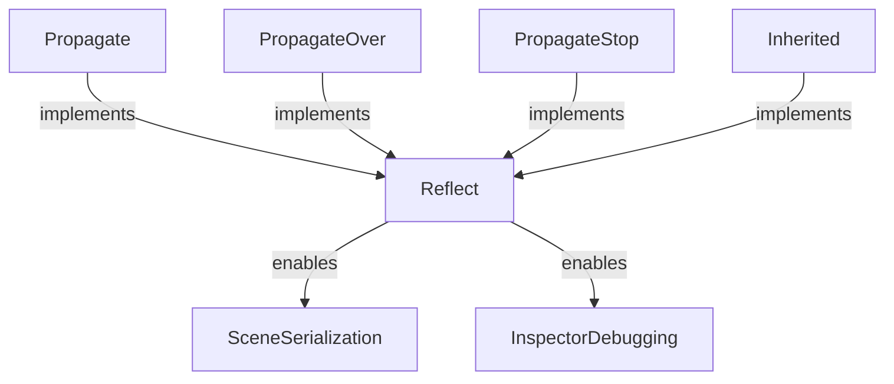

+++
title = "#20197 propagate add reflect"
date = "2025-07-20T00:00:00"
draft = false
template = "pull_request_page.html"
in_search_index = true

[taxonomies]
list_display = ["show"]

[extra]
current_language = "en"
available_languages = {"en" = { name = "English", url = "/pull_request/bevy/2025-07/pr-20197-en-20250720" }, "zh-cn" = { name = "中文", url = "/pull_request/bevy/2025-07/pr-20197-zh-cn-20250720" }}
labels = ["C-Usability", "A-App"]
+++

# Technical Analysis of PR #20197: propagate add reflect

## Basic Information
- **Title**: propagate add reflect
- **PR Link**: https://github.com/bevyengine/bevy/pull/20197
- **Author**: rendaoer
- **Status**: MERGED
- **Labels**: C-Usability, S-Ready-For-Final-Review, A-App
- **Created**: 2025-07-19T11:41:15Z
- **Merged**: 2025-07-20T20:31:53Z
- **Merged By**: alice-i-cecile

## Description Translation
Allow Propagate components to be saved and loaded simultaneously during bevy inspector debugging and scene save/load

## Solution
Let these components implement Reflect

## The Story of This Pull Request

### The Problem and Context
The PR addresses a limitation in Bevy's component propagation system. Components like `Propagate`, `PropagateOver`, and `PropagateStop` couldn't be serialized or inspected in the Bevy editor because they didn't implement the `Reflect` trait. This prevented their state from being saved in scenes or inspected during debugging, creating a gap in the development workflow.

### The Solution Approach
The solution is straightforward: implement the `Reflect` trait for these propagation components. This maintains consistency with other Bevy components that support reflection. The implementation uses conditional compilation to ensure the reflection code only compiles when the `bevy_reflect` feature is enabled, avoiding unnecessary overhead when reflection isn't needed.

### The Implementation
The changes are minimal but effective. For each propagation component, we added:
1. `derive(Reflect)` to enable automatic reflection implementation
2. `reflect()` attributes to include existing traits in reflection metadata
3. Conditional compilation guards (`cfg_attr`) to only include reflection when needed

The `Inherited` component also received reflection support since it's part of the propagation system. All changes are backward-compatible and maintain existing functionality while adding new capabilities.

### Technical Insights
The key technical aspects are:
1. **Conditional Compilation**: Using `#[cfg_attr(feature = "bevy_reflect", ...)]` ensures reflection support is optional
2. **Reflection Metadata**: The `reflect(Component, ...)` attribute registers component traits with Bevy's reflection system
3. **Zero-Cost Abstraction**: When reflection is disabled, these changes have no runtime impact

### The Impact
These changes enable:
1. Scene serialization/deserialization of propagation components
2. Runtime inspection of propagation state in Bevy's editor
3. Consistent behavior with other Bevy components that implement Reflect
4. No performance impact when reflection isn't used

## Visual Representation



## Key Files Changed

### `crates/bevy_app/src/propagate.rs`
**Purpose**: Adds reflection support to propagation components  
**Key Changes**:
1. Added `bevy_reflect` imports
2. Implemented `Reflect` for all propagation components
3. Added conditional compilation attributes

**Code Snippets**:

```rust
// Before:
#[derive(Component, Clone, PartialEq)]
pub struct Propagate<C: Component + Clone + PartialEq>(pub C);

// After:
#[derive(Component, Clone, PartialEq)]
#[cfg_attr(
    feature = "bevy_reflect",
    derive(Reflect),
    reflect(Component, Clone, PartialEq)
)]
pub struct Propagate<C: Component + Clone + PartialEq>(pub C);
```

```rust
// Before:
#[derive(Component)]
pub struct PropagateOver<C>(PhantomData<fn() -> C>);

// After:
#[derive(Component)]
#[cfg_attr(feature = "bevy_reflect", derive(Reflect), reflect(Component))]
pub struct PropagateOver<C>(PhantomData<fn() -> C>);
```

```rust
// Before:
#[derive(Component)]
pub struct PropagateStop<C>(PhantomData<fn() -> C>);

// After:
#[derive(Component)]
#[cfg_attr(feature = "bevy_reflect", derive(Reflect), reflect(Component))]
pub struct PropagateStop<C>(PhantomData<fn() -> C>);
```

```rust
// Before:
#[derive(Component, Clone, PartialEq)]
pub struct Inherited<C: Component + Clone + PartialEq>(pub C);

// After:
#[derive(Component, Clone, PartialEq)]
#[cfg_attr(
    feature = "bevy_reflect",
    derive(Reflect),
    reflect(Component, Clone, PartialEq)
)]
pub struct Inherited<C: Component + Clone + PartialEq>(pub C);
```

## Further Reading
1. [Bevy Reflection Documentation](https://docs.rs/bevy_reflect/latest/bevy_reflect/): Comprehensive guide to Bevy's reflection system
2. [Component Reflection Examples](https://github.com/bevyengine/bevy/tree/main/examples/reflection): Practical implementations of reflected components
3. [Scene Serialization Guide](https://bevyengine.org/learn/book/getting-started/scene/): Official documentation on saving/loading scenes
4. [Conditional Compilation in Rust](https://doc.rust-lang.org/reference/conditional-compilation.html): Reference for `cfg_attr` usage

## Full Code Diff
```diff
diff --git a/crates/bevy_app/src/propagate.rs b/crates/bevy_app/src/propagate.rs
index c6ac5139b92e8..2cfaf6bda767e 100644
--- a/crates/bevy_app/src/propagate.rs
+++ b/crates/bevy_app/src/propagate.rs
@@ -8,10 +8,12 @@ use bevy_ecs::{
     hierarchy::ChildOf,
     lifecycle::RemovedComponents,
     query::{Changed, Or, QueryFilter, With, Without},
+    reflect::ReflectComponent,
     relationship::{Relationship, RelationshipTarget},
     schedule::{IntoScheduleConfigs, SystemSet},
     system::{Commands, Local, Query},
 };
+use bevy_reflect::Reflect;
 
 /// Plugin to automatically propagate a component value to all direct and transient relationship
 /// targets (e.g. [`bevy_ecs::hierarchy::Children`]) of entities with a [`Propagate`] component.
@@ -38,15 +40,22 @@ pub struct HierarchyPropagatePlugin<
 /// targets. A target with a [`Propagate<C>`] component of its own will override propagation from
 /// that point in the tree.
 #[derive(Component, Clone, PartialEq)]
+#[cfg_attr(
+    feature = "bevy_reflect",
+    derive(Reflect),
+    reflect(Component, Clone, PartialEq)
+]
 pub struct Propagate<C: Component + Clone + PartialEq>(pub C);
 
 /// Stops the output component being added to this entity.
 /// Relationship targets will still inherit the component from this entity or its parents.
 #[derive(Component)]
+#[cfg_attr(feature = "bevy_reflect", derive(Reflect), reflect(Component))]
 pub struct PropagateOver<C>(PhantomData<fn() -> C>);
 
 /// Stops the propagation at this entity. Children will not inherit the component.
 #[derive(Component)]
+#[cfg_attr(feature = "bevy_reflect", derive(Reflect), reflect(Component))]
 pub struct PropagateStop<C>(PhantomData<fn() -> C>);
 
 /// The set in which propagation systems are added. You can schedule your logic relative to this set.
@@ -57,6 +66,11 @@ pub struct PropagateSet<C: Component + Clone + PartialEq> {
 
 /// Internal struct for managing propagation
 #[derive(Component, Clone, PartialEq)]
+#[cfg_attr(
+    feature = "bevy_reflect",
+    derive(Reflect),
+    reflect(Component, Clone, PartialEq)
+]
 pub struct Inherited<C: Component + Clone + PartialEq>(pub C);
 
 impl<C: Component + Clone + PartialEq, F: QueryFilter, R: Relationship> Default
```