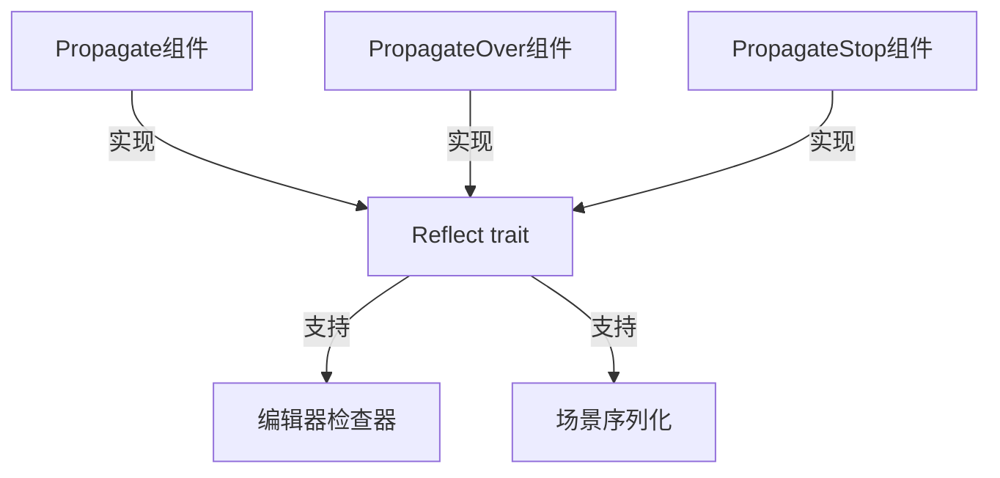

+++
title = "#20197 propagate add reflect"
date = "2025-07-20T00:00:00"
draft = false
template = "pull_request_page.html"
in_search_index = false

[extra]
current_language = "zh-cn"
available_languages = {"en" = { name = "English", url = "/pull_request/bevy/2025-07/pr-20197-en-20250720" }, "zh-cn" = { name = "中文", url = "/pull_request/bevy/2025-07/pr-20197-zh-cn-20250720" }}
+++

## 分析报告：Propagate 组件反射支持增强 (#20197)

### 基础信息
- **标题**: propagate add reflect
- **PR 链接**: https://github.com/bevyengine/bevy/pull/20197
- **作者**: rendaoer
- **状态**: 已合并
- **标签**: C-Usability, S-Ready-For-Final-Review, A-App
- **创建时间**: 2025-07-19T11:41:15Z
- **合并时间**: 2025-07-20T20:31:53Z
- **合并人**: alice-i-cecile

### 问题描述与背景
在 Bevy 的场景保存/加载和编辑器检查器(inspector)调试工作流中，存在一个功能缺失：`Propagate`、`PropagateOver` 和 `PropagateStop` 组件无法被序列化或动态检查。这些组件负责实体间的属性传播机制，但在调试或场景持久化时无法保存状态。这导致两个具体问题：
1. 使用 Bevy 的场景系统(scene system)时，组件的传播关系无法保存/恢复
2. 在运行时检查器(inspector)中无法查看或修改传播组件的状态

技术约束在于这些组件原先未实现 `Reflect` trait，而这是 Bevy 反射系统的核心要求。反射系统负责序列化、编辑器集成和动态类型操作。

### 解决方案
核心解决思路是为传播相关组件添加反射支持：
```rust
// 修改前
#[derive(Component, Clone, PartialEq)]
pub struct Propagate<C: Component + Clone + PartialEq>(pub C);

// 修改后
#[derive(Component, Clone, PartialEq)]
#[cfg_attr(
    feature = "bevy_reflect",
    derive(Reflect),
    reflect(Component, Clone, PartialEq)
)]
pub struct Propagate<C: Component + Clone + PartialEq>(pub C);
```
关键设计决策：
1. 使用条件编译(`cfg_attr`)，确保仅当启用 `bevy_reflect` 特性时才包含反射代码
2. 通过 `reflect(...)` 属性指定组件应实现的反射接口
3. 保持原有组件行为不变，仅增加元数据能力

### 实现细节
修改集中在 `propagate.rs` 文件，为三个核心组件添加反射支持：

1. **Propagate 组件**：
```rust
#[cfg_attr(
    feature = "bevy_reflect",
    derive(Reflect),
    reflect(Component, Clone, PartialEq)
)]
pub struct Propagate<C: Component + Clone + PartialEq>(pub C);
```
- 添加 `Reflect` derive 和反射元数据
- 保留泛型约束 `Component + Clone + PartialEq`
- `reflect(...)` 属性声明组件实现的 trait

2. **PropagateOver 组件**：
```rust
#[cfg_attr(feature = "bevy_reflect", derive(Reflect), reflect(Component))]
pub struct PropagateOver<C>(PhantomData<fn() -> C>);
```
- 简化实现，仅需反射基础组件功能
- 保持 `PhantomData` 以处理泛型参数

3. **PropagateStop 组件**：
```rust
#[cfg_attr(feature = "bevy_reflect", derive(Reflect), reflect(Component))]
pub struct PropagateStop<C>(PhantomData<fn() -> C>);
```
- 实现模式与 `PropagateOver` 一致
- 确保停止传播的语义保持不变

### 技术影响
1. **场景工作流完善**：
   - 传播状态现在可通过 `Scene` 序列化/反序列化
   - 示例代码：
     ```rust
     // 保存带传播组件的场景
     world.resource_scope(|world, mut scenes: Mut<Assets<Scene>>| {
         let scene = Scene::from_world(world);
         scenes.add(scene);
     });
     ```

2. **调试能力增强**：
   - 在编辑器检查器中可实时观察传播状态
   - 支持运行时修改传播参数

3. **条件编译设计**：
   - 无反射需求的构建不增加二进制体积
   - 保持 `bevy_reflect` 为可选依赖

### 组件关系图


### 关键文件变更
**文件路径**: `crates/bevy_app/src/propagate.rs`

变更说明：为传播系统的核心组件添加反射支持，使其兼容场景序列化和编辑器检查器。

代码变更：
```rust
// 修改前
#[derive(Component, Clone, PartialEq)]
pub struct Propagate<C: Component + Clone + PartialEq>(pub C);

#[derive(Component)]
pub struct PropagateOver<C>(PhantomData<fn() -> C>);

#[derive(Component)]
pub struct PropagateStop<C>(PhantomData<fn() -> C>);

// 修改后
#[derive(Component, Clone, PartialEq)]
#[cfg_attr(
    feature = "bevy_reflect",
    derive(Reflect),
    reflect(Component, Clone, PartialEq)
)]
pub struct Propagate<C: Component + Clone + PartialEq>(pub C);

#[derive(Component)]
#[cfg_attr(feature = "bevy_reflect", derive(Reflect), reflect(Component))]
pub struct PropagateOver<C>(PhantomData<fn() -> C>);

#[derive(Component)]
#[cfg_attr(feature = "bevy_reflect", derive(Reflect), reflect(Component))]
pub struct PropagateStop<C>(PhantomData<fn() -> C>);
```

### 延伸阅读
1. [Bevy 反射系统文档](https://bevyengine.org/learn/book/features/reflection/)
2. [组件传播机制源码分析](https://github.com/bevyengine/bevy/blob/main/crates/bevy_app/src/propagate.rs)
3. [场景序列化示例](https://github.com/bevyengine/bevy/blob/main/examples/scene/scene.rs)