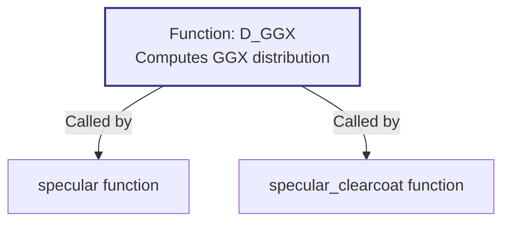

+++
title = "#20199 Remove extraneous h parameter for D_GGX"
date = "2025-07-19T00:00:00"
draft = false
template = "pull_request_page.html"
in_search_index = true

[taxonomies]
list_display = ["show"]

[extra]
current_language = "en"
available_languages = {"en" = { name = "English", url = "/pull_request/bevy/2025-07/pr-20199-en-20250719" }, "zh-cn" = { name = "中文", url = "/pull_request/bevy/2025-07/pr-20199-zh-cn-20250719" }}
labels = ["D-Trivial", "A-Rendering", "C-Code-Quality"]
+++

# Remove extraneous h parameter for D_GGX

## Basic Information
- **Title**: Remove extraneous h parameter for D_GGX
- **PR Link**: https://github.com/bevyengine/bevy/pull/20199
- **Author**: JMS55
- **Status**: MERGED
- **Labels**: D-Trivial, A-Rendering, C-Code-Quality
- **Created**: 2025-07-19T15:42:19Z
- **Merged**: 2025-07-19T18:35:51Z
- **Merged By**: mockersf

## Description Translation
Remove an unused function parameter.

## The Story of This Pull Request

The PR addresses a straightforward code quality issue in Bevy's physically based rendering (PBR) implementation. During routine shader maintenance, the author noticed that the `D_GGX` function in the PBR lighting calculations contained an unused parameter. This function computes the GGX normal distribution function, a core component of the PBR specular BRDF.

The `h` parameter (representing the half-vector) was present in the function signature but never actually used in the implementation. This extraneous parameter added unnecessary complexity to the shader code and could confuse developers working on the rendering pipeline. Since shader code needs to be highly optimized and maintainable, removing dead parameters helps reduce cognitive load and prevents potential misuse.

The solution was simple and non-disruptive: remove the unused `h` parameter from the `D_GGX` function signature and update all call sites to stop passing this argument. This change required modifications to three lines of WGSL shader code. The function's mathematical implementation remained unchanged since the unused parameter didn't affect the output.

The implementation demonstrates good code hygiene practices. By removing dead parameters:
1. The function signature more accurately reflects its actual dependencies
2. Call sites become simpler with fewer arguments to pass
3. Future maintenance becomes easier with reduced surface area for errors
4. Shader execution remains identical since the parameter wasn't used

The change is safe because it doesn't alter the rendering mathematics. The GGX distribution calculation only requires the roughness and NdotH (cosine of angle between normal and half-vector) parameters, not the full half-vector itself. This aligns with the standard GGX formulation where the distribution depends only on the angle, not the vector components.

This cleanup improves code clarity without affecting rendering output. It was quickly reviewed and merged as a trivial but valuable code quality improvement.

## Visual Representation



## Key Files Changed

### File: crates/bevy_pbr/src/render/pbr_lighting.wgsl

This file contains the core WGSL shader code for PBR lighting calculations. The changes remove an unused parameter from the D_GGX normal distribution function.

#### Key Changes:

1. **Function signature update**:
```wgsl
// Before:
fn D_GGX(roughness: f32, NdotH: f32, h: vec3<f32>) -> f32 {
    // Implementation...
}

// After:
fn D_GGX(roughness: f32, NdotH: f32) -> f32 {
    // Same implementation without 'h' parameter
}
```

2. **Call site updates in specular functions**:
```wgsl
// Before:
let D = D_GGX(roughness, NdotH, H);

// After:
let D = D_GGX(roughness, NdotH);
```

3. **Removed variable declarations**:
```wgsl
// Removed from both specular and specular_clearcoat:
let H = (*derived_input).H;
```

## Further Reading
1. [Filament PBR Documentation](https://google.github.io/filament/Filament.html) - Reference implementation of GGX distribution
2. [Physically Based Rendering: From Theory to Implementation](https://www.pbr-book.org/) - Comprehensive resource on PBR theory
3. [WGSL Specification](https://gpuweb.github.io/gpuweb/wgsl/) - Official WebGPU Shading Language docs

## Full Code Diff
```diff
diff --git a/crates/bevy_pbr/src/render/pbr_lighting.wgsl b/crates/bevy_pbr/src/render/pbr_lighting.wgsl
index 6bc24d8af01d6..09329b900750b 100644
--- a/crates/bevy_pbr/src/render/pbr_lighting.wgsl
+++ b/crates/bevy_pbr/src/render/pbr_lighting.wgsl
@@ -137,7 +137,7 @@ fn getDistanceAttenuation(distanceSquare: f32, inverseRangeSquared: f32) -> f32
 
 // Simple implementation, has precision problems when using fp16 instead of fp32
 // see https://google.github.io/filament/Filament.html#listing_speculardfp16
-fn D_GGX(roughness: f32, NdotH: f32, h: vec3<f32>) -> f32 {
+fn D_GGX(roughness: f32, NdotH: f32) -> f32 {
     let oneMinusNdotHSquared = 1.0 - NdotH * NdotH;
     let a = NdotH * roughness;
     let k = roughness / (oneMinusNdotHSquared + a * a);
@@ -313,13 +313,12 @@ fn specular(
     let roughness = (*input).layers[LAYER_BASE].roughness;
     let NdotV = (*input).layers[LAYER_BASE].NdotV;
     let F0 = (*input).F0_;
-    let H = (*derived_input).H;
     let NdotL = (*derived_input).NdotL;
     let NdotH = (*derived_input).NdotH;
     let LdotH = (*derived_input).LdotH;
 
     // Calculate distribution.
-    let D = D_GGX(roughness, NdotH, H);
+    let D = D_GGX(roughness, NdotH);
     // Calculate visibility.
     let V = V_SmithGGXCorrelated(roughness, NdotV, NdotL);
     // Calculate the Fresnel term.
@@ -343,12 +342,11 @@ fn specular_clearcoat(
 ) -> vec2<f32> {
     // Unpack.
     let roughness = (*input).layers[LAYER_CLEARCOAT].roughness;
-    let H = (*derived_input).H;
     let NdotH = (*derived_input).NdotH;
     let LdotH = (*derived_input).LdotH;
 
     // Calculate distribution.
-    let Dc = D_GGX(roughness, NdotH, H);
+    let Dc = D_GGX(roughness, NdotH);
     // Calculate visibility.
     let Vc = V_Kelemen(LdotH);
     // Calculate the Fresnel term.
```