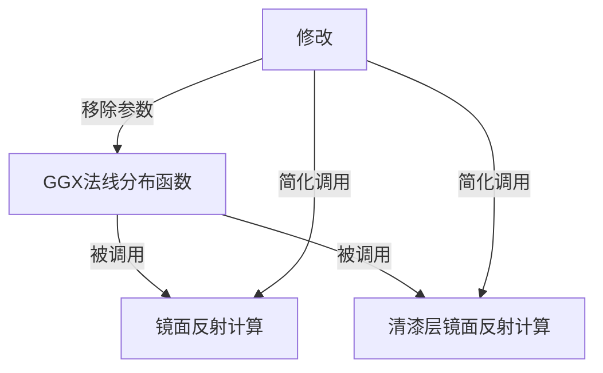

+++
title = "#20199 Remove extraneous h parameter for D_GGX"
date = "2025-07-19T00:00:00"
draft = false
template = "pull_request_page.html"
in_search_index = false

[extra]
current_language = "zh-cn"
available_languages = {"en" = { name = "English", url = "/pull_request/bevy/2025-07/pr-20199-en-20250719" }, "zh-cn" = { name = "中文", url = "/pull_request/bevy/2025-07/pr-20199-zh-cn-20250719" }}
+++

# Remove extraneous h parameter for D_GGX

## 基本信息
- **标题**: Remove extraneous h parameter for D_GGX
- **PR链接**: https://github.com/bevyengine/bevy/pull/20199
- **作者**: JMS55
- **状态**: 已合并
- **标签**: D-Trivial, A-Rendering, C-Code-Quality
- **创建时间**: 2025-07-19T15:42:19Z
- **合并时间**: 2025-07-19T18:35:51Z
- **合并者**: mockersf

## 描述翻译
移除未使用的函数参数。

## 该Pull Request的技术分析

在Bevy引擎的PBR渲染系统中，`D_GGX`函数负责计算GGX法线分布函数(Normal Distribution Function)，这是基于物理渲染(PBR)中镜面高光计算的关键组成部分。该函数原本接受三个参数：表面粗糙度(roughness)、法线与半角向量的点积(NdotH)、以及半角向量(h)本身。然而，在函数实现中可以观察到，参数h从未在计算中被实际使用。

```wgsl
// 修改前
fn D_GGX(roughness: f32, NdotH: f32, h: vec3<f32>) -> f32 {
    let oneMinusNdotHSquared = 1.0 - NdotH * NdotH;
    let a = NdotH * roughness;
    let k = roughness / (oneMinusNdotHSquared + a * a);
    return k * k * (1.0 / PI);
}
```

GGX NDF的数学实现只需要粗糙度和NdotH两个参数，完整的半角向量h是不必要的。这一情况在Filament渲染引擎的文档中也有明确说明（见参考链接）。保留未使用的参数会产生几个问题：增加不必要的GPU寄存器占用，降低代码可读性，并可能误导其他开发者认为该参数有实际用途。

解决方案直接明了：删除所有与h参数相关的代码。这包括：
1. 从`D_GGX`函数签名中移除h参数
2. 删除所有调用点传递的h参数
3. 清理调用点不再需要的局部变量H

在`specular`和`specular_clearcoat`两个核心光照计算函数中，调用`D_GGX`时原本需要准备并传递H向量：

```wgsl
// 修改前调用示例
let H = (*derived_input).H;
let D = D_GGX(roughness, NdotH, H);
```

修改后这些调用简化为：

```wgsl
// 修改后调用示例
let D = D_GGX(roughness, NdotH);
```

技术层面，GGX NDF的标准实现公式为：
```
D = α² / [π( (N·H)² (α² - 1) + 1 )²]
```
其中α表示粗糙度平方。可见计算仅依赖N·H点积结果，不需要完整的H向量。这个优化不影响渲染结果的正确性，因为被移除的参数原本就不参与实际计算。

该修改属于代码质量优化(C-Code-Quality)，归类为微小改动(D-Trivial)。它减少了GPU着色器的寄存器压力和指令数量，虽然单次调用的优化幅度很小，但在大规模场景渲染时可能带来累积性能收益。更重要的是，它消除了代码中的歧义点，使后续维护者更容易理解GGX NDF的实际依赖参数。

## 可视化关系



## 关键文件变更

### crates/bevy_pbr/src/render/pbr_lighting.wgsl (+3/-5)
该文件包含PBR光照模型的核心实现。修改移除了D_GGX函数未使用的h参数，并简化了相关调用。

```wgsl
// 修改前函数定义
fn D_GGX(roughness: f32, NdotH: f32, h: vec3<f32>) -> f32 {
    let oneMinusNdotHSquared = 1.0 - NdotH * NdotH;
    let a = NdotH * roughness;
    let k = roughness / (oneMinusNdotHSquared + a * a);
    return k * k * (1.0 / PI);
}

// 修改后函数定义
fn D_GGX(roughness: f32, NdotH: f32) -> f32 {
    let oneMinusNdotHSquared = 1.0 - NdotH * NdotH;
    let a = NdotH * roughness;
    let k = roughness / (oneMinusNdotHSquared + a * a);
    return k * k * (1.0 / PI);
}
```

```wgsl
// 修改前调用点
let H = (*derived_input).H;
let D = D_GGX(roughness, NdotH, H);

// 修改后调用点
let D = D_GGX(roughness, NdotH);
```

## 扩展阅读
- [Filament PBR文档 - GGX NDF实现](https://google.github.io/filament/Filament.html#listing_speculardfp16)
- [Real-Time Rendering 第4版 - 物理渲染原理](https://www.realtimerendering.com/)
- [WGSL语言规范](https://www.w3.org/TR/WGSL/)

## 完整代码变更
```diff
diff --git a/crates/bevy_pbr/src/render/pbr_lighting.wgsl b/crates/bevy_pbr/src/render/pbr_lighting.wgsl
index 6bc24d8af01d6..09329b900750b 100644
--- a/crates/bevy_pbr/src/render/pbr_lighting.wgsl
+++ b/crates/bevy_pbr/src/render/pbr_lighting.wgsl
@@ -137,7 +137,7 @@ fn getDistanceAttenuation(distanceSquare: f32, inverseRangeSquared: f32) -> f32
 
 // Simple implementation, has precision problems when using fp16 instead of fp32
 // see https://google.github.io/filament/Filament.html#listing_speculardfp16
-fn D_GGX(roughness: f32, NdotH: f32, h: vec3<f32>) -> f32 {
+fn D_GGX(roughness: f32, NdotH: f32) -> f32 {
     let oneMinusNdotHSquared = 1.0 - NdotH * NdotH;
     let a = NdotH * roughness;
     let k = roughness / (oneMinusNdotHSquared + a * a);
@@ -313,13 +313,12 @@ fn specular(
     let roughness = (*input).layers[LAYER_BASE].roughness;
     let NdotV = (*input).layers[LAYER_BASE].NdotV;
     let F0 = (*input).F0_;
-    let H = (*derived_input).H;
     let NdotL = (*derived_input).NdotL;
     let NdotH = (*derived_input).NdotH;
     let LdotH = (*derived_input).LdotH;
 
     // Calculate distribution.
-    let D = D_GGX(roughness, NdotH, H);
+    let D = D_GGX(roughness, NdotH);
     // Calculate visibility.
     let V = V_SmithGGXCorrelated(roughness, NdotV, NdotL);
     // Calculate the Fresnel term.
@@ -343,12 +342,11 @@ fn specular_clearcoat(
 ) -> vec2<f32> {
     // Unpack.
     let roughness = (*input).layers[LAYER_CLEARCOAT].roughness;
-    let H = (*derived_input).H;
     let NdotH = (*derived_input).NdotH;
     let LdotH = (*derived_input).LdotH;
 
     // Calculate distribution.
-    let Dc = D_GGX(roughness, NdotH, H);
+    let Dc = D_GGX(roughness, NdotH);
     // Calculate visibility.
     let Vc = V_Kelemen(LdotH);
     // Calculate the Fresnel term.
```