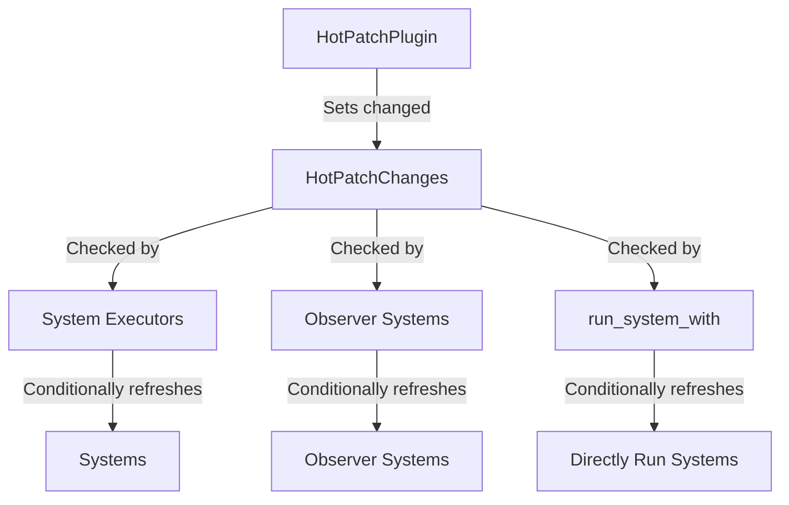

+++
title = "#20202 Refresh hotpatches using change ticks instead of checking for a event"
date = "2025-07-21T00:00:00"
draft = false
template = "pull_request_page.html"
in_search_index = true

[taxonomies]
list_display = ["show"]

[extra]
current_language = "en"
available_languages = {"en" = { name = "English", url = "/pull_request/bevy/2025-07/pr-20202-en-20250721" }, "zh-cn" = { name = "中文", url = "/pull_request/bevy/2025-07/pr-20202-zh-cn-20250721" }}
labels = ["A-ECS", "A-Dev-Tools"]
+++

## Technical Report: Refresh Hotpatches Using Change Ticks

### Basic Information
- **Title**: Refresh hotpatches using change ticks instead of checking for a event
- **PR Link**: https://github.com/bevyengine/bevy/pull/20202
- **Author**: laundmo
- **Status**: MERGED
- **Labels**: A-ECS, A-Dev-Tools
- **Created**: 2025-07-19T17:22:21Z
- **Merged**: 2025-07-21T06:32:21Z
- **Merged By**: mockersf

### Description
**Objective**  
Hotpatches were being applied only when a `HotPatched` event was received, which caused systems in Schedules which only run rarely to miss the event, and their systems to never be hotpatched.

**Solution**  
Instead of relying on the `HotPatched` event, I introduced a new empty/unit resource `HotPatchChanges` and rely on change-detection to apply patches. That means even system run long after the actual hotpatch happened can be updated by to comparing their last run ticks to the `HotPatchChanges`.

Due to this its now also possible to avoid applying patches for Observers each run.

I also noticed while reading the code that `World::run_system_with` didn't apply patches, so I added the same logic there.

**Testing**  
I originally noticed this issue because I tried to use states and `DespawnOnExitState` to re-run setup systems.

This is the logic, ripped out of my project and simplified:
```rs
#[derive(States, Debug, Hash, PartialEq, Eq, Clone, Default)]
enum WorkingState {
    #[default]
    Running,
    #[cfg(feature = "hotpatching")]
    Reloading,
}

fn hotpatch_setup(app: &mut App) {
    app.init_state::<WorkingState>()
        .add_systems(OnEnter(WorkingState::Running), hotpatchable_setup)
        .add_systems(
            OnEnter(WorkingState::Reloading),
            |mut next_state: ResMut<NextState<WorkingState>>| next_state.set(WorkingState::Running),
        )
        .add_systems(
            Update,
            (|reload: EventReader<HotPatched>, mut next_state: ResMut<NextState<WorkingState>>| {
                if !reload.is_empty() {
                    next_state.set(WorkingState::Reloading);
                }
            })
            .run_if(in_state(WorkingState::Running)),
        );
}

fn hotpatchable_setup(mut commands: Commands) {
    commands.spawn((
        Sprite {
            color: Color::WHITE,
            custom_size: Some(Vec2::ONE * 200.0),
            ..default()
        },
        DespawnOnExitState(WorkingState::Running),
    ));
}
```

I didn't test:
- cached one-shot systems hotpatching

---

### The Story of This Pull Request

#### The Problem
The original hotpatching implementation relied on `HotPatched` events to trigger system updates. This approach had a critical flaw: systems in schedules that run infrequently (like state transition systems) could miss the event entirely. When systems missed the event, they would never refresh their hotpatched pointers, leading to stale implementations being used indefinitely. This was particularly problematic for setup systems that run once during initialization but need to be updated when hotpatching occurs.

The author encountered this issue when using `DespawnOnExitState` to trigger re-runs of setup systems. Their state machine implementation would transition states to force re-execution of setup logic, but without receiving the `HotPatched` event, these systems never updated their function pointers after hotpatching.

#### The Solution Approach
The core insight was to leverage Bevy's existing change detection system instead of relying solely on events. The solution introduces:
1. A new `HotPatchChanges` resource that acts as a change detection marker
2. Logic to mark this resource as changed when hotpatching occurs
3. System executors that check this resource's change tick before refreshing hotpatches

This approach ensures systems refresh their hotpatched pointers if any hotpatch occurred since their last execution, regardless of whether they processed the event. It also optimizes performance by avoiding unnecessary hotpatch checks when no changes occurred.

#### Implementation Details
The changes span multiple parts of the ECS core:

1. **HotPatchPlugin Modification**  
   Updated to initialize `HotPatchChanges` and set it as changed when hotpatching occurs:
   ```rust
   app.init_resource::<HotPatchChanges>()
      .add_event::<HotPatched>()
      .add_systems(
          Last,
          move |mut events: EventWriter<HotPatched>, mut res: ResMut<HotPatchChanges>| {
              if receiver.try_recv().is_ok() {
                  events.write_default();
                  res.set_changed();  // Critical change
              }
          },
      );
   ```

2. **Executor Logic Updates**  
   All executors (simple, single-threaded, multi-threaded) now check `HotPatchChanges` instead of event presence. The pattern is consistent:
   ```rust
   let hotpatch_tick = world
       .get_resource_ref::<HotPatchChanges>()
       .map(|r| r.last_changed())
       .unwrap_or_default();
   
   // Later in system execution:
   if hotpatch_tick.is_newer_than(system.get_last_run(), world.change_tick()) {
       system.refresh_hotpatch();
   }
   ```
   This change ensures systems only refresh when necessary based on actual changes.

3. **Observer System Support**  
   Observers now use the same change-tick comparison:
   ```rust
   if world
       .get_resource_ref::<crate::HotPatchChanges>()
       .map(|r| r.last_changed().is_newer_than(/* ... */))
       .unwrap_or(true)
   {
       (*system).refresh_hotpatch();
   }
   ```

4. **World::run_system_with Fix**  
   Added missing hotpatch support to direct system execution:
   ```rust
   if self
       .get_resource_ref::<HotPatchChanges>()
       .map(|r| r.last_changed())
       .unwrap_or_default()
       .is_newer_than(system.get_last_run(), self.change_tick())
   {
       system.refresh_hotpatch();
   }
   ```

#### Technical Insights
Key technical aspects of this solution:
- **Change Detection Efficiency**: Uses Bevy's existing change tick comparison (`Tick::is_newer_than`) which is highly optimized
- **Resource Semantics**: `HotPatchChanges` is a unit struct (zero-sized) that only exists for its change detection metadata
- **Backward Compatibility**: Maintains `HotPatched` event for systems that need to react to hotpatches
- **Optimized Execution**: Avoids unnecessary pointer refreshes by only updating when changes occurred since last run

#### Impact
These changes:
1. Fix hotpatching for infrequently-run systems
2. Reduce unnecessary hotpatch checks in observers
3. Add missing hotpatch support to `run_system_with`
4. Maintain backward compatibility with existing event-based logic
5. Improve performance by eliminating redundant refreshes

The solution demonstrates effective use of Bevy's change detection system to solve event delivery reliability issues.

---

### Visual Representation


---

### Key Files Changed

1. **crates/bevy_app/src/hotpatch.rs** (+16/-10)  
   Modified the hotpatch plugin to update `HotPatchChanges` resource:
   ```rust
   // Before:
   app.add_event::<HotPatched>().add_systems(
       Last,
       move |mut events: EventWriter<HotPatched>| {
           if receiver.try_recv().is_ok() {
               events.write_default();
           }
       },
   );
   
   // After:
   app.init_resource::<HotPatchChanges>()
       .add_event::<HotPatched>()
       .add_systems(
           Last,
           move |mut events: EventWriter<HotPatched>, mut res: ResMut<HotPatchChanges>| {
               if receiver.try_recv().is_ok() {
                   events.write_default();
                   res.set_changed();  // Key addition
               }
           },
       );
   ```

2. **crates/bevy_ecs/src/lib.rs** (+13/-1)  
   Added the new resource definition:
   ```rust
   #[cfg(feature = "hotpatching")]
   #[derive(resource::Resource, Default)]
   pub struct HotPatchChanges;
   ```

3. **crates/bevy_ecs/src/schedule/executor/multi_threaded.rs** (+9/-6)  
   Updated executor logic to use change ticks:
   ```rust
   // Before:
   let should_update_hotpatch = !context
       .world_cell
       .get_resource::<Events<HotPatched>>()
       .map(Events::is_empty)
       .unwrap_or(true);
   
   // After:
   let hotpatch_tick = context
       .world_cell
       .get_resource_ref::<HotPatchChanges>()
       .map(|r| r.last_changed())
       .unwrap_or_default();
   
   // Usage:
   if hotpatch_tick.is_newer_than(/* ... */) {
       system.refresh_hotpatch();
   }
   ```

4. **crates/bevy_ecs/src/system/system_registry.rs**  
   Fixed `World::run_system_with`:
   ```rust
   // Added:
   #[cfg(feature = "hotpatching")]
   if self
       .get_resource_ref::<HotPatchChanges>()
       .map(|r| r.last_changed())
       .unwrap_or_default()
       .is_newer_than(system.get_last_run(), self.change_tick())
   {
       system.refresh_hotpatch();
   }
   ```

---

### Further Reading
1. [Bevy Change Detection Documentation](https://bevyengine.org/learn/book/change-detection/)
2. [ECS System Execution Model](https://bevyengine.org/learn/book/scheduling/)
3. [Resource Documentation](https://bevyengine.org/learn/book/resources/)
4. [Hot Reloading in Rust](https://fasterthanli.me/articles/hot-reloading-rust)

This solution demonstrates effective use of change detection for system management and provides a robust pattern for handling infrastructure-level events in ECS architectures.