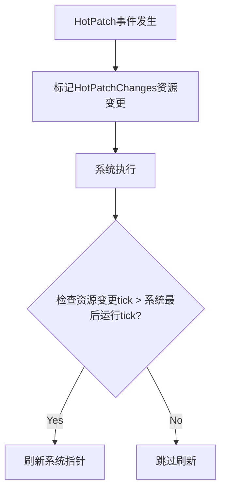

+++
title = "#20202 Refresh hotpatches using change ticks instead of checking for a event"
date = "2025-07-21T00:00:00"
draft = false
template = "pull_request_page.html"
in_search_index = false

[extra]
current_language = "zh-cn"
available_languages = {"en" = { name = "English", url = "/pull_request/bevy/2025-07/pr-20202-en-20250721" }, "zh-cn" = { name = "中文", url = "/pull_request/bevy/2025-07/pr-20202-zh-cn-20250721" }}
labels = ["A-ECS", "A-Dev-Tools"]
+++

## Refresh hotpatches using change ticks instead of checking for a event

### Basic Information
- **Title**: Refresh hotpatches using change ticks instead of checking for a event
- **PR Link**: https://github.com/bevyengine/bevy/pull/20202
- **Author**: laundmo
- **Status**: MERGED
- **Labels**: A-ECS, A-Dev-Tools
- **Created**: 2025-07-19T17:22:21Z
- **Merged**: 2025-07-21T06:32:21Z
- **Merged By**: mockersf

### Description Translation
**Objective**

热补丁(hotpatches)仅在接收到 `HotPatched` 事件时才会被应用，这导致在调度(Schedules)中不常运行的系统(systems)会错过该事件，从而使这些系统永远无法被热更新。

**Solution**

不再依赖 `HotPatched` 事件，我引入了一个新的空/单元资源(unit resource) `HotPatchChanges`，并依赖变更检测(change-detection)来应用补丁。这意味着即使在实际热补丁发生很久之后才运行的系统，也可以通过比较其上次运行的tick和 `HotPatchChanges` 的tick来更新。

由于此改动，现在还可以避免在每次运行时为观察者(Observers)应用补丁。

我在阅读代码时注意到 `World::run_system_with` 没有应用补丁，因此我为其添加了相同的逻辑。

**Testing**

我最初注意到这个问题是因为尝试使用状态(states)和 `DespawnOnExitState` 重新运行设置系统(setup systems)。

以下是逻辑（从我的项目中提取并简化）：
```rs
#[derive(States, Debug, Hash, PartialEq, Eq, Clone, Default)]
enum WorkingState {
    #[default]
    Running,
    #[cfg(feature = "hotpatching")]
    Reloading,
}

fn hotpatch_setup(app: &mut App) {
    app.init_state::<WorkingState>()
        .add_systems(OnEnter(WorkingState::Running), hotpatchable_setup)
        .add_systems(
            OnEnter(WorkingState::Reloading),
            |mut next_state: ResMut<NextState<WorkingState>>| next_state.set(WorkingState::Running),
        )
        .add_systems(
            Update,
            (|reload: EventReader<HotPatched>, mut next_state: ResMut<NextState<WorkingState>>| {
                if !reload.is_empty() {
                    next_state.set(WorkingState::Reloading);
                }
            })
            .run_if(in_state(WorkingState::Running)),
        );
}

fn hotpatchable_setup(mut commands: Commands) {
    commands.spawn((
        Sprite {
            color: Color::WHITE,
            custom_size: Some(Vec2::ONE * 200.0),
            ..default()
        },
        DespawnOnExitState(WorkingState::Running),
    ));
}
```

未测试：
- 缓存的一次性系统(cached one-shot systems)的热补丁

---

### The Story of This Pull Request

#### 问题背景
在Bevy的热补丁机制中，原先依赖 `HotPatched` 事件通知系统刷新内部指针。但事件驱动(event-driven)方式存在固有缺陷：当系统运行频率较低时（例如仅在某些状态转换时触发），可能错过事件导致无法更新。这在状态机场景尤其明显——当热补丁发生时，低频系统可能无法及时接收事件，导致热更新失效。

#### 解决方案
核心思路是将事件驱动改为基于变更检测的机制：
1. 引入 `HotPatchChanges` 资源（空结构体），专用于变更跟踪
2. 热补丁发生时标记该资源变更（调用 `set_changed()`）
3. 系统运行时比较自身最后执行tick和资源变更tick，决定是否刷新

这解决了事件丢失问题，因为变更检测状态持久存储在World中，不受系统执行频率影响。同时优化了性能——避免每次运行都检查补丁，仅在检测到变更时才刷新。

#### 关键实现
**1. 修改热补丁事件处理**
在 `hotpatch.rs` 中，重构事件处理系统，使其在发送事件时同时标记资源变更：
```diff
- app.add_event::<HotPatched>().add_systems(
-    Last,
-    move |mut events: EventWriter<HotPatched>| {
-        if receiver.try_recv().is_ok() {
-            events.write_default();
-        }
-    },
- );
+ app.init_resource::<HotPatchChanges>()
+   .add_event::<HotPatched>()
+   .add_systems(
+       Last,
+       move |mut events: EventWriter<HotPatched>, mut res: ResMut<HotPatchChanges>| {
+           if receiver.try_recv().is_ok() {
+               events.write_default();
+               res.set_changed();
+           }
+       },
+   );
```

**2. 新增变更检测资源**
在 `lib.rs` 中定义新资源，其唯一作用就是提供变更检测点：
```rust
#[derive(resource::Resource, Default)]
pub struct HotPatchChanges;  // 纯标记资源
```

**3. 重构执行器逻辑**
在所有执行器（单线程/多线程/简单模式）中，统一改用变更检测判断是否需要刷新：
```diff
 #[cfg(feature = "hotpatching")]
- let should_update_hotpatch = !world
-    .get_resource::<Events<HotPatched>>()
-    .map(Events::is_empty)
-    .unwrap_or(true);
+ let hotpatch_tick = world
+    .get_resource_ref::<HotPatchChanges>()
+    .map(|r| r.last_changed())
+    .unwrap_or_default();

...

 #[cfg(feature = "hotpatching")]
- if should_update_hotpatch {
+ if hotpatch_tick.is_newer_than(system.get_last_run(), world.change_tick()) {
     system.refresh_hotpatch();
 }
```
关键改进：
- 使用 `last_changed()` 获取资源变更tick
- 通过 `is_newer_than()` 与系统最后运行tick比较
- 仅当资源变更发生在系统上次运行后才触发刷新

**4. 修复遗漏点**
在 `system_registry.rs` 中为 `World::run_system_with` 添加相同逻辑：
```rust
#[cfg(feature = "hotpatching")]
if world
    .get_resource_ref::<HotPatchChanges>()
    .map(|r| r.last_changed())
    .unwrap_or_default()
    .is_newer_than(system.get_last_run(), world.change_tick())
{
    system.refresh_hotpatch();
}
```

#### 技术要点
1. **变更检测优势**：利用Bevy内置的变更跟踪机制，避免自定义事件系统
2. **Tick比较原理**：通过 `ChangeTick::is_newer_than()` 方法可靠判断事件顺序
3. **资源设计**：`HotPatchChanges` 作为标记资源，零内存开销但提供变更点
4. **执行优化**：避免每次系统运行都尝试刷新，减少无谓开销

#### 影响
1. 解决低频系统热更新失效问题
2. 统一所有执行路径（包括 `run_system_with`）的热补丁处理
3. 减少观察者系统(Observers)不必要的刷新操作
4. 为热补丁提供更可靠的底层机制

---

### Visual Representation


---

### Key Files Changed

1. **crates/bevy_app/src/hotpatch.rs** (+16/-10)  
   重构事件处理器，增加资源变更标记
   ```diff
   - // 旧事件处理
   + // 新事件处理（含资源变更标记）
   .add_systems(
       Last,
   -   move |mut events: EventWriter<HotPatched>| {
   +   move |mut events: EventWriter<HotPatched>, mut res: ResMut<HotPatchChanges>| {
           if receiver.try_recv().is_ok() {
               events.write_default();
   +           res.set_changed();
           }
       },
   ```

2. **crates/bevy_ecs/src/schedule/executor/simple.rs** (+12/-12)  
   将执行器中的热补丁检查改为基于变更tick
   ```diff
   #[cfg(feature = "hotpatching")]
   - let should_update_hotpatch = !world
   -   .get_resource::<Events<HotPatched>>()
   -   .map(Events::is_empty)
   -   .unwrap_or(true);
   + let hotpatch_tick = world
   +   .get_resource_ref::<HotPatchChanges>()
   +   .map(|r| r.last_changed())
   +   .unwrap_or_default();
   
   ...
   
   #[cfg(feature = "hotpatching")]
   - if should_update_hotpatch {
   + if hotpatch_tick.is_newer_than(system.get_last_run(), world.change_tick()) {
         system.refresh_hotpatch();
     }
   ```

3. **crates/bevy_ecs/src/schedule/executor/single_threaded.rs** (+12/-11)  
   单线程执行器相同改造
   ```diff
   #[cfg(feature = "hotpatching")]
   - let should_update_hotpatch = !world
   -   .get_resource::<Events<HotPatched>>()
   -   .map(Events::is_empty)
   -   .unwrap_or(true);
   + let hotpatch_tick = world
   +   .get_resource_ref::<HotPatchChanges>()
   +   .map(|r| r.last_changed())
   +   .unwrap_or_default();
   ```

4. **crates/bevy_ecs/src/schedule/executor/multi_threaded.rs** (+9/-6)  
   多线程执行器适配新机制
   ```diff
   #[cfg(feature = "hotpatching")]
   - let should_update_hotpatch = !context
   -   .environment.world_cell
   -   .get_resource::<Events<HotPatched>>()
   -   .map(Events::is_empty)
   -   .unwrap_or(true);
   + let hotpatch_tick = context
   +   .environment.world_cell
   +   .get_resource_ref::<HotPatchChanges>()
   +   .map(|r| r.last_changed())
   +   .unwrap_or_default();
   ```

5. **crates/bevy_ecs/src/lib.rs** (+13/-1)  
   定义新的变更检测资源
   ```rust
   #[derive(resource::Resource, Default)]
   pub struct HotPatchChanges;  // 变更标记资源
   ```

---

### Further Reading
1. [Bevy Change Detection 文档](https://bevyengine.org/learn/book/change-detection/)
2. [实体组件系统(ECS)模式详解](https://en.wikipedia.org/wiki/Entity_component_system)
3. [Rust 动态分发与热重载原理](https://doc.rust-lang.org/book/ch17-02-trait-objects.html)
4. [Bevy 系统执行模型](https://bevyengine.org/learn/book/scheduling/)