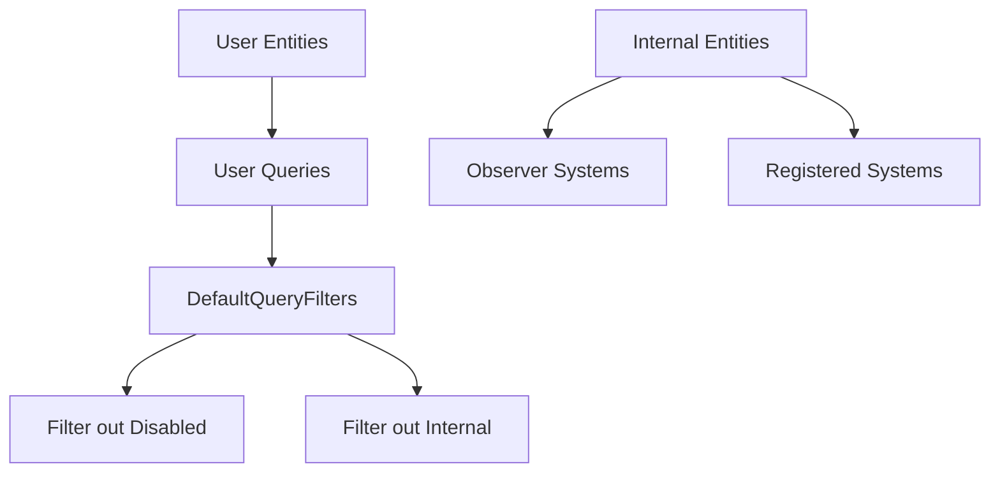

+++
title = "#20204 Internal Entities"
date = "2025-07-22T00:00:00"
draft = false
template = "pull_request_page.html"
in_search_index = true

[taxonomies]
list_display = ["show"]

[extra]
current_language = "en"
available_languages = {"en" = { name = "English", url = "/pull_request/bevy/2025-07/pr-20204-en-20250722" }, "zh-cn" = { name = "中文", url = "/pull_request/bevy/2025-07/pr-20204-zh-cn-20250722" }}
labels = ["C-Usability", "A-Dev-Tools", "A-Cross-Cutting"]
+++

## Internal Entities: Hiding Engine Implementation Details from User Queries

### Basic Information
- **Title**: Internal Entities
- **PR Link**: https://github.com/bevyengine/bevy/pull/20204
- **Author**: Trashtalk217
- **Status**: MERGED
- **Labels**: C-Usability, S-Ready-For-Final-Review, A-Dev-Tools, A-Cross-Cutting
- **Created**: 2025-07-19T19:45:48Z
- **Merged**: 2025-07-21T23:37:05Z
- **Merged By**: alice-i-cecile

### Description Translation
# Objective

As we move more stuff to entities, it's a good idea to keep these entities quasi-private. We do not want to confuse users by having to explain everything as being an entity.

This came out of #19711.

## Solution

This PR introduces the concept of internal entities, entities marked by the `Internal` component, that are filtered out by queries through `DefaultQueryFilters` and also don't show up for `World::entity_count()`.

## Testing

Added a test.

### The Story of This Pull Request

#### The Problem and Context
As Bevy increasingly uses entities for internal engine functionality, a usability issue emerged: users were encountering these implementation-detail entities in their queries and entity counts. This created confusion because:
1. These internal entities weren't relevant to game logic
2. Their presence exposed implementation details that shouldn't be part of the public API
3. Users might accidentally modify or depend on unstable internal structures

The problem originated from PR #19711 which expanded entity usage for engine internals. Without a filtering mechanism, these internal entities appeared alongside user-created entities in all default queries.

#### The Solution Approach
We introduced a new marker component `Internal` to tag engine-managed entities. The solution leverages Bevy's existing entity disabling framework by:
1. Adding `Internal` to the `DefaultQueryFilters`
2. Ensuring internal entities don't count toward `World::entity_count()`
3. Applying the marker to known internal entities (observers and registered systems)

This approach was chosen because:
- It builds on existing patterns (`Disabled` component handling)
- Requires minimal changes to query logic
- Maintains backward compatibility through default filtering
- Allows advanced users to opt-in to seeing internal entities when needed

#### The Implementation
We started by defining the `Internal` component and registering it as a disabling component:

```rust
// crates/bevy_ecs/src/entity_disabling.rs
#[derive(Component, Clone, Debug, Default)]
#[cfg_attr(feature = "bevy_reflect", ...)]
pub struct Internal;

impl FromWorld for DefaultQueryFilters {
    fn from_world(world: &mut World) -> Self {
        let mut filters = DefaultQueryFilters::empty();
        let disabled_component_id = world.register_component::<Disabled>();
        filters.register_disabling_component(disabled_component_id);
        let internal_component_id = world.register_component::<Internal>();
        filters.register_disabling_component(internal_component_id);
        filters
    }
}
```

Next, we modified internal entity creation points to automatically add the `Internal` marker. For observers:

```rust
// crates/bevy_ecs/src/observer/distributed_storage.rs
impl Component for Observer {
    fn register_required_components(
        _component_id: ComponentId,
        components: &mut ComponentsRegistrator,
        required_components: &mut RequiredComponents,
        inheritance_depth: u16,
        recursion_check_stack: &mut Vec<ComponentId>,
    ) {
        components.register_required_components_manual::<Self, Internal>(
            required_components,
            Internal::default,
            inheritance_depth,
            recursion_check_stack,
        );
    }
}
```

And for registered systems:

```rust
// crates/bevy_ecs/src/system/system_registry.rs
#[derive(Component)]
#[require(SystemIdMarker, Internal)]
pub(crate) struct RegisteredSystem<I, O> {
    initialized: bool,
    system: BoxedSystem<I, O>,
}
```

We added comprehensive tests to verify the filtering behavior:

```rust
#[test]
fn internal_entities() {
    let mut world = World::default();
    world.register_system(|| {});
    let mut query = world.query::<()>();
    assert_eq!(query.iter(&world).count(), 0);
    
    let mut query = world.query_filtered::<(), With<Internal>>();
    assert_eq!(query.iter(&world).count(), 1);
    
    #[derive(Component)]
    struct A;
    world.add_observer(|_: On<Add, A>| {});
    
    let mut query = world.query::<()>();
    assert_eq!(query.iter(&world).count(), 0);
    let mut query = world.query_filtered::<(), With<Internal>>();
    assert_eq!(query.iter(&world).count(), 2);
}
```

#### Technical Insights
Key technical aspects:
1. **Inheritance Pattern**: By extending `DefaultQueryFilters`, we ensure all existing queries automatically exclude internal entities without modification
2. **Entity Counting**: Internal entities are excluded from `World::entity_count()` by leveraging the same filtering mechanism
3. **Opt-in Visibility**: Advanced users can see internal entities by explicitly adding `With<Internal>` to queries
4. **Component Inheritance**: The `register_required_components` method ensures `Internal` is automatically added to observer entities

#### The Impact
These changes significantly improve the developer experience:
1. Cleaner queries - only user-relevant entities appear by default
2. Reduced cognitive load - implementation details are hidden
3. More stable API surface - users won't accidentally depend on internal entities
4. Backward compatible - existing code works unchanged

The migration guide clearly explains how to handle edge cases where internal entities need to be accessed:

```markdown
---
title: Internal Entities
pull_requests: [20204]
---

Bevy 0.17 introduces internal entities. Entities tagged by the `Internal` component that are hidden from most queries using [`DefaultQueryFilters`](https://docs.rs/bevy/latest/bevy/ecs/entity_disabling/index.html).

Currently, both [`Observer`s](https://docs.rs/bevy/latest/bevy/ecs/observer/struct.Observer.html) and systems that are registered through [`World::register_system`](https://docs.rs/bevy/latest/bevy/prelude/struct.World.html#method.register_system) are considered internal entities.

If you queried them before, add the `Allows<Internal>` filter to the query to bypass the default filter.
```

### Visual Representation



### Key Files Changed

1. **crates/bevy_ecs/src/entity_disabling.rs** (+42/-1)
   - Added `Internal` component definition
   - Registered `Internal` with `DefaultQueryFilters`
   - Added test case for internal entities

```rust
// Before: No Internal component
pub struct Disabled;

// After: Added Internal component
#[derive(Component, Clone, Debug, Default)]
pub struct Internal;

impl FromWorld for DefaultQueryFilters {
    fn from_world(world: &mut World) -> Self {
        // ... existing Disabled registration
        let internal_component_id = world.register_component::<Internal>();
        filters.register_disabling_component(internal_component_id);
    }
}
```

2. **crates/bevy_ecs/src/observer/distributed_storage.rs** (+20/-1)
   - Modified `Observer` to automatically add `Internal` component

```rust
// Added component inheritance
impl Component for Observer {
    fn register_required_components(...) {
        components.register_required_components_manual::<Self, Internal>(...);
    }
}
```

3. **crates/bevy_ecs/src/system/system_registry.rs** (+2/-1)
   - Added `Internal` to `RegisteredSystem` requirements

```rust
// Before:
#[derive(Component)]
#[require(SystemIdMarker)]

// After:
#[derive(Component)]
#[require(SystemIdMarker, Internal)]
```

4. **release-content/migration-guides/internal_entities.md** (+10/-0)
   - Created migration guide document

### Further Reading
1. [Bevy ECS Disabling Components Documentation](https://docs.rs/bevy/latest/bevy/ecs/entity_disabling/index.html)
2. [Component Inheritance in Bevy](https://github.com/bevyengine/bevy/blob/main/crates/bevy_ecs/src/component.rs)
3. [Original Discussion: Internal Entities](https://github.com/bevyengine/bevy/pull/19711)