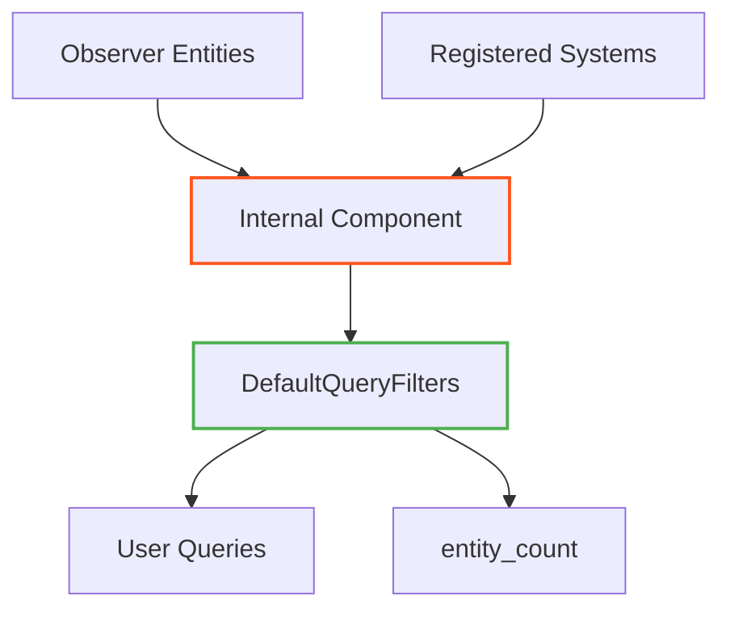

+++
title = "#20204 Internal Entities"
date = "2025-07-22T00:00:00"
draft = false
template = "pull_request_page.html"
in_search_index = false

[extra]
current_language = "zh-cn"
available_languages = {"en" = { name = "English", url = "/pull_request/bevy/2025-07/pr-20204-en-20250722" }, "zh-cn" = { name = "中文", url = "/pull_request/bevy/2025-07/pr-20204-zh-cn-20250722" }}
+++

# 内部实体 (Internal Entities)

## 基本信息
- **标题**: Internal Entities
- **PR链接**: https://github.com/bevyengine/bevy/pull/20204
- **作者**: Trashtalk217
- **状态**: 已合并
- **标签**: C-Usability, S-Ready-For-Final-Review, A-Dev-Tools, A-Cross-Cutting
- **创建时间**: 2025-07-19T19:45:48Z
- **合并时间**: 2025-07-21T23:37:05Z
- **合并人**: alice-i-cecile

## 描述翻译
### Objective
随着更多功能迁移到实体(entity)上，需要将这些实体保持准私有(quasi-private)状态。我们不希望用户因需要将所有内容解释为实体而感到困惑。

此需求源于 #19711。

### Solution
本PR引入了内部实体(internal entities)的概念——通过`Internal`组件标记的实体。这些实体会被`DefaultQueryFilters`过滤掉，并且不会计入`World::entity_count()`。

### Testing
添加了测试用例。

## PR分析

### 问题背景
在Bevy引擎开发过程中，越来越多的系统功能开始使用实体(entity)作为实现机制（如观察者系统observers和注册系统registered systems）。这导致了一个问题：这些内部实现实体暴露在用户查询和实体计数中，造成以下影响：
1. 用户查询结果被无关的内部实体污染
2. `World::entity_count()`返回的实体数量包含内部实体
3. 用户可能意外依赖不稳定的内部实现细节

该问题在实现观察者系统(observers)时变得明显（PR #19711），因为每个观察者都会创建一个实体，这些实体本应是引擎内部实现细节。

### 解决方案
核心方案是引入新的`Internal`组件作为内部实体的标记，并扩展`DefaultQueryFilters`机制自动过滤这些实体。具体实现分为三个部分：

1. **定义`Internal`标记组件**：创建新的组件类型，用于标记内部实体
2. **扩展默认查询过滤器**：修改`DefaultQueryFilters`使其自动过滤带`Internal`组件的实体
3. **标记现有内部实体**：为观察者(observers)和注册系统(registered systems)添加`Internal`组件

这种方案复用现有的实体禁用(entity disabling)机制，保持架构一致性，避免引入新的过滤逻辑。

### 关键技术实现
**1. 定义`Internal`组件**
在`entity_disabling.rs`中添加新的标记组件：
```rust
#[derive(Component, Clone, Debug, Default)]
#[cfg_attr(
    feature = "bevy_reflect",
    derive(Reflect),
    reflect(Component),
    reflect(Debug, Clone, Default)
)]
pub struct Internal;
```
该组件使用与`Disabled`相同的反射配置，确保行为一致。

**2. 扩展默认查询过滤器**
在`DefaultQueryFilters`初始化时注册`Internal`组件：
```rust
impl FromWorld for DefaultQueryFilters {
    fn from_world(world: &mut World) -> Self {
        let mut filters = DefaultQueryFilters::empty();
        let disabled_component_id = world.register_component::<Disabled>();
        filters.register_disabling_component(disabled_component_id);
        let internal_component_id = world.register_component::<Internal>();
        filters.register_disabling_component(internal_component_id);
        filters
    }
}
```
这使得所有未显式包含`Internal`组件的查询都会自动过滤掉内部实体。

**3. 标记观察者实体**
修改`Observer`组件的注册逻辑，自动添加`Internal`组件：
```rust
impl Component for Observer {
    // ...
    fn register_required_components(
        _component_id: ComponentId,
        components: &mut ComponentsRegistrator,
        required_components: &mut RequiredComponents,
        inheritance_depth: u16,
        recursion_check_stack: &mut Vec<ComponentId>,
    ) {
        components.register_required_components_manual::<Self, Internal>(
            required_components,
            Internal::default,
            inheritance_depth,
            recursion_check_stack,
        );
    }
}
```
这确保创建观察者实体时自动添加`Internal`标记。

**4. 标记注册系统**
修改`RegisteredSystem`组件定义，要求`Internal`组件：
```rust
#[derive(Component)]
#[require(SystemIdMarker, Internal)] // 添加Internal标记
pub(crate) struct RegisteredSystem<I, O> {
    initialized: bool,
    system: BoxedSystem<I, O>,
}
```
`#[require(...)]`属性宏确保创建注册系统实体时自动添加`Internal`组件。

### 测试验证
添加的测试用例验证内部实体行为：
```rust
#[test]
fn internal_entities() {
    let mut world = World::default();
    world.register_system(|| {});
    let mut query = world.query::<()>();
    assert_eq!(query.iter(&world).count(), 0);
    
    let mut query = world.query_filtered::<(), With<Internal>>();
    assert_eq!(query.iter(&world).count(), 1);

    #[derive(Component)]
    struct A;
    world.add_observer(|_: On<Add, A>| {});
    
    let mut query = world.query::<()>();
    assert_eq!(query.iter(&world).count(), 0);
    
    let mut query = world.query_filtered::<(), With<Internal>>();
    assert_eq!(query.iter(&world).count(), 2);
}
```
测试验证：
1. 默认查询不返回内部实体
2. 显式查询能获取内部实体
3. 注册系统和观察者都被正确标记

### 迁移指南
新增迁移文档`internal_entities.md`说明变更：
```markdown
---
title: Internal Entities
pull_requests: [20204]
---

Bevy 0.17 introduces internal entities. Entities tagged by the `Internal` component that are hidden from most queries using [`DefaultQueryFilters`](https://docs.rs/bevy/latest/bevy/ecs/entity_disabling/index.html).

Currently, both [`Observer`s](https://docs.rs/bevy/latest/bevy/ecs/observer/struct.Observer.html) and systems that are registered through [`World::register_system`](https://docs.rs/bevy/latest/bevy/prelude/struct.World.html#method.register_system) are considered internal entities.

If you queried them before, add the `Allows<Internal>` filter to the query to bypass the default filter.
```

### 影响分析
1. **用户透明度**：用户查询和实体计数不再包含内部实体
2. **架构清晰度**：明确区分引擎内部实体和用户实体
3. **扩展性**：为未来添加其他内部实体类型提供标准机制
4. **兼容性**：现有代码默认过滤内部实体，需要显式`Allows<Internal>`才能查询

## 组件关系图


## 关键文件变更

### 1. `crates/bevy_ecs/src/entity_disabling.rs`
**变更**：  
添加`Internal`组件定义并集成到默认查询过滤器中

**代码片段**：
```rust
// 添加Internal组件定义
#[derive(Component, Clone, Debug, Default)]
#[cfg_attr(...)]
pub struct Internal;

// 在过滤器初始化中注册Internal
impl FromWorld for DefaultQueryFilters {
    fn from_world(world: &mut World) -> Self {
        // ...
        let internal_component_id = world.register_component::<Internal>();
        filters.register_disabling_component(internal_component_id);
        filters
    }
}

// 添加测试用例
#[test]
fn internal_entities() {
    // 验证内部实体过滤行为
}
```

### 2. `crates/bevy_ecs/src/observer/distributed_storage.rs`
**变更**：  
确保`Observer`实体自动添加`Internal`组件

**代码片段**：
```rust
impl Component for Observer {
    // ...
    fn register_required_components(...) {
        components.register_required_components_manual::<Self, Internal>(...);
    }
}
```

### 3. `crates/bevy_ecs/src/system/system_registry.rs`
**变更**：  
标记注册系统为内部实体

**代码片段**：
```rust
#[derive(Component)]
#[require(SystemIdMarker, Internal)] // 添加Internal标记
pub(crate) struct RegisteredSystem<I, O> {
    // ...
}
```

### 4. `release-content/migration-guides/internal_entities.md`
**变更**：  
添加迁移指南文档

**代码片段**：
```markdown
---
title: Internal Entities
pull_requests: [20204]
---

Bevy 0.17 introduces internal entities...
```

## 扩展阅读
1. [实体禁用机制文档](https://docs.rs/bevy/latest/bevy/ecs/entity_disabling/index.html)
2. [Bevy ECS查询系统](https://bevyengine.org/learn/book/ecs/queries/)
3. [组件继承机制](https://docs.rs/bevy/latest/bevy/ecs/component/trait.Component.html#method.register_required_components)