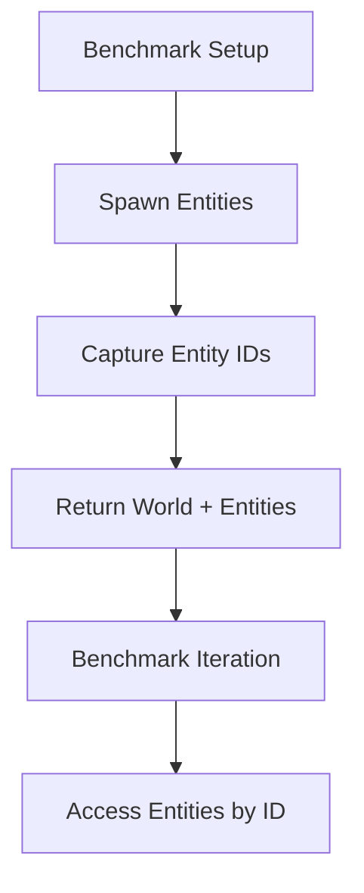

+++
title = "#20207 Adjust benches to be more robust"
date = "2025-07-20T00:00:00"
draft = false
template = "pull_request_page.html"
in_search_index = true

[taxonomies]
list_display = ["show"]

[extra]
current_language = "en"
available_languages = {"en" = { name = "English", url = "/pull_request/bevy/2025-07/pr-20207-en-20250720" }, "zh-cn" = { name = "中文", url = "/pull_request/bevy/2025-07/pr-20207-zh-cn-20250720" }}
labels = ["D-Trivial", "C-Code-Quality", "C-Benchmarks"]
+++

## Adjust benches to be more robust

### Basic Information
- **Title**: Adjust benches to be more robust
- **PR Link**: https://github.com/bevyengine/bevy/pull/20207
- **Author**: Trashtalk217
- **Status**: MERGED
- **Labels**: D-Trivial, C-Code-Quality, C-Benchmarks, S-Needs-Review
- **Created**: 2025-07-19T22:32:18Z
- **Merged**: 2025-07-20T16:27:13Z
- **Merged By**: mockersf

### Description Translation
# Objective

Currently, benchmarks access the world's entities in a very unsafe way, which doesn't hold up if we add more internal entities.

Part of #19711.

## Solution

Have the setups return a `Vec<Entity>` we can iterate over.

## Testing

Not needed.

### The Story of This Pull Request

The ECS benchmarks had a structural issue where they were assuming direct control over entity IDs. The original implementation generated entities by converting loop indices directly into entity IDs using unsafe operations:

```rust
let entity = Entity::from_raw(EntityRow::new(unsafe { NonMaxU32::new_unchecked(i) }));
```

This approach was fragile because it assumed:
1. Entities would always be allocated in sequential order starting from 0
2. No other entities would exist in the world during benchmarking
3. Entity IDs would exactly match their spawn order indices

These assumptions created two significant problems. First, the unsafe `NonMaxU32::new_unchecked` bypassed safety checks, making the code more error-prone. Second, and more importantly, this approach would break if Bevy's internal implementation changed to add background entities or use different entity allocation strategies. Since the project was considering adding internal entities (#19711), this benchmark approach would become invalid.

The solution refactors the benchmark setup to capture actual entity IDs during world population. Instead of returning just the `World`, setup functions now return a tuple containing both the world and a vector of entities:

```rust
fn setup<T: Component + Default>(entity_count: u32) -> (World, Vec<Entity>) {
    let mut world = World::default();
    let entities: Vec<Entity> = world
        .spawn_batch((0..entity_count).map(|_| T::default()))
        .collect();
    black_box((world, entities))
}
```

This change allows benchmarks to iterate over actual entities rather than assuming sequential IDs:

```rust
bencher.iter(|| {
    for entity in &entities {
        black_box(world.entity(*entity));
    }
});
```

The implementation required updating all benchmark cases to:
1. Destructure the setup return value into world and entities
2. Replace index-based loops with entity vector iteration
3. Remove unsafe entity ID construction
4. Eliminate the `nonmax` dependency since it's no longer needed

The changes maintain identical benchmark behavior while making the tests robust against internal ECS changes. By using the actual entities returned from `spawn_batch`, the benchmarks now correctly handle any entity allocation strategy Bevy might use, including non-sequential IDs or worlds with additional entities.

### Visual Representation



### Key Files Changed

- `benches/benches/bevy_ecs/world/world_get.rs` (+38/-54)

**Changes:**
1. Modified setup functions to return both World and entity list
2. Replaced unsafe entity ID generation with actual entity references
3. Removed unused dependencies and entity conversion code

**Code comparison:**

Before unsafe entity access:
```rust
// Before:
let world = setup::<Table>(entity_count);
bencher.iter(|| {
    for i in 0..entity_count {
        let entity = Entity::from_raw(EntityRow::new(unsafe { NonMaxU32::new_unchecked(i) }));
        black_box(world.entity(entity));
    }
});
```

After safe entity iteration:
```rust
// After:
let (world, entities) = setup::<Table>(entity_count);
bencher.iter(|| {
    for entity in &entities {
        black_box(world.entity(*entity));
    }
});
```

### Further Reading
1. [Bevy ECS World documentation](https://docs.rs/bevy_ecs/latest/bevy_ecs/world/struct.World.html)
2. [Entity handling in ECS systems](https://bevyengine.org/learn/book/getting-started/ecs/)
3. [Rust benchmarking with Criterion](https://bheisler.github.io/criterion.rs/book/index.html)