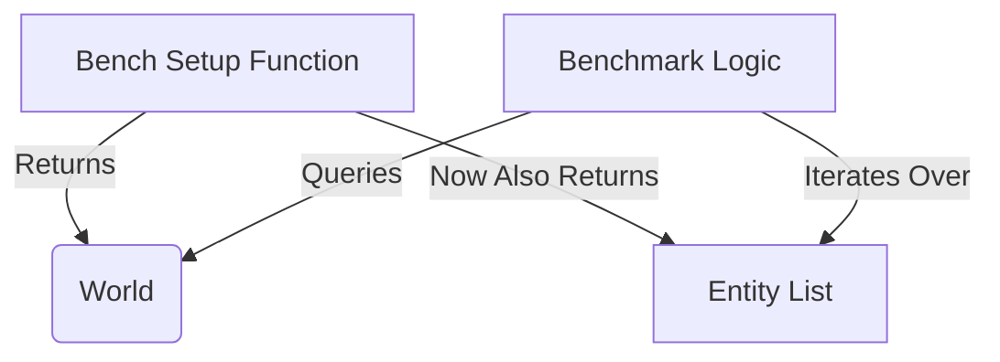

+++
title = "#20207 Adjust benches to be more robust"
date = "2025-07-20T00:00:00"
draft = false
template = "pull_request_page.html"
in_search_index = false

[extra]
current_language = "zh-cn"
available_languages = {"en" = { name = "English", url = "/pull_request/bevy/2025-07/pr-20207-en-20250720" }, "zh-cn" = { name = "中文", url = "/pull_request/bevy/2025-07/pr-20207-zh-cn-20250720" }}
+++

# PR 分析报告：Adjust benches to be more robust

## 基础信息
- **标题**: Adjust benches to be more robust
- **PR 链接**: https://github.com/bevyengine/bevy/pull/20207
- **作者**: Trashtalk217
- **状态**: MERGED
- **标签**: D-Trivial, C-Code-Quality, C-Benchmarks, S-Needs-Review
- **创建时间**: 2025-07-19T22:32:18Z
- **合并时间**: 2025-07-20T16:27:13Z
- **合并者**: mockersf

## 描述翻译
### 目标(Objective)
当前基准测试以非常不安全的方式访问世界(world)中的实体(entities)，如果添加更多内部实体，这种方式将无法维持。

作为 #19711 的一部分。

### 解决方案(Solution)
让设置函数返回一个可迭代的 `Vec<Entity>`。

### 测试(Testing)
不需要。

## 这个 PR 的故事

### 问题背景
在 Bevy 的 ECS 基准测试中，测试代码通过直接生成连续数字的实体 ID 来访问实体。这种实现依赖于实体 ID 在生成时连续且从零开始的假设，使用不安全的代码直接构造实体：

```rust
// 修改前的代码片段
let entity = Entity::from_raw(EntityRow::new(unsafe { NonMaxU32::new_unchecked(i) }));
```

这种方法存在两个主要问题：
1. **安全风险**：使用 `unsafe` 绕过类型系统，可能引入未定义行为
2. **脆弱性**：依赖实体 ID 连续生成的实现细节，当引擎内部添加额外实体时会破坏测试
3. **维护问题**：测试逻辑与具体实现耦合，增加重构成本

这种模式在多处基准测试中重复出现，成为技术债务的一部分，特别是考虑到 #19711 计划引入更多内部实体。

### 解决方案设计
PR 采用直接但有效的重构策略：
1. 修改测试设置函数，使其返回生成的实体列表
2. 用安全的实体迭代替代不安全的 ID 构造
3. 消除对 `nonmax` crate 的依赖

关键决策点：
- 选择返回 `(World, Vec<Entity>)` 而不是修改 World 内部结构，保持最小改动
- 保持基准测试逻辑不变，仅改变实体访问方式
- 不引入新抽象，保持测试代码简单直接

### 具体实现
核心修改是将所有 `setup*` 函数从返回 `World` 改为返回 `(World, Vec<Entity>)` 元组：

```rust
// 修改前
fn setup<T: Component + Default>(entity_count: u32) -> World {
    let mut world = World::default();
    world.spawn_batch((0..entity_count).map(|_| T::default()));
    black_box(world)
}

// 修改后
fn setup<T: Component + Default>(entity_count: u32) -> (World, Vec<Entity>) {
    let mut world = World::default();
    let entities: Vec<Entity> = world
        .spawn_batch((0..entity_count).map(|_| T::default()))
        .collect();
    black_box((world, entities))
}
```

在测试逻辑中，用安全的实体迭代替换不安全的 ID 生成：

```rust
// 修改前
for i in 0..entity_count {
    let entity = Entity::from_raw(EntityRow::new(unsafe { NonMaxU32::new_unchecked(i) }));
    black_box(world.entity(entity));
}

// 修改后
for entity in &entities {
    black_box(world.entity(*entity));
}
```

### 技术影响
1. **安全性提升**：消除所有 `unsafe` 代码块，减少潜在风险
2. **健壮性增强**：解耦测试与实体ID生成实现，支持未来架构变更
3. **依赖简化**：移除对 `nonmax` crate 的依赖，精简项目
4. **性能保持**：实体列表在设置阶段一次性生成，运行时开销可忽略

重构后代码更符合 Rust 的安全哲学，同时保持相同的基准测试意图和覆盖范围。

## 视觉表示



## 关键文件变更

### `benches/benches/bevy_ecs/world/world_get.rs`
**变更描述**：重构基准测试设置和实体访问方式，消除不安全代码

#### 核心修改
```rust
// 修改前：仅返回 World
fn setup<T: Component + Default>(entity_count: u32) -> World {
    let mut world = World::default();
    world.spawn_batch((0..entity_count).map(|_| T::default()));
    black_box(world)
}

// 修改后：返回 (World, Vec<Entity>)
fn setup<T: Component + Default>(entity_count: u32) -> (World, Vec<Entity>) {
    let mut world = World::default();
    let entities: Vec<Entity> = world
        .spawn_batch((0..entity_count).map(|_| T::default()))
        .collect();
    black_box((world, entities))
}
```

```rust
// 修改前：不安全实体构造
for i in 0..entity_count {
    let entity = Entity::from_raw(EntityRow::new(unsafe { NonMaxU32::new_unchecked(i) }));
    assert!(world.get::<Table>(entity).is_some());
}

// 修改后：安全实体迭代
for entity in &entities {
    assert!(world.get::<Table>(*entity).is_some());
}
```

#### 相关修改
1. 移除不再需要的依赖和类型导入：
```rust
- use nonmax::NonMaxU32;
- use bevy_ecs::entity::{Entity, EntityRow};
+ use bevy_ecs::entity::Entity;
```

2. 统一所有测试用例的模式：
```rust
// 修改前
let world = setup::<Table>(entity_count);
// 修改后
let (world, entities) = setup::<Table>(entity_count);
```

## 延伸阅读
1. [Rust 安全代码指南](https://doc.rust-lang.org/nomicon/)
2. [Bevy ECS 世界文档](https://docs.rs/bevy_ecs/latest/bevy_ecs/world/struct.World.html)
3. [实体生成最佳实践](https://github.com/bevyengine/bevy/blob/main/docs/ECS_FAQ.md#entity-creation)