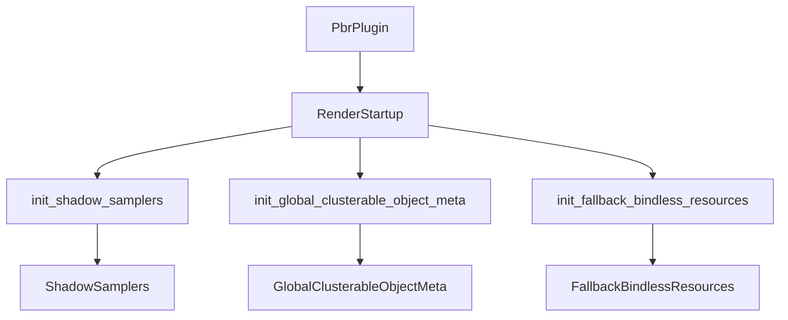

+++
title = "#20208 RenderStartup for resources in PbrPlugin finish"
date = "2025-07-20T00:00:00"
draft = false
template = "pull_request_page.html"
in_search_index = true

[taxonomies]
list_display = ["show"]

[extra]
current_language = "en"
available_languages = {"en" = { name = "English", url = "/pull_request/bevy/2025-07/pr-20208-en-20250720" }, "zh-cn" = { name = "中文", url = "/pull_request/bevy/2025-07/pr-20208-zh-cn-20250720" }}
labels = ["A-Rendering", "C-Code-Quality", "D-Straightforward"]
+++

# PR Analysis: `RenderStartup` for resources in PbrPlugin finish

## Basic Information
- **Title**: RenderStartup for resources in PbrPlugin finish
- **PR Link**: https://github.com/bevyengine/bevy/pull/20208
- **Author**: andriyDev
- **Status**: MERGED
- **Labels**: A-Rendering, C-Code-Quality, D-Straightforward, S-Needs-Review
- **Created**: 2025-07-20T00:30:07Z
- **Merged**: 2025-07-20T20:37:12Z
- **Merged By**: alice-i-cecile

## Description Translation
# Objective

- Progress towards #19887.

## Solution

- Convert FromWorld impls to systems in RenderStartup.
- I am intentionally leaving alone the `global_cluster_settings` since it requires a more complex migration (since it fetches data from the render world but the inserts into the main world).

## Testing

- Nothing really obvious to test. I just ran `3d_scene` and it still works.

## The Story of This Pull Request

### The Problem and Context
The PR addresses a technical debt issue in Bevy's rendering system related to resource initialization patterns. Several rendering resources were using `FromWorld` implementations for initialization, which is being phased out in favor of explicit systems (#19887). The `FromWorld` pattern has limitations in flexibility and testability compared to systems-based initialization. Specifically, the `ShadowSamplers`, `GlobalClusterableObjectMeta`, and `FallbackBindlessResources` resources were initialized using `FromWorld`, making them candidates for migration.

### The Solution Approach
The author converted these `FromWorld` implementations into dedicated systems that run during the `RenderStartup` schedule. This approach maintains the same initialization logic but uses Bevy's standard system paradigm. The author explicitly excluded `global_cluster_settings` from this migration due to its more complex initialization requirements involving data transfer between the main and render worlds.

### The Implementation
The migration involved three key steps for each resource:
1. Remove the existing `FromWorld` implementation
2. Create a new system function that initializes the resource using explicit dependencies
3. Register the system in the `RenderStartup` schedule

For `ShadowSamplers`, the initialization logic was moved from `FromWorld` to a new `init_shadow_samplers` system:

```rust
// Before:
impl FromWorld for ShadowSamplers {
    fn from_world(world: &mut World) -> Self {
        let render_device = world.resource::<RenderDevice>();
        // ...sampler creation logic
    }
}

// After:
pub fn init_shadow_samplers(mut commands: Commands, render_device: Res<RenderDevice>) {
    // ...same sampler creation logic
    commands.insert_resource(ShadowSamplers { ... });
}
```

Similar transformations were applied to `GlobalClusterableObjectMeta` and `FallbackBindlessResources`. The registration of these systems was consolidated in `PbrPlugin`:

```rust
render_app.add_systems(
    RenderStartup,
    (
        init_shadow_samplers,
        init_global_clusterable_object_meta,
        init_fallback_bindless_resources,
    ),
);
```

### Technical Insights
The PR demonstrates a clean pattern for migrating `FromWorld` to systems:
1. Use `Commands` to insert resources rather than returning them
2. Explicitly declare dependencies via system parameters (like `Res<RenderDevice>`)
3. Group related initialization systems together

The decision to keep `global_cluster_settings` using the old pattern was pragmatic. Its initialization requires accessing data from the render world while inserting into the main world, which doesn't fit cleanly into the new pattern without more extensive refactoring.

### The Impact
This change improves code consistency and maintainability in Bevy's rendering system. By eliminating three `FromWorld` implementations, it:
1. Aligns with Bevy's direction toward explicit systems
2. Makes resource dependencies more visible through system parameters
3. Simplifies future modifications to these initialization processes
4. Updates the migration guide to reflect the new initialization locations

## Visual Representation



## Key Files Changed

### `crates/bevy_pbr/src/render/light.rs`
Migrated `ShadowSamplers` initialization from `FromWorld` to a system:
```rust
// Before:
impl FromWorld for ShadowSamplers {
    fn from_world(world: &mut World) -> Self {
        // Initialization logic
    }
}

// After:
pub fn init_shadow_samplers(mut commands: Commands, render_device: Res<RenderDevice>) {
    // Same initialization logic
    commands.insert_resource(ShadowSamplers { ... });
}
```

### `crates/bevy_pbr/src/material_bind_groups.rs`
Converted `FallbackBindlessResources` to system initialization:
```rust
// Before:
impl FromWorld for FallbackBindlessResources {
    fn from_world(world: &mut World) -> Self {
        // Resource creation
    }
}

// After:
pub fn init_fallback_bindless_resources(mut commands: Commands, render_device: Res<RenderDevice>) {
    commands.insert_resource(FallbackBindlessResources {
        // Resource fields
    });
}
```

### `crates/bevy_pbr/src/lib.rs`
Registered initialization systems in `RenderStartup`:
```rust
render_app.add_systems(
    RenderStartup,
    (
        init_shadow_samplers,
        init_global_clusterable_object_meta,
        init_fallback_bindless_resources,
    ),
);
```

### `crates/bevy_pbr/src/cluster.rs`
Migrated `GlobalClusterableObjectMeta` initialization:
```rust
// Before:
impl FromWorld for GlobalClusterableObjectMeta {
    fn from_world(world: &mut World) -> Self {
        // Initialization code
    }
}

// After:
pub fn init_global_clusterable_object_meta(
    mut commands: Commands,
    render_device: Res<RenderDevice>,
) {
    commands.insert_resource(GlobalClusterableObjectMeta::new(
        // Initialization parameters
    ));
}
```

### `release-content/migration-guides/render_startup.md`
Updated documentation to reflect new initialization locations:
```markdown
- `ShadowSamplers`
- `GlobalClusterableObjectMeta`
- `FallbackBindlessResources`
```

## Further Reading
1. [Bevy's System Param Documentation](https://bevyengine.org/learn/book/next/ecs/system-params/)
2. [Render Startup Schedule Overview](https://bevyengine.org/learn/book/next/pipeline/render-pipelines/)
3. [Resource Initialization Patterns](https://bevyengine.org/learn/book/next/ecs/resources/)
4. [Tracking Issue for FromWorld Migration (#19887)](https://github.com/bevyengine/bevy/issues/19887)