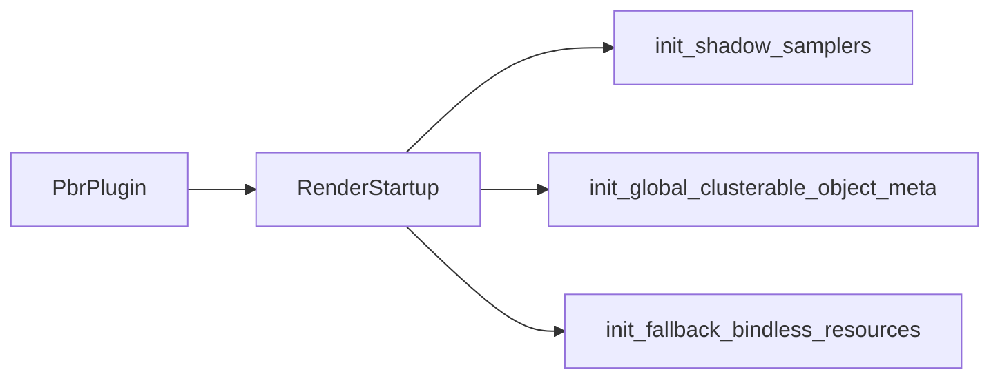

+++
title = "#20208 Use `RenderStartup` for resources in PbrPlugin finish"
date = "2025-07-20T00:00:00"
draft = false
template = "pull_request_page.html"
in_search_index = false

[extra]
current_language = "zh-cn"
available_languages = {"en" = { name = "English", url = "/pull_request/bevy/2025-07/pr-20208-en-20250720" }, "zh-cn" = { name = "中文", url = "/pull_request/bevy/2025-07/pr-20208-zh-cn-20250720" }}
+++

# 标题  
`RenderStartup` 用于 PbrPlugin 中的资源初始化  

## 基本信息  
- **标题**: Use `RenderStartup` for resources in PbrPlugin finish  
- **PR链接**: https://github.com/bevyengine/bevy/pull/20208  
- **作者**: andriyDev  
- **状态**: 已合并  
- **标签**: A-Rendering, C-Code-Quality, D-Straightforward, S-Needs-Review  
- **创建时间**: 2025-07-20T00:30:07Z  
- **合并时间**: 2025-07-20T20:37:12Z  
- **合并者**: alice-i-cecile  

## 描述翻译  
### 目标  
- 推进 #19887 的实现。  

### 解决方案  
- 将 `FromWorld` 实现转换为在 `RenderStartup` 阶段运行的系统。  
- 特意保留 `global_cluster_settings` 不做修改，因为它的迁移更复杂（需要从渲染世界获取数据并插入主世界）。  

### 测试  
- 没有明显需要测试的内容。运行 `3d_scene` 验证功能正常。  

## PR 技术分析  

### 问题背景  
在 Bevy 渲染系统中，多个关键资源（如阴影采样器、集群元数据）通过 `FromWorld` trait 进行初始化。这种方式在引擎启动时隐式执行资源创建，导致：  
1. 初始化时机不明确，难以追踪资源创建顺序  
2. 与 Bevy 的显式系统调度哲学不符  
3. 阻碍 #19887 要求的渲染系统结构化改进  

### 解决方案  
核心方案是将隐式的 `FromWorld` 初始化转换为显式系统：  
1. 为每个资源创建专门的初始化系统  
2. 在 `RenderStartup` 阶段注册这些系统  
3. 保留需要跨世界操作的 `global_cluster_settings` 待后续处理  



### 关键修改  

#### 1. 阴影采样器初始化 (`crates/bevy_pbr/src/render/light.rs`)  
**变更**: 将 `FromWorld` 实现替换为命令式系统  
```rust
// 修改前:
impl FromWorld for ShadowSamplers {
    fn from_world(world: &mut World) -> Self {
        let render_device = world.resource::<RenderDevice>();
        // ... 采样器创建逻辑
    }
}

// 修改后:
pub fn init_shadow_samplers(mut commands: Commands, render_device: Res<RenderDevice>) {
    // ... 采样器创建逻辑
    commands.insert_resource(ShadowSamplers { ... });
}
```
**技术要点**:  
- 使用 `Commands` 显式插入资源  
- 通过 `Res<RenderDevice>` 直接获取依赖  
- 消除隐式世界访问  

#### 2. 集群元数据初始化 (`crates/bevy_pbr/src/cluster.rs`)  
**变更**: 重构为独立系统  
```rust
// 修改前:
impl FromWorld for GlobalClusterableObjectMeta {
    fn from_world(world: &mut World) -> Self {
        Self::new(world.resource::<RenderDevice>().get_supported_read_only_binding_type(...))
    }
}

// 修改后:
pub fn init_global_clusterable_object_meta(
    mut commands: Commands,
    render_device: Res<RenderDevice>,
) {
    commands.insert_resource(GlobalClusterableObjectMeta::new(
        render_device.get_supported_read_only_binding_type(...)
    ));
}
```
**优势**:  
- 明确依赖关系 (`RenderDevice`)  
- 符合 ECS 系统参数规范  

#### 3. 回退资源初始化 (`crates/bevy_pbr/src/material_bind_groups.rs`)  
**变更**: 替换资源创建方式  
```rust
// 修改前:
impl FromWorld for FallbackBindlessResources {
    fn from_world(world: &mut World) -> Self {
        let render_device = world.resource::<RenderDevice>();
        FallbackBindlessResources {
            filtering_sampler: render_device.create_sampler(...),
            // ... 其他采样器
        }
    }
}

// 修改后:
pub fn init_fallback_bindless_resources(mut commands: Commands, render_device: Res<RenderDevice>) {
    commands.insert_resource(FallbackBindlessResources {
        filtering_sampler: render_device.create_sampler(...),
        // ... 其他采样器
    });
}
```
**设计考量**:  
- 保持原有资源结构不变  
- 仅改变初始化入口点  

#### 4. 插件集成 (`crates/bevy_pbr/src/lib.rs`)  
**变更**: 在 `RenderStartup` 阶段注册初始化系统  
```rust
render_app.add_systems(
    RenderStartup,
    (
        init_shadow_samplers,
        init_global_clusterable_object_meta,
        init_fallback_bindless_resources,
    ),
);
```
同时移除原有的隐式初始化：  
```rust
// 删除的代码:
.init_resource::<ShadowSamplers>()
.init_resource::<GlobalClusterableObjectMeta>()
.init_resource::<FallbackBindlessResources>();
```
**架构意义**:  
- 统一渲染资源初始化入口  
- 明确系统执行阶段  

#### 5. 迁移指南更新 (`release-content/migration-guides/render_startup.md`)  
添加新增的初始化资源：  
```markdown
- `ShadowSamplers`
- `GlobalClusterableObjectMeta`
- `FallbackBindlessResources`
```
**作用**:  
- 帮助开发者定位资源初始化位置变更  

### 技术影响  
1. **可维护性提升**:  
   - 初始化逻辑从隐式转为显式系统  
   - 资源依赖关系通过系统参数声明  
2. **架构一致性**:  
   - 符合 Bevy 的阶段化系统调度规范  
   - 为 #19887 的渲染系统重构铺平道路  
3. **性能不变**:  
   - 初始化操作仅改变执行方式，未增加开销  
4. **扩展性增强**:  
   - 新系统可轻松插入其他依赖或调试逻辑  

### 待处理事项  
- `global_cluster_settings` 因需跨世界访问暂未迁移  
- 未来可考虑将剩余 `FromWorld` 用法逐步迁移  

## 关键文件变更  
1. `crates/bevy_pbr/src/render/light.rs`  
   - 实现 `init_shadow_samplers` 系统  
   - 移除 `FromWorld for ShadowSamplers`  

2. `crates/bevy_pbr/src/cluster.rs`  
   - 添加 `init_global_clusterable_object_meta` 系统  
   - 删除 `FromWorld for GlobalClusterableObjectMeta`  

3. `crates/bevy_pbr/src/material_bind_groups.rs`  
   - 创建 `init_fallback_bindless_resources` 系统  
   - 移除 `FromWorld for FallbackBindlessResources`  

4. `crates/bevy_pbr/src/lib.rs`  
   - 在 `RenderStartup` 阶段注册初始化系统  
   - 删除隐式资源初始化调用  

5. `release-content/migration-guides/render_startup.md`  
   - 添加新增的渲染资源到迁移文档  

## 延伸阅读  
- [Bevy 系统阶段文档](https://docs.rs/bevy_ecs/latest/bevy_ecs/schedule/enum.Main.html)  
- [ECS 命令模式](https://bevy-cheatbook.github.io/programming/commands.html)  
- [相关 Issue #19887](https://github.com/bevyengine/bevy/issues/19887)