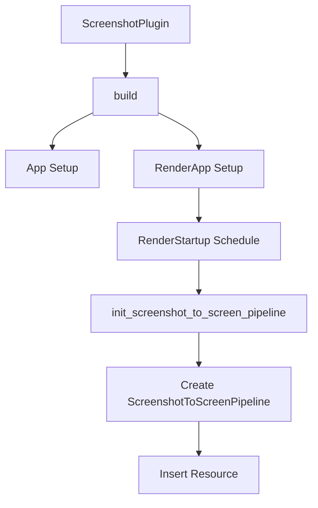

+++
title = "#20209 Use `RenderStartup` for screenshot plugin"
date = "2025-07-20T00:00:00"
draft = false
template = "pull_request_page.html"
in_search_index = true

[taxonomies]
list_display = ["show"]

[extra]
current_language = "en"
available_languages = {"en" = { name = "English", url = "/pull_request/bevy/2025-07/pr-20209-en-20250720" }, "zh-cn" = { name = "中文", url = "/pull_request/bevy/2025-07/pr-20209-zh-cn-20250720" }}
labels = ["A-Rendering", "C-Code-Quality", "D-Straightforward"]
+++

# PR Analysis: Use `RenderStartup` for screenshot plugin

## Basic Information
- **Title**: Use `RenderStartup` for screenshot plugin
- **PR Link**: https://github.com/bevyengine/bevy/pull/20209
- **Author**: andriyDev
- **Status**: MERGED
- **Labels**: A-Rendering, C-Code-Quality, S-Ready-For-Final-Review, D-Straightforward
- **Created**: 2025-07-20T00:46:04Z
- **Merged**: 2025-07-20T20:41:47Z
- **Merged By**: alice-i-cecile

## Description Translation
# Objective

- Progress towards #19887.

## Solution

- Convert FromWorld impls to systems in RenderStartup.
- Move everything from finish to build.

## Testing

- Ran the `screenshot` example and it still works.

## The Story of This Pull Request

### Problem and Context
The screenshot plugin in Bevy was using an outdated initialization pattern that relied on the `FromWorld` trait for resource setup. This approach had several limitations:
1. `FromWorld` initialization occurs on first access, which can lead to unpredictable timing
2. It complicated the plugin structure by requiring setup in both `build()` and `finish()` methods
3. It didn't align with Bevy's modern render initialization patterns using explicit schedules

This change was part of a larger effort (#19887) to migrate render initialization from implicit `FromWorld` patterns to explicit systems running in the `RenderStartup` schedule. The `RenderStartup` schedule provides a dedicated phase for initializing render resources, making initialization more predictable and maintainable.

### Solution Approach
The solution involved two key technical changes:
1. Replace the `FromWorld` implementation with a dedicated initialization system
2. Consolidate all plugin setup into the `build()` method by removing the `finish()` implementation

The migration from `FromWorld` to a system follows Bevy's established pattern for render resource initialization. By using `RenderStartup`, we ensure the pipeline initializes at the correct point in the render app's lifecycle. The consolidation into `build()` simplifies the plugin structure and eliminates the separation between build and finish phases.

### Implementation Details
The core changes occur in the `ScreenshotPlugin` implementation and the pipeline initialization:

**Plugin Restructuring:**
The plugin was simplified by moving all initialization from `finish()` to `build()`. The render app setup is now conditional and only runs if the render app exists:

```rust
// Before: Separate build and finish methods
fn build(&self, app: &mut App) {
    // Initial setup
}

fn finish(&self, app: &mut App) {
    // Render-specific setup
}

// After: Consolidated in build()
fn build(&self, app: &mut App) {
    // All setup including render app
    let Some(render_app) = app.get_sub_app_mut(RenderApp) else {
        return;
    };
    
    render_app
        .add_systems(RenderStartup, init_screenshot_to_screen_pipeline)
        // ... other setup
}
```

**Pipeline Initialization:**
The `ScreenshotToScreenPipeline` resource initialization was converted from a `FromWorld` impl to a system:

```rust
// Before: FromWorld pattern
impl FromWorld for ScreenshotToScreenPipeline {
    fn from_world(render_world: &mut World) -> Self {
        let device = render_world.resource::<RenderDevice>();
        // ... creation logic ...
    }
}

// After: Explicit system
pub fn init_screenshot_to_screen_pipeline(
    mut commands: Commands,
    render_device: Res<RenderDevice>,
    asset_server: Res<AssetServer>,
) {
    let bind_group_layout = render_device.create_bind_group_layout(/* ... */);
    let shader = load_embedded_asset!(asset_server.as_ref(), "screenshot.wgsl");
    
    commands.insert_resource(ScreenshotToScreenPipeline {
        bind_group_layout,
        shader,
    });
}
```

Key improvements in this approach:
- Uses standard system parameters (`Commands`, `Res`) instead of direct world access
- Leverages the asset server for shader loading
- Explicitly inserts the resource via commands
- Runs in the predictable `RenderStartup` schedule

### Technical Insights
The changes demonstrate several important Bevy patterns:
1. **Explicit over implicit initialization**: Systems provide clearer control flow than `FromWorld`
2. **Resource initialization**: Using `commands.insert_resource()` is the standard way to initialize resources in systems
3. **Asset loading**: The migration shows proper use of the asset server for loading embedded assets
4. **Schedule ordering**: `RenderStartup` ensures initialization happens before render systems run

The PR also includes a migration guide update, adding `ScreenshotToScreenPipeline` to the list of resources initialized in `RenderStartup`. This helps users understand the initialization sequence when migrating their own projects.

### Impact
These changes provide concrete benefits:
1. **Simplified plugin structure**: Eliminates the separate finish method
2. **Predictable initialization**: Resources initialize at a known point in the render schedule
3. **Alignment with modern Bevy patterns**: Consistent with other render plugins
4. **Maintainability**: Easier to modify and extend the initialization logic
5. **Preparatory work**: Advances the larger goal (#19887) of migrating away from FromWorld

The solution maintains backward compatibility - the `screenshot` example continues to work as before, confirming no functional changes were introduced.

## Visual Representation



## Key Files Changed

### 1. `crates/bevy_render/src/view/window/screenshot.rs`
**Changes:**  
Restructured plugin initialization and converted pipeline setup from `FromWorld` to a `RenderStartup` system.

**Code Snippets:**  
Plugin restructuring:
```rust
// Before:
fn build(&self, app: &mut App) {
    app.add_systems(First, ...)
       .register_type::<Screenshot>();
}

fn finish(&self, app: &mut App) {
    let (tx, rx) = channel();
    app.insert_resource(CapturedScreenshots(Arc::new(Mutex::new(rx))));
    
    if let Some(render_app) = app.get_sub_app_mut(RenderApp) {
        render_app
            .insert_resource(RenderScreenshotsSender(tx))
            .init_resource::<ScreenshotToScreenPipeline>();
    }
}

// After:
fn build(&self, app: &mut App) {
    let (tx, rx) = channel();
    app.insert_resource(CapturedScreenshots(Arc::new(Mutex::new(rx))))
        .add_systems(First, ...)
        .add_systems(Update, ...)
        .register_type::<Screenshot>();
    
    let Some(render_app) = app.get_sub_app_mut(RenderApp) else {
        return;
    };
    
    render_app
        .insert_resource(RenderScreenshotsSender(tx))
        .add_systems(RenderStartup, init_screenshot_to_screen_pipeline);
}
```

Pipeline initialization:
```rust
// Before (FromWorld impl):
impl FromWorld for ScreenshotToScreenPipeline {
    fn from_world(render_world: &mut World) -> Self {
        let device = render_world.resource::<RenderDevice>();
        let bind_group_layout = device.create_bind_group_layout(...);
        let shader = load_embedded_asset!(render_world, "screenshot.wgsl");
        Self { bind_group_layout, shader }
    }
}

// After (System):
pub fn init_screenshot_to_screen_pipeline(
    mut commands: Commands,
    render_device: Res<RenderDevice>,
    asset_server: Res<AssetServer>,
) {
    let bind_group_layout = render_device.create_bind_group_layout(...);
    let shader = load_embedded_asset!(asset_server.as_ref(), "screenshot.wgsl");
    commands.insert_resource(ScreenshotToScreenPipeline {
        bind_group_layout,
        shader,
    });
}
```

### 2. `release-content/migration-guides/render_startup.md`
**Changes:**  
Added the screenshot pipeline to the migration guide for render startup changes.

**Code Snippet:**  
```markdown
- `ScreenshotToScreenPipeline`
```

## Further Reading
1. [Bevy Render Stages Documentation](https://bevyengine.org/learn/book/getting-started/rendering/) - Overview of Bevy's render schedules
2. [ECS Schedules Guide](https://bevyengine.org/learn/book/getting-started/ecs/#schedules) - How schedules control system execution order
3. [Resource Initialization Patterns](https://bevy-cheatbook.github.io/programming/res.html) - Best practices for resource management in Bevy
4. [PR #19887](https://github.com/bevyengine/bevy/pull/19887) - The larger initiative to migrate away from FromWorld