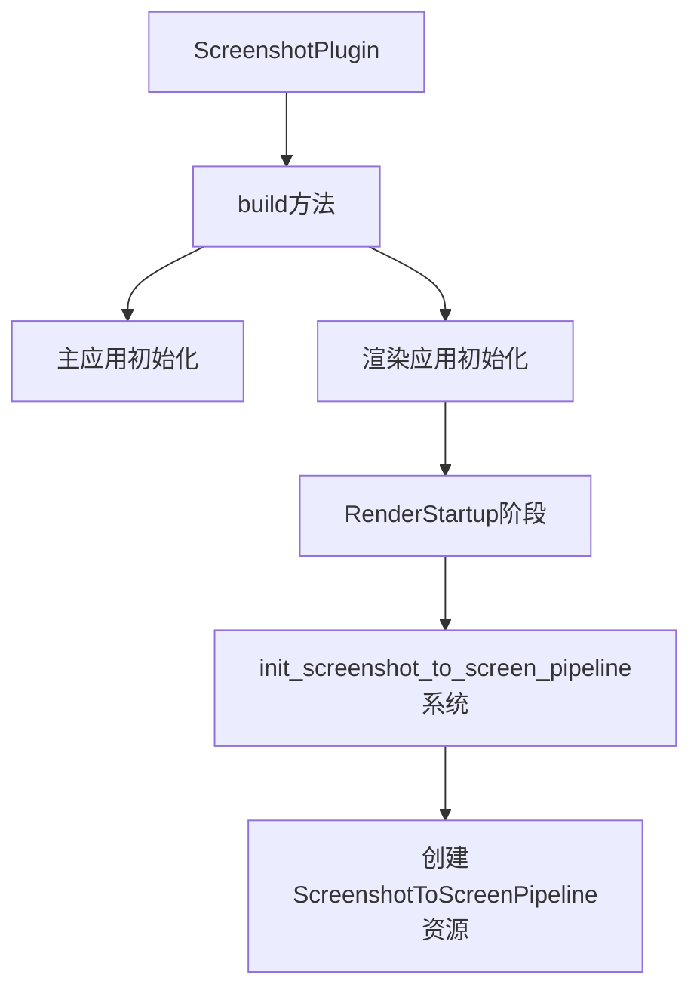

+++
title = "#20209 Use `RenderStartup` for screenshot plugin"
date = "2025-07-20T00:00:00"
draft = false
template = "pull_request_page.html"
in_search_index = false

[extra]
current_language = "zh-cn"
available_languages = {"en" = { name = "English", url = "/pull_request/bevy/2025-07/pr-20209-en-20250720" }, "zh-cn" = { name = "中文", url = "/pull_request/bevy/2025-07/pr-20209-zh-cn-20250720" }}
+++

## Use `RenderStartup` for screenshot plugin

### 基本信息
- **标题**: Use `RenderStartup` for screenshot plugin
- **PR链接**: https://github.com/bevyengine/bevy/pull/20209
- **作者**: andriyDev
- **状态**: MERGED
- **标签**: A-Rendering, C-Code-Quality, S-Ready-For-Final-Review, D-Straightforward
- **创建时间**: 2025-07-20T00:46:04Z
- **合并时间**: 2025-07-20T20:41:47Z
- **合并人**: alice-i-cecile

### 描述翻译
# Objective
- 向 #19887 的目标迈进

## Solution
- 将 FromWorld 实现转换为 RenderStartup 中的系统
- 将所有内容从 finish 移动到 build

## Testing
- 运行了 `screenshot` 示例，它仍然正常工作

### 这个故事

#### 问题背景
在 Bevy 渲染系统中，截图功能插件(ScreenshotPlugin)的初始化逻辑存在两个技术问题：
1. `ScreenshotToScreenPipeline` 资源使用 `FromWorld` trait 初始化，这种方式不符合 Bevy 推荐的最新模式
2. 插件初始化逻辑分散在 `build()` 和 `finish()` 两个方法中，增加了维护复杂度

这些问题属于 #19887 issue 的范畴，该 issue 旨在统一使用 `RenderStartup` 调度阶段进行渲染资源初始化。迁移到 `RenderStartup` 系统能带来更好的调度控制和资源初始化顺序管理。

#### 解决方案
开发者采用直接的重构方案：
1. 将 `FromWorld` 实现转换为显式的 `RenderStartup` 系统
2. 合并插件初始化逻辑，将所有设置从 `finish()` 移动到 `build()` 方法
3. 保持原有功能不变，确保截图功能继续正常工作

关键决策点：
- 选择 `RenderStartup` 而非其他阶段，因为这是初始化渲染管线的标准位置
- 保留原有资源初始化顺序，避免破坏现有依赖关系
- 使用 `AssetServer` 加载内嵌资源，替代直接从 World 获取的方式

#### 实现细节
重构集中在两个主要部分：

**1. 插件初始化逻辑迁移**
将资源创建和系统注册从 `finish()` 全部移动到 `build()` 方法中，使初始化逻辑更集中：

```rust
// Before:
fn build(&self, app: &mut App) {
    // 部分初始化
}

fn finish(&self, app: &mut App) {
    // 渲染相关初始化
    if let Some(render_app) = ... {
        // 资源插入和系统添加
    }
}

// After:
fn build(&self, app: &mut App) {
    // 所有主应用初始化
    app.insert_resource(...)
       .add_systems(...);

    // 渲染应用初始化
    if let Some(render_app) = ... {
        render_app
            .insert_resource(...)
            .add_systems(RenderStartup, ...) // 关键变更
            .add_systems(...);
    }
}
```

**2. 渲染管线初始化重构**
将 `FromWorld` 实现转换为显式系统：

```rust
// Before:
impl FromWorld for ScreenshotToScreenPipeline {
    fn from_world(render_world: &mut World) -> Self {
        let device = render_world.resource::<RenderDevice>();
        // 手动创建资源
    }
}

// After:
pub fn init_screenshot_to_screen_pipeline(
    mut commands: Commands,
    render_device: Res<RenderDevice>,
    asset_server: Res<AssetServer>,
) {
    let bind_group_layout = render_device.create_bind_group_layout(...);
    let shader = load_embedded_asset!(asset_server.as_ref(), "screenshot.wgsl");
    
    commands.insert_resource(ScreenshotToScreenPipeline {
        bind_group_layout,
        shader,
    });
}
```

技术亮点：
- 使用依赖注入获取 `RenderDevice` 和 `AssetServer`，更符合 ECS 模式
- 通过 `Commands` 插入资源，避免直接操作 World
- 保持原有资源创建逻辑不变，只改变初始化方式

#### 影响
这些变更带来以下改进：
1. **代码质量提升**：初始化逻辑更集中，减少插件生命周期方法的复杂度
2. **符合最新实践**：采用 `RenderStartup` 系统替代 `FromWorld`，与 #19887 目标一致
3. **维护性增强**：显式系统比隐式 `FromWorld` 更易理解和调试
4. **零功能影响**：保持原有截图功能完整，通过 `screenshot` 示例验证

迁移指南也相应更新，帮助其他开发者了解这一变更：
```markdown
release-content/migration-guides/render_startup.md
- `ScreenshotToScreenPipeline`
```

### 视觉表示


### 关键文件更改

1. **crates/bevy_render/src/view/window/screenshot.rs**
   - 重构插件初始化流程，将所有逻辑移到 `build()` 方法
   - 将 `FromWorld` 转换为 `RenderStartup` 系统
   - 添加渲染管线初始化系统

```rust
// 插件重构
fn build(&self, app: &mut App) {
    embedded_asset!(app, "screenshot.wgsl");
    let (tx, rx) = std::sync::mpsc::channel();
    app.insert_resource(CapturedScreenshots(Arc::new(Mutex::new(rx)))
        // ...其他系统注册...
    
    let Some(render_app) = app.get_sub_app_mut(RenderApp) else {
        return;
    };

    render_app
        .insert_resource(RenderScreenshotsSender(tx))
        // ...资源初始化...
        .add_systems(RenderStartup, init_screenshot_to_screen_pipeline) // 新增系统
        // ...其他系统...
}

// 新增渲染管线初始化系统
pub fn init_screenshot_to_screen_pipeline(
    mut commands: Commands,
    render_device: Res<RenderDevice>,
    asset_server: Res<AssetServer>,
) {
    let bind_group_layout = render_device.create_bind_group_layout(/* ... */);
    let shader = load_embedded_asset!(asset_server.as_ref(), "screenshot.wgsl");
    commands.insert_resource(ScreenshotToScreenPipeline {
        bind_group_layout,
        shader,
    });
}
```

2. **release-content/migration-guides/render_startup.md**
   - 更新迁移文档，反映新的初始化位置

```markdown
- `ScreenshotToScreenPipeline`
```

### 延伸阅读
1. Bevy 渲染启动阶段文档：[RenderStartup 阶段说明](https://bevyengine.org/learn/book/getting-started/rendering/#render-startup)
2. 资源初始化最佳实践：[从 FromWorld 迁移到系统](https://github.com/bevyengine/bevy/discussions/19887)
3. Bevy 插件开发指南：[插件生命周期管理](https://bevyengine.org/learn/book/getting-started/plugins/)