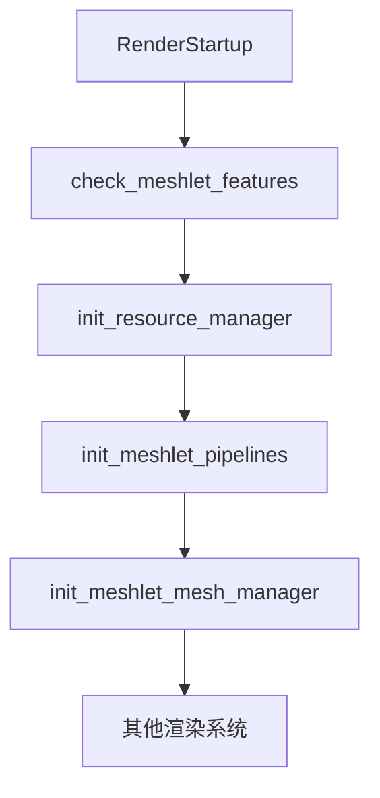

+++
title = "#20210 RenderStartup for meshlets"
date = "2025-07-20T00:00:00"
draft = false
template = "pull_request_page.html"
in_search_index = false

[extra]
current_language = "zh-cn"
available_languages = {"en" = { name = "English", url = "/pull_request/bevy/2025-07/pr-20210-en-20250720" }, "zh-cn" = { name = "中文", url = "/pull_request/bevy/2025-07/pr-20210-zh-cn-20250720" }}
+++

# 使用 RenderStartup 初始化 Meshlets

## 基本信息
- **标题**: RenderStartup for meshlets
- **PR链接**: https://github.com/bevyengine/bevy/pull/20210
- **作者**: andriyDev
- **状态**: MERGED
- **标签**: A-Rendering, C-Code-Quality, S-Ready-For-Final-Review, D-Straightforward
- **创建时间**: 2025-07-20T01:28:24Z
- **合并时间**: 2025-07-20T20:41:47Z
- **合并者**: alice-i-cecile

## 描述翻译
### 目标
- 朝着解决 #19887 的进展。

### 解决方案
- 将 `FromWorld` 实现转换为 `RenderStartup` 中的系统
- 使用闭包系统初始化 `ResourceManager` 以捕获 `cluster_buffer_slots`

### 测试
- 运行了 `meshlet` 示例，其行为与 main 分支一致

## 本 PR 的故事

### 问题与背景
在 Bevy 的 meshlet 渲染实现中，多个关键资源（包括 `MeshletMeshManager` 和 `MeshletPipelines`）使用 `FromWorld` trait 进行初始化。这种方式虽然可行，但存在几个问题：

1. **初始化顺序控制不足**：`FromWorld` 初始化发生在渲染应用启动时，难以控制资源之间的依赖关系
2. **无法访问系统参数**：`FromWorld` 实现无法直接使用 `Commands` 或 `Res` 等系统参数
3. **特性检查时机不当**：GPU 特性检查在插件 `finish` 阶段执行，此时资源可能已经部分初始化

这些问题使得代码难以维护且扩展性受限，特别是在需要参数化初始化或处理资源间依赖时。

### 解决方案方法
PR 采用系统化方法重构初始化流程：
1. **迁移到 RenderStartup 阶段**：将 `FromWorld` 实现转换为显式系统
2. **闭包捕获参数**：使用闭包系统捕获 `cluster_buffer_slots` 配置参数
3. **链式执行**：通过 `.chain()` 确保初始化顺序
4. **前置特性检查**：将 GPU 特性验证移到 RenderStartup 阶段最先执行

关键决策点：
- 选择 `RenderStartup` 而非 `Startup` 阶段，因这些是渲染专用资源
- 使用闭包而非全局状态来传递 `cluster_buffer_slots`，保持线程安全
- 将特性检查作为独立系统，确保在资源初始化前执行

### 实现细节
#### 1. MeshletMeshManager 重构
原始 `FromWorld` 实现被替换为命令式系统：
```rust
// 之前:
impl FromWorld for MeshletMeshManager {
    fn from_world(world: &mut World) -> Self {
        let render_device = world.resource::<RenderDevice>();
        Self { ... }
    }
}

// 之后:
pub fn init_meshlet_mesh_manager(mut commands: Commands, render_device: Res<RenderDevice>) {
    commands.insert_resource(MeshletMeshManager { ... });
}
```
现在通过 `commands.insert_resource` 显式插入资源，可直接访问 `RenderDevice` 资源。

#### 2. MeshletPipelines 重构
类似地，`MeshletPipelines` 初始化被转换为系统：
```rust
// 之前:
impl FromWorld for MeshletPipelines {
    fn from_world(world: &mut World) -> Self { ... }
}

// 之后:
pub fn init_meshlet_pipelines(
    mut commands: Commands,
    resource_manager: Res<ResourceManager>,
    // ... 其他依赖
) {
    commands.insert_resource(MeshletPipelines { ... });
}
```
现在能显式声明对 `ResourceManager` 的依赖，确保正确初始化顺序。

#### 3. Plugin 初始化流程重构
在 `MeshletPlugin` 中，初始化逻辑被重组：
```rust
// 创建闭包捕获配置参数
let cluster_buffer_slots = self.cluster_buffer_slots;
let init_resource_manager_system = 
    move |mut commands: Commands, render_device: Res<RenderDevice>| {
        commands.insert_resource(ResourceManager::new(cluster_buffer_slots, &render_device));
    };

// 配置 RenderStartup 系统
render_app.add_systems(
    RenderStartup,
    (
        check_meshlet_features, // 新增特性检查
        (
            (init_resource_manager_system, init_meshlet_pipelines).chain(),
            init_meshlet_mesh_manager,
        ),
    ).chain()
);
```
关键改进：
- 使用闭包捕获 `cluster_buffer_slots` 配置
- 通过 `chain()` 确保 `ResourceManager` 在 `MeshletPipelines` 前初始化
- 新增前置特性检查系统

#### 4. 新增特性检查系统
```rust
fn check_meshlet_features(render_device: Res<RenderDevice>) {
    let features = render_device.features();
    if !features.contains(MeshletPlugin::required_wgpu_features()) {
        error!("GPU lacks required features: {:?}", ...);
        std::process::exit(1);
    }
}
```
此系统在初始化流程最前端执行，确保不满足要求时立即退出。

### 技术洞察
1. **初始化顺序控制**：
   - 使用 `chain()` 明确资源依赖关系
   - 确保 `ResourceManager` → `MeshletPipelines` → `MeshletMeshManager` 的初始化顺序
2. **闭包捕获模式**：
   ```rust
   let config = ...;
   let system = move |commands: Commands| {
       // 使用捕获的 config
   };
   ```
   这种模式允许将配置数据安全传递到系统中
3. **错误处理改进**：
   - 特性检查提前到资源初始化前
   - 使用 `std::process.exit(1)` 立即终止不兼容环境
4. **资源初始化模式**：
   - 从隐式 `FromWorld` 转为显式命令插入
   - 符合 Bevy 最新初始化实践

### 影响
1. **代码质量提升**：
   - 消除隐式初始化
   - 明确资源间依赖关系
   - 减少全局状态访问
2. **维护性增强**：
   - 各资源初始化逻辑独立封装
   - 更易添加新初始化步骤
3. **错误处理强化**：
   - 提前终止不兼容环境
   - 避免部分初始化状态
4. **迁移指南更新**：
   ```markdown
   - `MeshletPipelines`
   - `MeshletMeshManager`
   - `ResourceManager`
   ```
   文档化变更帮助用户理解影响

## 视觉表示


## 关键文件变更
### 1. `crates/bevy_pbr/src/meshlet/meshlet_mesh_manager.rs`
**变更描述**：将 `MeshletMeshManager` 从 `FromWorld` 迁移到初始化系统  
**代码变更**：
```rust
// 之前:
impl FromWorld for MeshletMeshManager {
    fn from_world(world: &mut World) -> Self {
        let render_device = world.resource::<RenderDevice>();
        Self {
            vertex_positions: PersistentGpuBuffer::new("...", render_device),
            // ... 其他字段初始化
        }
    }
}

// 之后:
pub fn init_meshlet_mesh_manager(mut commands: Commands, render_device: Res<RenderDevice>) {
    commands.insert_resource(MeshletMeshManager {
        vertex_positions: PersistentGpuBuffer::new("...", &render_device),
        // ... 其他字段初始化
    });
}
```

### 2. `crates/bevy_pbr/src/meshlet/mod.rs`
**变更描述**：重构插件初始化流程，添加系统调度  
**关键变更**：
```rust
// 新增特性检查系统
fn check_meshlet_features(render_device: Res<RenderDevice>) {
    // 特性检查逻辑
}

// 重构的初始化逻辑
let cluster_buffer_slots = self.cluster_buffer_slots;
let init_resource_manager_system = 
    move |mut commands: Commands, render_device: Res<RenderDevice>| {
        commands.insert_resource(ResourceManager::new(cluster_buffer_slots, &render_device));
    };

render_app.add_systems(
    RenderStartup,
    (
        check_meshlet_features,
        (
            (init_resource_manager_system, init_meshlet_pipelines).chain(),
            init_meshlet_mesh_manager,
        ),
    ).chain()
);
```

### 3. `crates/bevy_pbr/src/meshlet/pipelines.rs`
**变更描述**：将 `MeshletPipelines` 初始化转为系统  
**代码变更**：
```rust
// 之前:
impl FromWorld for MeshletPipelines {
    fn from_world(world: &mut World) -> Self { ... }
}

// 之后:
pub fn init_meshlet_pipelines(
    mut commands: Commands,
    resource_manager: Res<ResourceManager>,
    // ... 其他参数
) {
    // 初始化逻辑
    commands.insert_resource(MeshletPipelines { ... });
}
```

### 4. `release-content/migration-guides/render_startup.md`
**变更描述**：更新迁移指南文档  
**变更内容**：
```markdown
- `MeshletPipelines`
- `MeshletMeshManager`
- `ResourceManager`
```

## 进一步阅读
1. [Bevy Render Stages 文档](https://bevyengine.org/learn/book/getting-started/stages/)
2. [ECS 系统调度指南](https://bevyengine.org/learn/book/getting-started/ecs/)
3. [WGSL 着色器规范](https://gpuweb.github.io/gpuweb/wgsl/)
4. [现代图形 API 资源管理](https://vkguide.dev/docs/chapter-4/gpu_resource_management/)