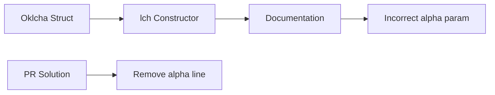

+++
title = "#20211 Fix Oklcha::lch docs by removing alpha argument"
date = "2025-07-20T00:00:00"
draft = false
template = "pull_request_page.html"
in_search_index = true

[taxonomies]
list_display = ["show"]

[extra]
current_language = "en"
available_languages = {"en" = { name = "English", url = "/pull_request/bevy/2025-07/pr-20211-en-20250720" }, "zh-cn" = { name = "中文", url = "/pull_request/bevy/2025-07/pr-20211-zh-cn-20250720" }}
labels = ["C-Docs", "A-Color"]
+++

### Fix Oklcha::lch docs by removing alpha argument

## Basic Information
- **Title**: Fix Oklcha::lch docs by removing alpha argument
- **PR Link**: https://github.com/bevyengine/bevy/pull/20211
- **Author**: emjomi
- **Status**: MERGED
- **Labels**: C-Docs, A-Color
- **Created**: 2025-07-20T13:52:29Z
- **Merged**: 2025-07-20T16:21:39Z
- **Merged By**: mockersf

## Description Translation
Fix Oklcha::lch docs by removing alpha argument

## The Story of This Pull Request

### The Problem and Context
The Oklcha::lch constructor function in Bevy's color system had a documentation inconsistency. The function's doc comment incorrectly listed an `alpha` parameter as part of its interface, despite the function only accepting three arguments: `lightness`, `chroma`, and `hue`. This discrepancy could mislead developers into believing the function accepted an alpha channel argument when it did not, potentially leading to incorrect usage or compilation errors.

The Oklcha color representation uses four components: lightness (L), chroma (C), hue (H), and alpha (A). However, the `lch` constructor is specifically designed as a convenience method that sets the alpha component to a default value of 1.0 (fully opaque). The documentation error stemmed from an earlier copy-paste mistake where the parameter list included alpha despite it not being part of the function's signature.

### The Solution Approach
The solution was straightforward: remove the incorrect documentation line referencing the non-existent `alpha` parameter. This required no code changes to the function implementation itself, only a correction to the doc comment. The approach maintains the existing functionality while ensuring documentation accuracy.

### The Implementation
The implementation consisted of a single-line deletion in the doc comment. The `lch` function itself remained unchanged as it correctly constructed the Oklcha instance with the provided lightness/chroma/hue values and a fixed alpha of 1.0:

```rust
pub const fn lch(lightness: f32, chroma: f32, hue: f32) -> Self {
    Self::new(lightness, chroma, hue, 1.0)
}
```

### Technical Insights
This change highlights the importance of maintaining accurate documentation, especially for public APIs. The Rust compiler uses doc comments not just for human-readable documentation but also for IDE tooltips and `cargo doc` outputs. Inconsistent documentation can cause:
1. Developer confusion about parameter requirements
2. Compilation errors if users attempt to pass extra parameters
3. Reduced trust in API documentation

The fix aligns the documentation with Rust's strong typing system - since the alpha parameter isn't in the function signature, it shouldn't appear in the parameter documentation.

### The Impact
This correction:
1. Prevents developer confusion about the Oklcha::lch interface
2. Maintains consistency with other color constructors in Bevy
3. Improves documentation reliability for the color module
4. Reduces potential support issues from incorrect API usage

## Visual Representation



## Key Files Changed
### `crates/bevy_color/src/oklcha.rs`
**Change Description**: Fixed documentation for Oklcha::lch constructor by removing incorrect reference to alpha parameter.

**Code Changes**:
```rust
// Before:
/// * `lightness` - Lightness channel. [0.0, 1.0]
/// * `chroma` - Chroma channel. [0.0, 1.0]
/// * `hue` - Hue channel. [0.0, 360.0]
/// * `alpha` - Alpha channel. [0.0, 1.0]
pub const fn lch(lightness: f32, chroma: f32, hue: f32) -> Self {
    Self::new(lightness, chroma, hue, 1.0)
}

// After:
/// * `lightness` - Lightness channel. [0.0, 1.0]
/// * `chroma` - Chroma channel. [0.0, 1.0]
/// * `hue` - Hue channel. [0.0, 360.0]
pub const fn lch(lightness: f32, chroma: f32, hue: f32) -> Self {
    Self::new(lightness, chroma, hue, 1.0)
}
```

**Relation to PR Purpose**: Directly implements the documentation fix by removing the misleading alpha parameter documentation.

## Further Reading
1. [Bevy Color Documentation](https://docs.rs/bevy_color/latest/bevy_color/)
2. [Oklch Color Space Explanation](https://evilmartians.com/chronicles/oklch-in-css-why-quit-it-and-how-to-use-it)
3. [Rust Documentation Guidelines](https://rust-lang.github.io/rfcs/1574-more-api-documentation-conventions.html)

## Full Code Diff
```diff
diff --git a/crates/bevy_color/src/oklcha.rs b/crates/bevy_color/src/oklcha.rs
index ba52a519ae1b7..4344cbca9bb45 100644
--- a/crates/bevy_color/src/oklcha.rs
+++ b/crates/bevy_color/src/oklcha.rs
@@ -60,7 +60,6 @@ impl Oklcha {
     /// * `lightness` - Lightness channel. [0.0, 1.0]
     /// * `chroma` - Chroma channel. [0.0, 1.0]
     /// * `hue` - Hue channel. [0.0, 360.0]
-    /// * `alpha` - Alpha channel. [0.0, 1.0]
     pub const fn lch(lightness: f32, chroma: f32, hue: f32) -> Self {
         Self::new(lightness, chroma, hue, 1.0)
     }
```