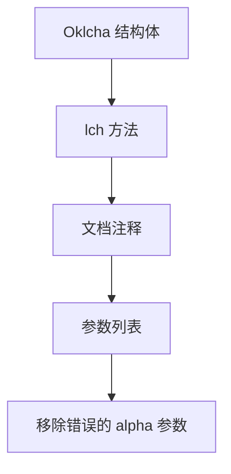

+++
title = "#20211 Fix Oklcha::lch docs by removing alpha argument"
date = "2025-07-20T00:00:00"
draft = false
template = "pull_request_page.html"
in_search_index = false

[extra]
current_language = "zh-cn"
available_languages = {"en" = { name = "English", url = "/pull_request/bevy/2025-07/pr-20211-en-20250720" }, "zh-cn" = { name = "中文", url = "/pull_request/bevy/2025-07/pr-20211-zh-cn-20250720" }}
labels = ["C-Docs", "A-Color"]
+++

# Fix Oklcha::lch docs by removing alpha argument

## Basic Information
- **Title**: Fix Oklcha::lch docs by removing alpha argument
- **PR Link**: https://github.com/bevyengine/bevy/pull/20211
- **Author**: emjomi
- **Status**: MERGED
- **Labels**: C-Docs, A-Color
- **Created**: 2025-07-20T13:52:29Z
- **Merged**: 2025-07-20T16:21:39Z
- **Merged By**: mockersf

## Description Translation
修复 Oklcha::lch 文档，移除 alpha 参数

## The Story of This Pull Request

### The Problem and Context
在 Bevy 引擎的颜色模块中，`Oklcha::lch` 函数的文档存在错误。该函数的 Rustdoc 注释错误地列出了四个参数（lightness、chroma、hue 和 alpha），但实际函数签名只有三个参数（lightness、chroma 和 hue）。这种文档与实现的不一致会导致以下问题：

1. 开发者阅读文档时会产生困惑，误以为需要提供 alpha 参数
2. 自动生成的 API 文档会显示错误的参数列表
3. IDE 的代码提示可能显示不准确的参数信息

这种文档错误属于技术债务，虽然不影响代码执行，但会降低代码的可读性和 API 的易用性。在颜色处理这种需要精确参数的领域，清晰的文档尤为重要。

### The Solution Approach
解决方案直接明了：修正文档注释使其与实际函数签名保持一致。具体做法是删除描述 alpha 参数的那行注释。由于问题仅限于文档层面，不需要修改任何实际代码逻辑。该修复方案具有以下优点：

1. 最小化变更范围，只修改注释行
2. 零风险，不影响现有功能
3. 保持函数原有行为不变

### The Implementation
实现集中在 `oklcha.rs` 文件中的 `lch` 函数文档注释。原始文档错误地包含了 alpha 参数描述：

```rust
/// * `lightness` - Lightness channel. [0.0, 1.0]
/// * `chroma` - Chroma channel. [0.0, 1.0]
/// * `hue` - Hue channel. [0.0, 360.0]
/// * `alpha` - Alpha channel. [0.0, 1.0]  // 这一行与实际参数不符
```

修复后移除了错误的 alpha 参数描述：

```rust
/// * `lightness` - Lightness channel. [0.0, 1.0]
/// * `chroma` - Chroma channel. [0.0, 1.0]
/// * `hue` - Hue channel. [0.0, 360.0]
```

函数实现保持不变，仍然通过 `Self::new` 设置 alpha 为默认值 1.0：

```rust
pub const fn lch(lightness: f32, chroma: f32, hue: f32) -> Self {
    Self::new(lightness, chroma, hue, 1.0)
}
```

### Technical Insights
这个修改展示了文档维护的重要原则：文档注释必须与对应函数的实际签名严格一致。在 Rust 生态中，`rustdoc` 工具会直接解析这些注释生成官方 API 文档，因此文档准确性直接影响开发者体验。

值得注意的技术细节：
1. 文档注释使用 `///` 语法，属于 Rust 的 doc comment 特性
2. 参数说明遵循 `* ` 的 Markdown 列表格式
3. 数值范围使用 `[0.0, 1.0]` 表示闭区间

### The Impact
这个 PR 虽然改动很小，但带来了明确的改进：
1. 消除了文档与实现的差异
2. 防止开发者尝试传递不存在的 alpha 参数
3. 保持 API 文档的准确性和专业性
4. 为后续贡献者提供了正确的代码示例

该修复被快速合并（2.5 小时内），表明其属于明确的技术债务清理，且维护团队重视文档质量。这类修复虽然简单，但对于维护大型开源项目的健康度至关重要。

## Visual Representation



## Key Files Changed

### `crates/bevy_color/src/oklcha.rs`
**修改原因**：修正函数文档与实现不一致的问题  
**修改内容**：删除 `lch` 函数文档中错误的 alpha 参数描述

```rust
// 修改前:
impl Oklcha {
    /// * `lightness` - Lightness channel. [0.0, 1.0]
    /// * `chroma` - Chroma channel. [0.0, 1.0]
    /// * `hue` - Hue channel. [0.0, 360.0]
    /// * `alpha` - Alpha channel. [0.0, 1.0]
    pub const fn lch(lightness: f32, chroma: f32, hue: f32) -> Self {
        Self::new(lightness, chroma, hue, 1.0)
    }
}

// 修改后:
impl Oklcha {
    /// * `lightness` - Lightness channel. [0.0, 1.0]
    /// * `chroma` - Chroma channel. [0.0, 1.0]
    /// * `hue` - Hue channel. [0.0, 360.0]
    pub const fn lch(lightness: f32, chroma: f32, hue: f32) -> Self {
        Self::new(lightness, chroma, hue, 1.0)
    }
}
```

## Further Reading
1. [Rust 文档注释指南](https://doc.rust-lang.org/rustdoc/how-to-write-documentation.html)
2. [Bevy 颜色系统文档](https://docs.rs/bevy_color/latest/bevy_color/)
3. [Oklch 颜色空间说明](https://evilmartians.com/chronicles/oklch-in-css-why-quit-rgb-hsl)
4. [Rust API 设计指南](https://rust-lang.github.io/api-guidelines/)