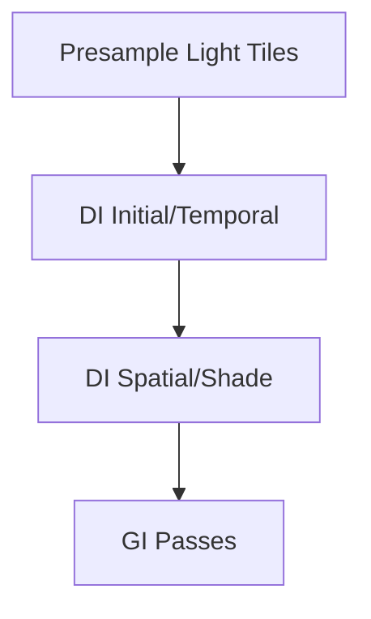

+++
title = "#20213 Solari light tiles"
date = "2025-07-22T00:00:00"
draft = false
template = "pull_request_page.html"
in_search_index = true

[taxonomies]
list_display = ["show"]

[extra]
current_language = "en"
available_languages = {"en" = { name = "English", url = "/pull_request/bevy/2025-07/pr-20213-en-20250722" }, "zh-cn" = { name = "中文", url = "/pull_request/bevy/2025-07/pr-20213-zh-cn-20250722" }}
labels = ["A-Rendering", "C-Performance", "D-Complex"]
+++

### Solari Light Tiles: Optimizing Raytraced Lighting Sampling

## Basic Information
- **Title**: Solari light tiles
- **PR Link**: https://github.com/bevyengine/bevy/pull/20213
- **Author**: JMS55
- **Status**: MERGED
- **Labels**: A-Rendering, C-Performance, S-Ready-For-Final-Review, D-Complex
- **Created**: 2025-07-20T18:37:55Z
- **Merged**: 2025-07-21T23:38:43Z
- **Merged By**: alice-i-cecile

## Description Translation
# Objective

- Biggest bottleneck in Solari by far is currently initial sampling for DI
- Cache usage is really poor randomly sampling different lights

## Solution

- Implement light tiles from https://cwyman.org/papers/hpg21_rearchitectingReSTIR.pdf
  - A new dispatch samples 128 blocks of 1024 samples each
  - Each DI workgroup randomly picks one of the 128 blocks
  - Each of the 32 initial samples for a thread randomly picks from within the 1024 samples in the block
  - This is much more cache coherent
- Refactored sampling.wgsl APIs to reduce redundant data loads, execution divergence, and allow supporting light tiles and in the future specular BRDFs
- Compacted LightSample and DI Reservoir struct sizes to reduce memory usage

## Testing

- Needs some performance testing on both NVIDIA/AMD hardware. Please upload before/after NSight/RGP captures!

## The Story of This Pull Request

The initial sampling pass for Direct Illumination (DI) in Solari was identified as the primary performance bottleneck. The existing implementation suffered from poor cache utilization due to completely random light sampling patterns across threads. Each thread independently generated random light samples, causing incoherent memory access patterns when loading light data from global memory.

To address this, we implemented light tiles based on the technique from ["ReSTIR GI: Path Resampling for Real-Time Path Tracing"](https://cwyman.org/papers/hpg21_rearchitectingReSTIR.pdf). The core idea is to precompute batches of light samples in cache-friendly blocks. Specifically:

1. A new compute pass (`presample_light_tiles`) generates 128 blocks of 1024 light samples each
2. During DI processing, each workgroup selects one random block
3. Each thread samples within its workgroup's block, ensuring coherent memory access

This required significant refactoring of the sampling APIs. We introduced a two-step sampling process: generate compact `LightSample` references during presampling, then resolve them to full `ResolvedLightSample` data during DI processing. This separation reduces redundant calculations and memory bandwidth:

```wgsl
// Before: Per-thread random generation
fn calculate_light_contribution() {
    let light_sample = generate_random_light_sample(rng);
    // Full light resolution every sample
}

// After: Presampled + resolution separation
fn presample_light_tiles() {
    // Store compact LightSample (8 bytes)
    light_tile_samples[i] = sample.light_sample; 
}

fn di_processing() {
    // Resolve on-demand
    let resolved = resolve_light_sample(light_sample);
}
```

We reduced struct sizes to minimize memory footprint:
- `LightSample` from 16 to 8 bytes (packing light/triangle IDs)
- `Reservoir` (DI) from 32 to 16 bytes by removing redundant fields
- Introduced packed `ResolvedLightSamplePacked` (24 bytes) using octahedral normals and RGB9E5 radiance

The temporal reservoir logic was modified to handle light ID translations between frames more efficiently by packing previous/current light IDs in a single uint:

```wgsl
// Before: vec2 for light/triangle IDs
struct LightSample {
    light_id: vec2<u32>, // 8 bytes
}

// After: packed uint
struct LightSample {
    light_id: u32, // 4 bytes (high 16b: light ID, low 16b: triangle ID)
}
```

Visibility tracing was optimized by moving it out of the sampling hot path and using ray direction vectors from resolved samples instead of recalculating positions. The new presampling pipeline integrates cleanly with the existing rendering workflow:



These changes significantly improve cache coherence during the initial sampling phase while reducing memory bandwidth requirements. The light tiles approach provides a foundation for future optimizations like specular BRDF sampling.

## Key Files Changed

### `crates/bevy_solari/src/realtime/presample_light_tiles.wgsl` (+55/-0)
New compute shader implementing light tile presampling. Generates 128 blocks of 1024 samples each.

```wgsl
@compute @workgroup_size(1024, 1, 1)
fn presample_light_tiles(...) {
    let tile_id = workgroup_id.x;
    let sample = generate_random_light_sample(&rng);
    light_tile_samples[i] = sample.light_sample;
    light_tile_resolved_samples[i] = pack_resolved_light_sample(...);
}
```

### `crates/bevy_solari/src/realtime/restir_di.wgsl` (+57/-42)
Modified DI shader to use presampled tiles and optimized sampling:

```wgsl
fn generate_initial_reservoir(...) -> Reservoir {
    let light_tile_start = rand_range_u(128u) * 1024u;
    for (var i = 0u; i < INITIAL_SAMPLES; i++) {
        let tile_sample = light_tile_start + rand_range_u(1024u, rng);
        let resolved = unpack_resolved_light_sample(...);
        // Process sample
    }
}
```

### `crates/bevy_solari/src/scene/sampling.wgsl` (+97/-102)
Refactored sampling API with resolution separation:

```wgsl
struct LightSample { light_id: u32 } // 8 bytes → 4 bytes

fn resolve_light_sample(sample: LightSample) -> ResolvedLightSample {
    // On-demand full resolution
}

fn calculate_resolved_light_contribution(resolved: ResolvedLightSample) {
    // Use precomputed data
}
```

### `crates/bevy_solari/src/realtime/node.rs` (+64/-74)
Added light tile pipelines and bindings:

```rust
// Added to bind group
BindGroupEntries::sequential((
    view_target,
    light_tile_samples,          // New
    light_tile_resolved_samples,  // New
    di_reservoirs_a,
    // ...
))

// Dispatch order
pass.set_pipeline(presample_light_tiles_pipeline);
pass.dispatch_workgroups(LIGHT_TILE_BLOCKS, 1, 1);

pass.set_pipeline(di_initial_and_temporal_pipeline);
pass.dispatch_workgroups(...);
```

### `crates/bevy_solari/src/realtime/prepare.rs` (+32/-3)
Added buffers for light tiles and adjusted struct sizes:

```rust
// New buffers
light_tile_samples: Buffer, 
light_tile_resolved_samples: Buffer,

// Size adjustments
const LIGHT_SAMPLE_STRUCT_SIZE: u64 = 8; // Was 16
const DI_RESERVOIR_STRUCT_SIZE: u64 = 16; // Was 32
```

## Further Reading
1. [ReSTIR GI: Path Resampling for Real-Time Path Tracing](https://cwyman.org/papers/hpg21_rearchitectingReSTIR.pdf) - Core light tiles technique
2. [Efficient Visibility Reuse for Real-time ReSTIR](https://yusuketokuyoshi.com/papers/2024/Efficient_Visibility_Reuse_for_Real-time_ReSTIR_(Supplementary_Document).pdf) - Visibility optimizations
3. [Ray Tracing Gems](https://www.realtimerendering.com/raytracinggems/) - Sampling techniques reference