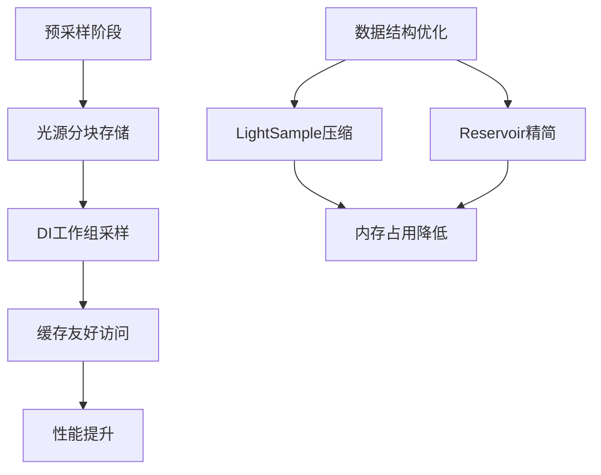

+++
title = "#20213 Solari light tiles"
date = "2025-07-22T00:00:00"
draft = false
template = "pull_request_page.html"
in_search_index = false

[extra]
current_language = "zh-cn"
available_languages = {"en" = { name = "English", url = "/pull_request/bevy/2025-07/pr-20213-en-20250722" }, "zh-cn" = { name = "中文", url = "/pull_request/bevy/2025-07/pr-20213-zh-cn-20250722" }}
+++

# Solari Light Tiles 技术分析报告

## 基本信息
- **标题**: Solari light tiles
- **PR链接**: https://github.com/bevyengine/bevy/pull/20213
- **作者**: JMS55
- **状态**: 已合并
- **标签**: A-Rendering, C-Performance, S-Ready-For-Final-Review, D-Complex
- **创建时间**: 2025-07-20T18:37:55Z
- **合并时间**: 2025-07-21T23:38:43Z
- **合并人**: alice-i-cecile

## 描述翻译
### 目标
- Solari 中最大的性能瓶颈是直接光照(DI)的初始采样阶段
- 随机采样不同光源时缓存利用率低下

### 解决方案
- 实现来自 https://cwyman.org/papers/hpg21_rearchitectingReSTIR.pdf 的光线分块(light tiles)技术
  - 新增调度步骤采样128个块，每块1024个样本
  - 每个DI工作组随机选择其中一个块
  - 每个线程的32个初始样本从块内的1024个样本中随机选取
  - 显著提高缓存一致性
- 重构 sampling.wgsl API，减少冗余数据加载和执行分支，支持光线分块和未来镜面BRDF
- 压缩 LightSample 和 DI Reservoir 结构体大小以减少内存占用

### 测试
- 需要在NVIDIA/AMD硬件上进行性能测试，请上传前后NSight/RGP分析数据

## PR技术分析

### 问题背景
Solari渲染器中直接光照(DI)的初始采样阶段存在严重性能瓶颈。随机采样不同光源导致缓存命中率低，内存访问模式效率低下。随着场景复杂度增加，这个问题成为主要性能限制因素。

### 解决方案
核心方案是实现光线分块技术：
1. **预采样阶段**：新增计算着色器预生成128×1024个光源样本
2. **缓存友好采样**：DI工作组从预采样块中随机选择，保证工作组内样本连续存储
3. **数据结构优化**：压缩关键结构体减少内存占用

### 实现细节

#### 1. 新增预采样管线(`presample_light_tiles.wgsl`)
```wgsl
@compute @workgroup_size(1024, 1, 1)
fn presample_light_tiles(...) {
    let tile_id = workgroup_id.x;
    let sample = generate_random_light_sample(&rng);
    
    let i = (tile_id * 1024u) + sample_index;
    light_tile_samples[i] = sample.light_sample;
    light_tile_resolved_samples[i] = pack_resolved_light_sample(...);
}
```
- 每个工作组生成1024个光源样本
- 使用紧凑数据结构存储样本信息

#### 2. 重构DI采样逻辑(`restir_di.wgsl`)
```wgsl
fn generate_initial_reservoir(...) -> Reservoir {
    let light_tile_start = rand_range_u(128u, &workgroup_rng) * 1024u;
    
    for (var i = 0u; i < INITIAL_SAMPLES; i++) {
        let tile_sample = light_tile_start + rand_range_u(1024u, rng);
        let resolved_light_sample = unpack_resolved_light_sample(...);
        // 使用预采样数据计算光照贡献
    }
}
```
- 工作组随机选择预采样块
- 线程从选定块内随机采样，提高缓存局部性

#### 3. 数据结构优化
**LightSample压缩**:
```wgsl
// 修改前: 16字节
struct LightSample {
    light_id: vec2<u32>, // 8字节
    random: vec2<f32>,   // 8字节
}

// 修改后: 8字节
struct LightSample {
    light_id: u32,  // 高16位光源ID，低16位三角形ID
    seed: u32,      // 随机种子
}
```

**Reservoir结构优化**:
```wgsl
// 修改前: 32字节
struct Reservoir {
    sample: LightSample, // 16字节
    weight_sum: f32,     // 4字节
    confidence_weight: f32, // 4字节
    unbiased_contribution_weight: f32, // 4字节
    visibility: f32,     // 4字节
}

// 修改后: 16字节
struct Reservoir {
    sample: LightSample, // 8字节
    confidence_weight: f32, // 4字节
    unbiased_contribution_weight: f32, // 4字节
}
```

#### 4. 管线调度重构(`node.rs`)
```rust
// 统一管线创建逻辑
let create_pipeline = |label, entry_point, shader| {
    pipeline_cache.queue_compute_pipeline(ComputePipelineDescriptor {
        label: Some(label.into()),
        layout: vec![scene_bindings.bind_group_layout.clone(), bind_group_layout.clone()],
        // ...
    })
};

// 新增预采样管线
presample_light_tiles_pipeline: create_pipeline(...),
```

#### 5. 新增缓冲区(`prepare.rs`)
```rust
// 预采样缓冲区
let light_tile_samples = render_device.create_buffer(...);
let light_tile_resolved_samples = render_device.create_buffer(...);
```

### 性能影响
1. **缓存优化**：将随机光源访问转换为块内连续访问，提高缓存命中率
2. **内存占用减少**：
   - LightSample 从16字节减至8字节
   - Reservoir 从32字节减至16字节
   - 128×1024样本缓冲区节省约50%内存
3. **执行效率**：减少冗余计算和分支，为未来扩展奠定基础

### 潜在风险
1. 预采样增加额外计算开销
2. 光源ID编码依赖16位限制（最多65536光源）
3. 三角形ID限制为65535/光源

## 关键文件变更

### `crates/bevy_solari/src/realtime/presample_light_tiles.wgsl` (新增)
```wgsl
@compute @workgroup_size(1024, 1, 1)
fn presample_light_tiles(...) {
    // 预采样光源数据并打包存储
}
```
- 新增预采样计算着色器
- 实现光源样本的紧凑存储格式

### `crates/bevy_solari/src/realtime/restir_di.wgsl`
```wgsl
// 修改后采样逻辑
fn generate_initial_reservoir(...) {
    let light_tile_start = ...; // 选择预采样块
    let tile_sample = light_tile_start + ...; // 块内随机采样
}
```
- DI初始采样改用预采样数据
- 重构光照贡献计算逻辑

### `crates/bevy_solari/src/scene/sampling.wgsl`
```wgsl
// 结构体优化
struct LightSample {
    light_id: u32,
    seed: u32,
}

// 新增解析方法
fn resolve_light_sample(...) -> ResolvedLightSample {
    // 统一处理方向光和网格光
}
```
- 压缩关键数据结构
- 统一光源解析接口
- 优化可见性检测逻辑

### `crates/bevy_solari/src/realtime/node.rs`
```rust
// 管线创建重构
let create_pipeline = |...| { ... };

// 新增预采样管线
presample_light_tiles_pipeline: create_pipeline(...),
```
- 统一管线创建模式
- 添加预采样管线调度
- 扩展绑定组包含新缓冲区

### `crates/bevy_solari/src/realtime/prepare.rs`
```rust
// 新增缓冲区
let light_tile_samples = render_device.create_buffer(...);
let light_tile_resolved_samples = render_device.create_buffer(...);
```
- 创建预采样存储缓冲区
- 定义块大小常量(128块×1024样本/块)

## 技术图示



## 延伸阅读
1. [Re-architecting ReSTIR for Real-time Path Tracing](https://cwyman.org/papers/hpg21_rearchitectingReSTIR.pdf)
2. [Efficient Visibility Reuse for Real-time ReSTIR](https://yusuketokuyoshi.com/papers/2024/Efficient_Visibility_Reuse_for_Real-time_ReSTIR_(Supplementary_Document).pdf)
3. [Ray Tracing Gems - Sampling Techniques](https://www.realtimerendering.com/raytracinggems/)