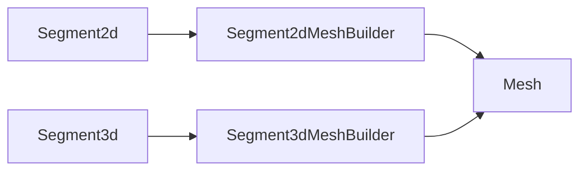

+++
title = "#20214 Make line segments meshable"
date = "2025-07-22T00:00:00"
draft = false
template = "pull_request_page.html"
in_search_index = true

[taxonomies]
list_display = ["show"]

[extra]
current_language = "en"
available_languages = {"en" = { name = "English", url = "/pull_request/bevy/2025-07/pr-20214-en-20250722" }, "zh-cn" = { name = "中文", url = "/pull_request/bevy/2025-07/pr-20214-zh-cn-20250722" }}
labels = ["D-Trivial", "A-Rendering"]
+++

## Make line segments meshable

### Basic Information
- **Title**: Make line segments meshable
- **PR Link**: https://github.com/bevyengine/bevy/pull/20214
- **Author**: tychedelia
- **Status**: MERGED
- **Labels**: D-Trivial, A-Rendering, S-Ready-For-Final-Review
- **Created**: 2025-07-20T21:32:34Z
- **Merged**: 2025-07-21T23:40:20Z
- **Merged By**: alice-i-cecile

### Description Translation
**Objective**  
Line segments aren't meshable.  

**Solution**  
Make line segments meshable.

### The Story of This Pull Request
Line segments were previously missing mesh generation capabilities in Bevy's rendering system. This created a gap where developers couldn't directly convert mathematical representations of line segments into renderable mesh assets. The PR addresses this by implementing the `Meshable` trait for both 2D and 3D line segments, enabling their direct conversion to mesh assets.

The solution introduces dedicated mesh builders for segment primitives. For 2D segments, the implementation was added to the existing 2D primitives module, while 3D segments required a new module due to Bevy's dimensional separation of primitive implementations. Both implementations follow the same core approach: representing segments as two vertices connected by a single line in a line list topology.

The mesh builders create minimal mesh representations containing only position attributes and two indices. This approach efficiently represents line segments while maintaining consistency with Bevy's existing primitive mesh generation patterns. The implementation avoids unnecessary complexity by not generating normals or UVs since they're irrelevant for basic line rendering.

Default implementations were added to the math primitives to support predictable initialization patterns. Tests validate that the generated meshes contain exactly two vertices and two indices, ensuring correct mesh generation. The changes integrate cleanly with Bevy's existing primitive mesh generation system without requiring modifications to core mesh handling logic.

### Visual Representation


### Key Files Changed

1. **crates/bevy_mesh/src/primitives/dim3/segment3d.rs** (+45/-0)  
Added new module implementing 3D segment mesh generation. Creates a line list mesh with exactly two vertices.

```rust
impl MeshBuilder for Segment3dMeshBuilder {
    fn build(&self) -> Mesh {
        let positions: Vec<_> = self.segment.vertices.into();
        let indices = Indices::U32(vec![0, 1]);

        Mesh::new(PrimitiveTopology::LineList, RenderAssetUsages::default())
            .with_inserted_indices(indices)
            .with_inserted_attribute(Mesh::ATTRIBUTE_POSITION, positions)
    }
}
```

2. **crates/bevy_mesh/src/primitives/dim2.rs** (+41/-1)  
Added 2D segment mesh generation to existing 2D primitives module.

```rust
impl MeshBuilder for Segment2dMeshBuilder {
    fn build(&self) -> Mesh {
        let positions = self.segment.vertices.map(|v| v.extend(0.0)).to_vec();
        let indices = Indices::U32(vec![0, 1]);

        Mesh::new(PrimitiveTopology::LineList, RenderAssetUsages::default())
            .with_inserted_attribute(Mesh::ATTRIBUTE_POSITION, positions)
            .with_inserted_indices(indices)
    }
}
```

3. **crates/bevy_math/src/primitives/dim2.rs** (+9/-0)  
Added default implementation for 2D segments to support initialization.

```rust
impl Default for Segment2d {
    fn default() -> Self {
        Self {
            vertices: [Vec2::new(0.0, 0.0), Vec2::new(1.0, 0.0)],
        }
    }
}
```

4. **crates/bevy_math/src/primitives/dim3.rs** (+9/-0)  
Added default implementation for 3D segments.

```rust
impl Default for Segment3d {
    fn default() -> Self {
        Self {
            vertices: [Vec3::new(0.0, 0.0, 0.0), Vec3::new(1.0, 0.0, 0.0)],
        }
    }
}
```

5. **crates/bevy_mesh/src/primitives/dim3/mod.rs** (+1/-0)  
Integrated the new segment3d module into the 3D primitives.

```rust
mod segment3d;
```

### Further Reading
1. [Bevy Mesh Documentation](https://docs.rs/bevy_mesh/latest/bevy_mesh/)  
2. [Primitive Topologies in Computer Graphics](https://learn.microsoft.com/en-us/windows/win32/direct3d11/d3d10-graphics-programming-guide-primitive-topologies)  
3. [Bevy Render Asset System](https://bevyengine.org/learn/book/next/assets/)