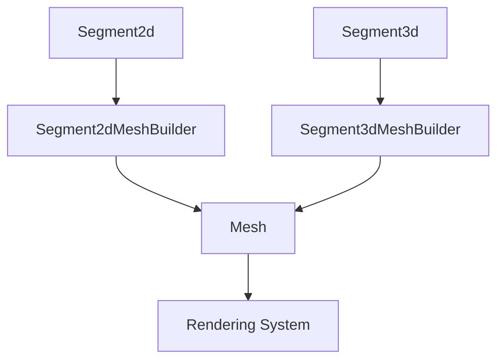

+++
title = "#20214 Make line segments meshable"
date = "2025-07-22T00:00:00"
draft = false
template = "pull_request_page.html"
in_search_index = false

[extra]
current_language = "zh-cn"
available_languages = {"en" = { name = "English", url = "/pull_request/bevy/2025-07/pr-20214-en-20250722" }, "zh-cn" = { name = "中文", url = "/pull_request/bevy/2025-07/pr-20214-zh-cn-20250722" }}
+++

### 标题
线段网格化功能实现分析

### 基本信息
- **标题**: Make line segments meshable
- **PR链接**: https://github.com/bevyengine/bevy/pull/20214
- **作者**: tychedelia
- **状态**: 已合并
- **标签**: D-Trivial, A-Rendering, S-Ready-For-Final-Review
- **创建时间**: 2025-07-20T21:32:34Z
- **合并时间**: 2025-07-21T23:40:20Z
- **合并者**: alice-i-cecile

### 描述翻译
#### 目标 (Objective)

线段不能被网格化。

#### 解决方案 (Solution)

使线段能够被网格化。

### 本PR的技术实现分析

#### 问题背景
在Bevy引擎中，线段（line segments）作为基础图元（primitives）存在，但缺乏直接转换为可渲染网格（mesh）的能力。这导致开发者无法像处理其他几何图元（如矩形、圆形）那样直接使用线段进行渲染。该PR的目标是填补这个功能空白，使`Segment2d`和`Segment3d`类型能够生成对应的网格数据。

#### 实现方案
实现方案集中在两个核心修改：
1. 为数学图元添加默认实现
2. 为线段类型实现`Meshable` trait

在数学模块（`bevy_math`）中，为`Segment2d`和`Segment3d`添加了`Default` trait实现，提供标准化的默认端点坐标。在网格模块（`bevy_mesh`）中，实现了`Meshable` trait和相关构建器，将线段转换为由两个顶点和一条边组成的网格。

#### 关键技术实现
**2D线段网格化**：
```rust
// Segment2dMeshBuilder实现
impl MeshBuilder for Segment2dMeshBuilder {
    fn build(&self) -> Mesh {
        let positions = self.segment.vertices.map(|v| v.extend(0.0)).to_vec();
        let indices = Indices::U32(vec![0, 1]);

        Mesh::new(PrimitiveTopology::LineList, RenderAssetUsages::default())
            .with_inserted_attribute(Mesh::ATTRIBUTE_POSITION, positions)
            .with_inserted_indices(indices)
    }
}
```
这里采用`LineList`图元拓扑，直接使用线段的两个端点作为顶点，创建包含两个索引（0和1）的索引缓冲区。

**3D线段网格化**：
```rust
// Segment3dMeshBuilder实现
impl MeshBuilder for Segment3dMeshBuilder {
    fn build(&self) -> Mesh {
        let positions: Vec<_> = self.segment.vertices.into();
        let indices = Indices::U32(vec![0, 1]);

        Mesh::new(PrimitiveTopology::LineList, RenderAssetUsages::default())
            .with_inserted_indices(indices)
            .with_inserted_attribute(Mesh::ATTRIBUTE_POSITION, positions)
    }
}
```
3D实现类似，但直接使用Vec3坐标，无需坐标扩展。

#### 测试保障
为3D线段添加了基础测试：
```rust
#[test]
fn segment3d_mesh_builder() {
    let segment = Segment3d::new(Vec3::ZERO, Vec3::X);
    let mesh = segment.mesh().build();
    assert_eq!(mesh.attribute(Mesh::ATTRIBUTE_POSITION).unwrap().len(), 2);
    assert_eq!(mesh.indices().unwrap().len(), 2);
}
```
验证生成的网格包含正确的顶点数和索引数。

#### 影响分析
1. **API一致性**：线段现在与其他图元（矩形/圆形等）具有相同的`mesh()`方法
2. **渲染能力**：开发者可直接将线段转换为可渲染网格
3. **资源消耗**：每个线段仅需2个顶点和2个索引，内存开销最小化
4. **拓扑选择**：使用`LineList`而非`LineStrip`确保线段独立性

### 组件关系图



### 关键文件变更

1. **`crates/bevy_mesh/src/primitives/dim3/segment3d.rs`** (新增)
   ```rust
   // 3D线段网格构建器实现
   impl MeshBuilder for Segment3dMeshBuilder {
       fn build(&self) -> Mesh {
           let positions: Vec<_> = self.segment.vertices.into();
           let indices = Indices::U32(vec![0, 1]);
   
           Mesh::new(PrimitiveTopology::LineList, RenderAssetUsages::default())
               .with_inserted_indices(indices)
               .with_inserted_attribute(Mesh::ATTRIBUTE_POSITION, positions)
       }
   }
   ```

2. **`crates/bevy_mesh/src/primitives/dim2.rs`** 
   ```diff
   + impl Meshable for Segment2d {
   +     type Output = Segment2dMeshBuilder;
   +
   +     fn mesh(&self) -> Self::Output {
   +         Segment2dMeshBuilder::new(*self)
   +     }
   + }
   ```

3. **`crates/bevy_math/src/primitives/dim2.rs`**
   ```rust
   // 添加默认端点实现
   impl Default for Segment2d {
       fn default() -> Self {
           Self {
               vertices: [Vec2::new(0.0, 0.0), Vec2::new(1.0, 0.0)],
           }
       }
   }
   ```

4. **`crates/bevy_math/src/primitives/dim3.rs`**
   ```rust
   // 3D线段默认实现
   impl Default for Segment3d {
       fn default() -> Self {
           Self {
               vertices: [Vec3::new(0.0, 0.0, 0.0), Vec3::new(1.0, 0.0, 0.0)],
           }
       }
   }
   ```

5. **`crates/bevy_mesh/src/primitives/dim3/mod.rs`**
   ```diff
   + mod segment3d;
   ```

### 进一步阅读
1. [Bevy图元文档](https://docs.rs/bevy/latest/bevy/math/primitives/index.html)
2. [Meshable trait设计](https://github.com/bevyengine/bevy/blob/main/crates/bevy_mesh/src/mesh/mod.rs)
3. [图元拓扑类型](https://docs.rs/wgpu/latest/wgpu/enum.PrimitiveTopology.html)
4. [Bevy渲染管线](https://bevy-cheatbook.github.io/pipeline.html)