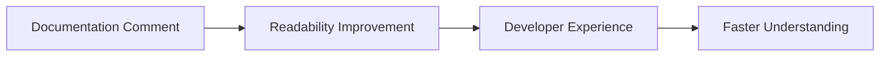

+++
title = "#20217 Fixing Minor Sentence Structure Mistake in Events Example Docs"
date = "2025-07-21T00:00:00"
draft = false
template = "pull_request_page.html"
in_search_index = true

[taxonomies]
list_display = ["show"]

[extra]
current_language = "en"
available_languages = {"en" = { name = "English", url = "/pull_request/bevy/2025-07/pr-20217-en-20250721" }, "zh-cn" = { name = "中文", url = "/pull_request/bevy/2025-07/pr-20217-zh-cn-20250721" }}
labels = ["C-Docs", "D-Trivial", "A-ECS", "C-Examples"]
+++

## Fixing Minor Sentence Structure Mistake in Events Example Docs

### Basic Information
- **Title**: Fixing Minor Sentence Structure Mistake in Events Example Docs
- **PR Link**: https://github.com/bevyengine/bevy/pull/20217
- **Author**: Carter0
- **Status**: MERGED
- **Labels**: C-Docs, D-Trivial, A-ECS, C-Examples, S-Ready-For-Final-Review
- **Created**: 2025-07-21T01:18:22Z
- **Merged**: 2025-07-21T06:32:21Z
- **Merged By**: mockersf

### Description Translation
This PR fixes a minor sentence structure mistake in the Events Example documentation.

### The Story of This Pull Request

The PR addresses a grammatical issue in the introductory comments of Bevy's event system example. The original documentation comment contained a minor structural flaw that made the sentence slightly awkward to read. While this didn't affect code functionality, it created a small but noticeable friction point for developers reading the documentation.

The author identified that the opening sentence used "showing" instead of "demonstrates" and had an awkward "how to you might" construction. These issues made the documentation less clear than it could be, especially for developers new to Bevy's event system.

The solution was straightforward: replace "showing" with "demonstrates" and rephrase "how to you might" to the cleaner "how to". This maintains all technical accuracy while improving readability. The changes were minimal, affecting only two lines in the documentation comment.

The implementation required no complex engineering decisions since it was purely a documentation improvement. The author preserved all technical content while making the wording more natural. This change enhances the developer experience by making the documentation more professional and easier to understand, especially for those learning Bevy's event system.

The impact is primarily on documentation quality. While the code functionality remains unchanged, the improved phrasing helps developers more quickly grasp the purpose of the example. This is particularly valuable since the event system example demonstrates important ECS patterns like event handling and system ordering.



### Key Files Changed

**File:** `examples/ecs/event.rs`  
**Changes:** Minor grammatical improvements to documentation comment  

```rust
// Before:
//! This example shows how to send, mutate, and receive, events. As well as showing
//! how to you might control system ordering so that events are processed in a specific order.

// After:
//! This example shows how to send, mutate, and receive, events. It also demonstrates
//! how to control system ordering so that events are processed in a specific order.
```

The changes:
1. Replaced "As well as showing" with "It also demonstrates" for better sentence structure
2. Removed "you might" from "how to you might control" for clearer instruction
3. Maintained all technical content while improving readability

### Further Reading
- [Bevy Events Documentation](https://bevyengine.org/learn/book/getting-started/events/)
- [Bevy ECS Introduction](https://bevyengine.org/learn/book/getting-started/ecs/)
- [Rust Documentation Best Practices](https://doc.rust-lang.org/rustdoc/how-to-write-documentation.html)