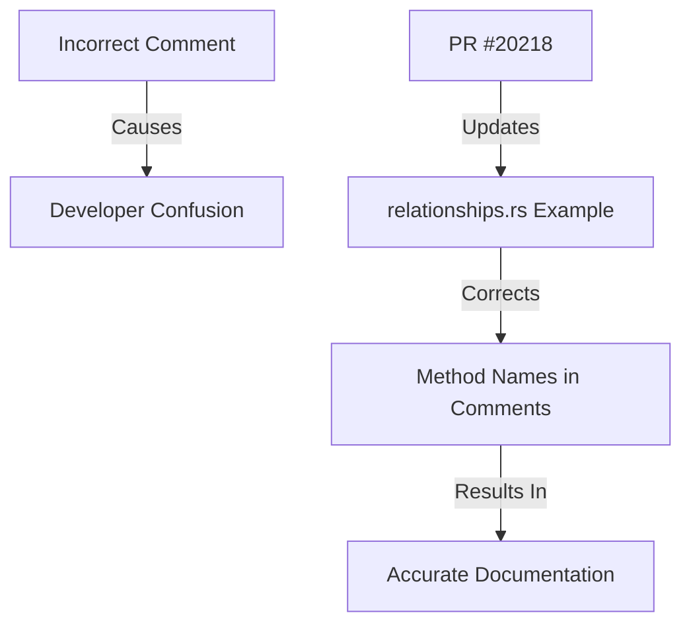

+++
title = "#20218 Fix relationship method names in comments"
date = "2025-07-21T00:00:00"
draft = false
template = "pull_request_page.html"
in_search_index = true

[taxonomies]
list_display = ["show"]

[extra]
current_language = "en"
available_languages = {"en" = { name = "English", url = "/pull_request/bevy/2025-07/pr-20218-en-20250721" }, "zh-cn" = { name = "中文", url = "/pull_request/bevy/2025-07/pr-20218-zh-cn-20250721" }}
labels = ["C-Docs", "D-Trivial", "A-ECS"]
+++

## Fix relationship method names in comments

### Basic Information
- **Title**: Fix relationship method names in comments
- **PR Link**: https://github.com/bevyengine/bevy/pull/20218
- **Author**: shunkie
- **Status**: MERGED
- **Labels**: C-Docs, D-Trivial, A-ECS, S-Ready-For-Final-Review
- **Created**: 2025-07-21T06:24:15Z
- **Merged**: 2025-07-21T07:43:25Z
- **Merged By**: mockersf

### Description Translation
The original PR description is in English, so we preserve it exactly as-is:

```
Fix relationship method names in comments

Fix the relationship helper method names in the comments of the `relationships` example.

The method names in the comments were incorrect. The correct method names are `with_related` and `with_related_entities`, not `with_related` and `with_relationships`.

This PR updates the comments to match the actual method names.

No functional changes.
```

### The Story of This Pull Request

#### The Problem and Context
The `relationships.rs` example in Bevy's ECS module contained incorrect documentation in its comments. Specifically, the example described two relationship helper methods on `EntityCommands`: `with_related` and `with_relationships`. However, the actual API only provides `with_related` and `with_related_entities`. This discrepancy created potential confusion for developers using the example as reference material.

The problem was identified as a documentation error - while the example code itself was functionally correct, the accompanying comments contained inaccurate method names. This type of inconsistency is particularly problematic in examples, which serve as learning resources and reference implementations for developers working with Bevy's ECS relationships API.

#### The Solution Approach
The solution was straightforward: update the comments to reflect the actual method names in the API. The developer identified two instances where the incorrect method name `with_relationships` appeared in comments and replaced them with the correct `with_related_entities` name. Since this was purely a documentation fix, no functional changes were needed.

#### The Implementation
The implementation consisted of two simple comment updates in the `relationships.rs` example file. The first change corrected the overview comment describing the available helper methods, while the second change fixed the specific example demonstrating relationship creation.

#### Technical Insights
This fix highlights the importance of maintaining consistency between API documentation and actual implementation. Even minor discrepancies in examples can create confusion and friction for developers learning a new system. The relationship methods (`with_related` and `with_related_entities`) are part of Bevy's Entity Command API, which provides a builder pattern for configuring entities and their relationships.

#### The Impact
This correction improves the developer experience by ensuring the example's documentation accurately reflects the API. Developers studying this example will now see the correct method names, reducing confusion and potential errors when implementing relationships in their own projects. While a small change, it contributes to the overall quality and reliability of Bevy's documentation ecosystem.

### Visual Representation



### Key Files Changed

#### `examples/ecs/relationships.rs`
This file contains the ECS relationships example. The changes fix incorrect method names in comments to match the actual API.

**Changes:**
```rust
// Before:
// The `with_related` and `with_relationships` helper methods on `EntityCommands`...
// The `with_relationships` method will automatically add...

// After:
// The `with_related` and `with_related_entities` helper methods on `EntityCommands`...
// The `with_related_entities` method will automatically add...
```

**Full diff:**
```diff
diff --git a/examples/ecs/relationships.rs b/examples/ecs/relationships.rs
index 5b855164283af..c8dc7f9b8b043 100644
--- a/examples/ecs/relationships.rs
+++ b/examples/ecs/relationships.rs
@@ -53,12 +53,12 @@ fn main() {
         // Relations are just components, so we can add them into the bundle that we're spawning.
         let bob = commands.spawn((Name::new("Bob"), Targeting(alice))).id();
 
-        // The `with_related` and `with_relationships` helper methods on `EntityCommands` can be used to add relations in a more ergonomic way.
+        // The `with_related` and `with_related_entities` helper methods on `EntityCommands` can be used to add relations in a more ergonomic way.
         let charlie = commands
             .spawn((Name::new("Charlie"), Targeting(bob)))
             // The `with_related` method will spawn a bundle with `Targeting` relationship
             .with_related::<Targeting>(Name::new("James"))
-            // The `with_relationships` method will automatically add the `Targeting` component to any entities spawned within the closure,
+            // The `with_related_entities` method will automatically add the `Targeting` component to any entities spawned within the closure,
             // targeting the entity that we're calling `with_related` on.
             .with_related_entities::<Targeting>(|related_spawner_commands| {
                 // We could spawn multiple entities here, and they would all target `charlie`.
```

### Further Reading
1. [Bevy ECS Relationships Documentation](https://docs.rs/bevy/latest/bevy/ecs/relationship/index.html)
2. [EntityCommands API Reference](https://docs.rs/bevy/latest/bevy/ecs/system/struct.EntityCommands.html)
3. [Original Relationships Example](https://github.com/bevyengine/bevy/blob/main/examples/ecs/relationships.rs)