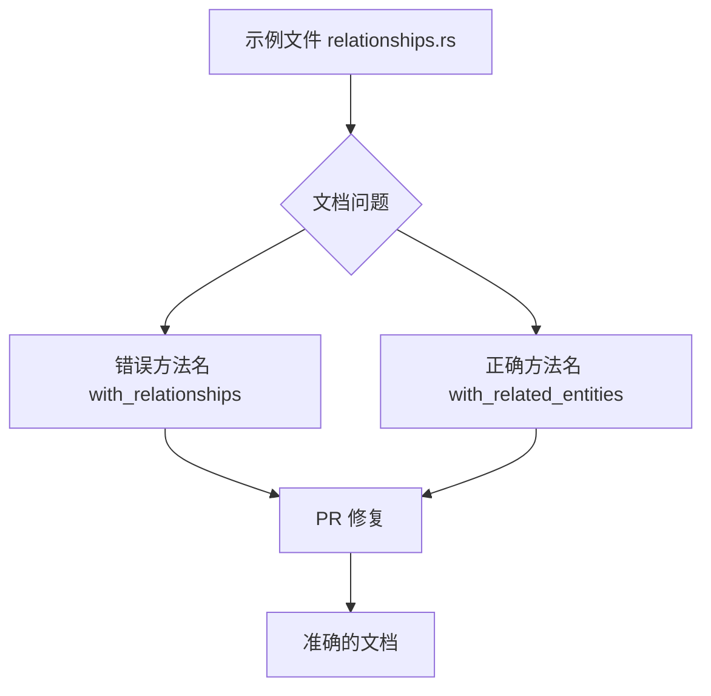

+++
title = "#20218 Fix relationship method names in comments"
date = "2025-07-21T00:00:00"
draft = false
template = "pull_request_page.html"
in_search_index = false

[extra]
current_language = "zh-cn"
available_languages = {"en" = { name = "English", url = "/pull_request/bevy/2025-07/pr-20218-en-20250721" }, "zh-cn" = { name = "中文", url = "/pull_request/bevy/2025-07/pr-20218-zh-cn-20250721" }}
labels = ["C-Docs", "D-Trivial", "A-ECS"]
+++

# Fix relationship method names in comments (PR #20218)

## Basic Information
- **Title**: Fix relationship method names in comments
- **PR Link**: https://github.com/bevyengine/bevy/pull/20218
- **Author**: shunkie
- **Status**: MERGED
- **Labels**: C-Docs, D-Trivial, A-ECS, S-Ready-For-Final-Review
- **Created**: 2025-07-21T06:24:15Z
- **Merged**: 2025-07-21T07:43:25Z
- **Merged By**: mockersf

## Description Translation
修复注释中的关系方法名称

## The Story of This Pull Request

### 问题背景
在 Bevy 引擎的 ECS 关系示例文件 (`relationships.rs`) 中，存在两处文档注释错误。这些注释错误地引用了名为 `with_relationships` 的方法，而实际存在的方法名为 `with_related_entities`。这种不一致会导致开发者在查阅示例代码时产生困惑，可能错误地尝试使用不存在的方法，影响学习效率和代码可维护性。

### 解决方案
PR 采用直接修复方法：将注释中错误的方法引用 `with_relationships` 更正为正确的 `with_related_entities`。同时优化了相关注释的表述，使其更准确地反映实际 API 的使用方式。

### 具体实现
修改集中在示例文件的文档注释部分，不涉及实际逻辑代码变更。原始注释错误地将两个相关方法描述为：
```rust
// The `with_related` and `with_relationships` helper methods...
// The `with_relationships` method will automatically...
```
这存在两个问题：
1. `with_relationships` 是错误的方法名（实际应为 `with_related_entities`）
2. 描述未清晰区分两种方法的用途

修正后的注释：
```rust
// The `with_related` and `with_related_entities` helper methods...
// The `with_related_entities` method will automatically...
```
关键改进：
- 方法名更正为实际存在的 `with_related_entities`
- 保持方法功能描述不变但使用正确术语
- 维持原有代码格式和注释结构

### 技术影响
1. **准确性提升**：消除文档与实际 API 的差异
2. **开发者体验优化**：避免用户因错误方法名导致的困惑
3. **维护成本降低**：保持示例代码与核心 API 同步

这类文档修正虽小但重要，确保示例代码作为学习资源的可靠性。在 ECS 系统中，`with_related` 和 `with_related_entities` 是建立实体关系的关键 API，准确的文档有助于用户正确理解 Bevy 的关系模型。

## Visual Representation



## Key Files Changed

### 文件: examples/ecs/relationships.rs
**变更描述**：修复两处文档注释中的方法名称错误

**代码变更**：
```rust
// Before:
// The `with_related` and `with_relationships` helper methods...
// The `with_relationships` method will automatically...

// After:
// The `with_related` and `with_related_entities` helper methods...
// The `with_related_entities` method will automatically...
```

**关联性**：这是 PR 的唯一变更，直接解决文档与 API 实际名称不一致的问题。

## Further Reading
1. [Bevy ECS 关系官方文档](https://bevyengine.org/learn/book/ecs-relationships)
2. [EntityCommands API 参考](https://docs.rs/bevy/latest/bevy/ecs/system/struct.EntityCommands.html)
3. [Bevy 示例代码指南](https://github.com/bevyengine/bevy/blob/main/examples/README.md)

## Full Code Diff
```diff
diff --git a/examples/ecs/relationships.rs b/examples/ecs/relationships.rs
index 5b855164283af..c8dc7f9b8b043 100644
--- a/examples/ecs/relationships.rs
+++ b/examples/ecs/relationships.rs
@@ -53,12 +53,12 @@ fn main() {
         // Relations are just components, so we can add them into the bundle that we're spawning.
         let bob = commands.spawn((Name::new("Bob"), Targeting(alice))).id();
 
-        // The `with_related` and `with_relationships` helper methods on `EntityCommands` can be used to add relations in a more ergonomic way.
+        // The `with_related` and `with_related_entities` helper methods on `EntityCommands` can be used to add relations in a more ergonomic way.
         let charlie = commands
             .spawn((Name::new("Charlie"), Targeting(bob)))
             // The `with_related` method will spawn a bundle with `Targeting` relationship
             .with_related::<Targeting>(Name::new("James"))
-            // The `with_relationships` method will automatically add the `Targeting` component to any entities spawned within the closure,
+            // The `with_related_entities` method will automatically add the `Targeting` component to any entities spawned within the closure,
             // targeting the entity that we're calling `with_related` on.
             .with_related_entities::<Targeting>(|related_spawner_commands| {
                 // We could spawn multiple entities here, and they would all target `charlie`.
```