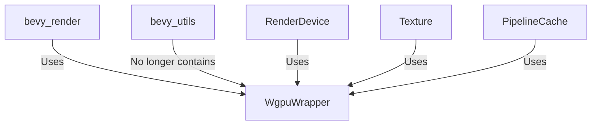

+++
title = "#20220 revert #19303, moving `WgpuWrapper` out of `bevy_utils`"
date = "2025-07-21T00:00:00"
draft = false
template = "pull_request_page.html"
in_search_index = true

[taxonomies]
list_display = ["show"]

[extra]
current_language = "en"
available_languages = {"en" = { name = "English", url = "/pull_request/bevy/2025-07/pr-20220-en-20250721" }, "zh-cn" = { name = "中文", url = "/pull_request/bevy/2025-07/pr-20220-zh-cn-20250721" }}
labels = ["D-Trivial", "A-Rendering", "C-Code-Quality"]
+++

### Revert #19303: Moving `WgpuWrapper` Back to `bevy_render`

#### Basic Information
- **Title**: revert #19303, moving `WgpuWrapper` out of `bevy_utils`
- **PR Link**: https://github.com/bevyengine/bevy/pull/20220
- **Author**: atlv24
- **Status**: MERGED
- **Labels**: D-Trivial, A-Rendering, C-Code-Quality, S-Ready-For-Final-Review
- **Created**: 2025-07-21T07:39:52Z
- **Merged**: 2025-07-21T23:43:35Z
- **Merged By**: alice-i-cecile

#### Description
- The changes from #19303 weren't necessary for `bevy_camera` since a better solution was found
- The original refactor was good but `WgpuWrapper` belongs in `bevy_render`
- Solution: Move the extracted file back to `bevy_render`
- Testing: Confirmed the code compiles successfully

---

### The Story of This Pull Request

This PR addresses a code organization issue introduced by #19303, which moved the `WgpuWrapper` utility from `bevy_render` to `bevy_utils`. While the original refactor was technically sound, further development revealed that `bevy_camera` didn't actually require this change. More importantly, the `WgpuWrapper` type is intrinsically tied to rendering operations, making `bevy_render` its natural home. Keeping it in `bevy_utils` added unnecessary complexity to the dependency graph without providing clear benefits.

The solution is straightforward: revert the file movement and update all import paths. This involves:
1. Physically moving `wgpu_wrapper.rs` back to `bevy_render/src/`
2. Removing the `wgpu_wrapper` feature flag from `bevy_utils`
3. Updating 14 import paths across the rendering system
4. Adjusting Cargo.toml dependencies to reflect the new structure

The key insight here is maintaining clean architectural boundaries. `WgpuWrapper` exists solely to wrap `wgpu` types in thread-safe containers (specifically `Arc<wgpu::Instance>` and `Arc<wgpu::Adapter>`). Since these types are only used within the rendering subsystem, co-locating them with rendering logic simplifies dependency management and improves code discoverability.

Here's how the import path changed in `render_device.rs`:

```rust
// Before:
use bevy_utils::WgpuWrapper;

// After:
use crate::WgpuWrapper;
```

This change eliminates cross-crate dependencies that served no practical purpose. The `bevy_utils` crate no longer needs platform-specific conditional dependencies for `send_wrapper`, which were only required to support `WgpuWrapper`. This reduces compile-time complexity and feature flag overhead.

The PR demonstrates good code hygiene by:
- Reverting unnecessary abstractions
- Keeping rendering-specific utilities in the rendering crate
- Minimizing cross-crate dependencies
- Maintaining clear module boundaries

#### Visual Representation



#### Key Files Changed

1. **`crates/bevy_render/Cargo.toml`**  
   Removed unnecessary feature flag from `bevy_utils` dependency and added direct `send_wrapper` dependency:

```toml
# Before:
bevy_utils = { path = "../bevy_utils", version = "0.17.0-dev", features = ["wgpu_wrapper"] }

# After:
bevy_utils = { path = "../bevy_utils", version = "0.17.0-dev" }

[target.'cfg(all(target_arch = "wasm32", target_feature = "atomics"))'.dependencies]
send_wrapper = { version = "0.6.0" }
```

2. **`crates/bevy_utils/Cargo.toml`**  
   Removed obsolete feature and dependencies:

```toml
# Before:
[features]
wgpu_wrapper = ["dep:send_wrapper"]

[target.'cfg(all(target_arch = "wasm32", target_feature = "atomics"))'.dependencies]
send_wrapper = { version = "0.6.0", optional = true }

# After:
[features]
# (wgpu_wrapper feature removed)
```

3. **`crates/bevy_render/src/lib.rs`**  
   Added module declaration and updated import:

```rust
// Added module
mod wgpu_wrapper;

// Updated import
use wgpu_wrapper::WgpuWrapper;  // Instead of bevy_utils::WgpuWrapper
```

4. **Import path updates (14 files)**  
   Consistent pattern across rendering resources:

```rust
// Before in bind_group.rs:
use bevy_utils::WgpuWrapper;

// After:
use crate::WgpuWrapper;
```

5. **File moved**  
   Physical file relocation:
   ```
   crates/bevy_utils/src/wgpu_wrapper.rs → crates/bevy_render/src/wgpu_wrapper.rs
   ```

#### Further Reading
- [Original PR #19303](https://github.com/bevyengine/bevy/pull/19303) for context on the initial move
- [wgpu Documentation](https://docs.rs/wgpu/latest/wgpu/) for understanding wrapped types
- [Rust Module System](https://doc.rust-lang.org/book/ch07-02-defining-modules-to-control-scope-and-privacy.html) for code organization best practices

---

### Full Code Diff
```diff
diff --git a/crates/bevy_render/Cargo.toml b/crates/bevy_render/Cargo.toml
index 4183ca8085f78..537f940922fc3 100644
--- a/crates/bevy_render/Cargo.toml
+++ b/crates/bevy_render/Cargo.toml
@@ -70,9 +70,7 @@ bevy_render_macros = { path = "macros", version = "0.17.0-dev" }
 bevy_time = { path = "../bevy_time", version = "0.17.0-dev" }
 bevy_transform = { path = "../bevy_transform", version = "0.17.0-dev" }
 bevy_window = { path = "../bevy_window", version = "0.17.0-dev" }
-bevy_utils = { path = "../bevy_utils", version = "0.17.0-dev", features = [
-  "wgpu_wrapper",
-] }
+bevy_utils = { path = "../bevy_utils", version = "0.17.0-dev" }
 bevy_tasks = { path = "../bevy_tasks", version = "0.17.0-dev" }
 bevy_image = { path = "../bevy_image", version = "0.17.0-dev" }
 bevy_mesh = { path = "../bevy_mesh", version = "0.17.0-dev" }
@@ -131,6 +129,9 @@ naga_oil = { version = "0.18", default-features = false, features = [
   "test_shader",
 ] }
 
+[target.'cfg(all(target_arch = "wasm32", target_feature = "atomics"))'.dependencies]
+send_wrapper = { version = "0.6.0" }
+
 [dev-dependencies]
 proptest = "1"
 
diff --git a/crates/bevy_render/src/diagnostic/internal.rs b/crates/bevy_render/src/diagnostic/internal.rs
index e7005f70f3e81..770d6ba720e27 100644
--- a/crates/bevy_render/src/diagnostic/internal.rs
+++ b/crates/bevy_render/src/diagnostic/internal.rs
@@ -16,7 +16,7 @@ use wgpu::{
 };
 
 use crate::renderer::{RenderAdapterInfo, RenderDevice, RenderQueue};
-use bevy_utils::WgpuWrapper;
+use crate::WgpuWrapper;
 
 use super::RecordDiagnostics;
 
diff --git a/crates/bevy_render/src/lib.rs b/crates/bevy_render/src/lib.rs
index 7a2ad060878b0..994bc35bb3e1e 100644
--- a/crates/bevy_render/src/lib.rs
+++ b/crates/bevy_render/src/lib.rs
@@ -49,6 +49,7 @@ pub mod sync_component;
 pub mod sync_world;
 pub mod texture;
 pub mod view;
+mod wgpu_wrapper;
 pub use bevy_camera::primitives;
 #[cfg(feature = "bevy_light")]
 mod extract_impls;
@@ -118,11 +119,11 @@ use alloc::sync::Arc;
 use bevy_app::{App, AppLabel, Plugin, SubApp};
 use bevy_asset::{AssetApp, AssetServer};
 use bevy_ecs::{prelude::*, schedule::ScheduleLabel};
-use bevy_utils::WgpuWrapper;
 use bitflags::bitflags;
 use core::ops::{Deref, DerefMut};
 use std::sync::Mutex;
 use tracing::debug;
+use wgpu_wrapper::WgpuWrapper;
 
 /// Inline shader as an `embedded_asset` and load it permanently.
 ///
diff --git a/crates/bevy_render/src/render_resource/bind_group.rs b/crates/bevy_render/src/render_resource/bind_group.rs
index 04b77471795fa..1772c0082e8a4 100644
--- a/crates/bevy_render/src/render_resource/bind_group.rs
+++ b/crates/bevy_render/src/render_resource/bind_group.rs
@@ -1,3 +1,4 @@
+use crate::WgpuWrapper;
 use crate::{
     define_atomic_id,
     render_asset::RenderAssets,
@@ -8,7 +9,6 @@ use crate::{
 use bevy_derive::{Deref, DerefMut};
 use bevy_ecs::system::{SystemParam, SystemParamItem};
 pub use bevy_render_macros::AsBindGroup;
-use bevy_utils::WgpuWrapper;
 use core::ops::Deref;
 use encase::ShaderType;
 use thiserror::Error;
diff --git a/crates/bevy_render/src/render_resource/bind_group_layout.rs b/crates/bevy_render/src/render_resource/bind_group_layout.rs
index 2d674f46d1ff8..86f09cde0c11f 100644
--- a/crates/bevy_render/src/render_resource/bind_group_layout.rs
+++ b/crates/bevy_render/src/render_resource/bind_group_layout.rs
@@ -1,5 +1,5 @@
 use crate::define_atomic_id;
-use bevy_utils::WgpuWrapper;
+use crate::WgpuWrapper;
 use core::ops::Deref;
 
 define_atomic_id!(BindGroupLayoutId);
diff --git a/crates/bevy_render/src/render_resource/buffer.rs b/crates/bevy_render/src/render_resource/buffer.rs
index b779417bf551d..811930da83667 100644
--- a/crates/bevy_render/src/render_resource/buffer.rs
+++ b/crates/bevy_render/src/render_resource/buffer.rs
@@ -1,5 +1,5 @@
 use crate::define_atomic_id;
-use bevy_utils::WgpuWrapper;
+use crate::WgpuWrapper;
 use core::ops::{Bound, Deref, RangeBounds};
 
 define_atomic_id!(BufferId);
diff --git a/crates/bevy_render/src/render_resource/pipeline.rs b/crates/bevy_render/src/render_resource/pipeline.rs
index e94cf27cd32c8..5f626e13e515a 100644
--- a/crates/bevy_render/src/render_resource/pipeline.rs
+++ b/crates/bevy_render/src/render_resource/pipeline.rs
@@ -1,12 +1,12 @@
 use super::ShaderDefVal;
 use crate::mesh::VertexBufferLayout;
+use crate::WgpuWrapper;
 use crate::{
     define_atomic_id,
     render_resource::{BindGroupLayout, Shader},
 };
 use alloc::borrow::Cow;
 use bevy_asset::Handle;
-use bevy_utils::WgpuWrapper;
 use core::ops::Deref;
 use wgpu::{
     ColorTargetState, DepthStencilState, MultisampleState, PrimitiveState, PushConstantRange,
diff --git a/crates/bevy_render/src/render_resource/pipeline_cache.rs b/crates/bevy_render/src/render_resource/pipeline_cache.rs
index 328c5e5600edb..bcb8e0dcf3131 100644
--- a/crates/bevy_render/src/render_resource/pipeline_cache.rs
+++ b/crates/bevy_render/src/render_resource/pipeline_cache.rs
@@ -1,3 +1,4 @@
+use crate::WgpuWrapper;
 use crate::{
     render_resource::*,
     renderer::{RenderAdapter, RenderDevice},
@@ -13,7 +14,6 @@ use bevy_ecs::{
 use bevy_platform::collections::{hash_map::EntryRef, HashMap, HashSet};
 use bevy_tasks::Task;
 use bevy_utils::default;
-use bevy_utils::WgpuWrapper;
 use core::{future::Future, hash::Hash, mem};
 use naga::valid::Capabilities;
 use std::sync::{Mutex, PoisonError};
diff --git a/crates/bevy_render/src/render_resource/texture.rs b/crates/bevy_render/src/render_resource/texture.rs
index c96da8a1be5f1..035e1ecca3183 100644
--- a/crates/bevy_render/src/render_resource/texture.rs
+++ b/crates/bevy_render/src/render_resource/texture.rs
@@ -1,7 +1,7 @@
 use crate::define_atomic_id;
+use crate::WgpuWrapper;
 use bevy_derive::{Deref, DerefMut};
 use bevy_ecs::resource::Resource;
-use bevy_utils::WgpuWrapper;
 use core::ops::Deref;
 
 define_atomic_id!(TextureId);
diff --git a/crates/bevy_render/src/renderer/mod.rs b/crates/bevy_render/src/renderer/mod.rs
index 52679002faa32..5bcc62188d883 100644
--- a/crates/bevy_render/src/renderer/mod.rs
+++ b/crates/bevy_render/src/renderer/mod.rs
@@ -1,10 +1,10 @@
 mod graph_runner;
 mod render_device;
 
+use crate::WgpuWrapper;
 use bevy_derive::{Deref, DerefMut};
 #[cfg(not(all(target_arch = "wasm32", target_feature = "atomics"))]
 use bevy_tasks::ComputeTaskPool;
-use bevy_utils::WgpuWrapper;
 pub use graph_runner::*;
 pub use render_device::*;
 use tracing::{debug, error, info, info_span, warn};
diff --git a/crates/bevy_render/src/renderer/render_device.rs b/crates/bevy_render/src/renderer/render_device.rs
index b1a20d2acedce..6785ad9c997c7 100644
--- a/crates/bevy_render/src/renderer/render_device.rs
+++ b/crates/bevy_render/src/renderer/render_device.rs
@@ -3,8 +3,8 @@ use crate::render_resource::{
     BindGroup, BindGroupLayout, Buffer, ComputePipeline, RawRenderPipelineDescriptor,
     RenderPipeline, Sampler, Texture,
 };
+use crate::WgpuWrapper;
 use bevy_ecs::resource::Resource;
-use bevy_utils::WgpuWrapper;
 use wgpu::{
     util::DeviceExt, BindGroupDescriptor, BindGroupEntry, BindGroupLayoutDescriptor,
     BindGroupLayoutEntry, BufferAsyncError, BufferBindingType, PollError, PollStatus,
diff --git a/crates/bevy_render/src/view/window/mod.rs b/crates/bevy_render/src/view/window/mod.rs
index 657106d5a0db9..e682829bf4a07 100644
--- a/crates/bevy_render/src/view/window/mod.rs
+++ b/crates/bevy_render/src/view/window/mod.rs
@@ -1,3 +1,4 @@
+use crate::WgpuWrapper;
 use crate::{
     render_resource::{SurfaceTexture, TextureView},
     renderer::{RenderAdapter, RenderDevice, RenderInstance},
@@ -7,7 +8,6 @@ use bevy_app::{App, Plugin};
 use bevy_ecs::{entity::EntityHashMap, prelude::*};
 use bevy_platform::collections::HashSet;
 use bevy_utils::default;
-use bevy_utils::WgpuWrapper;
 use bevy_window::{
     CompositeAlphaMode, PresentMode, PrimaryWindow, RawHandleWrapper, Window, WindowClosing,
 };
diff --git a/crates/bevy_utils/src/wgpu_wrapper.rs b/crates/bevy_render/src/wgpu_wrapper.rs
similarity index 100%
rename from crates/bevy_utils/src/wgpu_wrapper.rs
rename to crates/bevy_render/src/wgpu_wrapper.rs
diff --git a/crates/bevy_utils/Cargo.toml b/crates/bevy_utils/Cargo.toml
index 447c9966f4d30..eb0d8d05f2b91 100644
--- a/crates/bevy_utils/Cargo.toml
+++ b/crates/bevy_utils/Cargo.toml
@@ -11,8 +11,6 @@ keywords = ["bevy"]
 [features]
 default = ["parallel"]
 
-wgpu_wrapper = ["dep:send_wrapper"]
-
 # Provides access to the `Parallel` type.
 parallel = ["bevy_platform/std", "dep:thread_local"]
 
@@ -26,9 +24,6 @@ bevy_platform = { path = "../bevy_platform", version = "0.17.0-dev", default-fea
 disqualified = { version = "1.0", default-features = false }
 thread_local = { version = "1.0", optional = true }
 
-[target.'cfg(all(target_arch = "wasm32", target_feature = "atomics"))'.dependencies]
-send_wrapper = { version = "0.6.0", optional = true }
-
 [dev-dependencies]
 static_assertions = "1.1.0"
 
diff --git a/crates/bevy_utils/src/lib.rs b/crates/bevy_utils/src/lib.rs
index 58979139bbebf..55d3e02f8ec42 100644
--- a/crates/bevy_utils/src/lib.rs
+++ b/crates/bevy_utils/src/lib.rs
@@ -47,9 +47,6 @@ pub mod prelude {
     pub use crate::default;
 }
 
-#[cfg(feature = "wgpu_wrapper")]
-mod wgpu_wrapper;
-
 mod debug_info;
 mod default;
 mod once;
@@ -59,9 +56,6 @@ pub use once::OnceFlag;
 
 pub use default::default;
 
-#[cfg(feature = "wgpu_wrapper")]
-pub use wgpu_wrapper::WgpuWrapper;
-
 use core::mem::ManuallyDrop;
 
 /// A type which calls a function when dropped.
```