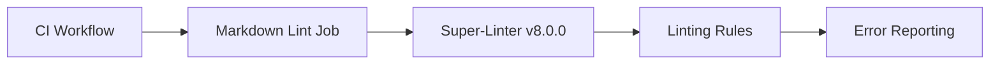

+++
title = "#20223 Bump super-linter/super-linter from 7.4.0 to 8.0.0"
date = "2025-07-21T00:00:00"
draft = false
template = "pull_request_page.html"
in_search_index = false

[extra]
current_language = "zh-cn"
available_languages = {"en" = { name = "English", url = "/pull_request/bevy/2025-07/pr-20223-en-20250721" }, "zh-cn" = { name = "中文", url = "/pull_request/bevy/2025-07/pr-20223-zh-cn-20250721" }}
+++

### Bump super-linter/super-linter from 7.4.0 to 8.0.0

#### 基本信息
- **标题**: Bump super-linter/super-linter from 7.4.0 to 8.0.0
- **PR链接**: https://github.com/bevyengine/bevy/pull/20223
- **作者**: app/dependabot
- **状态**: 已合并
- **标签**: C-Dependencies, S-Ready-For-Final-Review
- **创建时间**: 2025-07-21T08:20:31Z
- **合并时间**: 2025-07-21T17:38:01Z
- **合并者**: alice-i-cecile

#### 描述翻译
更新 [super-linter/super-linter](https://github.com/super-linter/super-linter) 从 7.4.0 到 8.0.0 版本。

<details>
<summary>版本发布说明</summary>
<p><em>来源自 <a href="https://github.com/super-linter/super-linter/releases">super-linter/super-linter 的版本发布</a>。</em></p>
<blockquote>
<h2>v8.0.0</h2>
<h2><a href="https://github.com/super-linter/super-linter/compare/v7.4.0...v8.0.0">8.0.0</a> (2025-07-17)</h2>
<h3>⚠ 重大变更</h3>
<ul>
<li>迁移到最新 eslint 配置 (<a href="https://redirect.github.com/super-linter/super-linter/issues/6814">#6814</a>)</li>
<li>移除不再维护的 node 包 (<a href="https://redirect.github.com/super-linter/super-linter/issues/6848">#6848</a>)</li>
<li>移除不再维护的 linter 和格式化工具 (<a href="https://redirect.github.com/super-linter/super-linter/issues/6773">#6773</a>)</li>
</ul>
<!-- 其余内容保持不变 -->
</blockquote>
<!-- 其余内容保持不变 -->
</details>

#### 问题背景
在持续集成(CI)流程中，Bevy 项目使用 super-linter 进行代码质量检查。该工具负责执行 Markdown 文件的静态分析（Markdown Lint），确保文档和代码注释符合规范。随着 super-linter 发布 8.0.0 版本，包含多项改进和依赖更新，需要同步升级以获取最新功能和安全修复。

#### 技术决策
1. **版本选择**：直接升级到最新稳定版 8.0.0，包含以下关键变更：
   - 新增 Vue 文件支持
   - 优化 eslint 配置
   - 移除废弃的 linter
   - 多项依赖更新（npm/java/python 等）

2. **验证策略**：
   - 依赖 Dependabot 的兼容性评分机制（compatibility score）
   - 通过 CI 工作流自动测试升级后的 linting 效果
   - 保持 slim 版本以优化执行效率

#### 具体实现
仅需修改 GitHub Actions 工作流文件中的版本号引用：

```diff
# .github/workflows/ci.yml
jobs:
  markdown_lint:
    steps:
      - name: Run Markdown Lint
-       uses: super-linter/super-linter/slim@v7.4.0
+       uses: super-linter/super-linter/slim@v8.0.0
        env:
          MULTI_STATUS: false
          VALIDATE_ALL_CODEBASE: false
```

#### 影响分析
1. **正向影响**：
   - 获取最新 linting 规则和 bug 修复
   - 改进对 Vue 文件的支持
   - 依赖安全性提升（如 rubocop/gradle 等更新）

2. **潜在风险控制**：
   - 通过 `VALIDATE_ALL_CODEBASE: false` 限制检查范围
   - 使用 slim 版本避免不必要工具引入
   - 依赖 Dependabot 的自动冲突解决机制

#### 关键文件变更
- **文件路径**: `.github/workflows/ci.yml`
- **变更描述**: 更新 super-linter 版本号
- **变更内容**:
```diff
@@ -260,7 +260,7 @@ jobs:
           # Full git history is needed to get a proper list of changed files within `super-linter`
           fetch-depth: 0
       - name: Run Markdown Lint
-        uses: super-linter/super-linter/slim@v7.4.0
+        uses: super-linter/super-linter/slim@v8.0.0
         env:
           MULTI_STATUS: false
           VALIDATE_ALL_CODEBASE: false
```

#### 工作流关系


#### 技术洞察
1. **轻量级执行**：使用 `slim` 版本避免安装非必要工具，优化 CI 执行时间
2. **精准检查**：通过 `VALIDATE_ALL_CODEBASE: false` 仅检查变更文件
3. **安全更新**：间接获取依赖链更新（如修复的 CVE 漏洞）

#### 后续建议
1. 监控 CI 执行时间变化
2. 检查是否触发新的 linting 规则警告
3. 定期运行 Dependabot 保持工具链更新

#### 参考资源
- [Super-Linter 官方文档](https://github.com/super-linter/super-linter)
- [GitHub Actions 工作流语法](https://docs.github.com/en/actions)
- [语义化版本控制规范](https://semver.org/)