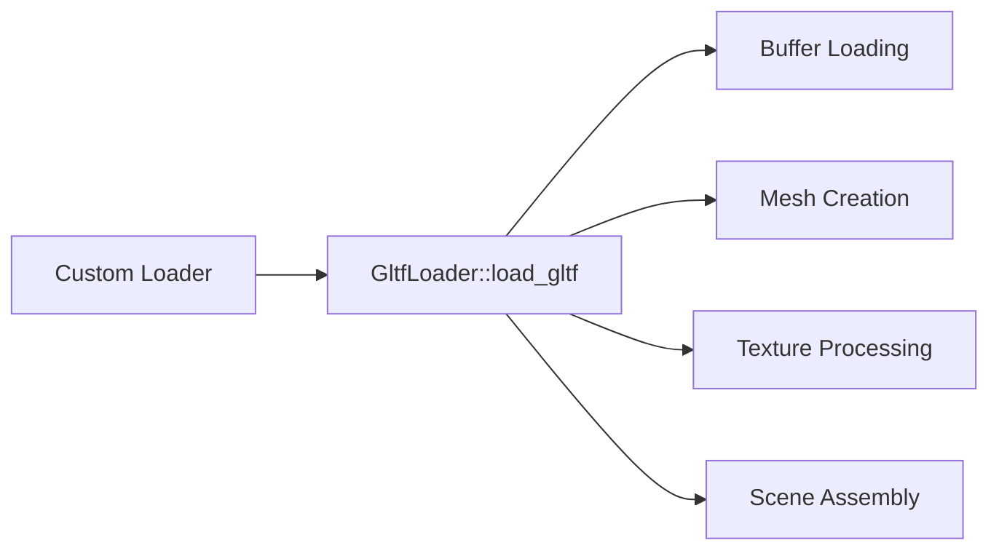

+++
title = "#20225 Make load gltf public"
date = "2025-07-24T00:00:00"
draft = false
template = "pull_request_page.html"
in_search_index = true

[taxonomies]
list_display = ["show"]

[extra]
current_language = "en"
available_languages = {"en" = { name = "English", url = "/pull_request/bevy/2025-07/pr-20225-en-20250724" }, "zh-cn" = { name = "中文", url = "/pull_request/bevy/2025-07/pr-20225-zh-cn-20250724" }}
labels = ["C-Usability", "D-Straightforward", "A-glTF"]
+++

### Make load gltf public

#### Basic Information
- **Title**: Make load gltf public
- **PR Link**: https://github.com/bevyengine/bevy/pull/20225
- **Author**: jiangheng90
- **Status**: MERGED
- **Labels**: C-Usability, S-Ready-For-Final-Review, D-Straightforward, A-glTF
- **Created**: 2025-07-21T11:43:53Z
- **Merged**: 2025-07-24T17:09:19Z
- **Merged By**: alice-i-cecile

#### Description
In some case, there are many gltf like format which I need to parse to make custom loader, so I make load_gltf to a static method public on GltfLoader

#### The Story of This Pull Request
The glTF loader implementation in Bevy had a private `load_gltf` function that handled the core loading logic. This function was only accessible through the `AssetLoader` trait implementation, which limited its reuse for custom formats similar to glTF. Developers working with glTF-like formats needed to duplicate this complex loading logic in their projects.

The solution was straightforward: move the `load_gltf` function into the `GltfLoader` impl block and make it public. This preserves the existing functionality while exposing the core loading mechanism. The `AssetLoader` implementation was updated to call this new public method, maintaining backward compatibility.

The implementation change involved:
1. Moving the entire `load_gltf` function into the `impl GltfLoader` block
2. Changing its visibility to `pub`
3. Updating the `AssetLoader` implementation to call `Self::load_gltf`
4. Maintaining identical function parameters and behavior

No logic changes were made to the loading process itself. The public method signature matches the original private function, accepting the same parameters (`&GltfLoader`, `&[u8]`, `&mut LoadContext`, and `&GltfLoaderSettings`) and returning the same `Result<Gltf, GltfError>`.

This change enables developers to create custom loaders for glTF-like formats by reusing the core parsing and loading logic. The public method provides access to the full glTF loading pipeline including buffer processing, texture loading, mesh creation, and scene construction.

#### Visual Representation


#### Key Files Changed
- `crates/bevy_gltf/src/loader/mod.rs` (+736/-698)

**Changes**:
1. The core glTF loading function was moved from a private module-level function to a public method of `GltfLoader`
2. The `AssetLoader` implementation now delegates to this public method
3. All functionality remains unchanged

**Code Comparison**:
```rust
// Before:
async fn load_gltf<'a, 'b, 'c>(
    loader: &GltfLoader,
    bytes: &'a [u8],
    load_context: &'b mut LoadContext<'c>,
    settings: &'b GltfLoaderSettings,
) -> Result<Gltf, GltfError> {
    // Original implementation
}

impl AssetLoader for GltfLoader {
    async fn load(...) -> ... {
        load_gltf(...).await
    }
}

// After:
impl GltfLoader {
    pub async fn load_gltf<'a, 'b, 'c>(
        loader: &GltfLoader,
        bytes: &'a [u8],
        load_context: &'b mut LoadContext<'c>,
        settings: &'b GltfLoaderSettings,
    ) -> Result<Gltf, GltfError> {
        // Same implementation moved here
    }
}

impl AssetLoader for GltfLoader {
    async fn load(...) -> ... {
        Self::load_gltf(...).await
    }
}
```

#### Further Reading
1. [Bevy Asset System Documentation](https://bevyengine.org/learn/book/assets/)
2. [glTF 2.0 Specification](https://www.khronos.org/registry/glTF/specs/2.0/glTF-2.0.html)
3. [Extending Bevy's Asset Loaders](https://bevyengine.org/examples/Assets/custom-asset-loaders/)

#### Full Code Diff
```diff
diff --git a/crates/bevy_gltf/src/loader/mod.rs b/crates/bevy_gltf/src/loader/mod.rs
index 3e4c38453240c..9597f8699bb84 100644
--- a/crates/bevy_gltf/src/loader/mod.rs
+++ b/crates/bevy_gltf/src/loader/mod.rs
@@ -241,812 +241,850 @@ impl Default for GltfLoaderSettings {
     }
 }
 
-impl AssetLoader for GltfLoader {
-    type Asset = Gltf;
-    type Settings = GltfLoaderSettings;
-    type Error = GltfError;
-    async fn load(
-        &self,
-        reader: &mut dyn Reader,
-        settings: &GltfLoaderSettings,
-        load_context: &mut LoadContext<'_>,
-    ) -> Result<Gltf, Self::Error> {
-        let mut bytes = Vec::new();
-        reader.read_to_end(&mut bytes).await?;
-
-        load_gltf(self, &bytes, load_context, settings).await
-    }
-
-    fn extensions(&self) -> &[&str] {
-        &["gltf", "glb"]
-    }
-}
-
-/// Loads an entire glTF file.
-async fn load_gltf<'a, 'b, 'c>(
-    loader: &GltfLoader,
-    bytes: &'a [u8],
-    load_context: &'b mut LoadContext<'c>,
-    settings: &'b GltfLoaderSettings,
-) -> Result<Gltf, GltfError> {
-    let gltf = gltf::Gltf::from_slice(bytes)?;
-
-    let file_name = load_context
-        .asset_path()
-        .path()
-        .to_str()
-        .ok_or(GltfError::Gltf(gltf::Error::Io(Error::new(
-            std::io::ErrorKind::InvalidInput,
-            "Gltf file name invalid",
-        ))))?
-        .to_string();
-    let buffer_data = load_buffers(&gltf, load_context).await?;
-
-    let linear_textures = get_linear_textures(&gltf.document);
+impl GltfLoader {
+    /// Loads an entire glTF file.
+    pub async fn load_gltf<'a, 'b, 'c>(
+        loader: &GltfLoader,
+        bytes: &'a [u8],
+        load_context: &'b mut LoadContext<'c>,
+        settings: &'b GltfLoaderSettings,
+    ) -> Result<Gltf, GltfError> {
+        let gltf = gltf::Gltf::from_slice(bytes)?;
+
+        let file_name = load_context
+            .asset_path()
+            .path()
+            .to_str()
+            .ok_or(GltfError::Gltf(gltf::Error::Io(Error::new(
+                std::io::ErrorKind::InvalidInput,
+                "Gltf file name invalid",
+            ))))?
+            .to_string();
+        let buffer_data = load_buffers(&gltf, load_context).await?;
+
+        let linear_textures = get_linear_textures(&gltf.document);
 
-    #[cfg(feature = "bevy_animation")]
-    let paths = {
-        let mut paths = HashMap::<usize, (usize, Vec<Name>)>::default();
-        for scene in gltf.scenes() {
-            for node in scene.nodes() {
-                let root_index = node.index();
-                collect_path(&node, &[], &mut paths, root_index, &mut HashSet::default());
+        #[cfg(feature = "bevy_animation")]
+        let paths = {
+            let mut paths = HashMap::<usize, (usize, Vec<Name>)>::default();
+            for scene in gltf.scenes() {
+                for node in scene.nodes() {
+                    let root_index = node.index();
+                    collect_path(&node, &[], &mut paths, root_index, &mut HashSet::default());
+                }
             }
-        }
-        paths
-    };
+            paths
+        };
 
-    let convert_coordinates = match settings.convert_coordinates {
-        Some(convert_coordinates) => convert_coordinates,
-        None => {
-            let convert_by_default = loader.default_convert_coordinates;
-            if !convert_by_default && !cfg!(feature = "gltf_convert_coordinates_default") {
-                warn_once!(
+        let convert_coordinates = match settings.convert_coordinates {
+            Some(convert_coordinates) => convert_coordinates,
+            None => {
+                let convert_by_default = loader.default_convert_coordinates;
+                if !convert_by_default && !cfg!(feature = "gltf_convert_coordinates_default") {
+                    warn_once!(
                     "Starting from Bevy 0.18, by default all imported glTF models will be rotated by 180 degrees around the Y axis to align with Bevy's coordinate system. \
                     You are currently importing glTF files using the old behavior. Consider opting-in to the new import behavior by enabling the `gltf_convert_coordinates_default` feature. \
                     If you encounter any issues please file a bug! \
                     If you want to continue using the old behavior going forward (even when the default changes in 0.18), manually set the corresponding option in the `GltfPlugin` or `GltfLoaderSettings`. See the migration guide for more details."
                 );
+                }
+                convert_by_default
             }
-            convert_by_default
-        }
-    };
-
-    #[cfg(feature = "bevy_animation")]
-    let (animations, named_animations, animation_roots) = {
-        use bevy_animation::{animated_field, animation_curves::*, gltf_curves::*, VariableCurve};
-        use bevy_math::{
-            curve::{ConstantCurve, Interval, UnevenSampleAutoCurve},
-            Quat, Vec4,
         };
-        use gltf::animation::util::ReadOutputs;
-        let mut animations = vec![];
-        let mut named_animations = <HashMap<_, _>>::default();
-        let mut animation_roots = <HashSet<_>>::default();
-        for animation in gltf.animations() {
-            let mut animation_clip = AnimationClip::default();
-            for channel in animation.channels() {
-                let node = channel.target().node();
-                let interpolation = channel.sampler().interpolation();
-                let reader = channel.reader(|buffer| Some(&buffer_data[buffer.index()]));
-                let keyframe_timestamps: Vec<f32> = if let Some(inputs) = reader.read_inputs() {
-                    match inputs {
-                        Iter::Standard(times) => times.collect(),
-                        Iter::Sparse(_) => {
-                            warn!("Sparse accessor not supported for animation sampler input");
-                            continue;
-                        }
-                    }
-                } else {
-                    warn!("Animations without a sampler input are not supported");
-                    return Err(GltfError::MissingAnimationSampler(animation.index()));
-                };
 
-                if keyframe_timestamps.is_empty() {
-                    warn!("Tried to load animation with no keyframe timestamps");
-                    continue;
-                }
+        #[cfg(feature = "bevy_animation")]
+        let (animations, named_animations, animation_roots) = {
+            use bevy_animation::{
+                animated_field, animation_curves::*, gltf_curves::*, VariableCurve,
+            };
+            use bevy_math::{
+                curve::{ConstantCurve, Interval, UnevenSampleAutoCurve},
+                Quat, Vec4,
+            };
+            use gltf::animation::util::ReadOutputs;
+            let mut animations = vec![];
+            let mut named_animations = <HashMap<_, _>>::default();
+            let mut animation_roots = <HashSet<_>>::default();
+            for animation in gltf.animations() {
+                let mut animation_clip = AnimationClip::default();
+                for channel in animation.channels() {
+                    let node = channel.target().node();
+                    let interpolation = channel.sampler().interpolation();
+                    let reader = channel.reader(|buffer| Some(&buffer_data[buffer.index()]));
+                    let keyframe_timestamps: Vec<f32> = if let Some(inputs) = reader.read_inputs() {
+                        match inputs {
+                            Iter::Standard(times) => times.collect(),
+                            Iter::Sparse(_) => {
+                                warn!("Sparse accessor not supported for animation sampler input");
+                                continue;
+                            }
+                        }
+                    } else {
+                        warn!("Animations without a sampler input are not supported");
+                        return Err(GltfError::MissingAnimationSampler(animation.index()));
+                    };
 
-                let maybe_curve: Option<VariableCurve> = if let Some(outputs) =
-                    reader.read_outputs()
-                {
-                    match outputs {
-                        ReadOutputs::Translations(tr) => {
-                            let translation_property = animated_field!(Transform::translation);
-                            let translations: Vec<Vec3> = tr
-                                .map(Vec3::from)
-                                .map(|verts| {
-                                    if convert_coordinates {
-                                        Vec3::convert_coordinates(verts)
-                                    } else {
-                                        verts
-                                    }
-                                })
-                                .collect();
-                            if keyframe_timestamps.len() == 1 {
-                                Some(VariableCurve::new(AnimatableCurve::new(
-                                    translation_property,
-                                    ConstantCurve::new(Interval::EVERYWHERE, translations[0]),
-                                )))
-                            } else {
-                                match interpolation {
-                                    gltf::animation::Interpolation::Linear => {
-                                        UnevenSampleAutoCurve::new(
-                                            keyframe_timestamps.into_iter().zip(translations),
-                                        )
-                                        .ok()
-                                        .map(|curve| {
-                                            VariableCurve::new(AnimatableCurve::new(
-                                                translation_property,
-                                                curve,
-                                            ))
-                                        })
-                                    }
-                                    gltf::animation::Interpolation::Step => {
-                                        SteppedKeyframeCurve::new(
-                                            keyframe_timestamps.into_iter().zip(translations),
-                                        )
-                                        .ok()
-                                        .map(|curve| {
-                                            VariableCurve::new(AnimatableCurve::new(
-                                                translation_property,
-                                                curve,
-                                            ))
-                                        })
-                                    }
-                                    gltf::animation::Interpolation::CubicSpline => {
-                                        CubicKeyframeCurve::new(keyframe_timestamps, translations)
+                    if keyframe_timestamps.is_empty() {
+                        warn!("Tried to load animation with no keyframe timestamps");
+                        continue;
+                    }
+
+                    let maybe_curve: Option<VariableCurve> = if let Some(outputs) =
+                        reader.read_outputs()
+                    {
+                        match outputs {
+                            ReadOutputs::Translations(tr) => {
+                                let translation_property = animated_field!(Transform::translation);
+                                let translations: Vec<Vec3> = tr
+                                    .map(Vec3::from)
+                                    .map(|verts| {
+                                        if convert_coordinates {
+                                            Vec3::convert_coordinates(verts)
+                                        } else {
+                                            verts
+                                        }
+                                    })
+                                    .collect();
+                                if keyframe_timestamps.len() == 1 {
+                                    Some(VariableCurve::new(AnimatableCurve::new(
+                                        translation_property,
+                                        ConstantCurve::new(Interval::EVERYWHERE, translations[0]),
+                                    )))
+                                } else {
+                                    match interpolation {
+                                        gltf::animation::Interpolation::Linear => {
+                                            UnevenSampleAutoCurve::new(
+                                                keyframe_timestamps.into_iter().zip(translations),
+                                            )
+                                            .ok()
+                                            .map(
+                                                |curve| {
+                                                    VariableCurve::new(AnimatableCurve::new(
+                                                        translation_property,
+                                                        curve,
+                                                    ))
+                                                },
+                                            )
+                                        }
+                                        gltf::animation::Interpolation::Step => {
+                                            SteppedKeyframeCurve::new(
+                                                keyframe_timestamps.into_iter().zip(translations),
+                                            )
+                                            .ok()
+                                            .map(
+                                                |curve| {
+                                                    VariableCurve::new(AnimatableCurve::new(
+                                                        translation_property,
+                                                        curve,
+                                                    ))
+                                                },
+                                            )
+                                        }
+                                        gltf::animation::Interpolation::CubicSpline => {
+                                            CubicKeyframeCurve::new(
+                                                keyframe_timestamps,
+                                                translations,
+                                            )
+                                            .ok()
+                                            .map(
+                                                |curve| {
+                                                    VariableCurve::new(AnimatableCurve::new(
+                                                        translation_property,
+                                                        curve,
+                                                    ))
+                                                },
+                                            )
+                                        }
+                                    }
+                                }
+                            }
+                            ReadOutputs::Rotations(rots) => {
+                                let rotation_property = animated_field!(Transform::rotation);
+                                let rotations: Vec<Quat> = rots
+                                    .into_f32()
+                                    .map(Quat::from_array)
+                                    .map(|quat| {
+                                        if convert_coordinates {
+                                            Quat::convert_coordinates(quat)
+                                        } else {
+                                            quat
+                                        }
+                                    })
+                                    .collect();
+                                if keyframe_timestamps.len() == 1 {
+                                    Some(VariableCurve::new(AnimatableCurve::new(
+                                        rotation_property,
+                                        ConstantCurve::new(Interval::EVERYWHERE, rotations[0]),
+                                    )))
+                                } else {
+                                    match interpolation {
+                                        gltf::animation::Interpolation::Linear => {
+                                            UnevenSampleAutoCurve::new(
+                                                keyframe_timestamps.into_iter().zip(rotations),
+                                            )
+                                            .ok()
+                                            .map(
+                                                |curve| {
+                                                    VariableCurve::new(AnimatableCurve::new(
+                                                        rotation_property,
+                                                        curve,
+                                                    ))
+                                                },
+                                            )
+                                        }
+                                        gltf::animation::Interpolation::Step => {
+                                            SteppedKeyframeCurve::new(
+                                                keyframe_timestamps.into_iter().zip(rotations),
+                                            )
+                                            .ok()
+                                            .map(
+                                                |curve| {
+                                                    VariableCurve::new(AnimatableCurve::new(
+                                                        rotation_property,
+                                                        curve,
+                                                    ))
+                                                },
+                                            )
+                                        }
+                                        gltf::animation::Interpolation::CubicSpline => {
+                                            CubicRotationCurve::new(
+                                                keyframe_timestamps,
+                                                rotations.into_iter().map(Vec4::from),
+                                            )
+                                            .ok()
+                                            .map(
+                                                |curve| {
+                                                    VariableCurve::new(AnimatableCurve::new(
+                                                        rotation_property,
+                                                        curve,
+                                                    ))
+                                                },
+                                            )
+                                        }
+                                    }
+                                }
+                            }
+                            ReadOutputs::Scales(scale) => {
+                                let scale_property = animated_field!(Transform::scale);
+                                let scales: Vec<Vec3> = scale.map(Vec3::from).collect();
+                                if keyframe_timestamps.len() == 1 {
+                                    Some(VariableCurve::new(AnimatableCurve::new(
+                                        scale_property,
+                                        ConstantCurve::new(Interval::EVERYWHERE, scales[0]),
+                                    )))
+                                } else {
+                                    match interpolation {
+                                        gltf::animation::Interpolation::Linear => {
+                                            UnevenSampleAutoCurve::new(
+                                                keyframe_timestamps.into_iter().zip(scales),
+                                            )
+                                            .ok()
+                                            .map(
+                                                |curve| {
+                                                    VariableCurve::new(AnimatableCurve::new(
+                                                        scale_property,
+                                                        curve,
+                                                    ))
+                                                },
+                                            )
+                                        }
+                                        gltf::animation::Interpolation::Step => {
+                                            SteppedKeyframeCurve::new(
+                                                keyframe_timestamps.into_iter().zip(scales),
+                                            )
+                                            .ok()
+                                            .map(
+                                                |curve| {
+                                                    VariableCurve::new(AnimatableCurve::new(
+                                                        scale_property,
+                                                        curve,
+                                                    ))
+                                                },
+                                            )
+                                        }
+                                        gltf::animation::Interpolation::CubicSpline => {
+                                            CubicKeyframeCurve::new(keyframe_timestamps, scales)
+                                                .ok()
+                                                .map(|curve| {
+                                                    VariableCurve::new(AnimatableCurve::new(
+                                                        scale_property,
+                                                        curve,
+                                                    ))
+                                                })
+                                        }
+                                    }
+                                }
+                            }
+                            ReadOutputs::MorphTargetWeights(weights) => {
+                                let weights: Vec<f32> = weights.into_f32().collect();
+                                if keyframe_timestamps.len() == 1 {
+                                    #[expect(
+                                        clippy::unnecessary_map_on_constructor,
+                                        reason = "While the mapping is unnecessary, it is much more readable at this level of indentation. Additionally, mapping makes it more consistent with the other branches."
+                                    )]
+                                    Some(ConstantCurve::new(Interval::EVERYWHERE, weights))
+                                        .map(WeightsCurve)
+                                        .map(VariableCurve::new)
+                                } else {
+                                    match interpolation {
+                                        gltf::animation::Interpolation::Linear => {
+                                            WideLinearKeyframeCurve::new(
+                                                keyframe_timestamps,
+                                                weights,
+                                            )
                                             .ok()
-                                            .map(|curve| {
-                                                VariableCurve::new(AnimatableCurve::new(
-                                                    translation_property,
-                                                    curve,
-                                                ))
-                                            })
+                                            .map(WeightsCurve)
+                                            .map(VariableCurve::new)
+                                        }
+                                        gltf::animation::Interpolation::Step => {
+                                            WideSteppedKeyframeCurve::new(
+                                                keyframe_timestamps,
+                                                weights,
+                                            )
+                                            .ok()
+                                            .map(WeightsCurve)
+                                            .map(VariableCurve::new)
+                                        }
+                                        gltf::animation::Interpolation::CubicSpline => {
+                                            WideCubicKeyframeCurve::new(
+                                                keyframe_timestamps,
+                                                weights,
+                                            )
+                                            .ok()
+                                            .map(WeightsCurve)
+                                            .map(VariableCurve::new)
+                                        }
                                     }
                                 }
                             }
                         }
-                        ReadOutputs::Rotations(rots) => {
-                            let rotation_property = animated_field!(Transform::rotation);
-                            let rotations: Vec<Quat> = rots
-                                .into_f32()
-                                .map(Quat::from_array)
-                                .map(|quat| {
-                                    if convert_coordinates {
-                                        Quat::convert_coordinates(quat)
-                                    } else {
-                                        quat
-                                    }
-                                })
-                                .collect();
-                            if keyframe_timestamps.len() == 1 {
-                                Some(VariableCurve::new(AnimatableCurve::new(
-                                    rotation_property,
-                                    ConstantCurve::new(Interval::EVERYWHERE, rotations[0]),
-                                )))
-                            } else {
-                                match interpolation {
-                                    gltf::animation::Interpolation::Linear => {
-                                        UnevenSampleAutoCurve::new(
-                                            keyframe_timestamps.into_iter().zip(rotations),
-                                        )
-                                        .ok()
-                                        .map(|curve| {
-                                            VariableCurve::new(AnimatableCurve::new(
-                                                rotation_property,
-                                                curve,
-                                            ))
-                                        })
-                                    }
-                                    gltf::animation::Interpolation::Step => {
-                                        SteppedKeyframeCurve::new(
-                                            keyframe_timestamps.into_iter().zip(rotations),
-                                        )
-                                        .ok()
-                                        .map(|curve| {
-                                            VariableCurve::new(AnimatableCurve::new(
-                                                rotation_property,
-                                                curve,
-                                            ))
-                                        })
-                                    }
-                                    gltf::animation::Interpolation::CubicSpline => {
-                                        CubicRotationCurve::new(
-                                            keyframe_timestamps,
-                                            rotations.into_iter().map(Vec4::from),
-                                        )
-                                        .ok()
-                                        .map(|curve| {
-                                            VariableCurve::new(AnimatableCurve::new(
-                                                rotation_property,
-                                                curve,
-                                            ))
-                                        })
-                                    }
-                                }
-                            }
-                        }
-                        ReadOutputs::Scales(scale) => {
-                            let scale_property = animated_field!(Transform::scale);
-                            let scales: Vec<Vec3> = scale.map(Vec3::from).collect();
-                            if keyframe_timestamps.len() == 1 {
-                                Some(VariableCurve::new(AnimatableCurve::new(
-                                    scale_property,
-                                    ConstantCurve::new(Interval::EVERYWHERE, scales[0]),
-                                )))
-                            } else {
-                                match interpolation {
-                                    gltf::animation::Interpolation::Linear => {
-                                        UnevenSampleAutoCurve::new(
-                                            keyframe_timestamps.into_iter().zip(scales),
-                                        )
-                                        .ok()
-                                        .map(|curve| {
-                                            VariableCurve::new(AnimatableCurve::new(
-                                                scale_property,
-                                                curve,
-                                            ))
-                                        })
-                                    }
-                                    gltf::animation::Interpolation::Step => {
-                                        SteppedKeyframeCurve::new(
-                                            keyframe_timestamps.into_iter().zip(scales),
-                                        )
-                                        .ok()
-                                        .map(|curve| {
-                                            VariableCurve::new(AnimatableCurve::new(
-                                                scale_property,
-                                                curve,
-                                            ))
-                                        })
-                                    }
-                                    gltf::animation::Interpolation::CubicSpline => {
-                                        CubicKeyframeCurve::new(keyframe_timestamps, scales)
+                    } else {
+                        warn!("Animations without a sampler output are not supported");
+                        return Err(GltfError::MissingAnimationSampler(animation.index()));
+                    };
+
+                    let Some(curve) = maybe_curve else {
+                        warn!(
+                            "Invalid keyframe data for node {}; curve could not be constructed",
+                            node.index()
+                        );
+                        continue;
+                    };
+
+                    if let Some((root_index, path)) = paths.get(&node.index()) {
+                        animation_roots.insert(*root_index);
+                        animation_clip.add_variable_curve_to_target(
+                            AnimationTargetId::from_names(path.iter()),
+                            curve,
+                        );
+                    } else {
+                        warn!(
+                        "Animation ignored for node {}: part of its hierarchy is missing a name",
+                        node.index()
+                    );
+                    }
+                }
+                let handle = load_context.add_labeled_asset(
+                    GltfAssetLabel::Animation(animation.index()).to_string(),
+                    animation_clip,
+                );
+                if let Some(name) = animation.name() {
+                    named_animations.insert(name.into(), handle.clone());
+                }
+                animations.push(handle);
+            }
+            (animations, named_animations, animation_roots)
+        };
+
+        let default_sampler = match settings.default_sampler.as_ref() {
+            Some(sampler) => sampler,
+            None => &loader.default_sampler.lock().unwrap().clone(),
+        };
+        // We collect handles to ensure loaded images from paths are not unloaded before they are used elsewhere
+        // in the loader. This prevents "reloads", but it also prevents dropping the is_srgb context on reload.
+        //
+        // In theory we could store a mapping between texture.index() and handle to use
+        // later in the loader when looking up handles for materials. However this would mean
+        // that the material's load context would no longer track those images as dependencies.
+        let mut _texture_handles = Vec::new();
+        if gltf.textures().len() == 1 || cfg!(target_arch = "wasm32") {
+            for texture in gltf.textures() {
+                let parent_path = load_context.path().parent().unwrap();
+                let image = load_image(
+                    texture,
+                    &buffer_data,
+                    &linear_textures,
+                    parent_path,
+                    loader.supported_compressed_formats,
+                    default_sampler,
+                    settings,
+                )
+                .await?;
+                image.process_loaded_texture(load_context, &mut _texture_handles);
+            }
+        } else {
+            #[cfg(not(target_arch = "wasm32"))]
+            IoTaskPool::get()
+                .scope(|scope| {
+                    gltf.textures().for_each(|gltf_texture| {
+                        let parent_path = load_context.path().parent().unwrap();
+                        let linear_textures = &linear_textures;
+                        let buffer_data = &buffer_data;
+                        scope.spawn(async move {
+                            load_image(
+                                gltf_texture,
+                                buffer_data,
+                                linear_textures,
+                                parent_path,
+                                loader.supported_compressed_formats,
+                                default_sampler,
+                                settings,
+                            )
+                            .await
+                        });
+                    });
+                })
+                .into_iter()
+                .for_each(|result| match result {
+                    Ok(image) => {
+                        image.process_loaded_texture(load_context, &mut _texture_handles);
+                    }
+                    Err(err) => {
+                        warn!("Error loading glTF texture: {}", err);
+                    }
+                });
+        }
+
+        let mut materials = vec![];
+        let mut named_materials = <HashMap<_, _>>::default();
+        // Only include materials in the output if they're set to be retained in the MAIN_WORLD and/or RENDER_WORLD by the load_materials flag
+        if !settings.load_materials.is_empty() {
+            // NOTE: materials must be loaded after textures because image load() calls will happen before load_with_settings, preventing is_srgb from being set properly
+            for material in gltf.materials() {
+                let handle = load_material(&material, load_context, &gltf.document, false);
+                if let Some(name) = material.name() {
+                    named_materials.insert(name.into(), handle.clone());
+                }
+                materials.push(handle);
+            }
+        }
+        let mut meshes = vec![];
+        let mut named_meshes = <HashMap<_, _>>::default();
+        let mut meshes_on_skinned_nodes = <HashSet<_>>::default();
+        let mut meshes_on_non_skinned_nodes = <HashSet<_>>::default();
+        for gltf_node in gltf.nodes() {
+            if gltf_node.skin().is_some() {
+                if let Some(mesh) = gltf_node.mesh() {
+                    meshes_on_skinned_nodes.insert(mesh.index());
+                }
+            } else if let Some(mesh) = gltf_node.mesh() {
+                meshes_on_non_skinned_nodes.insert(mesh.index());
+            }
+        }
+        for gltf_mesh in gltf.meshes() {
+            let mut primitives = vec![];
+            for primitive in gltf_mesh.primitives() {
+                let primitive_label = GltfAssetLabel::Primitive {
+                    mesh: gltf_mesh.index(),
+                    primitive: primitive.index(),
+                };
+                let primitive_topology = primitive_topology(primitive.mode())?;
+
+                let mut mesh = Mesh::new(primitive_topology, settings.load_meshes);
+
+                // Read vertex attributes
+                for (semantic, accessor) in primitive.attributes() {
+                    if [Semantic::Joints(0), Semantic::Weights(0)].contains(&semantic) {
+                        if !meshes_on_skinned_nodes.contains(&gltf_mesh.index()) {
+                            warn!(
+                        "Ignoring attribute {:?} for skinned mesh {} used on non skinned nodes (NODE_SKINNED_MESH_WITHOUT_SKIN)",
+                        semantic,
+                        primitive_label
+                    );
+                            continue;
+                        } else if meshes_on_non_skinned_nodes.contains(&gltf_mesh.index()) {
+                            error!("Skinned mesh {} used on both skinned and non skin nodes, this is likely to cause an error (NODE_SKINNED_MESH_WITHOUT_SKIN)", primitive_label);
+                        }
+                    }
+                    match convert_attribute(
+                        semantic,
+                        accessor,
+                        &buffer_data,
+                        &loader.custom_vertex_attributes,
+                        convert_coordinates,
+                    ) {
+                        Ok((attribute, values)) => mesh.insert_attribute(attribute, values),
+                        Err(err) => warn!("{}", err),
+                    }
+                }
+
+                // Read vertex indices
+                let reader =
+                    primitive.reader(|buffer| Some(buffer_data[buffer.index()].as_slice()));
+                if let Some(indices) = reader.read_indices() {
+                    mesh.insert_indices(match indices {
+                        ReadIndices::U8(is) => Indices::U16(is.map(|x| x as u16).collect()),
+                        ReadIndices::U16(is) => Indices::U16(is.collect()),
+                        ReadIndices::U32(is) => Indices::U32(is.collect()),
+                    });
+                };
+
+                {
+                    let morph_target_reader = reader.read_morph_targets();
+                    if morph_target_reader.len() != 0 {
+                        let morph_targets_label = GltfAssetLabel::MorphTarget {
+