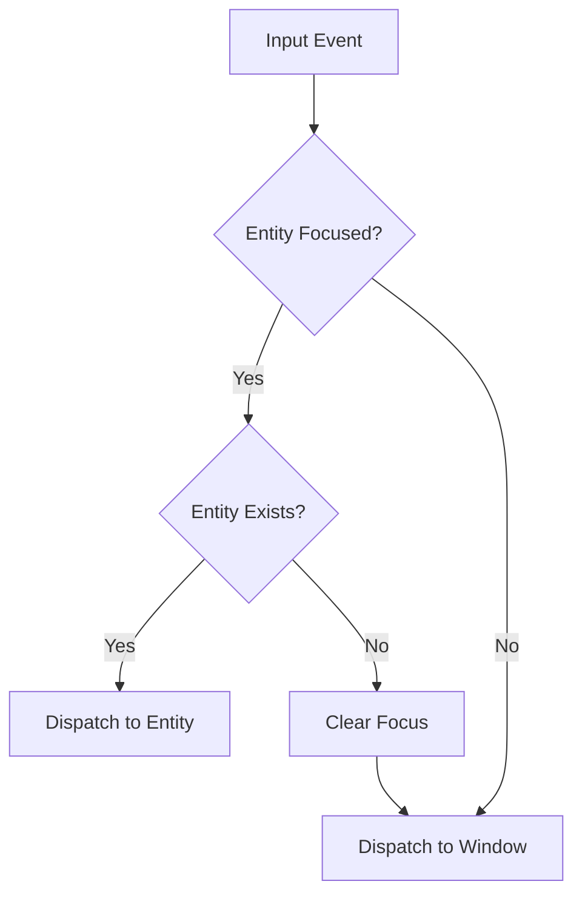

+++
title = "#20227 Fix panic when focused entity is despawned"
date = "2025-07-22T00:00:00"
draft = false
template = "pull_request_page.html"
in_search_index = true

[taxonomies]
list_display = ["show"]

[extra]
current_language = "en"
available_languages = {"en" = { name = "English", url = "/pull_request/bevy/2025-07/pr-20227-en-20250722" }, "zh-cn" = { name = "中文", url = "/pull_request/bevy/2025-07/pr-20227-zh-cn-20250722" }}
labels = ["C-Bug", "P-Crash", "A-UI", "D-Straightforward"]
+++

## Fix panic when focused entity is despawned

### Basic Information
- **Title**: Fix panic when focused entity is despawned
- **PR Link**: https://github.com/bevyengine/bevy/pull/20227
- **Author**: muddxyii
- **Status**: MERGED
- **Labels**: C-Bug, P-Crash, A-UI, S-Ready-For-Final-Review, X-Uncontroversial, D-Straightforward
- **Created**: 2025-07-21T16:00:03Z
- **Merged**: 2025-07-21T23:51:20Z
- **Merged By**: alice-i-cecile

### The Story of This Pull Request

#### The Problem
When an entity with input focus was despawned from the ECS world, Bevy's input dispatch system would attempt to send events to that non-existent entity. This occurred because the `InputFocus` resource retained a reference to the despawned entity, causing a panic when the system tried to access it. Specifically, the `dispatch_focused_input` system would try to trigger events on an entity that no longer existed, violating Bevy's entity validity guarantees. This manifested as a crash (#20057) in UI-heavy applications where focused elements could be dynamically removed.

#### The Solution Approach
The fix centers around adding an entity validity check before dispatching input events. The solution needed to:
1. Detect when the focused entity no longer exists
2. Clear the invalid focus state
3. Safely redirect input to a valid target (the primary window)
4. Maintain existing functionality when the focused entity is valid

The key decision was to use the `Entities` resource for efficient existence checks rather than querying for components, since this avoids unnecessary overhead and works for any entity regardless of its components.

#### Implementation Details
The core change modifies the `dispatch_focused_input` system to include an `Entities` resource reference. Before dispatching events to the focused entity, the system now checks if the entity still exists in the ECS world:

```rust
if let Some(focused_entity) = focus.0 {
    // Check if the focused entity is still alive
    if entities.contains(focused_entity) {
        // Existing dispatch logic
    } else {
        // New handling for despawned entity
        focus.0 = None;  // Clear invalid focus
        // Dispatch to window instead
    }
}
```

When the entity check fails, the system:
1. Clears the focus by setting `focus.0 = None`
2. Redirects the input events to the primary window
3. Prevents the panic by avoiding operations on the invalid entity

The solution maintains the existing event bubbling behavior while adding a safe fallback path. This approach was chosen over alternatives like automatically clearing focus during entity despawn because:
- It localizes the fix to the input system
- Avoids adding overhead to entity removal
- Maintains separation of concerns

#### Testing and Validation
A new test case verifies the fix by simulating the crash scenario:

```rust
#[test]
fn dispatch_clears_focus_when_focused_entity_despawned() {
    // Setup app with required plugins
    let entity = app.world_mut().spawn_empty().id();
    app.world_mut().insert_resource(InputFocus::from_entity(entity));
    app.world_mut().entity_mut(entity).despawn();

    // Trigger input event - should clear focus instead of panicking
    app.world_mut().write_event(key_a_event());
    app.update();

    // Verify focus was cleared
    assert_eq!(app.world().resource::<InputFocus>().0, None);
}
```

This test reproduces the exact conditions that previously caused a panic and confirms the system now handles despawned entities gracefully.

#### Impact and Considerations
The changes:
- Eliminate a crash scenario in UI interactions
- Add minimal runtime overhead (single entity existence check per input event batch)
- Maintain backward compatibility with existing focus behavior
- Improve overall system resilience

The solution demonstrates a pattern for safely handling entity references in ECS systems - always validate entity existence before use when references might persist beyond an entity's lifetime. Future improvements could consider automatically clearing focus during entity despawn, but the current solution provides a localized fix with minimal disruption.

### Visual Representation



### Key Files Changed

#### `crates/bevy_input_focus/src/lib.rs`
Added entity existence check and focus clearing logic when handling input events to prevent panics with despawned entities.

**Key Changes:**
```rust
// Before:
pub fn dispatch_focused_input<E: BufferedEvent + Clone>(
    mut key_events: EventReader<E>,
    focus: Res<InputFocus>,
    windows: Query<Entity, With<PrimaryWindow>>,
    mut commands: Commands,
) {
    if let Ok(window) = windows.single() {
        if let Some(focused_entity) = focus.0 {
            for ev in key_events.read() {
                commands.trigger_targets( ... ) // Direct dispatch to entity
            }
        } else { ... }
    }
}

// After:
pub fn dispatch_focused_input<E: BufferedEvent + Clone>(
    mut key_events: EventReader<E>,
    mut focus: ResMut<InputFocus>, // Now mutable
    windows: Query<Entity, With<PrimaryWindow>>,
    entities: &Entities, // Added Entities resource
    mut commands: Commands,
) {
    if let Ok(window) = windows.single() {
        if let Some(focused_entity) = focus.0 {
            if entities.contains(focused_entity) { // Existence check
                // Dispatch to valid entity
            } else {
                focus.0 = None; // Clear invalid focus
                // Dispatch to window instead
            }
        } else { ... }
    }
}
```

Added test case to verify the fix:
```rust
#[test]
fn dispatch_clears_focus_when_focused_entity_despawned() {
    // Setup: Create focused entity then despawn it
    // Action: Send input event
    // Verification: Focus cleared, no panic occurs
}
```

### Further Reading
1. [Bevy ECS Entities Documentation](https://docs.rs/bevy_ecs/latest/bevy_ecs/entity/struct.Entities.html)
2. [Bevy Input Handling Guide](https://bevyengine.org/learn/book/input/)
3. [Entity Component System Pattern](https://en.wikipedia.org/wiki/Entity_component_system)