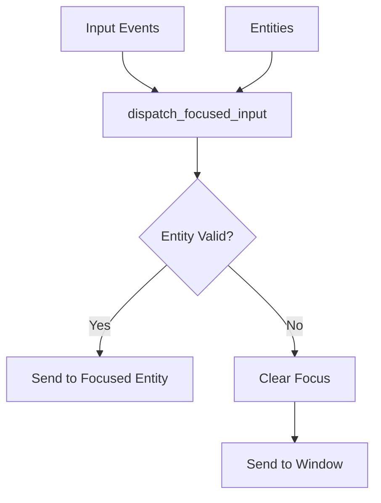

+++
title = "#20227 Fix panic when focused entity is despawned"
date = "2025-07-22T00:00:00"
draft = false
template = "pull_request_page.html"
in_search_index = false

[extra]
current_language = "zh-cn"
available_languages = {"en" = { name = "English", url = "/pull_request/bevy/2025-07/pr-20227-en-20250722" }, "zh-cn" = { name = "中文", url = "/pull_request/bevy/2025-07/pr-20227-zh-cn-20250722" }}
+++

## Fix panic when focused entity is despawned

### 基本信息
- **标题**: Fix panic when focused entity is despawned
- **PR链接**: https://github.com/bevyengine/bevy/pull/20227
- **作者**: muddxyii
- **状态**: 已合并
- **标签**: C-Bug, P-Crash, A-UI, S-Ready-For-Final-Review, X-Uncontroversial, D-Straightforward
- **创建时间**: 2025-07-21T16:00:03Z
- **合并时间**: 2025-07-21T23:51:20Z
- **合并者**: alice-i-cecile

### 描述翻译

# Objective

- 修复当输入分发系统尝试在已销毁的焦点实体上触发事件时导致的panic
- 修复 #20057

## Solution

- 在`dispatch_focused_input`函数中添加实体有效性检查，使用`entities.contains(focused_entity)`
- 如果焦点实体不再存在，则清除焦点并将事件分发到窗口

## Testing

- 添加测试`dispatch_clears_focus_when_focused_entity_despawned`来复现问题场景

### 技术实现过程

该PR解决了一个UI输入处理中的关键崩溃问题。在Bevy引擎中，当拥有输入焦点(input focus)的实体被销毁(despawn)后，输入事件分发系统仍会尝试向该实体发送事件，导致无效实体访问和panic。具体问题场景发生在`dispatch_focused_input`系统处理输入事件时，当焦点实体已被销毁但焦点状态未更新时。

解决方案的核心是在事件分发前增加实体有效性检查。修改后的`dispatch_focused_input`系统现在接收`Entities`资源作为参数，用于检查焦点实体是否仍然存在：

```rust
// 修改后函数签名
pub fn dispatch_focused_input<E: BufferedEvent + Clone>(
    mut key_events: EventReader<E>,
    mut focus: ResMut<InputFocus>,  // 改为可变引用
    windows: Query<Entity, With<PrimaryWindow>>,
    entities: &Entities,  // 新增实体管理器参数
    mut commands: Commands,
)
```

关键逻辑修改发生在焦点实体处理分支。原先直接向焦点实体分发事件的代码，现在被包裹在实体存在性检查中：

```rust
if let Some(focused_entity) = focus.0 {
    // 新增存在性检查
    if entities.contains(focused_entity) {
        // 原有分发逻辑
        for ev in key_events.read() {
            commands.trigger_targets( ... , focused_entity);
        }
    } else {
        // 实体不存在时的处理
        focus.0 = None;  // 清除焦点状态
        // 将事件分发到主窗口
        for ev in key_events.read() {
            commands.trigger_targets( ... , window);
        }
    }
} else { ... }
```

这个修改引入了两个重要行为变化：
1. 当检测到焦点实体不存在时，自动清除`InputFocus`资源中的焦点状态
2. 将待处理输入事件重定向到主窗口，确保事件不会丢失

为验证修复效果，新增了针对性测试用例。该测试模拟了焦点实体被销毁后触发输入事件的场景：

```rust
#[test]
fn dispatch_clears_focus_when_focused_entity_despawned() {
    // 初始化环境
    let mut app = App::new();
    app.add_plugins((InputPlugin, InputDispatchPlugin));
    
    // 创建窗口和焦点实体
    app.world_mut().spawn((Window::default(), PrimaryWindow));
    let entity = app.world_mut().spawn_empty().id();
    app.world_mut().insert_resource(InputFocus::from_entity(entity));
    
    // 销毁焦点实体但保持焦点状态
    app.world_mut().entity_mut(entity).despawn();
    assert_eq!(app.world().resource::<InputFocus>().0, Some(entity));
    
    // 触发输入事件并验证
    app.world_mut().write_event(key_a_event());  // 发送键盘事件
    app.update();  // 执行系统
    
    // 焦点应被自动清除
    assert_eq!(app.world().resource::<InputFocus>().0, None);
}
```

该测试确认了三个关键行为：
1. 销毁实体后焦点状态仍被保留（初始状态）
2. 输入事件处理不会导致panic
3. 系统自动清除无效焦点状态

### 组件关系



### 关键文件变更

**crates/bevy_input_focus/src/lib.rs** (+52/-9)  
该文件包含输入焦点管理的核心逻辑，主要变更在事件分发系统。

1. 修改函数签名，新增实体管理器参数：
```rust
// Before:
pub fn dispatch_focused_input<E: BufferedEvent + Clone>(
    mut key_events: EventReader<E>,
    focus: Res<InputFocus>,
    windows: Query<Entity, With<PrimaryWindow>>,
    mut commands: Commands,
)

// After:
pub fn dispatch_focused_input<E: BufferedEvent + Clone>(
    mut key_events: EventReader<E>,
    mut focus: ResMut<InputFocus>,  // 改为可变引用
    windows: Query<Entity, With<PrimaryWindow>>,
    entities: &Entities,  // 新增参数
    mut commands: Commands,
)
```

2. 增加实体存在性检查逻辑：
```rust
// Before:
if let Some(focused_entity) = focus.0 {
    for ev in key_events.read() {
        commands.trigger_targets( ... , focused_entity);
    }
}

// After:
if let Some(focused_entity) = focus.0 {
    if entities.contains(focused_entity) {
        // 分发到实体
    } else {
        focus.0 = None;  // 清除焦点
        // 分发到窗口
    }
}
```

3. 新增测试用例验证修复：
```rust
#[test]
fn dispatch_clears_focus_when_focused_entity_despawned() {
    // 测试设置代码
    ...
    
    // 关键验证点
    assert_eq!(app.world().resource::<InputFocus>().0, None);
}
```

### 延伸阅读

1. [Bevy ECS实体生命周期文档](https://bevyengine.org/learn/book/ecs/entity/)  
2. [系统参数使用指南](https://bevyengine.org/learn/book/ecs/system-params/)  
3. [相关Issue #20057](https://github.com/bevyengine/bevy/issues/20057)