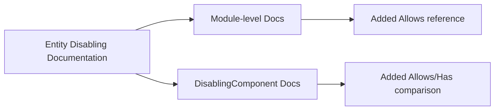

+++
title = "#20228 Add quick notes about Allows"
date = "2025-07-22T00:00:00"
draft = false
template = "pull_request_page.html"
in_search_index = true

[taxonomies]
list_display = ["show"]

[extra]
current_language = "en"
available_languages = {"en" = { name = "English", url = "/pull_request/bevy/2025-07/pr-20228-en-20250722" }, "zh-cn" = { name = "中文", url = "/pull_request/bevy/2025-07/pr-20228-zh-cn-20250722" }}
labels = ["C-Docs", "D-Trivial", "A-ECS"]
+++

# PR Analysis: Add quick notes about Allows

## Basic Information
- **Title**: Add quick notes about Allows
- **PR Link**: https://github.com/bevyengine/bevy/pull/20228
- **Author**: alice-i-cecile
- **Status**: MERGED
- **Labels**: C-Docs, D-Trivial, A-ECS, S-Ready-For-Final-Review
- **Created**: 2025-07-21T18:20:02Z
- **Merged**: 2025-07-21T23:56:52Z
- **Merged By**: alice-i-cecile

## Description Translation
# Objective

- `Allows` was added as a handy tool to work with default query filters.
- It wasn't in the docs though, and I had to hunt it down while reviewing #20204.

## Solution

- Add some breadcrumbs to the docs in the expected places.

## The Story of This Pull Request

### The Problem and Context
When reviewing PR #20204, the author discovered that the `Allows` query filter - a utility designed to work with Bevy's default query filters - wasn't properly documented. This posed a discoverability issue for developers working with entity disabling patterns in Bevy's ECS. Without explicit documentation references, developers might not know about this tool when reading about entity disabling functionality, potentially leading them to reinvent solutions or use less optimal patterns.

### The Solution Approach
The author addressed this documentation gap by adding concise references to `Allows` in two strategic locations within Bevy's entity disabling documentation. The approach was straightforward: insert clear, self-contained documentation blocks that explain `Allows` in relation to its relevant context. No code changes were needed since this was purely a documentation update. The author focused on placing these notes where developers would naturally encounter them while reading about entity disabling patterns.

### The Implementation
The implementation consisted of two documentation additions in `entity_disabling.rs`:

1. **Module-level documentation**: Added a brief note about `Allows` in the high-level entity disabling overview
2. **DisablingComponent documentation**: Added a more detailed explanation comparing `Allows` to the `Has` filter

Both additions include cross-references to relevant types in Bevy's API documentation. The changes are minimal but strategically placed to maximize discoverability.

### Technical Insights
The documentation highlights two important distinctions:

1. `Allows` is designed specifically for use with default query filters, ensuring queries include entities both with and without disabling components
2. `Allows` operates as a `QueryFilter` (affecting which entities are returned) while `Has` is `QueryData` (providing information about each entity)

This distinction is crucial because:
- Default query filters automatically exclude entities with disabling components
- `Allows` provides an explicit opt-out from this behavior
- `Has` allows conditional logic based on an entity's disabled status

### The Impact
These documentation updates improve developer experience by:
1. Making `Allows` discoverable in the context where it's most relevant
2. Clarifying when to use `Allows` versus `Has`
3. Providing immediate context about how `Allows` interacts with default query filters
4. Reducing the need for developers to search through source code to find this utility

The changes maintain consistency with Bevy's existing documentation style while filling a specific knowledge gap. No performance or functional changes were made to the codebase.

## Visual Representation



## Key Files Changed

### `crates/bevy_ecs/src/entity_disabling.rs` (+9/-0)
Added documentation references to `Allows` in two locations to improve discoverability.

**Change 1: Module-level documentation addition**
```rust
//! even if they have a `Position` component,
//! but `Query<&Position, With<Disabled>>` or `Query<(&Position, Has<Disabled>)>` will see them.
//!
//! The [`Allows`](crate::query::Allows) query filter is designed to be used with default query filters,
//! and ensures that the query will include entities both with and without the specified disabling component.
//!
//! Entities with disabling components are still present in the [`World`] and can be accessed directly,
```

**Change 2: DisablingComponent documentation addition**
```rust
/// To be more precise, this checks if the query's [`FilteredAccess`] contains the component,
/// and if it does not, adds a [`Without`](crate::prelude::Without) filter for that component to the query.
///
/// [`Allows`](crate::query::Allows) and [`Has`](crate::prelude::Has) can be used to include entities
/// with and without the disabling component.
/// [`Allows`](crate::query::Allows) is a [`QueryFilter`](crate::query::QueryFilter) and will simply change
/// the list of shown entities, while [`Has`](crate::prelude::Has) is a [`QueryData`](crate::query::QueryData)
/// and will allow you to see if each entity has the disabling component or not.
///
/// This resource is initialized in the [`World`] whenever a new world is created,
```

## Further Reading
1. [Bevy ECS Query System Documentation](https://bevyengine.org/learn/book/ecs/queries/)
2. [`Allows` API Reference](https://docs.rs/bevy_ecs/latest/bevy_ecs/query/struct.Allows.html)
3. [Default Query Filters in Bevy](https://docs.rs/bevy_ecs/latest/bevy_ecs/query/struct.Query.html#default-query-filters)
4. [Entity Disabling Patterns](https://github.com/bevyengine/bevy/blob/main/crates/bevy_ecs/src/entity_disabling.rs)

## Full Code Diff
```diff
diff --git a/crates/bevy_ecs/src/entity_disabling.rs b/crates/bevy_ecs/src/entity_disabling.rs
index 39d2aa27e8837..3b735a7607d73 100644
--- a/crates/bevy_ecs/src/entity_disabling.rs
+++ b/crates/bevy_ecs/src/entity_disabling.rs
@@ -44,6 +44,9 @@
 //! even if they have a `Position` component,
 //! but `Query<&Position, With<Disabled>>` or `Query<(&Position, Has<Disabled>)>` will see them.
 //!
+//! The [`Allows`](crate::query::Allows) query filter is designed to be used with default query filters,
+//! and ensures that the query will include entities both with and without the specified disabling component.
+//!
 //! Entities with disabling components are still present in the [`World`] and can be accessed directly,
 //! using methods on [`World`] or [`Commands`](crate::prelude::Commands).
 //!
@@ -111,6 +114,12 @@ pub struct Disabled;
 /// To be more precise, this checks if the query's [`FilteredAccess`] contains the component,
 /// and if it does not, adds a [`Without`](crate::prelude::Without) filter for that component to the query.
 ///
+/// [`Allows`](crate::query::Allows) and [`Has`](crate::prelude::Has) can be used to include entities
+/// with and without the disabling component.
+/// [`Allows`](crate::query::Allows) is a [`QueryFilter`](crate::query::QueryFilter) and will simply change
+/// the list of shown entities, while [`Has`](crate::prelude::Has) is a [`QueryData`](crate::query::QueryData)
+/// and will allow you to see if each entity has the disabling component or not.
+///
 /// This resource is initialized in the [`World`] whenever a new world is created,
 /// with the [`Disabled`] component as a disabling component.
 ///
```