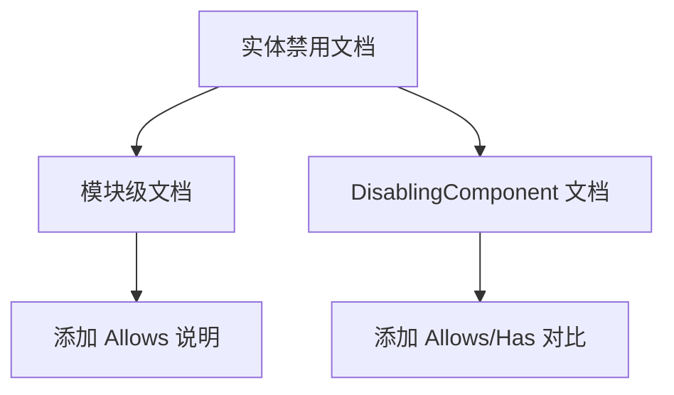

+++
title = "#20228 Add quick notes about Allows"
date = "2025-07-22T00:00:00"
draft = false
template = "pull_request_page.html"
in_search_index = false

[extra]
current_language = "zh-cn"
available_languages = {"en" = { name = "English", url = "/pull_request/bevy/2025-07/pr-20228-en-20250722" }, "zh-cn" = { name = "中文", url = "/pull_request/bevy/2025-07/pr-20228-zh-cn-20250722" }}
labels = ["C-Docs", "D-Trivial", "A-ECS"]
+++

# PR 分析报告：Add quick notes about Allows

## Basic Information
- **Title**: Add quick notes about Allows
- **PR Link**: https://github.com/bevyengine/bevy/pull/20228
- **Author**: alice-i-cecile
- **Status**: MERGED
- **Labels**: C-Docs, D-Trivial, A-ECS, S-Ready-For-Final-Review
- **Created**: 2025-07-21T18:20:02Z
- **Merged**: 2025-07-21T23:56:52Z
- **Merged By**: alice-i-cecile

## Description Translation
### 目标
- `Allows` 作为处理默认查询过滤器的便捷工具被添加
- 但文档中未提及，我在审查 #20204 时不得不自行查找

### 解决方案
- 在预期位置的文档中添加指引说明

## The Story of This Pull Request

### 问题和背景
在 Bevy 的 ECS(实体组件系统) 中，`Disabled` 组件用于标记被禁用的实体。默认情况下，标准查询会自动排除带有禁用组件的实体。虽然 Bevy 提供了 `Allows` 查询过滤器来覆盖此默认行为，但该工具未被包含在相关文档中。开发者在审查 PR #20204 时发现这个缺失，意识到缺乏文档会导致其他开发者难以发现和使用这个实用功能。

### 解决方案方法
解决方案直接明了：在 `entity_disabling.rs` 文件中添加两处文档注释：
1. 在模块级文档中简要说明 `Allows` 的作用
2. 在 `DisablingComponent` 资源的文档中详细解释 `Allows` 和 `Has` 的用法区别

这种方法确保开发者在查阅实体禁用功能文档时能自然发现 `Allows` 的存在和用途。

### 实现细节
实现完全通过文档注释完成，不涉及任何代码逻辑变更。第一处添加在模块文档中，位于禁用实体查询示例之后：

```rust
//! The [`Allows`](crate::query::Allows) query filter is designed to be used with default query filters,
//! and ensures that the query will include entities both with and without the specified disabling component.
```

第二处添加在 `DisablingComponent` 资源的文档中，位于默认行为说明之后：

```rust
/// [`Allows`](crate::query::Allows) and [`Has`](crate::prelude::Has) can be used to include entities
/// with and without the disabling component.
/// [`Allows`](crate::query::Allows) is a [`QueryFilter`](crate::query::QueryFilter) and will simply change
/// the list of shown entities, while [`Has`](crate::prelude::Has) is a [`QueryData`](crate::query::QueryData)
/// and will allow you to see if each entity has the disabling component or not.
```

这些注释明确区分了：
- `Allows` 作为查询过滤器(QueryFilter)的作用：修改实体可见性
- `Has` 作为查询数据(QueryData)的作用：提供每实体的禁用状态

### 技术要点
该 PR 澄清了两个关键概念：
1. **默认过滤行为**：Bevy 自动添加 `Without<Disabled>` 过滤器排除禁用实体
2. **覆盖方法**：使用 `Allows<Disabled>` 显式包含禁用实体
3. **状态检测**：使用 `Has<Disabled>` 获取每实体的禁用状态

文档特别强调了 `Allows` 与默认查询过滤器的配合使用场景，这是其设计的主要目的。

### 影响
这些文档更新带来以下改进：
1. **提高可发现性**：开发者现在能在相关上下文中找到 `Allows` 的用法
2. **明确概念区分**：清晰区分查询过滤器(`Allows`)和查询数据(`Has`)的不同用途
3. **减少认知负担**：无需通过代码或 issue 追踪即可理解功能用法

技术启示：即使小型工具类功能也需要及时文档化，否则会增加使用者的认知成本。

## Visual Representation



## Key Files Changed

### crates/bevy_ecs/src/entity_disabling.rs
**修改原因**：补充 `Allows` 查询过滤器的文档说明  
**关键修改**：添加两处文档注释块

```rust
// 修改位置 1：模块级文档
// Before:
//! even if they have a `Position` component,
//! but `Query<&Position, With<Disabled>>` or `Query<(&Position, Has<Disabled>)>` will see them.
//!
//! Entities with disabling components are still present in the [`World`] and can be accessed directly,

// After:
//! even if they have a `Position` component,
//! but `Query<&Position, With<Disabled>>` or `Query<(&Position, Has<Disabled>)>` will see them.
//!
//! The [`Allows`](crate::query::Allows) query filter is designed to be used with default query filters,
//! and ensures that the query will include entities both with and without the specified disabling component.
//!
//! Entities with disabling components are still present in the [`World`] and can be accessed directly,
```

```rust
// 修改位置 2：DisablingComponent 文档
// Before:
/// To be more precise, this checks if the query's [`FilteredAccess`] contains the component,
/// and if it does not, adds a [`Without`](crate::prelude::Without) filter for that component to the query.
///
/// This resource is initialized in the [`World`] whenever a new world is created,

// After:
/// To be more precise, this checks if the query's [`FilteredAccess`] contains the component,
/// and if it does not, adds a [`Without`](crate::prelude::Without) filter for that component to the query.
///
/// [`Allows`](crate::query::Allows) and [`Has`](crate::prelude::Has) can be used to include entities
/// with and without the disabling component.
/// [`Allows`](crate::query::Allows) is a [`QueryFilter`](crate::query::QueryFilter) and will simply change
/// the list of shown entities, while [`Has`](crate::prelude::Has) is a [`QueryData`](crate::query::QueryData)
/// and will allow you to see if each entity has the disabling component or not.
///
/// This resource is initialized in the [`World`] whenever a new world is created,
```

## Further Reading
1. [Bevy 查询系统官方文档](https://docs.rs/bevy_ecs/latest/bevy_ecs/system/struct.Query.html)
2. [实体禁用 RFC](https://github.com/bevyengine/rfcs/blob/main/rfcs/45-entity-disabling.md)
3. [默认查询过滤器实现](https://github.com/bevyengine/bevy/blob/main/crates/bevy_ecs/src/query/filter.rs)