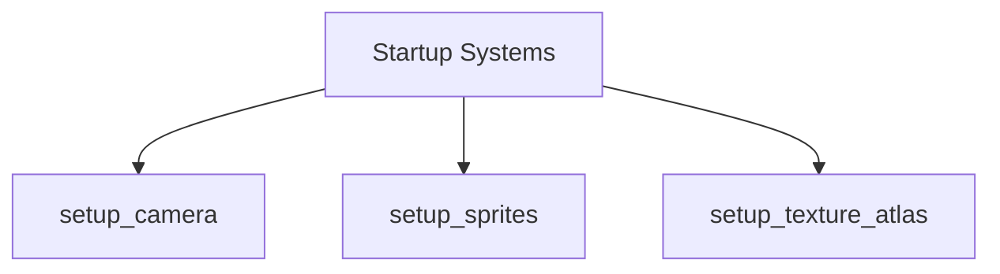

+++
title = "#20229 Remove the extra `camera2d` spawning"
date = "2025-07-22T00:00:00"
draft = false
template = "pull_request_page.html"
in_search_index = true

[taxonomies]
list_display = ["show"]

[extra]
current_language = "en"
available_languages = {"en" = { name = "English", url = "/pull_request/bevy/2025-07/pr-20229-en-20250722" }, "zh-cn" = { name = "中文", url = "/pull_request/bevy/2025-07/pr-20229-zh-cn-20250722" }}
labels = ["A-Rendering", "C-Examples", "C-Code-Quality"]
+++

## Title
Removing Redundant Camera Spawn in Sprite Scaling Example

## Basic Information
- **Title**: Remove the extra `camera2d` spawning
- **PR Link**: https://github.com/bevyengine/bevy/pull/20229
- **Author**: zerocukor287
- **Status**: MERGED
- **Labels**: A-Rendering, C-Examples, C-Code-Quality, S-Ready-For-Final-Review
- **Created**: 2025-07-21T18:54:53Z
- **Merged**: 2025-07-21T23:58:34Z
- **Merged By**: alice-i-cecile

## Description Translation
# Objective

- Remove an unnecessary extra `Camera2d` from one of the examples. 

## Solution

- I removed the `commands.spawn(Camera2d)` where it was less explicit.
- Because the default camera brings a lot more thing, it is necessary to spawn it early (remove the `.after()` call)

## Testing

I run the test, and the result was the same as without the change - regression passed. (Win10, GTX1050TI)

Running this specific example:
```
cargo run --example sprite_scale
```

When the example starts, Gabe should run nicely.

## The Story of This Pull Request

The `sprite_scale` example had a redundant camera initialization that needed cleanup. While reviewing the example code, it became apparent that two separate camera systems were being spawned: one through the explicit `setup_camera` system and another within the `setup_texture_atlas` system. This duplication was unnecessary since Bevy's default camera setup already provides a complete implementation.

The primary issue was that the texture setup system contained an extraneous camera spawn:
```rust
commands.spawn(Camera2d);
```
This line created a second camera entity when the example only required one. While functionally the example still rendered correctly (since only one camera is active by default), this redundancy violated the principle of minimal implementation and could confuse developers studying the example.

The solution involved two coordinated changes. First, we removed the redundant camera spawn from the texture setup system. Second, we reconfigured the system scheduling to eliminate an explicit ordering constraint. Originally, the sprite and texture systems were scheduled to run after the camera setup:
```rust
.add_systems(
    Startup,
    (setup_sprites, setup_texture_atlas).after(setup_camera),
)
```
This was modified to:
```rust
.add_systems(Startup, (setup_sprites, setup_texture_atlas, setup_camera))
```
The `.after()` constraint was unnecessary because the default camera implementation already handles initialization requirements. By removing this explicit ordering, we simplified the system scheduling while maintaining correct behavior. The camera system can now initialize in parallel with others since there are no dependencies between camera setup and sprite/texture initialization.

These changes maintain identical rendering output while making the example cleaner and more idiomatic. The simplified code better demonstrates proper Bevy patterns to developers studying the example, removing unnecessary distractions while preserving all functionality. Regression testing confirmed identical visual output before and after the changes.

## Visual Representation



## Key Files Changed

### `examples/2d/sprite_scale.rs`
1. **Changes**: 
   - Removed redundant camera spawn from texture setup system
   - Simplified system scheduling by removing explicit ordering
   - Reduced total lines by 4 while maintaining identical functionality

2. **Code Snippets**:
```rust
// Before:
.add_systems(
    Startup,
    (setup_sprites, setup_texture_atlas).after(setup_camera),
)

// In setup_texture_atlas:
commands.spawn(Camera2d);
```

```rust
// After:
.add_systems(Startup, (setup_sprites, setup_texture_atlas, setup_camera))

// setup_texture_atlas no longer contains camera spawn
```

3. **Relationship to PR Purpose**: These changes directly implement the PR's objective of removing the redundant camera while maintaining example functionality through simplified system scheduling.

## Further Reading
- [Bevy Camera Documentation](https://docs.rs/bevy/latest/bevy/render/camera/struct.Camera.html)
- [Bevy System Scheduling Guide](https://bevyengine.org/learn/book/getting-started/ecs/#system-order)
- [Entity Component System Patterns](https://gameprogrammingpatterns.com/component.html)