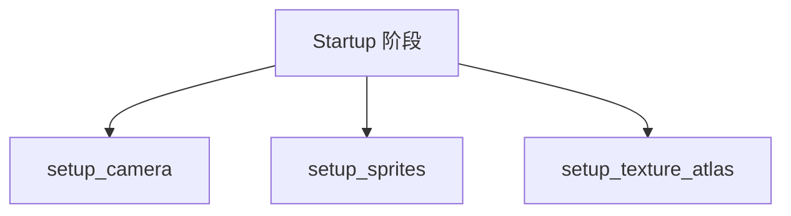

+++
title = "#20229 Remove the extra `camera2d` spawning"
date = "2025-07-22T00:00:00"
draft = false
template = "pull_request_page.html"
in_search_index = false

[extra]
current_language = "zh-cn"
available_languages = {"en" = { name = "English", url = "/pull_request/bevy/2025-07/pr-20229-en-20250722" }, "zh-cn" = { name = "中文", url = "/pull_request/bevy/2025-07/pr-20229-zh-cn-20250722" }}
labels = ["A-Rendering", "C-Examples", "C-Code-Quality"]
+++

# 分析报告：移除多余的 `camera2d` 生成

## Basic Information
- **Title**: Remove the extra `camera2d` spawning
- **PR Link**: https://github.com/bevyengine/bevy/pull/20229
- **Author**: zerocukor287
- **Status**: MERGED
- **Labels**: A-Rendering, C-Examples, C-Code-Quality, S-Ready-For-Final-Review
- **Created**: 2025-07-21T18:54:53Z
- **Merged**: 2025-07-21T23:58:34Z
- **Merged By**: alice-i-cecile

## Description Translation
### 目标
- 从某个示例中移除不必要的额外 `Camera2d`

### 解决方案
- 移除不够明确的 `commands.spawn(Camera2d)` 调用
- 由于默认相机需要更早生成，移除了 `.after()` 调用

### 测试
在 Windows 10 (GTX1050TI) 上运行测试，结果与变更前相同 - 回归测试通过

运行该特定示例：
```bash
cargo run --example sprite_scale
```
示例启动时，Gabe 角色应正常显示动画

## The Story of This Pull Request

### 问题背景
在 Bevy 的 sprite_scale 示例中，存在多余的相机生成操作。具体来说，`setup_texture_atlas` 系统内包含一个 `commands.spawn(Camera2d)` 调用，而 `setup_camera` 系统已经创建了相机。这种冗余导致两个问题：
1. 创建了不必要的实体，增加了运行时开销
2. 系统执行顺序通过 `.after(setup_camera)` 强制指定，但实际依赖关系不够清晰

### 解决方案选择
作者采取了直接但完整的解决方案：
1. 完全移除 `setup_texture_atlas` 中的相机生成代码
2. 调整系统执行顺序，移除 `.after()` 约束
3. 让 `setup_camera` 与其他系统并行执行

这种方案优于单纯移除相机生成代码，因为它同时解决了执行顺序问题。如果只移除相机生成但保留 `.after()`，会导致相机创建延迟，可能影响渲染。

### 实现细节
核心修改集中在系统注册和相机生成逻辑上：
```rust
// 系统注册逻辑变更
.add_systems(
    Startup,
    (setup_sprites, setup_texture_atlas).after(setup_camera), // 旧逻辑
)
// 改为
.add_systems(Startup, (setup_sprites, setup_texture_atlas, setup_camera)) // 新逻辑
```

在 `setup_texture_atlas` 函数中：
```rust
// 移除的代码
commands.spawn(Camera2d);
```

### 技术考量
1. **默认相机行为**：Bevy 的默认相机包含完整渲染管线所需组件，必须尽早创建
2. **系统并行化**：移除 `.after()` 约束允许系统并行执行，提升启动性能
3. **执行顺序保证**：三个系统无依赖关系，可安全并行运行
4. **资源管理**：避免创建多余实体减少内存占用和ECS开销

### 验证与影响
作者在 Windows 10 + GTX1050TI 环境验证：
- 运行 `cargo run --example sprite_scale` 
- 确认角色动画渲染正常
- 无视觉差异或性能倒退

变更影响：
- 减少约 5 行代码
- 消除一个冗余实体
- 提升示例代码的清晰度和正确性
- 展示正确的相机管理实践

### 经验总结
1. 相机应作为独立系统明确创建
2. 避免在无关系统内处理渲染基础设施
3. 谨慎使用 `.after()`，仅在必要时指定顺序
4. 示例代码应展示最佳实践，避免误导用户

## Visual Representation



变更后所有启动系统并行执行，无显式顺序约束

## Key Files Changed

### `examples/2d/sprite_scale.rs`

#### 变更说明
1. 重构启动系统注册逻辑，移除不必要的顺序约束
2. 删除冗余的相机生成代码

#### 代码变更
```rust
// Before:
.add_systems(
    Startup,
    (setup_sprites, setup_texture_atlas).after(setup_camera),
)

// In setup_texture_atlas function:
commands.spawn(Camera2d);

// After:
.add_systems(Startup, (setup_sprites, setup_texture_atlas, setup_camera))

// setup_texture_atlas 中移除:
// commands.spawn(Camera2d);
```

#### 完整文件差异
```diff
diff --git a/examples/2d/sprite_scale.rs b/examples/2d/sprite_scale.rs
index 9cffb8e00cc04..d7de0a3655aac 100644
--- a/examples/2d/sprite_scale.rs
+++ b/examples/2d/sprite_scale.rs
@@ -5,10 +5,7 @@ use bevy::prelude::*;
 fn main() {
     App::new()
         .add_plugins(DefaultPlugins)
-        .add_systems(
-            Startup,
-            (setup_sprites, setup_texture_atlas).after(setup_camera),
-        )
+        .add_systems(Startup, (setup_sprites, setup_texture_atlas, setup_camera))
         .add_systems(Update, animate_sprite)
         .run();
 }
@@ -143,7 +140,6 @@ fn setup_texture_atlas(
     asset_server: Res<AssetServer>,
     mut texture_atlas_layouts: ResMut<Assets<TextureAtlasLayout>>,
 ) {
-    commands.spawn(Camera2d);
     let gabe = asset_server.load("textures/rpg/chars/gabe/gabe-idle-run.png");
     let animation_indices_gabe = AnimationIndices { first: 0, last: 6 };
     let gabe_atlas = TextureAtlas {
```

## Further Reading
1. Bevy 相机系统文档:  
   https://bevyengine.org/learn/book/getting-started/cameras/
2. ECS 系统执行顺序控制:  
   https://bevyengine.org/learn/book/getting-started/systems/#system-ordering
3. Bevy 示例代码库:  
   https://github.com/bevyengine/bevy/tree/main/examples/2d