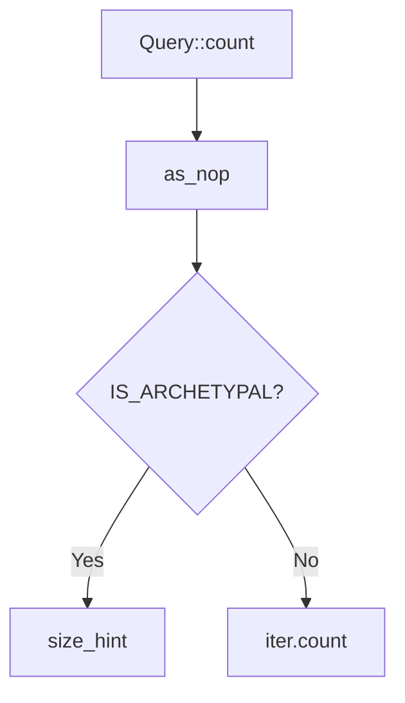

+++
title = "#20230 Add a `Query::count()` method."
date = "2025-07-22T00:00:00"
draft = false
template = "pull_request_page.html"
in_search_index = false

[extra]
current_language = "zh-cn"
available_languages = {"en" = { name = "English", url = "/pull_request/bevy/2025-07/pr-20230-en-20250722" }, "zh-cn" = { name = "中文", url = "/pull_request/bevy/2025-07/pr-20230-zh-cn-20250722" }}
+++

## 基本情报
- **标题**: Add a `Query::count()` method.
- **PR链接**: https://github.com/bevyengine/bevy/pull/20230
- **作者**: chescock
- **状态**: 已合并
- **标签**: C-Feature, A-ECS, S-Ready-For-Final-Review, D-Straightforward
- **创建时间**: 2025-07-21T19:04:04Z
- **合并时间**: 2025-07-21T23:59:33Z
- **合并者**: alice-i-cecile

## 描述翻译
### 目标
使开发者能高效地统计匹配查询的实体数量。

### 解决方案
实现 `Query::count()` 方法。

使用 `as_nop()` 跳过 fetch state 的初始化，类似于 `is_empty()` 和 `contains()` 的处理方式。

如果过滤器是原型过滤(archetypal)，调用 `size_hint()` 直接获取数量而无需迭代。否则使用常规的 `count()` 方法。

## PR 技术分析

### 问题背景
在 Bevy ECS 系统中，开发者经常需要统计符合特定条件的实体数量。现有方案是通过 `query.iter().count()` 实现，但这存在两个效率问题：
1. 即使只需计数，系统仍需初始化完整的查询状态
2. 当查询包含非原型过滤器(non-archetypal filters)时，必须遍历所有实体

这导致在需要频繁计数的场景（如AI目标选择、UI计数显示）产生不必要的性能开销。特别是当查询包含复杂过滤器时，遍历操作可能成为性能瓶颈。

### 解决方案设计
新增的 `count()` 方法采用条件优化策略：
1. **通用优化**：使用 `as_nop()` 避免初始化完整查询状态，与现有 `is_empty()` 方法保持一致
2. **原型过滤特化**：当过滤器满足 `F::IS_ARCHETYPAL` 条件时，直接通过 `size_hint().0` 获取精确计数
3. **通用回退**：非原型过滤时降级到标准 `iter().count()` 实现

这种分层优化确保：
- 原型查询获得O(1)时间复杂度
- 非原型查询保持原有正确性
- API 与现有方法保持一致性

### 技术实现
核心实现在 `query.rs` 文件中添加了 `count()` 方法：

```rust
// File: crates/bevy_ecs/src/system/query.rs
pub fn count(&self) -> usize {
    let iter = self.as_nop().into_iter();
    if F::IS_ARCHETYPAL {
        // 原型查询直接返回精确数量
        iter.size_hint().0
    } else {
        // 非原型查询遍历计数
        iter.count()
    }
}
```
关键实现细节：
1. `as_nop().into_iter()` 创建无操作迭代器，跳过组件数据初始化
2. `F::IS_ARCHETYPAL` 标记过滤器是否仅基于原型（不影响实体级迭代）
3. `size_hint().0` 对于原型查询可提供精确计数

### 性能考量
方法设计时考虑了不同场景的性能特征：
- **原型查询**：直接访问Archetype/Table元数据，时间复杂度为O(m)（m为匹配的原型数量）
- **非原型查询**：时间复杂度为O(n)（n为实体总数），但避免初始化完整查询状态

文档明确说明性能特征，防止误用：
```rust
/// If [`F::IS_ARCHETYPAL`](QueryFilter::IS_ARCHETYPAL) is `true`,
/// this will do work proportional to the number of matched archetypes or tables...
/// If it is `false`, it will have to do work for each entity.
```

### 实际影响
1. **API改进**：提供符合直觉的计数方法，替代冗长的 `iter().count()` 写法
2. **性能提升**：原型查询场景避免实体迭代开销
3. **模式统一**：与现有 `is_empty()` 方法共享优化模式

示例用法展示典型场景：
```rust
fn targeting_system(in_range_query: Query<&InRange>) {
    let count = in_range_query.count();
    println!("{count} targets in range!");
}
```

## 组件关系图



## 关键文件变更

### `crates/bevy_ecs/src/system/query.rs`
新增 `count()` 方法实现，提供优化的实体计数功能：

```rust
/// Counts the number of entities that match the query.
///
/// This is equivalent to `self.iter().count()` but may be more efficient...
pub fn count(&self) -> usize {
    let iter = self.as_nop().into_iter();
    if F::IS_ARCHETYPAL {
        iter.size_hint().0
    } else {
        iter.count()
    }
}
```

## 扩展阅读
1. [Bevy ECS 查询文档](https://docs.rs/bevy_ecs/latest/bevy_ecs/system/struct.Query.html)
2. [原型过滤技术说明](https://github.com/bevyengine/bevy/blob/main/docs/ecs_design.md#archetypal-queries)
3. [迭代器 size_hint 机制](https://doc.rust-lang.org/std/iter/trait.Iterator.html#method.size_hint)