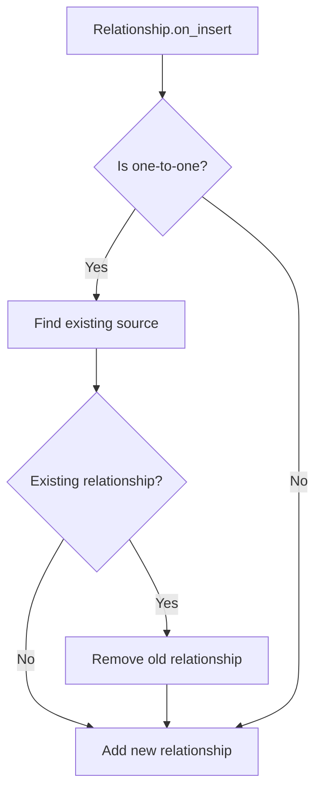

+++
title = "#20232 Rework one-to-one relationships to remove existing instead of panicking"
date = "2025-07-23T00:00:00"
draft = false
template = "pull_request_page.html"
in_search_index = true

[taxonomies]
list_display = ["show"]

[extra]
current_language = "en"
available_languages = {"en" = { name = "English", url = "/pull_request/bevy/2025-07/pr-20232-en-20250723" }, "zh-cn" = { name = "中文", url = "/pull_request/bevy/2025-07/pr-20232-zh-cn-20250723" }}
labels = ["C-Bug", "A-ECS", "P-Crash"]
+++

# Analysis of PR #20232: Rework one-to-one relationships to remove existing instead of panicking

## Basic Information
- **Title**: Rework one-to-one relationships to remove existing instead of panicking
- **PR Link**: https://github.com/bevyengine/bevy/pull/20232
- **Author**: muddxyii
- **Status**: MERGED
- **Labels**: C-Bug, A-ECS, P-Crash, S-Ready-For-Final-Review, X-Uncontroversial
- **Created**: 2025-07-21T19:13:01Z
- **Merged**: 2025-07-23T18:13:46Z
- **Merged By**: alice-i-cecile

## Description Translation
# Objective

- Issue: #18847 
- Resolves panic when establishing a one-to-one relationship to an entity that already has an existing relationship from another entity.

## Solution

- Modified the `on_insert` hook in the `Relationship` trait to detect one-to-one relationships (where the target collection type is `Entity`) and automatically remove any existing relationship before establishing the new one.
- Uses runtime type checking with `TypeId` to identify one-to-one vs one-to-many relationships.
- Safely removes the existing source relationship using `try_remove()` to handle edge cases gracefully.

## Testing

- Removed panic assertions from `Entity::add()` and `Entity::extend_from_iter()` methods that would previously crash when attempting to establish overlapping one-to-one relationships
- Modified existing test `one_to_one_relationship_shared_target` by removing `#[should_panic]` and adding assertions to verify:
  - Original relationship is properly removed
  - New relationship is correctly established
  - Target entity points to the new source

## The Story of This Pull Request

### The Problem
The ECS relationship system had a critical flaw in handling one-to-one relationships. When multiple entities attempted to establish relationships with the same target entity, the system would panic due to an assertion failure. This violated the principle of least surprise and caused crashes in real-world scenarios where relationships needed to be dynamically reassigned.

The root cause was in the relationship source collection implementation for one-to-one relationships (represented by `Entity`). The `add()` and `extend_from_iter()` methods contained assertions that enforced the target must not have an existing relationship:

```rust
// Before implementation
fn add(&mut self, entity: Entity) -> bool {
    assert_eq!(
        *self,
        Entity::PLACEHOLDER,
        "Entity {entity} attempted to target an entity with a one-to-one relationship..."
    );
    *self = entity;
    true
}
```

These assertions were overly restrictive and didn't match common use cases where relationships need to be transferred between entities.

### The Solution Approach
Instead of panicking, the solution automatically removes conflicting relationships before establishing new ones. The approach:

1. Identifies one-to-one relationships at runtime by checking if the target collection type is `Entity`
2. Locates any existing relationship source for the target entity
3. Safely removes the previous relationship using `try_remove()` (gracefully handling missing entities)
4. Establishes the new relationship

The implementation uses a new method `source_to_remove_before_add()` in the `RelationshipSourceCollection` trait to abstract the difference between one-to-one and one-to-many relationships.

### Implementation Details
The core changes happen in two key areas:

1. **Relationship hook modification** (`relationship/mod.rs`):  
   Added logic in `on_insert` to detect and remove conflicting relationships:

```rust
// New logic in on_insert hook
let current_source_to_remove = world
    .get_entity(target_entity)
    .ok()
    .and_then(|target_entity_ref| target_entity_ref.get::<Self::RelationshipTarget>())
    .and_then(|relationship_target| {
        relationship_target
            .collection()
            .source_to_remove_before_add()
    });

if let Some(current_source) = current_source_to_remove {
    world.commands().entity(current_source).try_remove::<Self>();
}
```

2. **Relationship source behavior** (`relationship_source_collection.rs`):  
   Implemented the new method for `Entity` (one-to-one) and removed panic assertions:

```rust
// Before: Panic on conflict
fn add(&mut self, entity: Entity) -> bool {
    assert_eq!(...); // Removed
    *self = entity;
    true
}

// After: New conflict detection
fn source_to_remove_before_add(&self) -> Option<Entity> {
    if *self != Entity::PLACEHOLDER {
        Some(*self)
    } else {
        None
    }
}
```

### Testing Strategy
The test case was refactored to verify the new behavior instead of expecting a panic:

```rust
#[test]
fn one_to_one_relationship_shared_target() {
    // ...setup...
    world.entity_mut(a).insert(Above(c));
    world.entity_mut(b).insert(Above(c));
    
    // Verification
    assert!(world.get::<Above>(a).is_none());
    assert_eq!(world.get::<Above>(b).unwrap().0, c);
    assert_eq!(world.get::<Below>(c).unwrap().0, b);
}
```

### Technical Insights
Key design decisions:
- **Runtime type checking**: Using `TypeId` avoids complex trait specialization while maintaining clear separation between one-to-one and one-to-many relationships
- **Graceful removal**: `try_remove()` prevents cascading failures if the previous source entity was despawned
- **Command deferral**: Works correctly with Bevy's command queue system
- **Placeholder handling**: Maintains the `Entity::PLACEHOLDER` convention for unset relationships

### Impact
This change:
1. Eliminates a common panic scenario in relationship management
2. Makes relationship assignment more intuitive (last writer wins)
3. Maintains backward compatibility while fixing behavior
4. Preserves the existing API surface area

The solution demonstrates good use of trait composition to extend functionality without breaking existing contracts. The `try_remove()` approach shows thoughtful error handling where complete validation would be impractical.

## Visual Representation



## Key Files Changed

### `crates/bevy_ecs/src/relationship/mod.rs` (+30/-14)
Added conflict resolution logic to relationship insertion:
```rust
// New conflict detection and removal
let current_source_to_remove = world
    .get_entity(target_entity)
    .ok()
    .and_then(|target_entity_ref| target_entity_ref.get::<Self::RelationshipTarget>())
    .and_then(|relationship_target| {
        relationship_target
            .collection()
            .source_to_remove_before_add()
    });

if let Some(current_source) = current_source_to_remove {
    world.commands().entity(current_source).try_remove::<Self>();
}
```

### `crates/bevy_ecs/src/relationship/relationship_source_collection.rs` (+15/-0)
Modified one-to-one relationship handling:
```rust
// Before (removed):
assert_eq!(*self, Entity::PLACEHOLDER, ...);

// After (new method):
fn source_to_remove_before_add(&self) -> Option<Entity> {
    if *self != Entity::PLACEHOLDER {
        Some(*self)
    } else {
        None
    }
}
```

## Further Reading
1. [Bevy ECS Relationships Documentation](https://bevyengine.org/learn/book/ecs/relationships/)
2. [Entity Component System Pattern](https://en.wikipedia.org/wiki/Entity_component_system)
3. [Rust TypeId Documentation](https://doc.rust-lang.org/std/any/struct.TypeId.html)