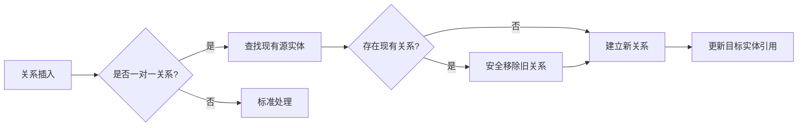

+++
title = "#20232 Rework one-to-one relationships to remove existing instead of panicking"
date = "2025-07-23T00:00:00"
draft = false
template = "pull_request_page.html"
in_search_index = false

[extra]
current_language = "zh-cn"
available_languages = {"en" = { name = "English", url = "/pull_request/bevy/2025-07/pr-20232-en-20250723" }, "zh-cn" = { name = "中文", url = "/pull_request/bevy/2025-07/pr-20232-zh-cn-20250723" }}
+++

# PR分析报告：一对一关系重构 - 移除现有关系而非panic

## 基本信息
- **标题**: Rework one-to-one relationships to remove existing instead of panicking
- **PR链接**: https://github.com/bevyengine/bevy/pull/20232
- **作者**: muddxyii
- **状态**: 已合并
- **标签**: C-Bug, A-ECS, P-Crash, S-Ready-For-Final-Review, X-Uncontroversial
- **创建时间**: 2025-07-21T19:13:01Z
- **合并时间**: 2025-07-23T18:13:46Z
- **合并人**: alice-i-cecile

## 描述翻译
### 目标
- 问题: #18847
- 解决当多个实体尝试与已有关系的目标实体建立一对一关系时发生的panic

### 解决方案
- 修改`Relationship` trait中的`on_insert`钩子，使其能检测一对一关系（目标集合类型为`Entity`），并在建立新关系前自动移除现有关系
- 使用`TypeId`进行运行时类型检查以区分一对一和一对多关系
- 使用`try_remove()`安全移除现有源关系，优雅处理边界情况

### 测试
- 从`Entity::add()`和`Entity::extend_from_iter()`方法中移除panic断言，这些方法在尝试建立重叠的一对一关系时会导致崩溃
- 修改现有测试`one_to_one_relationship_shared_target`：
  - 移除`#[should_panic]`
  - 添加断言验证：
    - 原始关系被正确移除
    - 新关系被正确建立
    - 目标实体指向新的源

## PR的技术故事

### 问题与背景
在Bevy的ECS关系系统中，当多个实体尝试与同一个目标实体建立一对一关系时，系统会触发panic。这是因为一对一关系要求目标实体只能有一个源实体。原始实现使用断言强制此约束，导致应用程序在违反约束时崩溃（issue #18847）。这种设计不符合Bevy的容错原则，且限制了开发灵活性。

### 解决方案设计
核心思路是将约束检查从panic改为自动关系管理。当检测到新的一对一关系时，系统应：
1. 自动移除目标实体上现有的关系
2. 建立新关系
3. 更新目标实体的反向引用

设计决策：
- 使用运行时类型检查（`TypeId`）识别一对一关系
- 在关系组件插入时触发清理逻辑（`on_insert`钩子）
- 使用`try_remove()`避免移除不存在的组件
- 保留一对多关系现有行为不变

### 实现细节
修改集中在两个关键位置：

1. **关系插入逻辑**（`relationship/mod.rs`）：
```rust
// 检测一对一关系并清理现有关系
let current_source_to_remove = world
    .get_entity(target_entity)
    .ok()
    .and_then(|target_entity_ref| target_entity_ref.get::<Self::RelationshipTarget>())
    .and_then(|relationship_target| {
        relationship_target
            .collection()
            .source_to_remove_before_add()
    });

if let Some(current_source) = current_source_to_remove {
    world.commands().entity(current_source).try_remove::<Self>();
}
```
此代码段：
- 查询目标实体当前的关系组件
- 调用新增的`source_to_remove_before_add()`方法获取需清理的源实体
- 使用安全移除（`try_remove`）断开旧关系

2. **一对一关系处理**（`relationship_source_collection.rs`）：
```rust
// Entity类型的集合实现（代表一对一关系）
impl RelationshipSourceCollection for Entity {
    fn add(&mut self, entity: Entity) -> bool {
        *self = entity; // 直接覆盖原值
        true
    }

    fn source_to_remove_before_add(&self) -> Option<Entity> {
        if *self != Entity::PLACEHOLDER {
            Some(*self) // 返回现有源实体
        } else {
            None // 无现有关系
        }
    }
}
```
关键变更：
- 移除所有panic断言
- 实现`source_to_remove_before_add()`返回现有源实体
- 插入操作简化为直接赋值

### 技术考量
1. **类型安全**：通过`TypeId`动态检测集合类型，确保一对一逻辑仅应用于`Entity`集合
2. **错误处理**：使用`try_remove()`而非`remove()`避免实体不存在时panic
3. **性能**：运行时检查开销极小，因`TypeId`比较是常量操作
4. **向后兼容**：一对多关系逻辑保持不变，不影响现有代码

### 影响与验证
测试用例`one_to_one_relationship_shared_target`验证了核心场景：
```rust
#[test]
fn one_to_one_relationship_shared_target() {
    // 建立关系
    world.entity_mut(a).insert(Above(c));
    world.entity_mut(b).insert(Above(c));

    // 验证关系更新
    assert!(world.get::<Above>(a).is_none()); // 旧关系移除
    assert_eq!(world.get::<Above>(b).unwrap().0, c); // 新关系建立
    assert_eq!(world.get::<Below>(c).unwrap().0, b); // 目标指向新源
}
```
此变更：
- 消除了特定场景下的panic
- 保持了一对一关系的数据一致性
- 使API行为更符合开发者预期

## 可视化表示


## 关键文件变更

### crates/bevy_ecs/src/relationship/mod.rs
**变更原因**：在关系插入点添加一对一关系处理逻辑  
**代码变更**：
```diff
@@ -128,6 +128,21 @@ pub trait Relationship: Component + Sized {
             world.commands().entity(entity).remove::<Self>();
             return;
         }
+        // 一对一关系：添加新关系前移除现有关系
+        let current_source_to_remove = world
+            .get_entity(target_entity)
+            .ok()
+            .and_then(|target_entity_ref| target_entity_ref.get::<Self::RelationshipTarget>())
+            .and_then(|relationship_target| {
+                relationship_target
+                    .collection()
+                    .source_to_remove_before_add()
+            });
+
+        if let Some(current_source) = current_source_to_remove {
+            world.commands().entity(current_source).try_remove::<Self>();
+        }
+
         if let Ok(mut entity_commands) = world.commands().get_entity(target_entity) {
             // 批处理模式下需要延迟操作
             entity_commands
```

### crates/bevy_ecs/src/relationship/relationship_source_collection.rs
**变更原因**：实现一对一关系自动清理并移除panic  
**代码变更**：
```diff
@@ -69,6 +69,12 @@ pub trait RelationshipSourceCollection {
         self.len() == 0
     }
 
+    /// 一对一关系：返回添加新关系前需移除的实体
+    /// 一对多关系或无实体需移除时返回None
+    fn source_to_remove_before_add(&self) -> Option<Entity> {
+        None
+    }
+
     /// 批量添加实体到集合
     ///
     /// 可能比重复调用[`Self::add`]更快
@@ -345,14 +351,7 @@ impl RelationshipSourceCollection for Entity {
     }
 
     fn add(&mut self, entity: Entity) -> bool {
-        assert_eq!(
-            *self,
-            Entity::PLACEHOLDER,
-            "Entity {entity} attempted to target an entity with a one-to-one relationship, but it is already targeted by {}. You must remove the original relationship first.",
-            *self
-        );
         *self = entity;
-
         true
     }
 
@@ -389,15 +388,17 @@ impl RelationshipSourceCollection for Entity {
 
     fn extend_from_iter(&mut self, entities: impl IntoIterator<Item = Entity>) {
         for entity in entities {
-            assert_eq!(
-                *self,
-                Entity::PLACEHOLDER,
-                "Entity {entity} attempted to target an entity with a one-to-one relationship, but it is already targeted by {}. You must remove the original relationship first.",
-                *self
-            );
             *self = entity;
         }
     }
+
+    fn source_to_remove_before_add(&self) -> Option<Entity> {
+        if *self != Entity::PLACEHOLDER {
+            Some(*self)
+        } else {
+            None
+        }
+    }
 }
```

## 延伸阅读
1. [Bevy ECS关系系统文档](https://docs.rs/bevy_ecs/latest/bevy_ecs/relationship/index.html)
2. [Rust类型ID动态检查](https://doc.rust-lang.org/std/any/struct.TypeId.html)
3. [实体组件系统设计模式](https://en.wikipedia.org/wiki/Entity_component_system)
4. [安全错误处理策略](https://doc.rust-lang.org/book/ch09-00-error-handling.html)