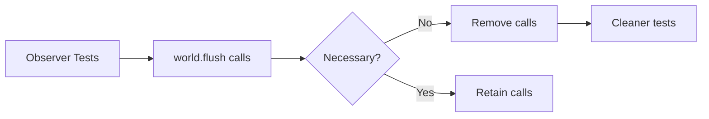

+++
title = "#20234 Observer tests contain unnecessary calls to world.flush()"
date = "2025-07-22T00:00:00"
draft = false
template = "pull_request_page.html"
in_search_index = true

[taxonomies]
list_display = ["show"]

[extra]
current_language = "en"
available_languages = {"en" = { name = "English", url = "/pull_request/bevy/2025-07/pr-20234-en-20250722" }, "zh-cn" = { name = "中文", url = "/pull_request/bevy/2025-07/pr-20234-zh-cn-20250722" }}
labels = ["A-ECS", "C-Code-Quality"]
+++

# Observer tests contain unnecessary calls to world.flush()

## Basic Information
- **Title**: Observer tests contain unnecessary calls to world.flush()
- **PR Link**: https://github.com/bevyengine/bevy/pull/20234
- **Author**: shirokoff
- **Status**: MERGED
- **Labels**: A-ECS, C-Code-Quality, S-Ready-For-Final-Review
- **Created**: 2025-07-21T22:23:43Z
- **Merged**: 2025-07-22T00:09:00Z
- **Merged By**: alice-i-cecile

## Description Translation
# Objective

- Cleanup unnecessary world.flush() calls in the Observer tests

## The Story of This Pull Request

The PR addresses a code quality issue in Bevy's ECS observer tests where explicit `world.flush()` calls were unnecessarily scattered throughout test cases. These flush operations were originally added as workarounds for observer registration behavior but became obsolete after internal Bevy changes.

Historically, when observers were added using `world.add_observer()`, the method returned a `WorldEntityMut` that didn't automatically flush pending operations. This required manual `flush()` calls to ensure observers were properly registered before events could trigger them. The explicit flushes were accompanied by TODO comments explaining their necessity.

However, after Bevy's observer implementation evolved, these manual flushes became redundant. The tests continued to include them, creating confusion about whether they were still required. The flush operations also added visual noise and potential performance overhead during test execution.

The solution was straightforward: remove all unnecessary `world.flush()` calls along with their associated explanatory comments. This required carefully auditing each test case to verify that observer behavior remained correct without explicit flushes. The changes were made in the observer test module (`mod tests`), targeting specific test functions where flushes were no longer needed.

Key technical considerations included:
1. Verifying observer triggering still worked correctly after flush removal
2. Ensuring event propagation through component hierarchies remained functional
3. Confirming observer ordering and duplicate triggering behavior stayed consistent
4. Maintaining test coverage for all observer functionality

The changes simplify test code by eliminating redundant operations and clarifying that explicit flushes aren't required for observer registration. This makes the tests more readable and reduces potential confusion for contributors working with Bevy's observer system.

## Visual Representation



## Key Files Changed

### `crates/bevy_ecs/src/observer/mod.rs`
This file contains the observer implementation and test suite. The changes remove unnecessary flush operations and associated comments from multiple test cases.

**Before:**
```rust
// TODO: ideally this flush is not necessary, but right now observe() returns WorldEntityMut
// and therefore does not automatically flush.
world.flush();

// ... test logic ...

world.flush();
```

**After:**
```rust
// ... test logic without flush calls ...
```

**Key modifications:**
1. Removed flush calls after observer registration
2. Removed flush calls after event triggering
3. Deleted obsolete TODO comments explaining flush requirements
4. Maintained all test assertions unchanged

The changes affect 21 test cases across various observer scenarios including:
- Basic event triggering
- Targeted events with entities/components
- Event propagation through hierarchies
- Observer ordering
- Complex multi-observer scenarios

## Further Reading
1. [Bevy ECS Observer Documentation](https://docs.rs/bevy_ecs/latest/bevy_ecs/observer/index.html)
2. [World::flush() API Reference](https://docs.rs/bevy_ecs/latest/bevy_ecs/world/struct.World.html#method.flush)
3. [Event System Improvements PR #1912](https://github.com/bevyengine/bevy/pull/1912) (original observer implementation)

# Full Code Diff
```diff
diff --git a/crates/bevy_ecs/src/observer/mod.rs b/crates/bevy_ecs/src/observer/mod.rs
index 574f6ca257dea..4f3d210110d9b 100644
--- a/crates/bevy_ecs/src/observer/mod.rs
+++ b/crates/bevy_ecs/src/observer/mod.rs
@@ -630,10 +630,6 @@ mod tests {
         });
         world.add_observer(|_: On<Remove, A>, mut res: ResMut<Order>| res.observed("remove"));
 
-        // TODO: ideally this flush is not necessary, but right now observe() returns WorldEntityMut
-        // and therefore does not automatically flush.
-        world.flush();
-
         let mut entity = world.entity_mut(entity);
         entity.insert(A);
         entity.flush();
@@ -684,9 +680,6 @@ mod tests {
         world.add_observer(|mut trigger: On<EventWithData>| trigger.event_mut().counter += 1);
         world.add_observer(|mut trigger: On<EventWithData>| trigger.event_mut().counter += 2);
         world.add_observer(|mut trigger: On<EventWithData>| trigger.event_mut().counter += 4);
-        // This flush is required for the last observer to be called when triggering the event,
-        // due to `World::add_observer` returning `WorldEntityMut`.
-        world.flush();
 
         let mut event = EventWithData { counter: 0 };
         world.trigger_ref(&mut event);
@@ -706,9 +699,6 @@ mod tests {
         world.add_observer(|mut trigger: On<EventWithData, A>| {
             trigger.event_mut().counter += 4;
         });
-        // This flush is required for the last observer to be called when triggering the event,
-        // due to `World::add_observer` returning `WorldEntityMut`.
-        world.flush();
 
         let mut event = EventWithData { counter: 0 };
         let component_a = world.register_component::<A>();
@@ -766,7 +756,6 @@ mod tests {
 
         let entity = world.spawn(A).id();
         world.entity_mut(entity).insert(B);
-        world.flush();
         assert_eq!(vec!["add_ab", "add_ab"], world.resource::<Order>().0);
     }
 
@@ -833,11 +822,7 @@ mod tests {
             res.observed("event_a");
         });
 
-        // TODO: ideally this flush is not necessary, but right now observe() returns WorldEntityMut
-        // and therefore does not automatically flush.
-        world.flush();
         world.trigger(EventA);
-        world.flush();
         assert_eq!(vec!["event_a"], world.resource::<Order>().0);
     }
 
@@ -860,11 +845,7 @@ mod tests {
             res.observed("a_2");
         });
 
-        // TODO: ideally this flush is not necessary, but right now observe() returns WorldEntityMut
-        // and therefore does not automatically flush.
-        world.flush();
         world.trigger_targets(EventA, entity);
-        world.flush();
         assert_eq!(vec!["a_2", "a_1"], world.resource::<Order>().0);
     }
 
@@ -904,26 +885,20 @@ mod tests {
              mut res: ResMut<R>| res.0 += 1000000,
         );
 
-        // WorldEntityMut does not automatically flush.
-        world.flush();
-
         // trigger for an entity and a component
         world.trigger_targets(EventA, (entity_1, component_a));
-        world.flush();
         // only observer that doesn't trigger is the one only watching entity_2
         assert_eq!(1111101, world.resource::<R>().0);
         world.resource_mut::<R>().0 = 0;
 
         // trigger for both entities, but no components: trigger once per entity target
         world.trigger_targets(EventA, (entity_1, entity_2));
-        world.flush();
         // only the observer that doesn't require components triggers - once per entity
         assert_eq!(200, world.resource::<R>().0);
         world.resource_mut::<R>().0 = 0;
 
         // trigger for both components, but no entities: trigger once
         world.trigger_targets(EventA, (component_a, component_b));
-        world.flush();
         // all component observers trigger, entities are not observed
         assert_eq!(1111100, world.resource::<R>().0);
         world.resource_mut::<R>().0 = 0;
@@ -931,7 +906,6 @@ mod tests {
         // trigger for both entities and both components: trigger once per entity target
         // we only get 2222211 because a given observer can trigger only once per entity target
         world.trigger_targets(EventA, ((component_a, component_b), (entity_1, entity_2)));
-        world.flush();
         assert_eq!(2222211, world.resource::<R>().0);
         world.resource_mut::<R>().0 = 0;
 
@@ -940,7 +914,6 @@ mod tests {
             EventA,
             (component_a, component_b, (component_a, component_b)),
         );
-        world.flush();
         // the duplicate components in the tuple don't cause multiple triggers
         assert_eq!(1111100, world.resource::<R>().0);
         world.resource_mut::<R>().0 = 0;
@@ -955,7 +928,6 @@ mod tests {
                 ((component_a, component_b), (component_a, component_b)),
             ),
         );
-        world.flush();
         // the duplicate components in the tuple don't cause multiple triggers
         assert_eq!(1111100, world.resource::<R>().0);
         world.resource_mut::<R>().0 = 0;
@@ -975,7 +947,6 @@ mod tests {
                 ),
             ),
         );
-        world.flush();
         // the duplicate components in the tuple don't cause multiple triggers
         assert_eq!(1111100, world.resource::<R>().0);
         world.resource_mut::<R>().0 = 0;
@@ -1000,7 +971,6 @@ mod tests {
         let entity = entity.flush();
 
         world.trigger_targets(EventA, entity);
-        world.flush();
         assert_eq!(vec!["event_a"], world.resource::<Order>().0);
     }
 
@@ -1052,11 +1022,8 @@ mod tests {
             },
         );
 
-        // TODO: ideally this flush is not necessary, but right now observe() returns EntityWorldMut
-        // and therefore does not automatically flush.
-        world.flush();
         world.trigger_targets(EventPropagating, child);
-        world.flush();
+
         assert_eq!(vec!["child", "parent"], world.resource::<Order>().0);
     }
 
@@ -1079,11 +1046,8 @@ mod tests {
             })
             .id();
 
-        // TODO: ideally this flush is not necessary, but right now observe() returns WorldEntityMut
-        // and therefore does not automatically flush.
-        world.flush();
         world.trigger_targets(EventPropagating, [child, child]);
-        world.flush();
+
         assert_eq!(
             vec!["child", "parent", "child", "parent"],
             world.resource::<Order>().0
@@ -1109,11 +1073,7 @@ mod tests {
             })
             .id();
 
-        // TODO: ideally this flush is not necessary, but right now observe() returns WorldEntityMut
-        // and therefore does not automatically flush.
-        world.flush();
         world.trigger_targets(EventPropagating, [child, parent]);
-        world.flush();
         assert_eq!(
             vec!["child", "parent", "parent"],
             world.resource::<Order>().0
@@ -1142,11 +1102,8 @@ mod tests {
             )
             .id();
 
-        // TODO: ideally this flush is not necessary, but right now observe() returns WorldEntityMut
-        // and therefore does not automatically flush.
-        world.flush();
         world.trigger_targets(EventPropagating, child);
-        world.flush();
+
         assert_eq!(vec!["child"], world.resource::<Order>().0);
     }
 
@@ -1176,11 +1133,8 @@ mod tests {
             })
             .id();
 
-        // TODO: ideally this flush is not necessary, but right now observe() returns WorldEntityMut
-        // and therefore does not automatically flush.
-        world.flush();
         world.trigger_targets(EventPropagating, [child_a, child_b]);
-        world.flush();
+
         assert_eq!(
             vec!["child_a", "parent", "child_b", "parent"],
             world.resource::<Order>().0
@@ -1199,11 +1153,7 @@ mod tests {
             })
             .id();
 
-        // TODO: ideally this flush is not necessary, but right now observe() returns WorldEntityMut
-        // and therefore does not automatically flush.
-        world.flush();
         world.trigger_targets(EventPropagating, entity);
-        world.flush();
         assert_eq!(vec!["event"], world.resource::<Order>().0);
     }
 
@@ -1243,11 +1193,8 @@ mod tests {
             })
             .id();
 
-        // TODO: ideally this flush is not necessary, but right now observe() returns WorldEntityMut
-        // and therefore does not automatically flush.
-        world.flush();
         world.trigger_targets(EventPropagating, [child_a, child_b]);
-        world.flush();
+
         assert_eq!(
             vec!["child_a", "child_b", "parent_b"],
             world.resource::<Order>().0
@@ -1267,11 +1214,8 @@ mod tests {
         let parent = world.spawn(ChildOf(grandparent)).id();
         let child = world.spawn(ChildOf(parent)).id();
 
-        // TODO: ideally this flush is not necessary, but right now observe() returns WorldEntityMut
-        // and therefore does not automatically flush.
-        world.flush();
         world.trigger_targets(EventPropagating, child);
-        world.flush();
+
         assert_eq!(vec!["event", "event", "event"], world.resource::<Order>().0);
     }
 
@@ -1292,11 +1236,8 @@ mod tests {
         let parent = world.spawn(ChildOf(grandparent)).id();
         let child = world.spawn((A, ChildOf(parent))).id();
 
-        // TODO: ideally this flush is not necessary, but right now observe() returns WorldEntityMut
-        // and therefore does not automatically flush.
-        world.flush();
         world.trigger_targets(EventPropagating, child);
-        world.flush();
+
         assert_eq!(vec!["event", "event"], world.resource::<Order>().0);
     }
 
@@ -1314,7 +1255,6 @@ mod tests {
         let mut world = World::new();
         world.add_observer(on_add);
         world.spawn(A);
-        world.flush();
     }
 
     // Regression test for https://github.com/bevyengine/bevy/issues/14467
@@ -1367,9 +1307,7 @@ mod tests {
                 params.p1().insert_resource(ResA);
             },
         );
-        // TODO: ideally this flush is not necessary, but right now observe() returns WorldEntityMut
-        // and therefore does not automatically flush.
-        world.flush();
+
         world.trigger(EventA);
         world.flush();
 
@@ -1405,7 +1343,6 @@ mod tests {
             assert_eq!(trigger.caller(), caller);
         });
         world.commands().spawn(Component).clear();
-        world.flush();
     }
 
     #[test]
@@ -1425,14 +1362,12 @@ mod tests {
                 }
             },
         );
-        world.flush();
 
         world.trigger_targets(EventA, [a_id, b_id]);
         world.trigger_targets(EventA, a_id);
         world.trigger_targets(EventA, b_id);
         world.trigger_targets(EventA, [a_id, b_id]);
         world.trigger_targets(EventA, a_id);
-        world.flush();
 
         let counter = world.resource::<Counter>();
         assert_eq!(4, *counter.0.get(&a_id).unwrap());
```