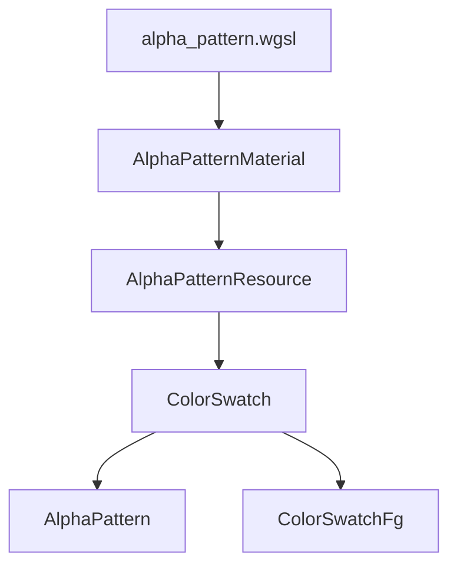

+++
title = "#20237 Color swatch widget."
date = "2025-07-27T00:00:00"
draft = false
template = "pull_request_page.html"
in_search_index = false

[extra]
current_language = "zh-cn"
available_languages = {"en" = { name = "English", url = "/pull_request/bevy/2025-07/pr-20237-en-20250727" }, "zh-cn" = { name = "中文", url = "/pull_request/bevy/2025-07/pr-20237-zh-cn-20250727" }}
labels = ["C-Feature", "A-UI"]
+++

# Color swatch widget.

## Basic Information
- **Title**: Color swatch widget.
- **PR Link**: https://github.com/bevyengine/bevy/pull/20237
- **Author**: viridia
- **Status**: MERGED
- **Labels**: C-Feature, A-UI, S-Ready-For-Final-Review, M-Needs-Release-Note
- **Created**: 2025-07-22T00:33:15Z
- **Merged**: 2025-07-27T17:35:35Z
- **Merged By**: alice-i-cecile

## Description Translation
一个带有alpha图案的简单颜色样本；这已从其他颜色控件中分离出来。

主要引入原因是想为feathers中的自定义着色器建立基础设施。

属于#16900的一部分

注意这是BSN（Bevy Style Notation）之前的版本，与BSN合并时需要修订。我故意省略了一些内容以便于合并。


## The Story of This Pull Request

### 问题和背景
在开发Bevy的UI框架feathers时，需要实现一个颜色样本控件（color swatch）。这个控件需要显示颜色并支持alpha透明度，通常通过棋盘格图案来可视化透明区域。现有UI控件中没有专门的颜色样本组件，开发者在实现颜色选择器等功能时需要手动构建这种显示。此外，这个控件是后续实现自定义着色器功能的基础设施，属于#16900任务的一部分。开发者决定将颜色样本拆分为独立控件以简化复用和维护。

技术约束包括：
1. 需要与Bevy的UI渲染系统集成
2. 支持动态颜色更新
3. 实现alpha图案作为背景
4. 保持与现有feathers控件的设计一致性

### 解决方案
开发者采用以下方法实现颜色样本控件：
1. 创建专用着色器生成alpha棋盘格图案
2. 实现分层结构：背景显示alpha图案，前景显示实际颜色
3. 使用Bevy的UiMaterial系统管理自定义材质
4. 添加资源管理和观察者系统处理材质初始化

核心决策：
- 分离前景和背景：允许单独控制颜色显示和alpha图案
- 使用WGSL着色器而非纹理：减少资源依赖，实现动态缩放
- 创建AlphaPatternMaterial：封装着色器逻辑
- 添加ColorSwatchFg组件：提供颜色更新接口

### 实现细节
新增alpha_pattern模块处理透明背景：
```rust
// crates/bevy_feathers/src/alpha_pattern.rs
#[derive(AsBindGroup, Asset, TypePath, Default, Debug, Clone)]
pub(crate) struct AlphaPatternMaterial {}

impl UiMaterial for AlphaPatternMaterial {
    fn fragment_shader() -> ShaderRef {
        "embedded://bevy_feathers/assets/shaders/alpha_pattern.wgsl".into()
    }
}
```
AlphaPatternMaterial定义了使用自定义着色器的UI材质。着色器文件alpha_pattern.wgsl实现棋盘格图案和圆角处理：
```wgsl
// crates/bevy_feathers/src/assets/shaders/alpha_pattern.wgsl
@fragment
fn fragment(in: UiVertexOutput) -> @location(0) vec4<f32> {
    let uv = (in.uv - vec2<f32>(0.5, 0.5)) * in.size / 16.;
    let check = select(0.0, 1.0, (fract(uv.x) < 0.5) != (fract(uv.y) < 0.5));
    let bg = mix(vec3<f32>(0.2, 0.2, 0.2), vec3<f32>(0.6, 0.6, 0.6), check);
    ...
}
```
着色器使用有符号距离函数（SDF）实现精确的圆角渲染，确保在不同分辨率下保持清晰。

颜色样本控件的实现在color_swatch.rs中：
```rust
// crates/bevy_feathers/src/controls/color_swatch.rs
pub fn color_swatch<B: Bundle>(overrides: B) -> impl Bundle {
    (
        Node { /* 尺寸定义 */ },
        ColorSwatch,
        AlphaPattern,
        MaterialNode::<AlphaPatternMaterial>(Handle::default()),
        children![(
            Node { /* 前景节点 */ },
            ColorSwatchFg,
            BackgroundColor(palette::ACCENT.with_alpha(0.5))
        )]
    )
}
```
该模板函数创建包含两个层的UI实体：
1. 背景层：应用AlphaPatternMaterial显示棋盘格
2. 前景层：通过ColorSwatchFg组件显示实际颜色

系统集成方面：
1. 在lib.rs中初始化资源和注册插件：
```rust
// crates/bevy_feathers/src/lib.rs
impl Plugin for FeathersPlugin {
    fn build(&self, app: &mut App) {
        embedded_asset!(app, "assets/shaders/alpha_pattern.wgsl");
        app.add_plugins(UiMaterialPlugin::<AlphaPatternMaterial>::default());
        app.init_resource::<AlphaPatternResource>();
    }
}
```
2. 在controls/mod.rs中注册新控件：
```rust
// crates/bevy_feathers/src/controls/mod.rs
pub struct ControlsPlugin;
impl Plugin for ControlsPlugin {
    fn build(&self, app: &mut App) {
        app.add_plugins((AlphaPatternPlugin, /* 其他插件 */));
    }
}
```

### 技术洞察
1. **材质资源管理**：通过AlphaPatternResource全局管理材质实例，避免重复创建
```rust
#[derive(Resource)]
pub(crate) struct AlphaPatternResource(pub(crate) Handle<AlphaPatternMaterial>);
```
2. **观察者模式**：使用on_add_alpha_pattern系统在添加AlphaPattern组件时注入材质
```rust
fn on_add_alpha_pattern(
    ev: On<Add, AlphaPattern>,
    mut q_material_node: Query<&mut MaterialNode<AlphaPatternMaterial>>,
    r_material: Res<AlphaPatternResource>,
) {
    // 注入材质句柄
}
```
3. **动态alpha显示**：着色器根据控件尺寸动态缩放棋盘格，确保图案一致性
4. **控件结构设计**：分离ColorSwatch（容器）和ColorSwatchFg（颜色显示）允许：
   - 单独控制颜色属性
   - 保持背景图案不变
   - 简化样式覆盖

### 影响
1. 新增可直接使用的颜色样本控件
2. 为自定义UI着色器建立基础框架
3. 示例程序展示新控件使用方式：
```rust
// examples/ui/feathers.rs
demo_root(commands: &mut Commands) -> impl Bundle {
    children![
        // ...其他控件
        color_swatch(())
    ]
}
```
4. 发布说明添加相关记录：
```markdown
--- b/release-content/release-notes/feathers.md
+++ a/release-content/release-notes/feathers.md
-pull_requests: [19730, 19900, 19928]
+pull_requests: [19730, 19900, 19928, 20237]
```

### 后续工作
PR作者指出这是BSN（Bevy Style Notation）之前的临时实现，未来需要：
1. 与BSN样式系统集成
2. 优化材质管理方式
3. 增强自定义选项

## Visual Representation



## Key Files Changed

1. `crates/bevy_feathers/src/alpha_pattern.rs` (+59/-0)
   - 新增alpha图案材质系统和资源管理
   - 关键代码：
```rust
#[derive(AsBindGroup, Asset, TypePath, Default, Debug, Clone)]
pub(crate) struct AlphaPatternMaterial {}

impl UiMaterial for AlphaPatternMaterial {
    fn fragment_shader() -> ShaderRef {
        "embedded://bevy_feathers/assets/shaders/alpha_pattern.wgsl".into()
    }
}
```

2. `crates/bevy_feathers/src/controls/color_swatch.rs` (+53/-0)
   - 实现颜色样本控件模板
   - 关键代码：
```rust
pub fn color_swatch<B: Bundle>(overrides: B) -> impl Bundle {
    (
        Node { height: size::ROW_HEIGHT, min_width: size::ROW_HEIGHT },
        ColorSwatch,
        AlphaPattern,
        MaterialNode::<AlphaPatternMaterial>(Handle::default()),
        children![(
            Node { position_type: PositionType::Absolute, /* ... */ },
            ColorSwatchFg,
            BackgroundColor(/* ... */)
        )]
    )
}
```

3. `crates/bevy_feathers/src/assets/shaders/alpha_pattern.wgsl` (+39/-0)
   - 实现alpha图案的WGSL着色器
   - 关键代码：
```wgsl
let uv = (in.uv - vec2<f32>(0.5, 0.5)) * in.size / 16.;
let check = select(0.0, 1.0, (fract(uv.x) < 0.5) != (fract(uv.y) < 0.5));
let bg = mix(vec3<f32>(0.2, 0.2, 0.2), vec3<f32>(0.6, 0.6, 0.6), check);
```

4. `crates/bevy_feathers/src/controls/mod.rs` (+5/-0)
   - 注册颜色样本控件和alpha图案插件
   - 关键修改：
```rust
pub struct ControlsPlugin;
impl Plugin for ControlsPlugin {
    fn build(&self, app: &mut App) {
        app.add_plugins((
            AlphaPatternPlugin,  // 新增
            // ...其他插件
        ));
    }
}
```

5. `crates/bevy_feathers/src/lib.rs` (+10/-0)
   - 初始化资源和注册材质插件
   - 关键修改：
```rust
embedded_asset!(app, "assets/shaders/alpha_pattern.wgsl");  // 新增
app.add_plugins(UiMaterialPlugin::<AlphaPatternMaterial>::default());  // 新增
app.init_resource::<AlphaPatternResource>();  // 新增
```

## Further Reading
1. [Bevy UI Material 系统文档](https://docs.rs/bevy_ui_render/latest/bevy_ui_render/ui_material/)
2. [WGSL 着色器语言规范](https://www.w3.org/TR/WGSL/)
3. [Signed Distance Fields (SDF) 技术介绍](https://www.iquilezles.org/www/articles/distfunctions/distfunctions.htm)
4. [Bevy 实体组件系统(ECS)指南](https://bevy-cheatbook.github.io/programming/ecs-intro.html)